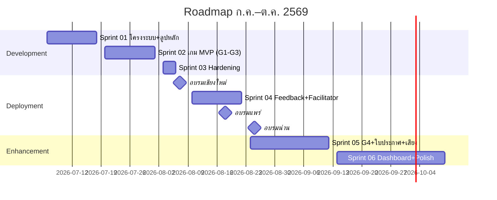

# Sprint Planning & Roadmap

**Last Updated:** 2026-07-03 | **Version:** 1.0

> กรอบเวลาโครงการ: ออกแบบสื่อ ก.ค.–ต.ค. 2569 | **Hard deadline: งานอบรมเชียงใหม่ 6–7 ส.ค. 2569**

## 📅 Sprint Schedule Overview

| Sprint | Timeline | Focus Area | Status |
|:---|:---|:---|:---|
| [Sprint 01](./sprint-backlog/archives/sprint-01.md) | 2026-07-06 → 2026-07-17 | โครงระบบ + ลูปหลัก (Landing, Consent, Video, Sequence) | Completed |
| [Sprint 02](./sprint-backlog/sprint-02.md) | 2026-07-20 → 2026-07-31 | เกม MVP ทั้ง 3 (G1, G2, G3) + ดาว + แชร์ LINE | Planned |
| [Sprint 03](./sprint-backlog/sprint-03.md) | 2026-08-03 → 2026-08-05 | Hardening: ทดสอบกับผู้สูงอายุจริง, ทดสอบใน LINE browser, เตรียม QR งานอบรม | Planned |
| 🎯 Milestone | 2026-08-06 → 2026-08-07 | **ใช้งานจริง — อบรมเชียงใหม่** | — |
| [Sprint 04](./sprint-backlog/sprint-04.md) | 2026-08-10 → 2026-08-21 | ปรับจาก feedback เชียงใหม่ + Facilitator Mode (รองรับแพร่ 17–18, น่าน 24–25) | Planned |
| [Sprint 05](./sprint-backlog/sprint-05.md) | 2026-08-24 → 2026-09-11 | G4, ใบประกาศ, เสียงอ่าน | Planned |
| [Sprint 06](./sprint-backlog/sprint-06.md) | 2026-09-14 → 2026-10-09 | Dashboard, G5, polish, ส่งมอบ | Planned |

## 🚀 Sprint Details

- **[Sprint 01](./sprint-backlog/archives/sprint-01.md)** (Completed): US-CORE-01, US-CORE-02, US-CORE-03, US-CORE-04 — จบ Sprint ต้องกดลิงก์จาก LINE → ดูคลิป → ไปหน้าเกม (placeholder) ได้ครบลูป
- **[Sprint 02](./sprint-backlog/sprint-02.md)**: US-GAME-01, US-GAME-02, US-GAME-03, US-GAME-06, US-REWARD-01, US-LEAD-01, US-UX-01 — จบ Sprint ต้องเล่นครบทุกบทได้จริง (ครอบคลุมทั้ง 3 รูปแบบเกมย่อย G1-G3 และ G6)
- **[Sprint 03](./sprint-backlog/sprint-03.md)**: ไม่มี feature ใหม่ — ทดสอบกับผู้สูงอายุจริง ≥ 3 คน, ทดสอบอุปกรณ์จริง/เน็ตช้า, เตรียม QR code และซ้อม flow งานอบรม
- **[Sprint 04](./sprint-backlog/sprint-04.md)**: US-LEAD-02 + แก้ไขจาก feedback งานเชียงใหม่ (สำคัญ: มีเวลาแค่ ~1 สัปดาห์ก่อนงานแพร่)
- **[Sprint 05](./sprint-backlog/sprint-05.md)**: US-GAME-05, US-GAME-07, US-REWARD-02, US-UX-02
- **[Sprint 06](./sprint-backlog/sprint-06.md)**: US-DATA-01, US-GAME-04, US-CORE-05, ปิดโครงการ

## ⚠️ Risks

| Risk | Impact | Mitigation |
|------|--------|------------|
| รายการคลิป/ลิงก์ YouTube ยังไม่ครบ | Block Sprint 01 | ขอจากทีมเนื้อหาภายในสัปดาห์แรก; ระหว่างรอใช้คลิป placeholder |
| สื่อ AI ตัวอย่างสำหรับ G3 ผลิตไม่ทัน | G3 หลุด MVP | เริ่มผลิต/คัดเลือกตั้งแต่ Sprint 01 คู่ขนานกับ dev |
| LINE in-app browser มีข้อจำกัดที่ไม่คาดคิด | UX พังในสนามจริง | ทดสอบใน LINE จริงตั้งแต่ Sprint 01 ไม่รอ Sprint 03 |
| งบจำกัด — เกมทำไม่ครบ | ลด scope | ลำดับตัด: G5 → G4 → เสียงอ่าน (G1–G3 ห้ามตัด) |

## Related Documents
- Backlog: [Product Backlog](./01-product-backlog.md)
- Concept: [Concept & Architecture](../gdd/00-concept.md)
