# Sprint Planning & Roadmap

**Last Updated:** 2026-08-08 | **Version:** 1.2

> กรอบเวลาโครงการ: ออกแบบสื่อ ก.ค.–ต.ค. 2569 | **Hard deadline: งานอบรมเชียงใหม่ 6–7 ส.ค. 2569 (✅ ผ่านแล้ว)** | แพร่ 17–18 ส.ค. | น่าน 24–25 ส.ค.

## üìÖ Sprint Schedule Overview

| Sprint                                                      | Timeline                 | Focus Area                                                                                                                  | Status    |
| :---------------------------------------------------------- | :----------------------- | :-------------------------------------------------------------------------------------------------------------------------- | :-------- |
| [Sprint 01](./sprint-backlog/archives/sprint-01.md)            | 2026-07-06 → 2026-07-17 | โครงระบบ + ลูปหลัก (Landing, Consent, Video, Sequence)                                                       | Completed |
| [Sprint 02](./sprint-backlog/archives/sprint-02.md)            | 2026-07-06 → 2026-07-17 | เกม MVP ทั้ง 3 (G1, G2, G3) + ดาว + แชร์ LINE (พัฒนาโค้ดเสร็จแล้ว)                          | Completed |
| [Sprint 03 polishing](./sprint-backlog/sprint-03-polishing.md) | 2026-07-15 ‚Üí 2026-08-05 | QA ‡πć∏Ň∏°‡∏´‡∏•‡∏±‡∏Å 3 ‡πŇ∏ö‡∏ö (G3, G6, G5) + ‡∏¢‡πâ‡∏≤‡∏| [Sprint 03B](./sprint-backlog/sprint-03b-refinement.md)       | 2026-07-27 ‚Üí 2026-08-08 | ‚ö° **Fast-tracked:** ‡∏£‡∏∑‡πâ‡∏≠ Flow ‡πć∏£‡∏µ‡∏¢‡∏ô‡∏ï‡πà‡∏≠‡πć∏ô‡∏∑‡πà‡∏≠‡∏á (‡∏ч∏•‡∏¥‡∏õ‚Üí‡πć∏Ň∏°) + Responsive/UX + Security Hotfix v0.8.1                          | Completed |
| [Sprint 04](./sprint-backlog/sprint-04.md)                     | 2026-08-08 → 2026-08-21 | ปรับจาก feedback เชียงใหม่ + Facilitator Mode (รองรับแพร่ 17–18, น่าน 24–25)                                 | Active    |
| 🎯 Milestone 2 & 3                                          | 2026-08-17 → 2026-08-25 | **ใช้งานจริง — อบรมแพร่ (17–18 ส.ค.) และ น่าน (24–25 ส.ค.)**                                 | Upcoming  |
| [Sprint 05](./sprint-backlog/sprint-05.md)                     | 2026-08-24 → 2026-09-11 | G4, ใบประกาศ, เสียงอ่าน                                                                                    | Planned   |
| [Sprint 06](./sprint-backlog/sprint-06.md)                     | 2026-09-14 → 2026-10-09 | Dashboard, G5, polish, ส่งมอบ                                                                                         | Planned   |
| [Sprint 07](./sprint-backlog/sprint-07.md)                     | 2026-10-12 → 2026-11-14 | **R&D:** Top-Down Mini Prototype "รู้ทันกลางสายหมอก" — Canvas 2D world ห่อมินิเกม G1–G10 (E-WORLD)          | Planned   |

```mermaid
gantt
    title Roadmap ก.ค.–ต.ค. 2569
    dateFormat  YYYY-MM-DD
    section Development
    Sprint 01 โครงระบบ+ลูปหลัก      :done, s1, 2026-07-06, 12d
    Sprint 02 เกม MVP (G1-G3)        :done, s2, 2026-07-06, 12d
    Sprint 03 Polishing & Migration  :done, s3, 2026-07-15, 22d
    Sprint 03B Flow & Security Hotfix:done, s3b, 2026-07-27, 12d
    section Deployment
    อบรมเชียงใหม่                    :milestone, m1, 2026-08-06, 2d
    Sprint 04 Feedback+Facilitator   :active, s4, 2026-08-08, 14d
    อบรมแพร่                         :milestone, m2, 2026-08-17, 2d
    อบรมน่าน                         :milestone, m3, 2026-08-24, 2d
    section Enhancement
    Sprint 05 G4+ใบประกาศ+เสียง     :s5, 2026-08-24, 19d
    Sprint 06 Dashboard+Polish       :s6, 2026-09-14, 26d
    section R&D
    Sprint 07 Top-Down Mini Prototype :s7, 2026-10-12, 34d
```

## üöÄ Sprint Details

- **[Sprint 01](./sprint-backlog/archives/sprint-01.md)** (Completed): US-CORE-01, US-CORE-02, US-CORE-03, US-CORE-04 — จบ Sprint ต้องกดลิงก์จาก LINE → ดูคลิป → ไปหน้าเกม (placeholder) ได้ครบลูป
- **[Sprint 02](./sprint-backlog/archives/sprint-02.md)** (Completed): US-GAME-01, US-GAME-02, US-GAME-03, US-GAME-06, US-REWARD-01, US-LEAD-01, US-UX-01, US-DATA-02, US-UX-04 — การพัฒนาโค้ดหลักเสร็จสิ้นทั้งหมดแล้ว (QA ย้ายไปทำร่วมกับขัดเกลาธีมใน Sprint 03)
- **[Sprint 03 polishing](./sprint-backlog/sprint-03-polishing.md)** (Completed): QA เกมหลัก 3 แบบ (G3/G5/G6) + **ย้ายสแตกระบบหลักสู่ Next.js (TypeScript) + Supabase + Tailwind + shadcn/ui** + ตั้งค่าชุดทดสอบ Vitest/Playwright
- **[Sprint 03B](./sprint-backlog/sprint-03b-refinement.md)** (Completed 80%+): US-FLOW-01 (รื้อ Flow ต่อเนื่อง: คลิปสั้น→เกม G1→G3→G6 + ปิดท้าย G13→`/lessons/complete`), US-VIDEO-01 (Autoplay fallback & 5s countdown), US-SEC-01 (🔥 Supabase IPv4 Pooler + 500 offline logs cap), US-DOC-01, US-DEBT-01
- **[Sprint 04](./sprint-backlog/sprint-04.md)** (Active): US-LEAD-02 + US-03-01 (User Testing กับผู้สูงอายุ) + แก้ไขจาก feedback งานเชียงใหม่ (สำคัญ: มีเวลาแค่ ~1 สัปดาห์ก่อนงานแพร่)print ต้องกดลิงก์จาก LINE → ดูคลิป → ไปหน้าเกม (placeholder) ได้ครบลูป
- **[Sprint 02](./sprint-backlog/archives/sprint-02.md)** (Completed): US-GAME-01, US-GAME-02, US-GAME-03, US-GAME-06, US-REWARD-01, US-LEAD-01, US-UX-01, US-DATA-02, US-UX-04 — การพัฒนาโค้ดหลักเสร็จสิ้นทั้งหมดแล้ว (QA ย้ายไปทำร่วมกับขัดเกลาธีมใน Sprint 03)
- **[Sprint 03 polishing](./sprint-backlog/sprint-03-polishing.md)** (Active): QA เกมหลัก 3 แบบ (G3/G5/G6) + **ย้ายสแตกระบบหลักสู่ Next.js (TypeScript) + Supabase + Tailwind + shadcn/ui** + ตั้งค่าระบบทดสอบ Vitest/Playwright + ตั้งค่า URL Redirect + Hardening (ทดสอบ LINE browser, เตรียม QR สำหรับเชียงใหม่)
- **[Sprint 04](./sprint-backlog/sprint-04.md)**: US-LEAD-02 + US-03-01 (User Testing กับผู้สูงอายุ) + แก้ไขจาก feedback งานเชียงใหม่ (สำคัญ: มีเวลาแค่ ~1 สัปดาห์ก่อนงานแพร่)
- **[Sprint 05](./sprint-backlog/sprint-05.md)**: US-GAME-05 (QA คืบหน้า), US-GAME-07, US-REWARD-02, US-UX-02
- **[Sprint 06](./sprint-backlog/sprint-06.md)**: US-DATA-01, US-GAME-04, US-CORE-05, ปิดโครงการ
- **[Sprint 08](./sprint-backlog/sprint-08.md)** (Planned): US-FLOW-01 (รื้อ Flow ต่อเนื่อง: คลิปสั้น→เกม G1→G3→G6 + ปิดท้าย G13→Start Menu; 🔁 REVISED client 2026-07-31), US-UX-05 (responsive ทุกเกม + นำ design UX/UI มาใช้), US-SEC-01 (🔥 hotfix: rotate secret + auth analytics ก่อน 6 ส.ค. / quiz integrity + Zod ใน sprint), US-DOC-01 (แก้ AGENT.md/architecture ให้ตรงโค้ด), US-DEBT-01 (เก็บกวาด dead code). **ที่มา:** รีวิวโค้ด+เอกสาร 2026-07-27
- **[Sprint 07](./sprint-backlog/sprint-07.md)** (R&D / Production-Transition): Epic E-WORLD — Top-Down Mini Prototype "รู้ทันกลางสายหมอก" — US-WORLD-01…09 (Canvas 2D world ห่อมินิเกม G1–G10, เดินสำรวจ+บทสนทนา+เหตุการณ์ ลดความรู้สึกเหมือนทำแบบทดสอบ). **ตัดสินใจใช้ Canvas 2D ไม่ใช่ Phaser** เพราะ field feedback เครื่องสเปคต่ำ (A10s) เข้า Phaser ไม่ได้ — ดู [Sprint 07 §Key Decision](./sprint-backlog/sprint-07.md#-key-decision--ใช้-canvas-2d-ไม่ใช่-phaser)

## 📌 Client Feedback รอบ 2026-08-04 (task list)

> รอบผลตอบรับใหม่ (**คนละวันกับ 2026-07-31**) — ดู [ML-2026-08-04](./meeting-log/ML-2026-08-04-client-feedback.md) + [Product Backlog §Client Feedback 2026-08-04](./01-product-backlog.md). หน้าแรก/Start Menu (US-CF-21, 22) ทำแล้ว; ที่เหลือเป็นงานเร่งจากภาคสนาม ควรจัดเข้าก่อน**งานแพร่ 17–18 ส.ค.**

| ID | สรุปงาน | Estimate | Status |
|----|---------|----------|--------|
| [US-CF-23](./user-stories/US-CF-23.md) | consent: เพิ่มตัวเลือกจังหวัด "อื่นๆ" | XS | 🔴 To Do |
| [US-CF-24](./user-stories/US-CF-24.md) | G1: วิธีเล่น + หมวดข่าว (น้ำมะนาวโซดา→สุขภาพ) + ปุ่มข้อสุดท้าย | S | 🔴 To Do |
| [US-CF-25](./user-stories/US-CF-25.md) | G3: ลด header โจทย์ + เพิ่มภาพถ่ายจริง 1–2 รูป | M | 🔴 To Do |
| [US-CF-26](./user-stories/US-CF-26.md) | G6: ชื่อ "จำลองแชทไลน์" + "ไลน์" + ตัดหน้าสถานการณ์ + ปุ่มจบ | M | 🟢 Done |
| [US-CF-27](./user-stories/US-CF-27.md) | G13: ป้าย "เกมฝึกสมอง" + ปุ่ม "เล่นอีกรอบ" + sprite ไอติมใหม่ | M | 🔴 To Do |
| [US-CF-28](./user-stories/US-CF-28.md) | คำกลางทั้งแอป: ลบ "วัยเก๋า" + ตัด ครับ/ค่ะ/คะ (UI+TTS+JSON) | M-L | 🔴 To Do |

*หมายเหตุ: บางข้อรอยืนยันทิศทาง (US-CF-24 ปุ่มคะแนน) และ asset (US-CF-25 ภาพจริง)*

## ⚠️ Risks

| Risk                                                             | Impact                        | Mitigation                                                                                                 |
| ---------------------------------------------------------------- | ----------------------------- | ---------------------------------------------------------------------------------------------------------- |
| รายการคลิป/ลิงก์ YouTube ยังไม่ครบ       | Block Sprint 01               | ขอจากทีมเนื้อหาภายในสัปดาห์แรก; ระหว่างรอใช้คลิป placeholder |
| สื่อ AI ตัวอย่างสำหรับ G3 ผลิตไม่ทัน | G3 หลุด MVP               | เริ่มผลิต/คัดเลือกตั้งแต่ Sprint 01 คู่ขนานกับ dev                       |
| LINE in-app browser มีข้อจำกัดที่ไม่คาดคิด | UX พังในสนามจริง | ทดสอบใน LINE จริงตั้งแต่ Sprint 01 ไม่รอ Sprint 03                                  |
| งบจำกัด — เกมทำไม่ครบ                         | ลด scope                    | ลำดับตัด: G5 → G4 → เสียงอ่าน (G1–G3 ห้ามตัด)                                   |
| เครื่องสเปคต่ำเข้าเกมไม่ได้ (A10s) — บทเรียนจาก Phaser (MCI) | Sprint 07 prototype เล่นไม่ได้ในสนามจริง | ใช้ **Canvas 2D ไม่ใช่ Phaser**, cap FPS/ลด effect/unload มินิเกม, ทดสอบบน A10s ก่อนถือว่าผ่าน (US-WORLD-09); fallback DOM node-map |

## Related Documents

- Backlog: [Product Backlog](./01-product-backlog.md)
- Concept: [Concept &amp; Architecture](../gdd/00-concept.md)
