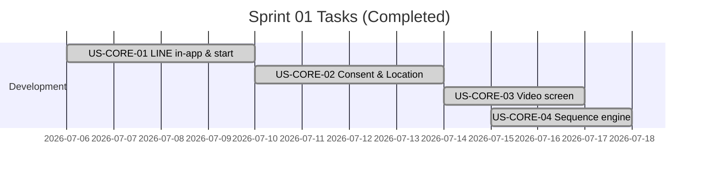

# Sprint 01: โครงระบบ + ลูปหลัก (Landing, Consent, Video, Sequence)

**Goal:** จบ Sprint ต้องกดลิงก์จาก LINE → ดูคลิป → ไปหน้าเกม (placeholder) ได้ครบลูป
**Timeline:** 2026-07-06 → 2026-07-17
**Version:** 1.1 (Completed) | **Last Updated:** 2026-07-03

## 📅 Internal Timeline

## 📋 Committed Stories & Tasks
| ID | Story / Task | Estimate | Status |
|----|--------------|----------|--------|
| [US-CORE-01](../../user-stories/archives/US-CORE-01.md) | เปิดแอปจากลิงก์ใน LINE แล้วเริ่มเรียนได้ทันที | M | [x] |
| [US-CORE-02](../../user-stories/archives/US-CORE-02.md) | เก็บช่วงอายุและตำแหน่งของผู้เล่น (แบบขอความยินยอม) | S | [x] |
| [US-CORE-03](../../user-stories/archives/US-CORE-03.md) | ดูคลิป "รู้ทันสื่อ" แนวตั้งในแอป | M | [x] |
| [US-CORE-04](../../user-stories/archives/US-CORE-04.md) | ให้ระบบพาไปทีละขั้น (คลิป → เกม → บทถัดไป) | M | [x] |

## 🛠 Sprint Specifics
- **Definition of Done:**
  - โค้ดผ่านการรีวิวและ merge เข้า branch หลัก
  - ผ่านการทดสอบบน LINE in-app browser จริง
  - โหลดหน้าแรกเสร็จภายใน < 3 วินาที บนเครือข่าย 3G (จำลอง)
- **Risks & Blockers:**
  - **รายการคลิป/ลิงก์ YouTube ยังไม่ครบ:** (Blocker) ทีมเนื้อหาต้องส่งมอบในสัปดาห์แรก ระหว่างรอให้ใช้คลิป placeholder ไปก่อน (แก้ไขแล้ว: ใช้ ID `d-xplM8U07w` เป็น placeholder และมีปุ่ม Fallback เปิดดูบนแอปหลักสำเร็จ)
  - **LINE in-app browser มีข้อจำกัดที่ไม่คาดคิด:** (Risk) ต้องทดสอบใน LINE จริงตั้งแต่แรก ไม่รอไปทดสอบสัปดาห์สุดท้าย (แก้ไขแล้ว: มีระบบตรวจจับ State ผ่าน YouTube Iframe API แบบ non-blocking)
