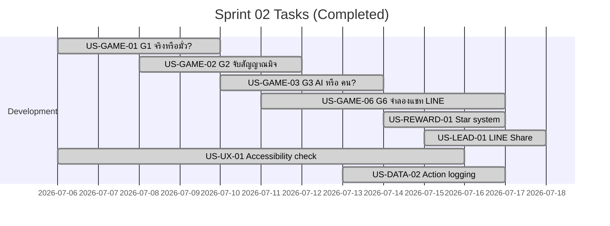

> ℹ️ **หมายเหตุ:** การพัฒนาโค้ดของทุกฟีเจอร์เสร็จสิ้นใน Sprint นี้เรียบร้อยแล้ว ส่วนงานตรวจสอบคุณภาพ (QA) ของ US-GAME-03 (G3) และ US-GAME-06 (G6) ถูกย้ายไปติดตามใน [Sprint 03 polishing](./sprint-03-polishing.md) แทน

# Sprint 02: เกม MVP ทั้ง 3 (G1, G2, G3) + ดาว + แชร์ LINE

**Goal:** จบ Sprint ต้องพัฒนาโค้ดครบทุกมินิเกม สะสมดาวแชร์ต่อได้ พร้อมรองรับระบบเก็บประวัติการเรียนรู้
**Timeline:** 2026-07-06 → 2026-07-17
**Version:** 1.2 | **Last Updated:** 2026-07-15

## 📅 Internal Timeline

## 📋 Committed Stories & Tasks
| ID | Story / Task | Estimate | Status |
|----|--------------|----------|--------|
| [US-GAME-01](../user-stories/archives/US-GAME-01.md) | เกม "จริงหรือมั่ว?" (G1) | M | [x] |
| [US-GAME-02](../user-stories/archives/US-GAME-02.md) | เกม "จับสัญญาณมิจ" (G2 - Content-Focused Quiz) | M | [x] |
| [US-GAME-03](../user-stories/US-GAME-03.md) | เกม "AI หรือ คน?" (G3) — พัฒนาโค้ดแล้ว (QA ใน Sprint 03) | L | [x] |
| [US-GAME-06](../user-stories/US-GAME-06.md) | เกมจำลองแชท LINE (G6) — พัฒนาโค้ดแล้ว (QA ใน Sprint 03) | L | [x] |
| [US-REWARD-01](../user-stories/archives/US-REWARD-01.md) | ได้ดาวเมื่อจบแต่ละบท | S | [x] |
| [US-LEAD-01](../user-stories/archives/US-LEAD-01.md) | แชร์ลิงก์บทเรียนเข้ากลุ่ม LINE ได้ในแตะเดียว | S | [x] |
| [US-UX-01](../user-stories/archives/US-UX-01.md) | ตัวหนังสือใหญ่ ปุ่มใหญ่ และขั้นตอนน้อย (Accessibility) | M | [x] |
| [US-DATA-02](../user-stories/archives/US-DATA-02.md) | เก็บประวัติและเวลาการกดใช้งานฟังก์ชันต่างๆ (Action Logs) | M | [x] |

| [US-UX-04](../user-stories/archives/US-UX-04.md) | รูปแบบการเรียนรู้ 2 หมวด (Flow และ Manual) | S | [x] |

## 🛠 Sprint Specifics
- **Definition of Done:**
  - โค้ดของเกม G1, G2, G3 และ G6 ได้รับการพัฒนาสมบูรณ์และนำเข้าระบบหลัก
  - ระบบเก็บดาว (Cookie/LocalStorage) และปุ่มแชร์ LINE ทำงานถูกต้อง
  - ฟังก์ชัน Action logging บันทึกข้อมูลลงตาราง `action_logs` สำเร็จ
  - โค้ดสร้างเสร็จสมบูรณ์สำหรับการเริ่มขั้นตอนตรวจสอบคุณภาพ (QA)
- **Risks & Blockers:**
  - **ความซับซ้อนของมินิเกม:** บรรเทาความเสี่ยงโดยดึงส่วนงาน QA และ Theme Polish ไปติดตามอย่างเป็นเอกเทศใน Sprint 03 เพื่อไม่ให้กระทบรอบการส่งมอบหลัก
