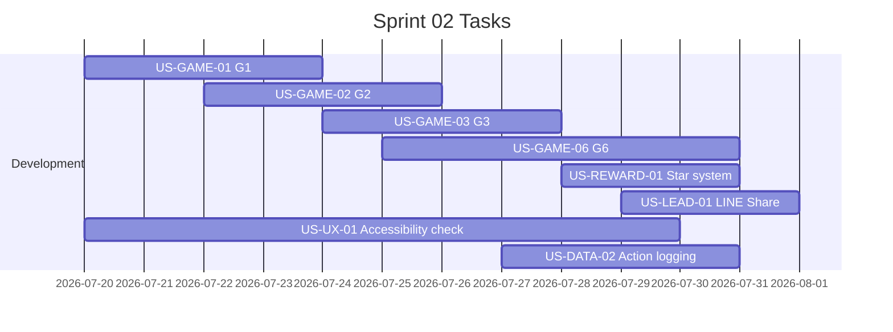

# Sprint 02: เกม MVP ทั้ง 3 (G1, G2, G3) + ดาว + แชร์ LINE

**Goal:** จบ Sprint ต้องเล่นครบทุกบทได้จริง และสะสมดาวแชร์ต่อได้
**Timeline:** 2026-07-20 → 2026-07-31
**Version:** 1.0 | **Last Updated:** 2026-07-03

## 📅 Internal Timeline

## 📋 Committed Stories & Tasks
| ID | Story / Task | Estimate | Status |
|----|--------------|----------|--------|
| [US-GAME-01](../user-stories/archives/US-GAME-01.md) | เกม "จริงหรือมั่ว?" (G1) | M | [x] |
| [US-GAME-02](../user-stories/US-GAME-02.md) | เกม "จับสัญญาณมิจ" (G2 - Content-Focused Quiz) | M | [ ] |
| [US-GAME-03](../user-stories/archives/US-GAME-03.md) | เกม "AI หรือ คน?" (G3) | L | [x] |
| [US-GAME-06](../user-stories/US-GAME-06.md) | เกมจำลองแชท LINE (G6) | L | [ ] |
| [US-REWARD-01](../user-stories/archives/US-REWARD-01.md) | ได้ดาวเมื่อจบแต่ละบท | S | [x] |
| [US-LEAD-01](../user-stories/archives/US-LEAD-01.md) | แชร์ลิงก์บทเรียนเข้ากลุ่ม LINE ได้ในแตะเดียว | S | [x] |
| [US-UX-01](../user-stories/archives/US-UX-01.md) | ตัวหนังสือใหญ่ ปุ่มใหญ่ และขั้นตอนน้อย (Accessibility) | M | [x] |
| [US-DATA-02](../user-stories/archives/US-DATA-02.md) | เก็บประวัติและเวลาการกดใช้งานฟังก์ชันต่างๆ (Action Logs) | M | [x] |

| [US-UX-04](../user-stories/archives/US-UX-04.md) | รูปแบบการเรียนรู้ 2 หมวด (Flow และ Manual) | S | [x] |

## 🛠 Sprint Specifics
- **Definition of Done:**
  - เกม G1, G2, G3 และ G6 เล่นได้สมบูรณ์ตาม Acceptance Criteria (G1-G3 เป็น Content-Focused และ G6 เป็น LINE Simulation)
  - ระบบเก็บดาว (Cookie/LocalStorage) และปุ่มแชร์ LINE ทำงานถูกต้อง
  - ฟังก์ชัน Action logging บันทึกข้อมูลแบบ Asynchronous ลงตาราง `action_logs` สำเร็จ
  - ผ่านการประเมิน Accessibility ตามมาตรฐานโครงการ
- **Risks & Blockers:**
  - **สื่อ AI ตัวอย่างสำหรับ G3 ผลิตไม่ทัน:** (Risk) ทีมงานต้องเริ่มคัดเลือกและผลิตสื่อตัวอย่างสำหรับ G3 ตั้งแต่ Sprint 01
  - **ความซับซ้อนของห้องแชทจำลอง LINE (G6):** (Risk) เนื่องจากเป็นเกมประเภท Simulation จึงต้องทดสอบหน้าตาและการรับคำสั่ง (Touch Areas) บนหน้าจอมือถือจริงหลายขนาดเพื่อป้องกันการกดกะพริบหรือจุด Hotspots คลาดเคลื่อน
