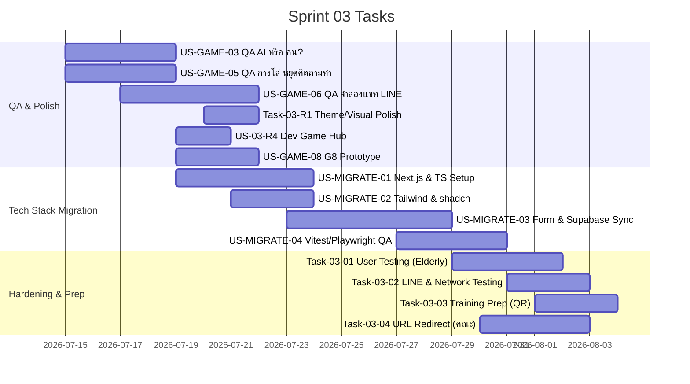

# Sprint 03: Polishing, Hardening & Tech Stack Migration (3 เกมหลัก + ย้ายสแตกระบบสู่ Next.js + Supabase)

**Goal:** จบ Sprint ต้องปรับปรุงและขัดเกลาเกมหลัก 3 แบบ (G3, G5, G6), ลบเศษสไตล์ template เก่า, และทำการ**ย้ายโครงสร้างระบบ (Migration) จากสแตกเดิม (Vite React SPA + Express) เข้าสู่ Next.js App Router (TypeScript) + Supabase** พร้อมทั้งตั้งค่าชุดทดสอบ Vitest และ Playwright สำหรับรัน E2E / Offline flows เพื่อความเสถียรและความพร้อมในการทดสอบกับผู้สูงอายุจริงก่อนงานอบรมเชียงใหม่
**Timeline:** 2026-07-15 → 2026-08-05
**Version:** 1.2 | **Last Updated:** 2026-07-19

> ⚠️ **หมายเหตุสำคัญ:** Sprint นี้เป็น **Sprint การเปลี่ยนผ่านทางเทคโนโลยี (Tech Stack Migration)** ร่วมกับการเก็บงาน QA + Polish + Hardening เนื่องจากโครงสร้างพื้นฐานต้องการความมั่นคงทางระบบและการรันแบบ SSR บน Next.js รวมถึงการจัดเก็บบันทึกบน Supabase BaaS เพื่อลดเวลาการดูแลระบบหลังบ้านบน VM

## 📅 Internal Timeline

## 📋 Committed Stories & Tasks

| ID | Story / Task | Estimate | Status |
|----|--------------|----------|--------|
| [US-GAME-03](../user-stories/US-GAME-03.md) | QA เกม "AI หรือ คน?" (G3) — ตรวจ 6 โจทย์ขึ้นไป, จุดสังเกตเฉลย, ป้าย `ai_disclosure`, ทางเลือก "ไม่แน่ใจ" ตาม AC เดิม | S | [ ] |
| [US-GAME-05](../user-stories/US-GAME-05.md) | QA เกม "กางโล่ หยุด คิด ถาม ทำ" (G5) — ตรวจ Single-action tap, ออนิเมชั่นสโลแกน, Confidence Bar, ไม่มี Game Over | M | [ ] |
| [US-GAME-06](../user-stories/US-GAME-06.md) | QA เกมจำลองแชท LINE (G6) — ตรวจครบ 3 สถานการณ์หลอกลวง, ระบบเลือกตอบกลับ (ยอมรับ/ปฏิเสธ/นิ่งเฉย), ระบบ Hint, หน้าเฉลย+เบอร์ 1441 | M | [ ] |
| [US-03-R1](../user-stories/US-03-R1.md) | **Theme/Visual Polish** — ลบ `src/App.css`, ตรวจสอบความสอดคล้องของ Design Tokens ใน `src/index.css` (สีหลัก `#0d9488`, ฟอนต์ Outfit/Sarabun) ให้ใช้ตรงกันทุกหน้าจอ | S | [x] |
| [US-03-R4](../user-stories/US-03-R4.md) | **Dev Game Hub** — หน้ารวมเกมทุกเกมที่ `/dev/games` กดเข้าเล่นได้ทันทีโดยไม่ติด session guard ใช้ mock log/progress ไม่เขียนข้อมูลจริง พร้อมแผงดู event log เพื่อเร่งงาน QA (G3/G5/G6) | S | [x] |
| [US-GAME-08](../user-stories/US-GAME-08.md) | **G8 กระโดดแพรู้ทันมิจ (Prototype)** — เกมคัดแยก SMS/สายโทรเข้ามิจฉาชีพ 5 ด่าน ใช้ emoji/SVG เป็นกราฟิกชั่วคราว ทดสอบผ่าน Dev Game Hub เท่านั้น ยังไม่ผูกเข้า flow ผู้เรียนก่อนงานเชียงใหม่ | M | [x] |
| [US-MIGRATE-01](../user-stories/US-MIGRATE-01.md) | **Next.js & TS Base Migration** — จัดการโครงสร้างโปรเจกต์ใหม่เป็น Next.js Monorepo, แปลงโค้ดเป็น TypeScript และย้าย Component หน้าจอหลัก | L | [ ] |
| [US-MIGRATE-02](../user-stories/US-MIGRATE-02.md) | **Tailwind & shadcn/ui Config** — คอนฟิก Tailwind ธีมสี/ฟอนต์ขนาดใหญ่ รองรับ Accessibility และอิมพอร์ต UI components | M | [ ] |
| [US-MIGRATE-03](../user-stories/US-MIGRATE-03.md) | **Form & Supabase Integration** — พัฒนาแบบฟอร์มด้วย React Hook Form + Zod, ต่อระบบ DB/Storage ของ Supabase และติดตั้ง Offline Sync Queue | L | [ ] |
| [US-MIGRATE-04](../user-stories/US-MIGRATE-04.md) | **Testing (Vitest & Playwright)** — เขียน Unit tests คอยตรวจ Logic ความถูกต้อง และ E2E tests ตรวจจับพฤติกรรมในเบราว์เซอร์จำลองและจำลองโหมดออฟไลน์ | M | [ ] |
| [US-03-01](../user-stories/US-03-01.md) | **User Testing** — ทดสอบกับผู้สูงอายุจริงอย่างน้อย 3 คน และปรับปรุงระบบตามผลทดสอบจริงเพื่อความง่ายในการเล่น | M | ⏭ Deferred to Sprint 04 |
| [US-03-02](../user-stories/archives/US-03-02.md) | **LINE & Network Testing** — ทดสอบการทำงานใน LINE in-app browser บนอุปกรณ์จริงและเน็ตช้าเพื่อลดความเสี่ยงหน้างาน | S | [x] |
| [US-03-03](../user-stories/US-03-03.md) | **Chiang Mai Training Prep** — จัดเตรียม QR Code สำหรับเข้าใช้งานและซ้อม Flow ร่วมกับกระบวนกรหน้างานอบรม | S | [ ] |
| [US-03-04](../user-stories/US-03-04.md) | **URL Redirect (คณะ → โปรเจกต์)** — ตั้งค่า Redirect จาก URL เดิมของคณะ/แหล่งทุนที่เคยเผยแพร่ไว้ ให้พาไปยัง URL จริงของโปรเจกต์ | S | [ ] |

## 🛠 Sprint Specifics

- **Definition of Done:**
  - ตัวโปรเจกต์ย้ายเข้าสู่สแตก Next.js + TypeScript เสร็จสิ้น ทำการ build ผ่าน (`npm run build` สำเร็จ) โดยไม่มีข้อผิดพลาดด้านประเภทข้อมูล (TypeScript Errors)
  - หน้าจอแบบฟอร์มทั้งหมดกรอกข้อมูลได้สมบูรณ์และผ่านการทำ Schema Validation ด้วย Zod
  - ระบบบันทึก Log และข้อมูลผลคะแนนสามารถบันทึกลงฐานข้อมูล Supabase และอัปโหลดภาพลง Supabase Storage ได้สำเร็จ
  - มี Unit Tests (Vitest) และ E2E Tests (Playwright) รันผ่านทั้งหมด และได้รับการยืนยันว่ากลไกการเก็บคิวออฟไลน์ (Offline Queue) สามารถอัปโหลดซิงก์ใหม่ได้เมื่อเน็ตออนไลน์
  - ทั้ง 3 เกม (G3, G6, G5) รันบนสแตกใหม่และผ่านการเล่นทดสอบจริงครบตาม Acceptance Criteria
  - ไม่มีสไตล์ template เก่าค้าง และการจัดสไตล์ CSS/Tailwind เป็นระเบียบเรียบร้อย
  - ทดสอบบน LINE in-app browser และจำลองความเร็วสัญญาณต่ำ (3G) โหลดหน้าแรกไม่ค้างขาวนาน
- **Risks & Blockers:**
  - **ความล่าช้าในการย้ายโค้ด (Migration Overhead):** การแปลงประเภทตัวแปร (Typescript) จาก JS เดิมอาจเจอบั๊กตัวแปรแอบแฝง ให้แยกแก้เป็นส่วนย่อยและรันเช็คตลอดการย้าย
  - **ข้อจำกัด API บน LINE WebView:** บางฟังก์ชันเกี่ยวกับพิกัดหรือการเล่นเสียงอ่านอาจติดสิทธิ์ความปลอดภัยใน iOS/Android ให้เขียน fallback เป็นแบบแมนนวลให้กดสั่งงานได้เสมอ

## Related Documents
- Roadmap: [Sprint Planning](../02-sprint-planning.md)
- Backlog: [Product Backlog](../01-product-backlog.md)
- DNS Setup: [DNS Setup Guidelines](../../wiki/dns-setup.md)
