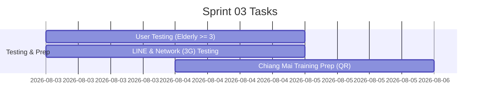

# Sprint 03: Hardening: ทดสอบกับผู้สูงอายุจริง, ทดสอบใน LINE browser, เตรียม QR งานอบรม

**Goal:** ไม่เน้นฟีเจอร์ใหม่ — เน้นความเสถียร การทดสอบผู้ใช้จริง และเตรียมการสำหรับงานอบรมเชียงใหม่
**Timeline:** 2026-08-03 → 2026-08-05 (3 วัน)
**Version:** 1.0 | **Last Updated:** 2026-07-03

## 📅 Internal Timeline

## 📋 Committed Stories & Tasks
| ID | Story / Task | Estimate | Status |
|----|--------------|----------|--------|
| Task-03-01 | ทดสอบกับผู้สูงอายุจริงอย่างน้อย 3 คน และปรับปรุงตามผลทดสอบ | M | [ ] |
| Task-03-02 | ทดสอบการทำงานใน LINE in-app browser บนอุปกรณ์จริงและเน็ตช้า | S | [ ] |
| Task-03-03 | จัดเตรียม QR Code และซ้อม Flow การใช้งานจริงหน้างานอบรม | S | [ ] |

## 🛠 Sprint Specifics
- **Definition of Done:**
  - ปรับปรุงบั๊กวิกฤตที่พบจากการทดสอบผู้สูงอายุเสร็จสิ้น
  - ยืนยันว่าแอปทำงานได้อย่างถูกต้องบน LINE in-app browser ของเครื่องทดสอบหลัก
  - ลิงก์และ QR Code ได้รับการตรวจสอบและพร้อมใช้งานจริง
- **Risks & Blockers:**
  - **ข้อจำกัดนาทีสุดท้ายของ LINE in-app browser:** (Risk) หากพบปัญหาเกี่ยวกับการทำงานของเสียงหรือวิดีโอ ต้องเตรียมแผนสำรองสำหรับเปิดใน Chrome/Safari ปกติ
