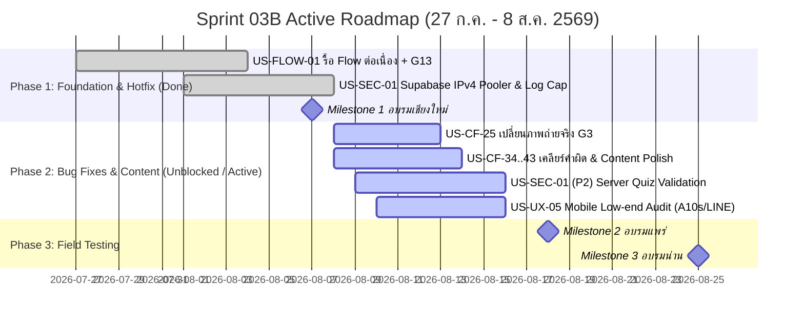

# Sprint 03B: Refinement, Field Bug Fixes & Pre-Phrae/Nan Readiness

**Goal:** ดำเนินการปรับปรุงและเพิ่มเติมเนื้อหา แก้ไขข้อผิดพลาดของระบบ/การทำงานที่พบจากการทดสอบภาคสนามจังหวัดเชียงใหม่ (6–7 ส.ค. 2569) ปรับปรุงคลังโจทย์และภาพประกอบของเกม G1, G3, G6, G13 ขยายความเสถียรของระบบ Offline Telemetry & Supabase Connection Pooler และปลดล็อก (Unblock) รายการงานที่พร้อมให้ทีมเริ่มทำงานต่อได้ทันที เพื่อเตรียมความพร้อมสำหรับการลงพื้นที่จังหวัดแพร่ (17–18 ส.ค.) และน่าน (24–25 ส.ค.)
**Timeline:** 2026-07-27 → 2026-08-08 (Fast-tracked Execution Phase — ปรับย้ายลำดับมาทำคั่นระหว่าง Sprint 03 และ Sprint 04)
**Version:** 2.1 | **Last Updated:** 2026-08-08

> 💡 **หมายเหตุการจัดลำดับใหม่ (Sprint Re-indexing):** ปรับชื่อเปลี่ยนจากเดิม "Sprint 08" เป็น **Sprint 03B** เพื่อให้ตรงตามลำดับเวลาการทำงานจริง (Chronological Order) ในช่วง 27 ก.ค. – 8 ส.ค. ก่อนเริ่ม **Sprint 04** สำหรับงานลงพื้นที่จังหวัดแพร่

---

## 📅 Internal Timeline & Action Roadmap

---

## 📋 Committed Stories & Tasks Status

### 🟡 1. รายการงานที่ปลดล็อกและพร้อมเริ่มทำต่อทันที (Unblocked & Active Tasks)

| ID | Story / Task Description | Est. | Target Files | Status / Action Item |
|---|---|---|---|---|
| [US-CF-25](../user-stories/US-CF-25.md) | **G3 Real Photo Assets**: เปลี่ยนภาพประกอบโจทย์ภาพจริง (isAi: false) ให้เป็นภาพถ่ายจริง 100% (ปัจจุบันบางภาพยังดูเป็น AI-gen) | M | `public/assets/g3-images/real-photo/`, `src/data/g3-questions.json` | 🟡 **Unblocked / Ready** — รอคัดเลือกและนำเข้าภาพถ่ายจริง 5 ภาพ |
| [US-CF-34](../user-stories/US-CF-34.md)–[43](../user-stories/US-CF-43.md) | **Content & Copywriting Polish**: ปรับแก้ไขคำผิด, เว้นวรรค, คำเตือนภัยสแกม และปรับข้อความเฉลยตามผลตอบรับจากสนามเชียงใหม่ | S-M | `src/data/`, `src/components/` | 🟡 **Unblocked / Active** — ทยอยตรวจและอัปเดตไฟล์ JSON/Component |
| [US-SEC-01](../user-stories/US-SEC-01.md) *(Phase 2)* | **Server-side Quiz Validation & Auth**: พัฒนา Server Actions / Zod schema ตรวจสอบคะแนนแบบทดสอบและเกม ป้องกันการแก้คะแนนจากฝั่ง Client | L | `src/app/api/`, `src/services/loggingService.ts` | 🟡 **Unblocked / Active** — พัฒนาต่อจาก Hotfix IPv4 Pooler |
| [US-UX-05](../user-stories/US-UX-05.md) *(Phase 2)* | **Low-end Device Responsive Audit**: ทดสอบและปรับแต่ง Zero-Scroll Viewport เพิ่มเติมสำหรับ Samsung Galaxy A10s และ LINE In-App Browser | M | `src/components/G*.jsx`, `src/app/globals.css` | 🟡 **Unblocked / Active** — ตรวจสอบเพิ่มเติมในโหมดแนวนอน/แนวตั้ง |
| [US-MIGRATE-03](../user-stories/US-MIGRATE-03.md) | **Supabase Form Sync & Auth Integration**: ทดสอบและเตรียมระบบบันทึกแบบฟอร์มประเมิน Pre-test/Post-test ผ่าน Supabase | M | `src/lib/database.ts`, `src/services/` | 🟡 **Unblocked / Ready** — ดำเนินการต่อจากโครงสร้าง Supabase Pooler |

---

### 🟢 2. รายการงานที่เสร็จสมบูรณ์แล้ว (Completed & Verified Tasks)

| ID | Story / Task Description | Result / Release |
|---|---|---|
| [US-FLOW-01](../user-stories/US-FLOW-01.md) | รื้อ Flow เรียนต่อเนื่อง: คลิปสั้น → เกม (G1→G3→G6) ปิดท้าย G13 → `/lessons/complete` | 🟢 **Done** (Commit `863895c`, `849b3ef`, v0.7.0) |
| [US-CF-42](../user-stories/archives/US-CF-42.md) | เพิ่มหน้า Course Completion Screen ชื่นชมหลังจบหลักสูตร พร้อมปุ่มกลับหน้าหลักปุ่มเดียว | 🟢 **Done** (`src/app/lessons/complete/page.tsx`, v0.7.0) |
| [US-VIDEO-01](../user-stories/US-VIDEO-01.md) | ระบบเล่นวิดีโอ (YouTube + MP4) + ปุ่มถัดไปนับถอยหลัง 5 วินาที — เล่นมีเสียงเลย ไม่มีปุ่ม "แตะเพื่อเปิดเสียง" แล้ว (ถอดออกใน [US-CF-46](../user-stories/US-CF-46.md)) | 🟢 **Done** (v0.7.2 / v0.7.3; audio ปรับใน 0.8.4) |
| [US-SEC-01](../user-stories/archives/US-SEC-01.md) *(P1)* | 🔥 **Hotfix Connection & Telemetry**: สลับ Supabase IPv4 Pooler + ขยาย Offline Log Cap เป็น 500 รายการ | 🟢 **Done** (Commit `65cec6c`, Hotfix v0.8.1) |
| [US-GAME-03-R2](../user-stories/US-GAME-03-R2.md) | คลังโจทย์ G3 17 ข้อ + ระบบสุ่ม Fisher–Yates 6 ข้อ/รอบ (จริง 3 / ปลอม 3) | 🟢 **Done** (`src/data/g3-questions.json`, v0.6.0) |
| [US-GAME-06-R1](../user-stories/US-GAME-06-R1.md) | ปรับแต่ง UI เกม G6 จำลองแชท LINE + ระบบหยุดนับเวลา Auto-advance เมื่ออ่านเฉลย | 🟢 **Done** (Commit `a39bd2f`, v0.7.1) |
| [US-GAME-13-R2](../user-stories/US-GAME-13-R2.md) | ปรับแต่ง UI G13 Scoop Stacker ลบแถบด้านล่างเพื่อขยายพื้นที่สัมผัสเล่นเกม | 🟢 **Done** (Commit `09d5988`, v0.7.3) |
| [US-DOC-01](../user-stories/archives/US-DOC-01.md) | แก้ไขเอกสาร `AGENT.md` และ Architecture ให้ตรงกับสแตกระบบจริง (Next.js Monorepo) | 🟢 **Done** (Commit `9900ddd`) |
| [US-DEBT-01](../user-stories/archives/US-DEBT-01.md) | ลบ Dead code, Service ซ้ำซ้อน และไฟล์ขยะออกจากคลังโค้ด | 🟢 **Done** (Commit `f401d0b`) |

---

## 🛠️ Sprint Specifics & Definition of Done

### ✅ Definition of Done (เกณฑ์ความสำเร็จของสปรินท์)
1. **Field Readiness**: ข้อผิดพลาดทางเทคนิคและข้อความจากการลงพื้นที่เชียงใหม่ได้รับการแก้ไขและผ่านการทดสอบ QA บนอุปกรณ์มือถือสเปกต่ำก่อนลงพื้นที่แพร่ (17–18 ส.ค.)
2. **Content & Asset Quality**: ภาพประกอบโจทย์ G3 ทุกข้อใช้ภาพถ่ายจริง 100% ปราศจากภาพ AI-gen ที่ทำให้ผู้เรียนสับสน
3. **Data Integrity & Security**: ระบบเก็บบันทึก Log ออฟไลน์ (500 รายการ/เครื่อง) และการส่งข้อมูลเข้า Supabase IPv4 Pooler ทำงานได้อย่างเสถียรโดยไม่มีข้อผิดพลาด `ENETUNREACH`
4. **Codebase Standards**: `npx tsc --noEmit` ผ่านสมบูรณ์ และ Unit Tests 19/19 รายการผ่านทั้งหมด

---

## 🔗 Related Documents & References

- **Product Backlog**: [01-product-backlog.md](../01-product-backlog.md)
- **Sprint Schedule**: [02-sprint-planning.md](../02-sprint-planning.md)
- **Weekly Progress Report**: [weekly-2026-W32.md](../../reports/weekly/weekly-2026-W32.md)
- **Archived User Stories**: [user-stories/archives/](../user-stories/archives/)
