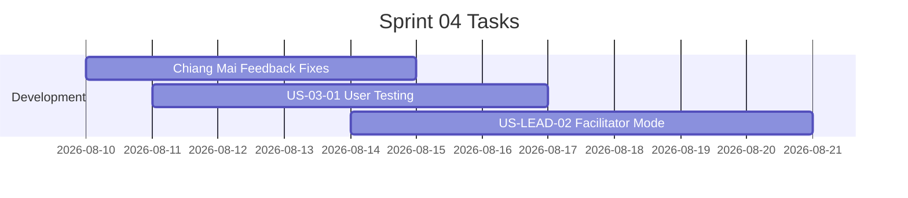

# Sprint 04: ปรับจาก feedback เชียงใหม่ + Facilitator Mode

**Goal:** ปรับปรุงแอปตามข้อเสนอแนะจากงานอบรมเชียงใหม่ และพัฒนาโหมดผู้นำชุมชน (Facilitator Mode)
**Timeline:** 2026-08-10 → 2026-08-21
**Version:** 1.0 | **Last Updated:** 2026-07-03

## 📅 Internal Timeline

## 📋 Committed Stories & Tasks
| ID | Story / Task | Estimate | Status |
|----|--------------|----------|--------|
| [US-LEAD-02](../01-product-backlog.md#should-have-ภายใน-ตค-2569) | ในฐานะผู้นำชุมชน ฉันต้องการ Facilitator Mode เพื่อใช้จัดกิจกรรมกลุ่มในชุมชน | L | [ ] |
| [US-03-01](../user-stories/US-03-01.md) | **User Testing** — ทดสอบกับผู้สูงอายุจริงอย่างน้อย 3 คน และปรับปรุงระบบตามผลทดสอบจริงเพื่อความง่ายในการเล่น (เลื่อนมาจาก Sprint 03) | M | [ ] |
| Task-04-01 | ปรับปรุงและแก้ไขปัญหาตาม Feedback จากงานอบรมเชียงใหม่ | M | [ ] |

## 🛠 Sprint Specifics
- **Definition of Done:**
  - บั๊กและข้อเสนอแนะจากงานเชียงใหม่ได้รับการแก้ไขและทดสอบเสร็จสิ้น
  - Facilitator Mode รองรับ Layout จอใหญ่, คู่มือพูดประกอบ และการตอบแบบกลุ่มอย่างสมบูรณ์
  - โครงระบบได้รับการเตรียมความพร้อมสำหรับงานอบรมแพร่ (17–18 ส.ค.) และน่าน (24–25 ส.ค.)
- **Risks & Blockers:**
  - **เวลาจำกัด:** (Blocker) มีเวลาแก้ปัญหาและพัฒนาหลังงานเชียงใหม่เพียง ~1 สัปดาห์ก่อนงานอบรมแพร่ ทีมงานต้องประเมินและเน้นแก้บั๊กวิกฤตก่อนเป็นลำดับแรก
