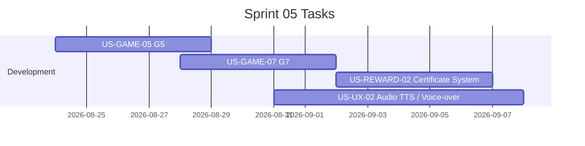

# Sprint 05: G5, G7, ใบประกาศ, เสียงอ่าน

**Goal:** พัฒนาเกมกางโล่ G5, เกมกระโดดหลบภัย G7, ระบบรับใบประกาศนียบัตร และระบบสนับสนุนเสียงอ่านโจทย์/เฉลย
**Timeline:** 2026-08-24 → 2026-09-11
**Version:** 1.1 | **Last Updated:** 2026-07-05

## 📅 Internal Timeline

## 📋 Committed Stories & Tasks
| ID | Story / Task | Estimate | Status |
|----|--------------|----------|--------|
| [US-GAME-05](../user-stories/US-GAME-05.md) | เกมกางโล่สะกดภัย "หยุด คิด ถาม ทำ" (G5) | M | [ ] |
| [US-GAME-07](../user-stories/US-GAME-07.md) | เกมวิ่งหลบภัยไซเบอร์ (G7) | M | [ ] |
| [US-REWARD-02](../01-product-backlog.md#should-have-ภายใน-ตค-2569) | ใบประกาศเมื่อเรียนครบ (ใส่ชื่อเล่น, บันทึกภาพ, แชร์ LINE) | M | [ ] |
| [US-UX-02](../01-product-backlog.md#should-have-ภายใน-ตค-2569) | เสียงอ่านโจทย์และเฉลย สำหรับผู้สูงอายุที่อ่านไม่ถนัด | M | [ ] |

## 🛠 Sprint Specifics
- **Definition of Done:**
  - เกม G5 (Digital Shield) แตะกางโล่สลายวัตถุภัยพิบัติเดี่ยวและฉายสโลแกน "หยุด คิด ถาม ทำ" ครบถ้วน และเกม G7 (Cyber Runner) ควบคุมแตะเพื่อกระโดดข้ามอุปสรรคสแกมเดี่ยว ทั้งสองเกมทำงานปกติและไม่มีหน้าจอ Game Over เชิงลบ
  - ใบประกาศนียบัตรสามารถกรอกชื่อเล่น บันทึกเป็นรูปภาพลงเครื่อง และแชร์ไปยัง LINE ได้
  - เสียงอ่านโจทย์และเฉลยมีปุ่มเปิด/ปิดเสียงชัดเจน และครอบคลุมเกม Must-have ทั้งหมด
- **Risks & Blockers:**
  - **การอัดเสียง/เสียงอ่านมีคุณภาพต่ำ:** (Risk) หากเลือกใช้วิธีอัดเสียงจริงอาจล่าช้าในการส่งมอบ หากใช้ TTS ต้องหา Service ที่ออกเสียงภาษาไทยเป็นธรรมชาติสำหรับผู้สูงอายุ
  - **ความยากในการกะจังหวะของเกมกระโดด (G7):** (Risk) ผู้สูงอายุอาจมีอัตราการตอบสนองที่ช้าลง ต้องกำหนดขนาดกล่องชน (Collider Box) ของสิ่งกีดขวางให้เล็กกว่าปกติ และเพิ่มระยะการมองเห็นสิ่งกีดขวางให้กว้างเพื่อให้เล่นได้ง่ายขึ้น
