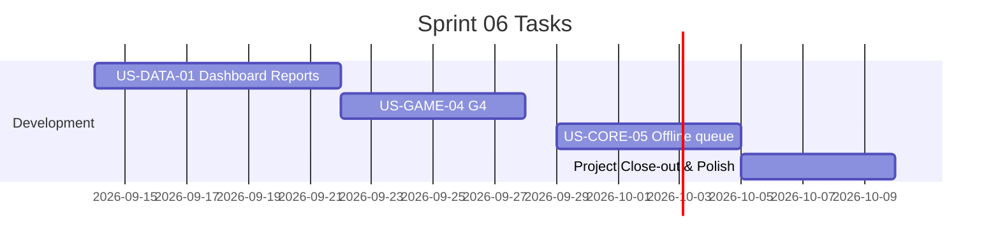

# Sprint 06: Dashboard, G4, polish, ส่งมอบ

**Goal:** พัฒนาหน้าแสดงผล Dashboard ของทีมงาน, พัฒนาเกม G4, ปรับปรุงระบบแบบออฟไลน์ และส่งมอบงานปิดโครงการ
**Timeline:** 2026-09-14 → 2026-10-09
**Version:** 1.0 | **Last Updated:** 2026-07-05

## 📅 Internal Timeline

## 📋 Committed Stories & Tasks
| ID | Story / Task | Estimate | Status |
|----|--------------|----------|--------|
| [US-DATA-01](../01-product-backlog.md#should-have-ภายใน-ตค-2569) | Dashboard จำนวนผู้เล่นแยกพื้นที่/ช่วงอายุ สำหรับวิเคราะห์ผล | M | [ ] |
| [US-GAME-04](../user-stories/US-GAME-04.md) | เกม "แชร์ดีไหม?" (G4) | M | [ ] |
| [US-CORE-05](../01-product-backlog.md#nice-to-have) | ระบบเล่นต่อได้แม้เน็ตหลุด (Queue to Sync) | M | [ ] |
| Task-06-01 | ปรับปรุงระบบภาพรวม (Polish) และจัดทำคู่มือส่งมอบงาน | S | [ ] |

## 🛠 Sprint Specifics
- **Definition of Done:**
  - Dashboard แสดงผลสถิติจำนวนผู้ใช้แยกจังหวัด/อำเภอ/ตำบล และช่วงอายุตามที่ระบุใน Acceptance Criteria
  - เกม G4 เล่นได้สมบูรณ์พร้อมคำเฉลย
  - แอปยังคงทำงานและเก็บประวัติผู้เล่นเพื่อนำมา Sync ภายหลังเมื่อเน็ตเชื่อมต่อ (Offline fallback)
  - เอกสารประกอบการส่งมอบครบถ้วน ระบบขึ้นระบบผลิต (Production Environment) จริงอย่างมั่นคง
- **Risks & Blockers:**
  - **งบประมาณหรือเวลาจำกัด:** (Risk) หากพัฒนาไม่ทัน ต้องลดขอบเขตงานโดยตัดฟีเจอร์ G4 (Nice), G7 (Should), G5 (Should) หรือเสียงอ่านตามลำดับความสำคัญ (แต่ G1-G3 และ G6 ต้องคงอยู่เสมอ)
