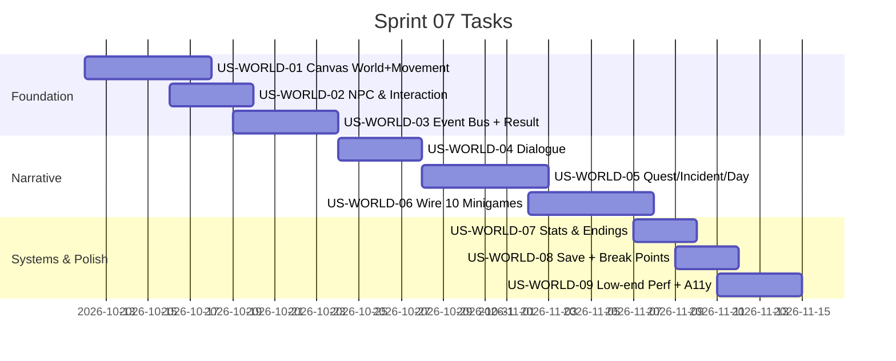

# Sprint 07: Top-Down Mini Prototype — "รู้ทันกลางสายหมอก"

**Goal:** สร้าง prototype โลก 2D top-down (Canvas 2D) มาห่อมินิเกม G1–G10 ที่มีอยู่แล้ว ให้เกมรู้สึกเป็น "เรื่องราวในชุมชน" แทนที่จะดูเป็นแอปทำแบบทดสอบ — พิสูจน์ว่าการเดินสำรวจ + บทสนทนา + เหตุการณ์ใกล้ตัว ช่วยลดความรู้สึกน่าเบื่อ/เหมือนสอบได้จริง
**Scope reference:** [05 — Mini Prototype GDD "รู้ทันกลางสายหมอก"](../../wiki/design/05-mini-prototype-gdd.docx.md) + [04 — Requirements Specification](../../wiki/design/04-requirements-specification.md)
**Timeline:** 2026-10-12 → 2026-11-14 (Planned — R&D / Production-Transition prototype)
**Version:** 1.0 | **Last Updated:** 2026-07-21

> **หมายเหตุสถานะ:** Sprint นี้เป็นงานสำรวจ (R&D) ล่วงหน้า **ไม่ใช่ Current Sprint** (Current Sprint ยังเป็น Sprint 03 polishing) — จัดทำ backlog ไว้ก่อนเพื่อให้เห็นภาพงานทั้งก้อนของ mini prototype

## 🧭 Key Decision — ใช้ Canvas 2D ไม่ใช่ Phaser

เอกสาร 04/05 ระบุ Phaser เดิม แต่ **ตัดสินใจใช้ Canvas 2D API แทน** ด้วยเหตุผลจาก field feedback ของโปรเจกต์พี่น้อง (MCI): เครื่องสเปคต่ำ (Samsung Galaxy A10s / PowerVR GE8320 / RAM 2–3GB) **เข้าเกม Phaser ไม่ได้เลย** เพราะ WebGL + particle/tween หนัก และ bundle ใหญ่ — ดู [MCI US-E9-07](/mnt/Storage-NVME1/PhaserProject/mci-attention-game-sorting-line/docs/agile/user-stories/US-E9-07.md)

โลก top-down ในเกมนี้เป็นแค่ "ทางเดินเชื่อม" มินิเกม ไม่ใช่เกม action → Canvas 2D (เร่งฮาร์ดแวร์บน Android Chrome, ไม่พึ่ง WebGL, ไม่มี bundle ใหญ่, cap FPS ง่าย) เพียงพอและปลอดภัยกับ A10s มากกว่า รองรับรูปภาพ (drawImage) + เอฟเฟคเบา ๆ ได้ ถ้า playtest พบว่ายังฝืดหรือการเดินเป็นอุปสรรค → fallback เป็น DOM node-map ตามที่ SRS §10 อนุญาต ("simplified navigation mode")

## 📅 Internal Timeline

## 📋 Committed Stories & Tasks
| ID | Story / Task | Phase (GDD §26) | Estimate | Status |
|----|--------------|-----------------|----------|--------|
| [US-WORLD-01](../user-stories/US-WORLD-01.md) | Canvas 2D world engine + เดิน 4 ทิศ + แผนที่เล็ก 1 แผนที่ | P1 | L | [ ] |
| [US-WORLD-02](../user-stories/US-WORLD-02.md) | NPC 5–7 ตัว + interaction zone + ปุ่มโต้ตอบ | P1 | M | [ ] |
| [US-WORLD-03](../user-stories/US-WORLD-03.md) | Typed Event Bus + `MinigameResult` contract + migrate `onFinish` | P1 | M | [ ] |
| [US-WORLD-04](../user-stories/US-WORLD-04.md) | ระบบบทสนทนา (Dialogue overlay) | P2 | M | [ ] |
| [US-WORLD-05](../user-stories/US-WORLD-05.md) | Quest + Incident + Day controller + หน้าสรุปประจำวัน | P2 | L | [ ] |
| [US-WORLD-06](../user-stories/US-WORLD-06.md) | เชื่อมมินิเกม G1–G10 เข้าเหตุการณ์ + Phone overlay | P3 | L | [ ] |
| [US-WORLD-07](../user-stories/US-WORLD-07.md) | 3 ค่าสถานะ + 3 ตอนจบ + ฉากเปิด/จบ | P2/P4 | M | [ ] |
| [US-WORLD-08](../user-stories/US-WORLD-08.md) | Save/Resume + จุดพัก "เล่นต่อ / พักก่อน" | P2/P4 | M | [ ] |
| [US-WORLD-09](../user-stories/US-WORLD-09.md) | Optimize เครื่องสเปคต่ำ (A10s) + Accessibility + emoji/SVG art | P4 | M | [ ] |

## 🛠 Sprint Specifics
- **Definition of Done:**
  - เดินสำรวจแผนที่เล็ก 1 แผนที่ (5 สถานที่) ได้ทั้งมือถือแนวตั้งและ PC แนวนอน ด้วย Canvas 2D
  - โต้ตอบ NPC → เกิดเหตุการณ์ → เปิดมินิเกมจริง (React overlay) → ส่ง `MinigameResult` กลับ → โลกทำงานต่อที่ตำแหน่งเดิม โดยไม่มี canvas/loop ซ้ำ
  - เล่นเนื้อเรื่องได้ครบ 3 วัน เชื่อมมินิเกมทั้ง 10 เกมจากเหตุการณ์ในโลก (ไม่ใช่จากเมนู)
  - มี 3 ค่าสถานะ, หน้าสรุปประจำวัน, จุดพัก "เล่นต่อ/พักก่อน", 3 ตอนจบ (ไม่มี game over)
  - Save/resume ได้ — รีเฟรชแล้วเล่นต่อจากเดิม
  - **ผ่านการทดสอบบนเครื่องสเปคต่ำ (A10s หรือ emulator เทียบเท่า)** — เข้าเล่นได้ ไม่ค้าง (AC หลักของ US-WORLD-09)
  - เอกสาร 04/05 ถูกแก้จุดที่ระบุ Phaser ให้สอดคล้องกับการตัดสินใจใช้ Canvas 2D
- **Risks & Blockers:**
  - **เครื่องสเปคต่ำ (A10s):** (Risk สูงสุด) แม้ใช้ Canvas 2D ก็ต้อง cap FPS, ลด effect, unload มินิเกมที่ปิด — ถ้ายังฝืด ให้ fallback DOM node-map (US-WORLD-01 มีทางออกไว้)
  - **Prototype ยาวเกินไป:** 10 มินิเกมในรอบเดียว 45–60 นาที อาจล้าสายตา — บรรเทาด้วยจุดพักท้ายวัน (US-WORLD-08) และ playtest ประเมินความยาว
  - **Result contract แตะทั้ง 10 เกม:** migrate `onFinish` ต้องทำแบบ backward-compatible ไม่ให้ Dev Game Hub / flow เดิมพัง (US-WORLD-03)
  - **Asset ยังไม่มี:** prototype ใช้ emoji + inline SVG ไปก่อน (US-WORLD-09) — ไม่รอ art จริง

## Related Documents
- Prototype GDD: [05 — รู้ทันกลางสายหมอก](../../wiki/design/05-mini-prototype-gdd.docx.md)
- Requirements: [04 — Requirements Specification](../../wiki/design/04-requirements-specification.md)
- Backlog: [Product Backlog](../01-product-backlog.md) → Epic "Top-Down Mini Prototype (E-WORLD)"
- มินิเกมที่จะถูกห่อ: G1–G10 ใน `src/components/` (ทดสอบผ่าน [Dev Game Hub](../user-stories/US-03-R4.md))
