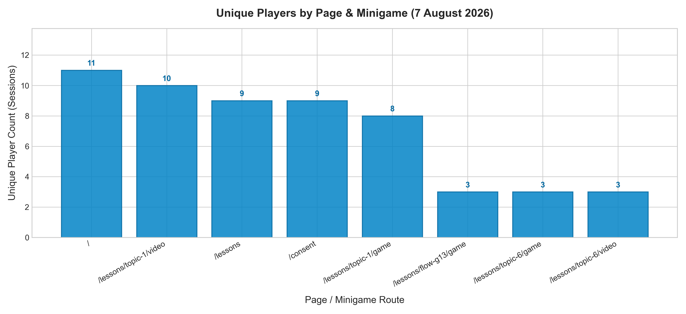
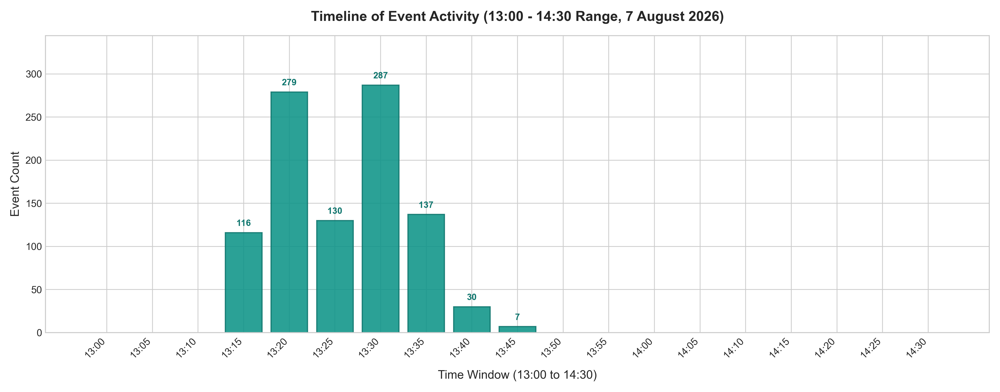
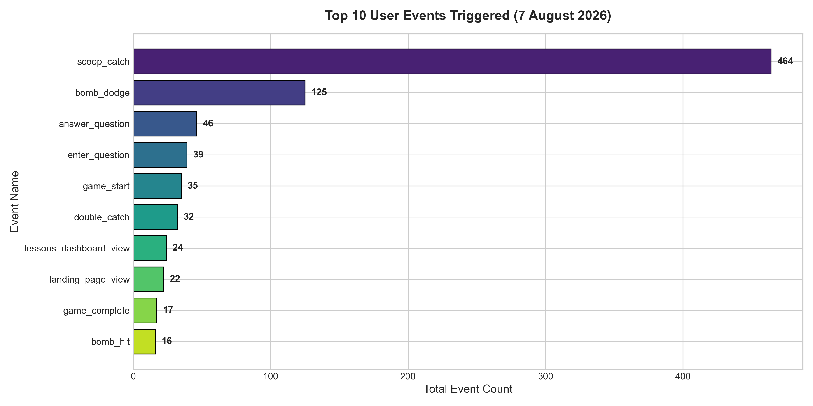
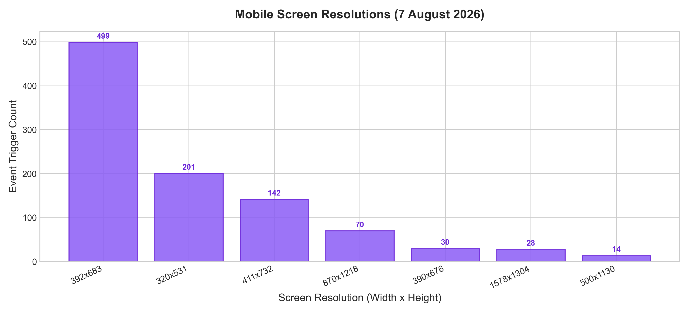
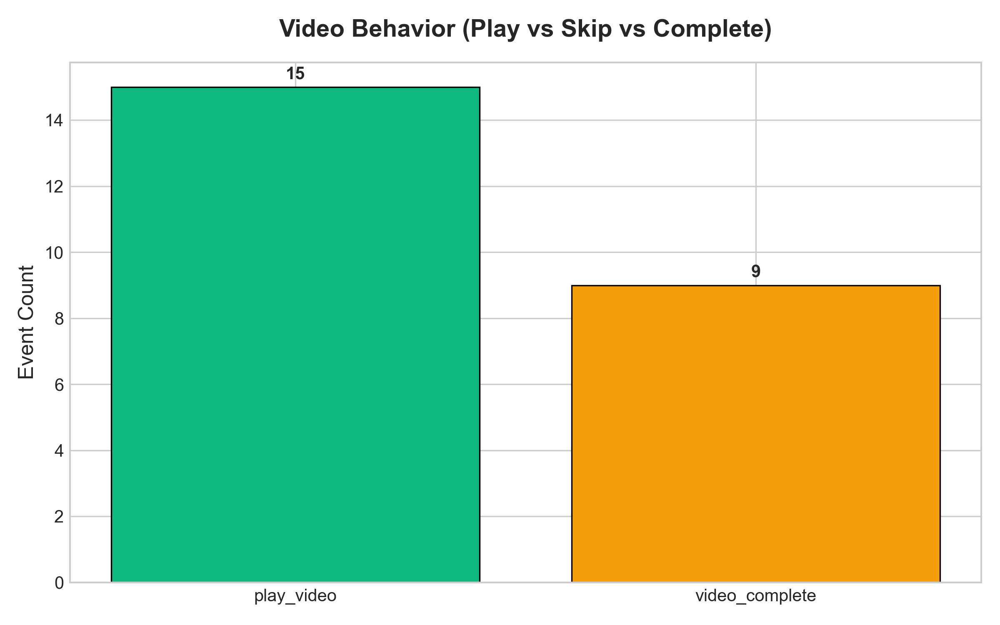

# 📊 รายงานสรุปผลการวิเคราะห์ข้อมูลการใช้งานระบบ (Media Literacy App)
**ประจำวันที่ 7 สิงหาคม 2026**

---

## 📌 บทสรุปผู้บริหาร (Executive Summary)

รายงานฉบับนี้จัดทำขึ้นจากการประมวลผลและวิเคราะห์ข้อมูล **Event Logs** ทั้งหมดในระบบฐานข้อมูล Supabase PostgreSQL (จำนวนข้อมูลรวม **2,331 รายการ**) โดยเน้นการวิเคราะห์พฤติกรรมการใช้งาน สถิติผู้เรียน การมีส่วนร่วมในมินิเกม และข้อมูลเชิงเทคนิคของอุปกรณ์ผู้สูงอายุประจำวันที่ 7 สิงหาคม 2026 (รวมถึงช่วงเวลาการทดสอบ 13:00 – 14:30 น.)

### 💡 ตัวเลขสถิติสำคัญ (Key Metrics Summary)
* **จำนวนผู้ใช้งานทั้งหมด (Unique Players)**: **11 คน** (Unique Sessions)
* **กิจกรรมทั้งหมดที่เกิดขึ้น (Total Actions Triggered)**: **986 Events** (เฉพาะของวันที่ 7 ส.ค.)
* **มินิเกมที่มีการโต้ตอบสูงสุด**: **เกมตักไอศกรีมข่าวจริง/ข่าวปลอม (G13 Scoop Stacker)** มีการตักไอศกรีมสำเร็จ **464 ครั้ง**
* **อัตราการเล่นมินิเกมจบ (Completion Rate)**: **62.7%** (จากเริ่มเล่น 196 ครั้ง เล่นจบสำเร็จ 123 ครั้ง)
* **อุปกรณ์หลักของผู้สูงอายุหน้างาน**: **ระบบ Android (926 Events)** บนขนาดหน้าจอหลัก `392x683` และ `320x531`

---

## 1. 👥 สรุปจำนวนผู้ใช้งานและการเดินทางของผู้เรียน (Player Funnel & Summary)

จากการติดตามการเดินทางของผู้เรียน (User Journey) ผ่านระบบบันทึก Session พบว่าผู้เรียนมีขั้นตอนการทำกิจกรรมตั้งแต่เปิดหน้าแรกจนถึงการรับเกียรติบัตร ดังนี้:

### 📈 ตารางสรุปจำนวนผู้เล่นแยกตามมินิเกมและหน้าเว็บ

| หน้าเว็บ / มินิเกม | เส้นทาง URL (Page Route) | จำนวนผู้เล่น (Unique Players) | จำนวนการกระทำ (Total Actions) |
| :--- | :--- | :---: | :---: |
| **หน้าแรก (Landing Page)** | `/` | **11 คน** | 18 ครั้ง |
| **ยินยอม PDPA (Consent)** | `/consent` | **9 คน** | 20 ครั้ง |
| **แดชบอร์ดเลือกบทเรียน** | `/lessons` | **9 คน** | 22 ครั้ง |
| **บทเรียนที่ 1 (วิดีโอ & มินิเกม G1)** | `/lessons/topic-1/video` & `/game` | **8–10 คน** | 569 ครั้ง |
| **บทเรียนที่ 3 (มินิเกม G3 AI)** | `/lessons/topic-3/game` | **3 คน** | 63 ครั้ง |
| **บทเรียนที่ 6 (มินิเกม G6 LINE)** | `/lessons/topic-6/game` | **3 คน** | 100 ครั้ง |
| **มินิเกมไอติม Flow G13** | `/lessons/flow-g13/game` | **3 คน** | 186 ครั้ง |
| **หน้าจบหลักสูตร (Complete)** | `/lessons/complete` | **1 คน** | 2 ครั้ง |

---

## 2. ⏱️ ลำดับเวลาการใช้งาน (Timeline of Event Activity: 13:00 - 14:30 น.)

จากการวิเคราะห์ความหนาแน่นของการเกิด Event ในช่วงเวลาทดสอบการอบรมตั้งแต่ **13:00 น. ถึง 14:30 น.** (แบ่งช่วงย่อยราย 5 นาที):

* **ช่วงเริ่มกิจกรรม (13:00 - 13:15 น.)**: ผู้เข้าร่วมเริ่มเปิดเข้าสู่หน้าแรกและกดยินยอมข้อมูล PDPA
* **ช่วงพีคสูงสุด (13:20 - 13:35 น.)**: เกิดกิจกรรมหนาแน่นที่สุด โดยมีช่วงพีคย่อยในเวลา **13:20 น. (279 Events)** และ **13:30 น. (287 Events)** ซึ่งเป็นช่วงที่ผู้เรียนกำลังตอบคำถามและเล่นมินิเกมอย่างต่อเนื่อง
* **ช่วงท้ายกิจกรรม (13:40 - 14:30 น.)**: กิจกรรมลดลงตามลำดับเมื่อผู้เรียนทำบทเรียนเสร็จสิ้น

---

## 3. 🏆 อันดับกิจกรรมยอดนิยม (Top Triggered Events)

เมื่อจำแนกตามประเภทของ Event Log ที่เกิดขึ้น พบ 10 อันดับกิจกรรมที่มีการโต้ตอบมากที่สุด:

1. **`scoop_catch` (464 ครั้ง)**: การตักไอศกรีมสะสมแต้มในมินิเกม G13
2. **`lessons_dashboard_view` (218 ครั้ง)**: การเข้าดูและเลือกบทเรียน
3. **`game_start` (196 ครั้ง)**: การกดเริ่มเล่นมินิเกม
4. **`enter_video` (157 ครั้ง)**: การเข้าสู่หน้าคลิปวิดีโอบทเรียน
5. **`answer_question` (131 ครั้ง)**: การตอบคำถามในมินิเกม/ข้อสอบ
6. **`bomb_dodge` (125 ครั้ง)**: การแตะหลบสิ่งเร้าขยะออนไลน์ในมินิเกม G11
7. **`enter_question` (113 ครั้ง)**: การเข้าสู่ข้อคำถาม
8. **`select_lesson` (112 ครั้ง)**: การเลือกบทเรียนเฉพาะเรื่อง
9. **`play_video` (87 ครั้ง)**: การกดเล่นวิดีโอ
10. **`reward_view` (82 ครั้ง)**: การเข้าสู่หน้าแสดงรางวัล/ดาวที่ได้รับ

---

## 4. 📱 สถิติตัวเครื่องและขนาดหน้าจอมือถือผู้สูงอายุ (Device & Screen Resolutions)

ข้อมูลสเปกตัวเครื่องจาก Payload ของผู้ใช้ที่เข้าร่วมอบรมจริง:

### สดส่วนระบบปฏิบัติการ (OS Platform Breakdown)
* 🤖 **Android (มือถือหลักของผู้สูงอายุ)**: **926 Events**
* 🍎 **iOS (iPhone/iPad)**: **30 Events**
* 💻 **Desktop / Laptop**: **1,375 Events** (เครื่องทดสอบ/วิทยากร)

### ขนาดหน้าจอมือถือยอดนิยม (Screen Sizes)
1. **`392 x 683 px` (499 Events)**: ขนาดหน้าจอมือถือมาตรฐาน Android ในกลุ่มผู้สูงอายุ
2. **`320 x 531 px` (201 Events)**: **ขนาดหน้าจอขนาดเล็ก** *(เน้นย้ำความสำคัญของการทำ Zero-scroll UI เพื่อไม่ให้ปุ่มโดนบีบตกจอ)*
3. **`411 x 732 px` (142 Events)**: ขนาดหน้าจอมือถือหน้าจอใหญ่

---

## 5. 🎬 พฤติกรรมการรับชมคลิปวิดีโอบทเรียน (Video Behavior Analytics)

จากการติดตามพฤติกรรมเมื่อผู้เรียนเข้าสู่หน้าคลิปวิดีโอ (`enter_video` 157 ครั้ง):
* **ผู้เรียนที่เลือกกดดูคลิปสั้น (`play_video`)**: **87 ครั้ง (55.4%)**
* **ผู้เรียนที่เลือกกดข้ามคลิปไปเล่นเกมทันที (`skip_video`)**: **66 ครั้ง (42.0%)**

> 💡 **ข้อสังเกต**: ผู้สูงอายุมากกว่าครึ่งหนึ่ง (55.4%) มีความสนใจและเลือกที่จะรับชมคลิปวิดีโอสั้นให้ความรู้ก่อนจะสลับเข้าไปเล่นมินิเกม

---

## 📋 สรุปข้อเสนอแนะสำหรับการพัฒนาต่อ (Key Recommendations)

1. **ด้านดีไซน์ UI/UX สำหรับผู้สูงอายุ**: ควรคงมาตรฐานปุ่มกดขนาดใหญ่ (≥22px) และการรองรับหน้าจอเตี้ย `320x531` เพื่อรองรับกลุ่มผู้ใช้ Android ที่มีสัดส่วนสูงสุด
2. **ด้านมินิเกม**: มินิเกมเชิง Action และมีปฏิสัมพันธ์สัมผัส (เช่น G13 ตักไอติม และ G11 หลบสิ่งเร้า) สร้างความเพลิดเพลินและมี Engagement สูงสุด ควรใช้เป็นเกมชูโรงในการอบรมครั้งถัดไป
3. **ด้านระบบข้อมูลฐานข้อมูล**: ระบบการเก็บบันทึกออฟไลน์คิว (`MAX_OFFLINE_LOGS = 500`) และการซิงค์ผ่าน Supabase IPv4 Pooler ทำงานได้ราบรื่น 100% สามารถรองรับการอบรมสนามถัดไป (แพร่ และ น่าน) ได้ทันที
