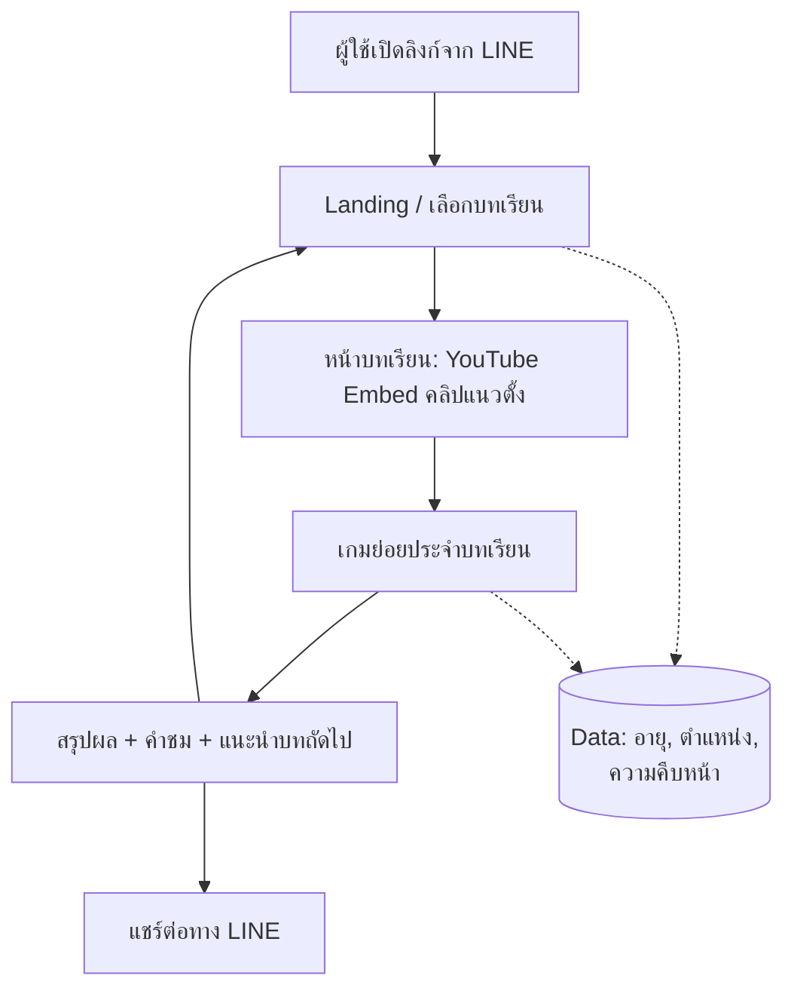

# รู้ทันสื่อ Interactive — Game Concept & Architecture

**Version:** 1.0 | **Last Updated:** 2026-07-03 | **Owner:** NAPLAB

## 1. Introduction

### Elevator Pitch
Web Application เชิง Interactive สำหรับ "โครงการสร้างเสริมสมรรถนะด้านสื่อสังคมออนไลน์ การหลอกลวงออนไลน์ และการรู้เท่าทันเทคโนโลยีปัญญาประดิษฐ์สำหรับผู้สูงอายุ" ผสานคลิปวิดีโอแนวตั้ง (ฝากไฟล์บน YouTube แล้ว Embed) เข้ากับเกมย่อยที่สร้างความตระหนักรู้ (Awareness) ว่า AI และมิจฉาชีพออนไลน์เข้ามาอยู่ในชีวิตประจำวันแล้ว ผู้ใช้เรียนรู้ผ่านลูป **ดูคลิป → เล่นเกม → ไปบทถัดไป** และฝึกหลักคิด **"หยุด คิด ถาม ทำ"** ทุกครั้งก่อนเชื่อหรือแชร์ ส่งต่อได้ง่ายผ่าน LINE

### Target Audience
ผู้ใช้งาน 2 กลุ่ม ซึ่งมีบทบาทต่างกัน:

| กลุ่ม | บทบาท | บริบทการใช้งาน |
|-------|--------|----------------|
| **กลุ่มที่ 1 — ผู้นำชุมชน** (อสม., ผู้ใหญ่บ้าน, เจ้าหน้าที่ สธ., แอดมินโซเชียลมีเดียชุมชน) | เรียนรู้เอง **และ** นำไปถ่ายทอด/จัดกิจกรรมต่อในชุมชน | อบรมเชิงปฏิบัติการ (Workshop) และนำแอปไปใช้เป็นเครื่องมือสอนกลุ่ม |
| **กลุ่มที่ 2 — ผู้สูงอายุในชุมชน** | กลุ่มเป้าหมายปลายทาง เรียนรู้ด้วยตนเองหรือผ่านผู้นำชุมชน | ใช้บนมือถือส่วนตัว มักเปิดผ่านลิงก์ที่แชร์มาทาง LINE |

ดูการออกแบบเส้นทางผู้ใช้แยกตามกลุ่มที่ [User Journey](./05-user-journey.md)

### Project Context
- **งบประมาณ:** 360,000 บาท (ชื่องบ: อบรมเชิงปฏิบัติการในชุมชน) — จำนวนเกมย่อยปรับตามความเหมาะสมของงบ
- **กรอบเวลาออกแบบสื่อ:** กรกฎาคม – ตุลาคม 2569 (มีอัพเดทย่อยระหว่างทาง)
- **การใช้งานจริงครั้งแรก (กับกลุ่มผู้นำผู้สูงอายุ):**
  - เชียงใหม่ 6–7 สิงหาคม 2569
  - แพร่ 17–18 สิงหาคม 2569
  - น่าน 24–25 สิงหาคม 2569

---

## 2. Technical Stack (ยืนยันแล้ว)

| Layer | Technology | Notes |
|-------|-----------|-------|
| Frontend | **Vite + React** (+ `vite-plugin-pwa`) | เบา เร็ว เหมาะกับมือถือรุ่นเก่า/เน็ตช้า; ทำ Progressive Web App ได้โดยไม่ผูก framework หนัก |
| Video | YouTube Embed (iframe) | ฝากไฟล์คลิปแนวตั้งบน YouTube ตาม Requirement เบื้องต้น |
| Game Engine | Phaser 3 หรือ HTML/JS เบา ๆ ต่อเกม | เลือกตามความซับซ้อนของเกมแต่ละตัว |
| Backend / Data | **Supabase** (Postgres + Edge Functions) | เก็บข้อมูลอายุ, ตำแหน่ง, ความคืบหน้า, `action_logs`; Edge Functions ใช้ทำ IP→geolocation |
| Geolocation จาก IP | **Cloudflare** request headers (`cf.country/region/city`) | ได้จังหวัด/ภูมิภาคฟรีจากทุก request โดยไม่ต้องเก็บ IP ดิบ หรือเรียก MaxMind/API ภายนอก — ตรงกับนโยบาย PDPA |
| Hosting | **Cloudflare Pages** | ฟรี เร็ว ลิงก์เดียวแชร์ผ่าน LINE ได้ทันที; ทำงานร่วมกับ geolocation ด้านบนในระบบเดียว |

### หมายเหตุเรื่อง PWA
แอปทำเป็น Progressive Web App (มี manifest + service worker) แต่ **ไม่ใช่เส้นทางหลัก** สำหรับกลุ่มผู้สูงอายุ — เพราะ LINE in-app browser (webview) ไม่รองรับ PWA install prompt ผู้ใช้ต้องกดเปิดในเบราว์เซอร์ปกติ (Safari/Chrome) ก่อนถึงจะ "เพิ่มลงหน้าจอโฮม" ได้เอง ซึ่งซับซ้อนเกินไปสำหรับการใช้งานครั้งแรกผ่านลิงก์ LINE จึงมอง PWA เป็น **bonus สำหรับผู้ใช้ที่กลับมาใช้ซ้ำ** (เช่น ผู้นำชุมชน) ส่วนประโยชน์หลักที่ทุกคนได้แน่ ๆ คือ service worker ช่วย cache asset และ queue คำตอบเกมตอนเน็ตหลุด (ตาม NFR ใน [System Design](../software/01-system-design.md#non-functional-requirements))

---

## 3. Game Collection / Features

### Feature หลัก 2 ส่วน
1. **Video Learning** — คลิปวิดีโอแนวตั้ง "รู้ทันสื่อ" 2 ชุด (ดูรายละเอียดเนื้อหาที่ [Content & Curriculum](./02-narrative.md))
2. **Awareness Mini-Games** — เกมย่อยประกอบแต่ละเรื่องที่แบ่งออกเป็น **3 รูปแบบหลัก** เพื่อสร้างเสริมสมรรถนะการเรียนรู้ของผู้สูงอายุอย่างมีประสิทธิภาพ (ดูรายละเอียดที่ [Core Mechanics](./01-mechanics.md))

### การจัดกลุ่ม 3 รูปแบบเกมหลัก (Game Formats)

เพื่อตอบสนองวัตถุประสงค์การเรียนรู้ที่รอบด้าน แอปพลิเคชันได้ออกแบบมินิเกมย่อยโดยแบ่งออกเป็น 3 รูปแบบ ดังนี้:

1. **เกมที่เน้นเนื้อหาโดยเฉพาะ (Content-Focused Games):**
   * *เป้าหมาย:* ถ่ายทอดความรู้ (Knowledge Transfer) และสร้างทักษะการแยกแยะข่าวสาร/สื่อสารสนเทศขั้นพื้นฐาน
   * *เกมย่อย:* **G1 — จริงหรือมั่ว?** (Fact-check ข่าวปลอม), **G2 — จับสัญญาณมิจ** (แยกแยะและตรวจหาข้อความ/SMS หลอกลวง), **G3 — AI หรือ คน?** (แยกแยะภาพที่สร้างด้วย AI), **G4 — แชร์ดีไหม?** (ความปลอดภัยของข้อมูลส่วนบุคคล) และเกมตอบคำถามชิงรางวัล/วัดความรู้ (Trivia/Knowledge Quiz)

2. **เกมจำลองสถานการณ์ (Simulation Games):**
   * *เป้าหมาย:* ให้ผู้เรียนเผชิญหน้ากับกลลวงในบริบทเสมือนจริง (Contextual Learning) เพื่อฝึกการจับจุดที่น่าสงสัย (Red Flags)
   * *เกมย่อย:* **G6 — จำลองแชท LINE** (จำลองห้องแชท LINE Platform เสมือนจริงที่มีมิจฉาชีพทักเข้ามาหลอกลวงรูปแบบต่างๆ เพื่อฝึกการตรวจจับ Red Flags)

3. **เกมสร้างเสริมกำลังใจ (Motivation & Empowerment Action Games):**
   * *เป้าหมาย:* เสริมสร้างความเชื่อมั่นในตัวเองด้วย Action Game เล่นง่ายๆ ไม่ซับซ้อน เพื่อลดความกดดัน สอดแทรกความตื่นเต้นเชิงสร้างสรรค์ และย้ำเตือนสโลแกนเพื่อระงับการโอนหรือแชร์ข้อมูลโดยง่าย
   * *เกมย่อย:* **G5 — หยุด คิด ถาม ทำ (กางโล่กู้ชีพ)** (แตะกางโล่เพื่อสะกัดข้อความเสี่ยงภัยดิจิทัล) และ **G7 — วิ่งสู้ภัยไซเบอร์ (กระโดดหลบภัย)** (แตะกระโดดข้ามสิ่งกีดขวาง/อุปสรรคสแกมเมอร์)

### ตารางสรุปรายการเกมย่อย
| # | เกม | รูปแบบเกม (Game Format) | Topic ที่รองรับ | Priority |
|---|-----|-----------------------|----------------|----------|
| G1 | จริงหรือมั่ว? (Fact-Check Quiz) | 1. Content-Focused | Topic 1 — MIL | Must |
| G2 | จับสัญญาณมิจ (Spot the Scam Quiz) | 1. Content-Focused | Topic 2 — Scams | Must |
| G3 | AI หรือ คน? (AI or Not) | 1. Content-Focused | Topic 3 — AI | Must |
| G4 | แชร์ดีไหม? (Privacy Game) | 1. Content-Focused | Topic 1 — Online Safety | Nice |
| G5 | หยุด คิด ถาม ทำ (กางโล่กู้ชีพ) | 3. Motivation & Action | ชุดที่ 2 — ทัศนคติ | Should |
| G6 | จำลองแชท LINE (LINE Simulation) | 2. Simulation | Topic 2 — Scams | Must |
| G7 | วิ่งสู้ภัยไซเบอร์ (กระโดดหลบภัย) | 3. Motivation & Action | ชุดที่ 2 — ทัศนคติ | Should |

---

## 4. System Architecture

หลักการสำคัญ:
- **Guided Sequence** — ระบบกำหนดลำดับ เปิดเข้ามาดูคลิปก่อนแล้วตามด้วยเกม จากนั้นแนะนำคลิป/เกมถัดไป
- **ไม่ต้อง Login** — ลดขั้นตอนสำหรับผู้สูงอายุ เก็บเฉพาะอายุและตำแหน่ง (พร้อมขอความยินยอม — ดู [Data Schema](../software/03-data-schema.md))
- **LINE-first** — ทุกบทเรียนมีลิงก์ตรง (deep link) สำหรับส่งต่อใน LINE

---

## 5. นโยบายการนำเสนอเนื้อหาที่สร้างจาก AI ⚠️

โครงการนี้สอนเรื่องการรู้เท่าทัน AI จึงมีเนื้อหาตัวอย่างที่สร้างจาก AI (ภาพ, เสียง, deepfake) อยู่ในสื่อและเกม — **ต้องระมัดระวังเป็นพิเศษ**:

1. **ติดป้ายชัดเจนทุกครั้ง** — เนื้อหาที่สร้างจาก AI ที่ใช้เป็นตัวอย่างในเกม/คลิป ต้องมีข้อความกำกับ เช่น "⚠️ ภาพนี้สร้างโดย AI เพื่อการเรียนรู้" ปรากฏ **หลังเฉลย** (ไม่ใช่ก่อน เพื่อไม่ทำลายโจทย์เกม) และในหน้าสรุป
2. **ไม่ใช้ภาพ/เสียงบุคคลจริงโดยไม่ได้รับอนุญาต** — สอดคล้องกับเนื้อหา Topic 3 เรื่อง AIGC Ethics (สิทธิ์ภาพตัวเอง + ไม่เอาภาพคนอื่นมา Gen AI) — สื่อของเราต้องเป็นตัวอย่างที่ดีเอง
3. **ไม่สร้างความหวาดกลัวเกินจริง** — โทนคือ "รู้จักไว้ไม่ต้องกลัว" เนื้อหา AI ตัวอย่างต้องจบด้วยวิธีสังเกตและวิธีรับมือเสมอ
4. **แหล่งที่มาโปร่งใส** — ระบุในหน้า About ว่าสื่อใดผลิตโดยทีมงาน สื่อใดสร้างด้วยเครื่องมือ AI ใด

---

## Related Documents
- Mechanics: [Core Mechanics](./01-mechanics.md)
- Content: [Content & Curriculum](./02-narrative.md)
- UI/UX: [Art Direction & Accessibility](./03-art-direction.md)
- Journey: [User Journey](./05-user-journey.md)
- System: [System Design](../software/01-system-design.md)
- Backlog: [Product Backlog](../agile/01-product-backlog.md)
