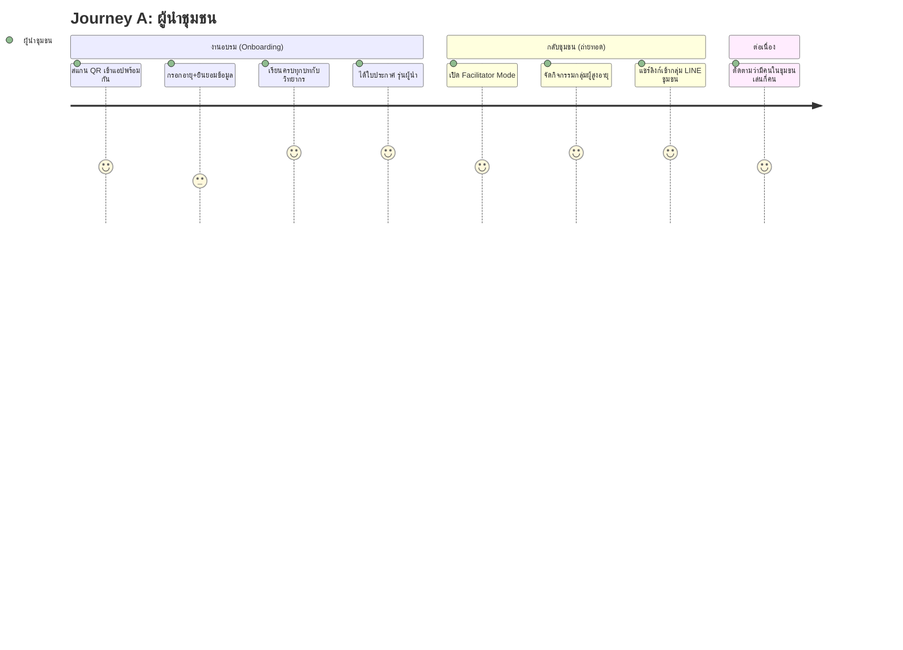
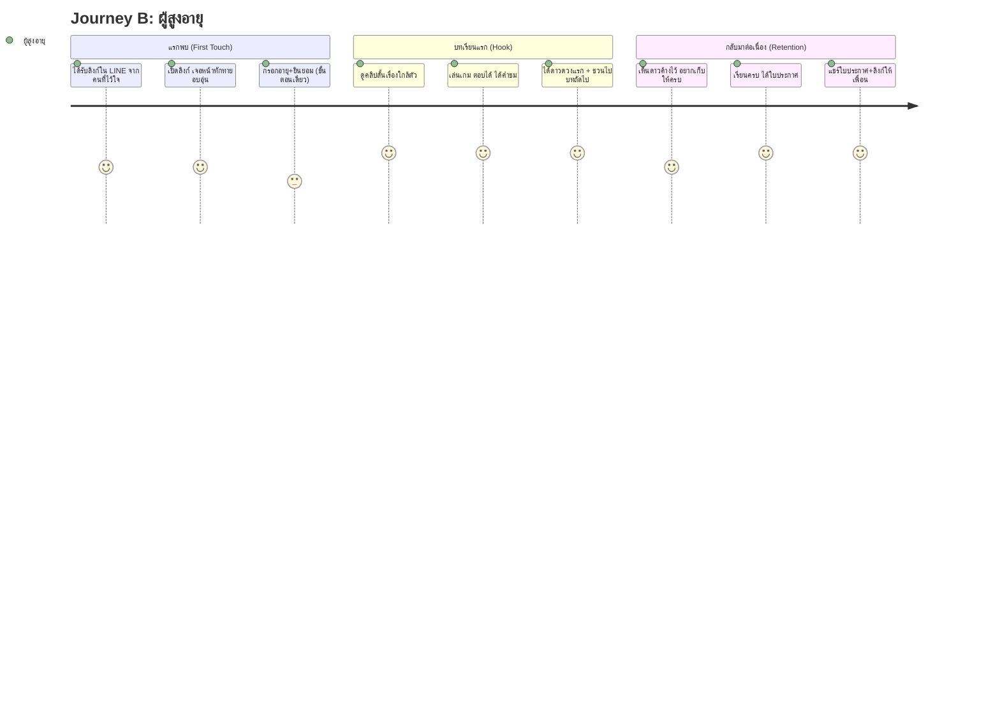

# รู้ทันสื่อ Interactive — User Journey Design

**Version:** 1.0 | **Last Updated:** 2026-07-03
**สถานะ:** 🟡 ข้อเสนอการออกแบบ (Requirement เดิมยังไม่ได้ลงรายละเอียดส่วนนี้ — เอกสารนี้คือ draft สำหรับทีมทบทวน)

> โจทย์: ออกแบบเส้นทางผู้ใช้ให้ **สร้างแรงดึงดูดที่เหมาะสมกับผู้สูงวัย** — ดึงดูดโดยไม่กดดัน, สนุกโดยไม่ทำให้อาย, และง่ายจนไม่มีใครหลงทาง

---

## หลักจิตวิทยาแรงดึงดูดสำหรับผู้สูงวัย

การออกแบบทุกจุดใน Journey อิงหลัก 5 ข้อนี้:

1. **ความภูมิใจ > ความท้าทาย** — ผู้สูงวัยถูกดึงดูดด้วยความรู้สึก "ฉันทำได้ / ฉันตามทัน" มากกว่าความยากของเกม → ให้คำชมจริงใจ, ใบประกาศ, ดาวสะสม
2. **ความเกี่ยวข้องกับชีวิตจริง** — โจทย์ต้องเป็นสถานการณ์ที่เขาเจอจริง (แชท LINE, โทรศัพท์อ้างเป็นตำรวจ, ข่าวสุขภาพ) ไม่ใช่สถานการณ์สมมุติไกลตัว
3. **ความสัมพันธ์ทางสังคม** — แรงจูงใจใหญ่ที่สุดคือ ลูกหลาน เพื่อนบ้าน และการได้เป็น "คนที่เตือนคนอื่นได้" → ปุ่มแชร์ LINE, ใบประกาศที่อวดได้, บทบาท "ผู้รู้ทัน" ในชุมชน
4. **ปลอดภัยทางใจ** — ไม่มีการจับเวลา ไม่มีตกรอบ ไม่มีคะแนนประจาน ตอบผิด = ได้เรียนรู้
5. **ทีละก้าว สั้น ๆ จบเป็นตอน** — 1 บทเรียน = คลิปสั้น + เกมสั้น จบใน 5–8 นาที เหมาะกับสมาธิและเวลาว่างเป็นช่วง ๆ

---

## Journey A — ผู้นำชุมชน (เรียนรู้ → ถ่ายทอด)

ผู้นำชุมชนพบแอปครั้งแรกใน **งานอบรมเชิงปฏิบัติการ** (เชียงใหม่/แพร่/น่าน ส.ค. 2569) โดยมีวิทยากรพาใช้

**จุดออกแบบสำคัญ:**
- **Facilitator Mode (โหมดผู้นำกิจกรรม):** หน้าจอเหมาะกับต่อโปรเจกเตอร์/ทีวี, มีคู่มือพูดประกอบแต่ละบท (พูดอะไรก่อนเปิดคลิป, ชวนคุยอะไรหลังเกม), เล่นเกมแบบยกมือ/แบ่งทีมเพื่อความสนุกในวงกิจกรรม
- **เครื่องมือส่งต่อ:** ปุ่ม "แชร์บทนี้เข้า LINE" สร้างข้อความสำเร็จรูป + ลิงก์ตรงบทเรียน ผู้นำไม่ต้องพิมพ์เอง
- **แรงดึงดูดของผู้นำ:** สถานะ "ผู้นำรู้ทันสื่อ" (ใบประกาศรุ่นผู้นำ) + เห็นผลลัพธ์ว่าชุมชนตัวเองมีคนเรียนไปเท่าไร (จากข้อมูลตำแหน่ง/จำนวนผู้เล่น)

## Journey B — ผู้สูงอายุในชุมชน (กลุ่มเป้าหมาย)

ผู้สูงอายุมาถึงแอปได้ 2 ทาง: **(1) ผ่านกิจกรรมกลุ่มที่ผู้นำจัด** หรือ **(2) ลิงก์ที่ถูกแชร์มาใน LINE** (จากผู้นำ, ลูกหลาน, เพื่อน)

**จุดออกแบบสำคัญ (ไล่ตามลำดับหน้าจอ):**

| ขั้น | หน้าจอ | การออกแบบแรงดึงดูด |
|------|--------|---------------------|
| 1. Landing | หน้าทักทาย | ภาษาอบอุ่น ("ยินดีต้อนรับ มาฝึกรู้ทันสื่อไปด้วยกัน") ปุ่มเดียวใหญ่ ๆ "เริ่มเลย" — ไม่มี login ไม่มีเมนู |
| 2. ข้อมูลเบื้องต้น | ฟอร์มสั้น | ถามอายุ (ปุ่มช่วงอายุ ไม่ต้องพิมพ์) + ขอความยินยอมตำแหน่งด้วยภาษาง่าย ปฏิเสธได้โดยใช้แอปต่อได้ |
| 3. เลือกบท | การ์ดบทเรียน | เรียงเป็นเส้นทางชัดเจน บทแนะนำถัดไปมีป้าย "บทต่อไปของคุณ" กะพริบเบา ๆ |
| 4. คลิป | YouTube แนวตั้ง | เปิดปุ๊บเล่นได้เลย มีปุ่ม "ดูจบแล้ว ไปเล่นเกม" โผล่ท้ายคลิป |
| 5. เกม | โจทย์ทีละข้อ | 3–5 ข้อจบ ทุกเฉลยจบด้วยประโยคเชิงบวก + โยงหลัก "หยุด คิด ถาม ทำ" |
| 6. สรุปบท | ฉลอง | ดาวเด้งขึ้น + คำชม + "บทต่อไป: ..." ปุ่มใหญ่ปุ่มเดียว |
| 7. จบหลักสูตร | ใบประกาศ | ใส่ชื่อเล่นได้ บันทึกภาพ/แชร์เข้า LINE ได้ทันที — จุด viral หลักของแอป |

**Retention โดยไม่มี notification:** แอปเปิดจาก LINE จึง push notification ไม่ได้ → อาศัย (1) ดาวที่ค้างไว้สร้างความอยากเก็บให้ครบ (2) ผู้นำชุมชนแชร์บทใหม่เข้ากลุ่ม LINE เป็นระยะ (มีปฏิทินแนะนำในคู่มือผู้นำ) (3) ใบประกาศที่เพื่อนแชร์กันเป็นแรงชวนตามธรรมชาติ

---

## จุดเสี่ยงหลุด (Drop-off Risks) และการรับมือ

| จุดเสี่ยง | การรับมือ |
|-----------|-----------|
| ฟอร์มขอข้อมูล/ยินยอมหน้าแรก | สั้นที่สุด 1 หน้าจอ ภาษาง่าย ปุ่มช่วงอายุแทนการพิมพ์ |
| คลิปยาวเกิน สมาธิหลุด | คลิปละไม่เกิน ~3 นาที (ประสานทีมวิดีโอ) |
| เล่นเกมไม่เป็น | โจทย์แรกของทุกเกมเป็นข้อสาธิต ตอบยังไงก็ถูก + มีเสียงอ่านนำ |
| เน็ตช้า โหลดนาน | Asset เบา มีสถานะกำลังโหลดที่เข้าใจง่าย |
| เปิดจาก LINE แล้ว embed ไม่เล่น | ปุ่ม fallback "เปิดดูใน YouTube" |

## Related Documents
- Concept: [Concept & Architecture](./00-concept.md)
- Mechanics: [Core Mechanics](./01-mechanics.md)
- UI/UX: [Art Direction & Accessibility](./03-art-direction.md)
- Backlog: [Product Backlog](../agile/01-product-backlog.md)
