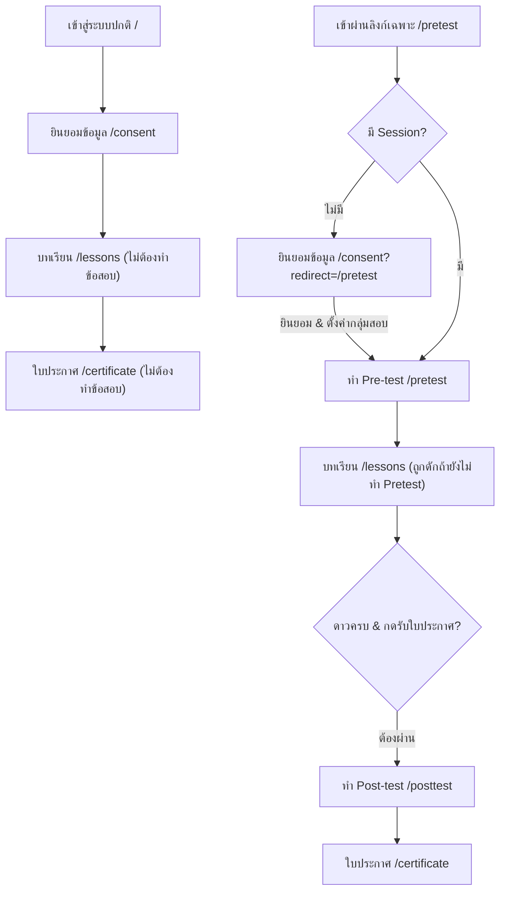

# รู้ทันสื่อ Interactive — แบบทดสอบ Pre-test & Post-test

**Version:** 1.0 | **Last Updated:** 2026-07-19 | **Status:** Active

> เอกสารนี้ทำหน้าที่ระบุรายละเอียดของแบบทดสอบก่อนเรียน (Pre-test) และแบบทดสอบหลังเรียน (Post-test) ทั้งในแง่ของเนื้อหาข้อสอบ (คำถาม, ตัวเลือก, เฉลย, คำอธิบาย) และระบบการทำงานของแอปพลิเคชัน (Routing, Guard Logic, Database Schema)

---

## 1. ภาพรวมและโฟลว์ระบบ (Application Flow & Guard Logic)

ระบบแบ่งการไหลของหน้าจอ (Application Flow) ออกเป็น 2 เส้นทาง (Split Path) เพื่อแยกแยะกลุ่มผู้ใช้ทั่วไปออกจากกลุ่มประเมินผลสัมฤทธิ์ทางการเรียนรู้ (Test Group) ดังนี้:

### แผนผังเส้นทางการเรียนรู้ (Split-Path Flowchart)

1. **เส้นทางปกติ (General Public Flow):**
   - **การทำงาน:** เข้าจากลิงก์หลัก `/` หรือกรอกข้อมูลปกติที่หน้า `/consent`
   - **สิทธิ์:** ระบบจะอนุญาตให้ข้ามการทำแบบทดสอบทั้งหมด โดยเมื่อกดยินยอมข้อมูลแล้ว จะส่งตรงไปที่หน้าหลัก `/lessons` ทันที และเมื่อเรียนครบจะเข้าสู่หน้า `/certificate` ได้โดยไม่ถูกดักทำ Post-test

2. **เส้นทางกลุ่มทดสอบ (Test Group Flow):**
   - **การเข้าถึง:** เข้าถึงผ่านลิงก์เส้นทางพิเศษ ได้แก่ `/pretest` หรือ `/posttest` โดยตรง
   - **กลไกอัตโนมัติ (Implicit Registration):** เมื่อผู้ใช้เข้าสู่หน้า `/pretest` หรือ `/posttest` ไม่ว่าจะผ่านลิงก์ตรงหรือถูกเปลี่ยนเส้นทางมาจากพารามิเตอร์ `?redirect=/pretest` ระบบจะทำการระบุตัวตนในข้อมูลเซสชัน (Session Cookie) ให้เป็นกลุ่มทดสอบ (`isTestingGroup = true`) โดยอัตโนมัติ
   - **กลไกการดักเส้นทาง (Guard Logic):**
     - **Pre-test Guard:** หากเป็นกลุ่มทดสอบและยังไม่ได้บันทึกผลคะแนนก่อนเรียน ระบบจะดักเปลี่ยนเส้นทางมาทำ Pre-test เสมอเมื่อพยายามเข้าหน้าบทเรียน `/lessons`
     - **Post-test Guard:** เมื่อสะสมดาวครบ 5 บทเรียนและพยายามเข้าหน้า `/certificate` ระบบจะดักตรวจสอบสถานะและส่งไปทำแบบทดสอบหลังเรียนที่หน้า `/posttest` ก่อนทุกครั้ง

---

## 2. รายละเอียดข้อสอบ (Quiz Spec & Content)

ข้อสอบถูกออกแบบมาให้เหมาะสมสำหรับผู้สูงอายุ โดยเน้นเนื้อหาหลักในการรับมือมิจฉาชีพและทักษะการรู้เท่าทันสื่อดิจิทัล มีระบบเสียงอ่านโจทย์ช่วย (Text-to-Speech) และเฉลยคำตอบพร้อมคำอธิบายหลังจากเสร็จสิ้นเพื่อเพิ่มประสิทธิภาพความเข้าใจ

### 2.1 แบบทดสอบก่อนเรียน (Pre-test)

| รหัสข้อ (ID) | คำถาม (Question Text) | ตัวเลือกคำตอบ (Options) | ตัวเลือกที่ถูก (Correct Option) | คำอธิบายเฉลย (Explanation) |
|---|---|---|:---:|---|
| **pre-q1** | หากมีข้อความแชร์ในไลน์กลุ่มว่า 'ดื่มน้ำมะนาวผสมน้ำอุ่นช่วยรักษาโรคมะเร็งได้หายขาดใน 3 วัน' ท่านจะปฏิบัติอย่างไร? | 1. เชื่อทันทีและรีบกดแชร์ส่งต่อให้เพื่อนคนอื่นในไลน์กลุ่ม 2. ไม่แชร์ต่อ และตรวจสอบข้อมูลจากแหล่งข่าวหรือแพทย์ที่เชื่อถือได้ก่อน 3. ไม่แน่ใจ | **ตัวเลือกที่ 2** | ข่าวรักษามะเร็งด้วยมะนาวจัดเป็นข่าวลือทางการแพทย์ ควรหลีกเลี่ยงการแชร์ต่อและตรวจสอบจากศูนย์ต่อต้านข่าวปลอมก่อนเชื่อครับ |
| **pre-q2** | มีข้อความ SMS ส่งมาว่า 'พัสดุของท่านชำรุดเสียหาย กรุณากดลิงก์เพื่อกรอกข้อมูลรับค่าชดเชย 1,000 บาท' ท่านควรทำอย่างไร? | 1. กดเปิดลิงก์เพื่อกรอกชื่อและบัญชีธนาคารรับเงินชดเชย 2. ห้ามกดเปิดลิงก์ และลบข้อความ SMS ทิ้งทันที 3. ไม่แน่ใจ | **ตัวเลือกที่ 2** | มิจฉาชีพมักแอบอ้างเป็นบริษัทขนส่งเพื่อส่งลิงก์ดูดเงินหรือติดตั้งแอปพลิเคชันควบคุมมือถือ ห้ามกดลิงก์ดังกล่าวเด็ดขาดครับ |
| **pre-q3** | ข้อใดเป็นจุดสังเกตหลักในการจับผิดภาพถ่ายบุคคลที่สร้างขึ้นจากปัญญาประดิษฐ์ (AI Deepfake)? | 1. รายละเอียดนิ้วมือบิดเบี้ยว แววตาแข็งทื่อไม่กะพริบ ขอบผมฟุ้งเบลอ 2. ภาพมีความคมชัดและสีสันสวยงามสมบูรณ์แบบมากเกินไป 3. ไม่แน่ใจ | **ตัวเลือกที่ 1** | AI ในปัจจุบันยังมีจุดบกพร่องในการสร้างอวัยวะที่มีรายละเอียดสูง เช่น นิ้วมือแหว่ง/เกิน แววตาแข็งทื่อไม่กะพริบ หรือจุดเชื่อมต่อขอบผมเบลอผิดสังเกตครับ |

---

### 2.2 แบบทดสอบหลังเรียน (Post-test)

| รหัสข้อ (ID) | คำถาม (Question Text) | ตัวเลือกคำตอบ (Options) | ตัวเลือกที่ถูก (Correct Option) | คำอธิบายเฉลย (Explanation) |
|---|---|---|:---:|---|
| **post-q1** | เมื่อได้รับลิงก์แจกเงินช่วยเหลือค่าครองชีพจากหน่วยงานรัฐบาลส่งมาในกลุ่มไลน์ ท่านควรตรวจสอบอย่างไรก่อนเชื่อ? | 1. ตรวจสอบกับเว็บไซต์หลักของหน่วยงานนั้นๆ หรือโทรสอบถามสายด่วนก่อน 2. รีบแชร์ลิงก์ส่งต่อไปให้ญาติพี่น้องคนอื่นลองกดรับสิทธิ์ก่อน 3. ไม่แน่ใจ | **ตัวเลือกที่ 1** | การชะลอการตอบสนองความเร็วด้วยการกางโล่ 'หยุด คิด ถาม ทำ' ช่วยให้เรามีเวลาสืบค้นจากเว็บไซต์หลักและไม่หลงกลหน้าเพจปลอมครับ |
| **post-q2** | มิจฉาชีพแอบอ้างเป็นตำรวจโทรหาและแจ้งว่า 'ท่านเกี่ยวข้องกับคดีฟอกเงิน ให้โอนเงินทั้งหมดมาตรวจสอบ' ท่านควรทำอย่างไร? | 1. ตกใจและยอมรีบโอนเงินไปให้ทันทีเพื่อยืนยันความบริสุทธิ์ใจ 2. วางสายทันที และโทรติดต่อสถานีตำรวจโดยตรงเพื่อยืนยันข้อเท็จจริง 3. ไม่แน่ใจ | **ตัวเลือกที่ 2** | เจ้าหน้าที่ตำรวจและหน่วยงานรัฐไม่มีสิทธิ์โทรศัพท์มาสอบสวนเรื่องการเงินหรือขอให้ประชาชนโอนเงินผ่านทางโทรศัพท์เพื่อตรวจสอบเด็ดขาดครับ |
| **post-q3** | หากมีแชทจากลูกหลานหรือเพื่อนสนิททักมาขอยืมเงินเร่งด่วนทางข้อความ LINE สิ่งใดที่ควรปฏิบัติก่อนโอนเงิน? | 1. โทรศัพท์กลับไปด้วยเสียงหรือวิดีโอคอลเพื่อพูดคุยยืนยันกับเจ้าตัวโดยตรง 2. รีบโอนเงินช่วยเหลือทันทีเพราะเกรงใจเพื่อนและกลัวเพื่อนโกรธ 3. ไม่แน่ใจ | **ตัวเลือกที่ 1** | แชท LINE สามารถโดนแฮกหรือสวมรอยรูปภาพได้ง่าย เพื่อความปลอดภัยสูงสุดควรโทรศัพท์ติดต่อพูดคุยให้ได้ยินเสียงหรือวิดีโอคอลยืนยันตัวตนก่อนโอนเงินเสมอครับ |

---

## 3. สถาปัตยกรรมทางเทคนิคและการเก็บข้อมูล (Technical Architecture & Data Schema)

### 3.1 โครงสร้างตารางฐานข้อมูล (Supabase / PostgreSQL)
ข้อมูลแบบทดสอบและประวัติผู้ใช้งานถูกจัดเก็บในตารางโครงสร้างเชิงสัมพันธ์ดังนี้:

1. **`quiz_questions`**: ตารางเก็บโจทย์ข้อสอบหลัก
   - `id` (`VARCHAR`, PK) เช่น `pre-q1`, `pre-q2`
   - `test_type` (`VARCHAR`) กำหนดประเภท `pretest` หรือ `posttest`
   - `question_text` (`TEXT`) ข้อความคำถามภาษาไทย
   - `media_url` (`TEXT`, Nullable) ที่อยู่รูปภาพประกอบโจทย์
   - `explanation` (`TEXT`, Nullable) ข้อความอธิบายเฉลยท้ายการทดสอบ
   - `sort_order` (`INTEGER`) ลำดับการเรียงลำดับการทำข้อสอบ

2. **`quiz_options`**: ตารางเก็บตัวเลือกคำตอบของแต่ละข้อ
   - `id` (`UUID`, PK)
   - `question_id` (`VARCHAR`, FK -> `quiz_questions.id`)
   - `option_text` (`TEXT`) ข้อความตัวเลือกภาษาไทย
   - `is_correct` (`BOOLEAN`) ทำหน้าที่ระบุว่าเป็นคำตอบที่ถูกหรือไม่

3. **`quiz_attempts`**: ตารางเก็บประวัติความพยายามในการสอบแต่ละครั้ง
   - `id` (`UUID`, PK)
   - `session_id` (`UUID`, FK -> `sessions.id`)
   - `test_type` (`VARCHAR`)
   - `score` (`INTEGER`) คะแนนสอบที่ได้
   - `completed_at` (`TIMESTAMP`) เวลาที่ทำแบบทดสอบเสร็จ

4. **`quiz_answers`**: ตารางบันทึกการตอบจริงของผู้เรียนเป็นรายข้อ
   - `id` (`UUID`, PK)
   - `attempt_id` (`UUID`, FK -> `quiz_attempts.id`)
   - `question_id` (`VARCHAR`, FK -> `quiz_questions.id`)
   - `selected_option_id` (`UUID`, FK -> `quiz_options.id`)
   - `is_correct` (`BOOLEAN`) ระบุว่าตอบข้อนี้ถูกหรือผิด

### 3.2 ชุดข้อมูล API
ระบบสื่อสารข้อมูลผ่าน API Endpoints ต่อไปนี้:
- **`GET /api/quiz-questions?type={pretest|posttest}`**: เรียกดึงข้อมูลข้อสอบทั้งหมดตามประเภทที่เลือก เพื่อนำมาเรนเดอร์ในคอมโพเนนต์
- **`POST /api/quiz-attempts`**: ส่งผลคะแนนสุทธิของการทำแบบทดสอบไปบันทึกประวัติการเริ่มทำ/ทำเสร็จ
- **`POST /api/quiz-answers`**: ใช้สำหรับการบันทึกชุดตัวเลือกที่ผู้ใช้กดเลือกจริงลงในตาราง โดยรองรับการบันทึกแบบกลุ่ม (Batch insertion) เพื่อประหยัดทราฟฟิกเครือข่าย

---

## 🔗 เอกสารอ้างอิงและรหัสโค้ดที่เกี่ยวข้อง
- **โครง DDL Schema:** [supabase-schema.sql](../supabase-schema.sql)
- **ข้อมูลตั้งต้น Seeding Script:** [db-init.cjs](../../scripts/db-init.cjs)
- **คอมโพเนนต์แสดงผลส่วนติดต่อผู้ใช้:** [QuizScreen.tsx](../../src/components/QuizScreen.tsx)
- **หน้าจอทดสอบก่อนเรียน:** [app/pretest/page.tsx](../../src/app/pretest/page.tsx)
- **หน้าจอทดสอบหลังเรียน:** [app/posttest/page.tsx](../../src/app/posttest/page.tsx)
- **การกำหนดเส้นทางและ Middleware Guard:** [04 — Application Flow & Routing](../software/04-application-flow.md)
