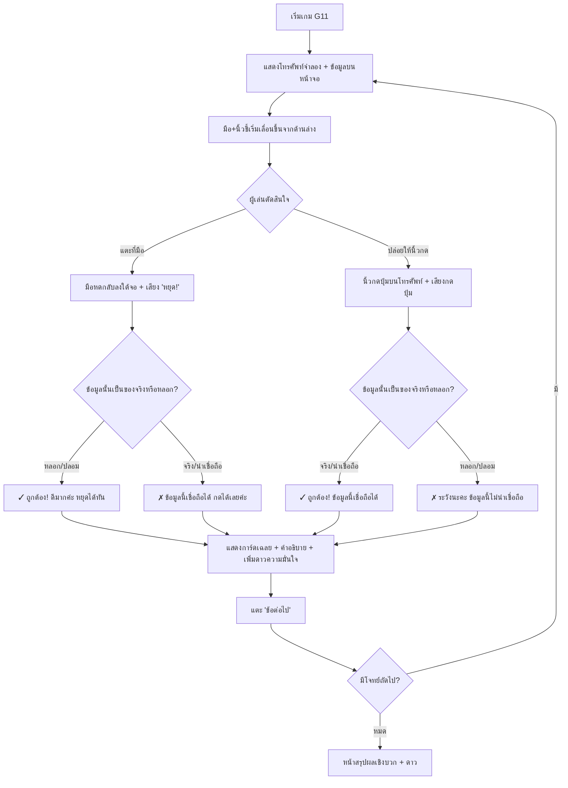

# Detailed Design Document: G11 — หยุดนิ้ว! คิดก่อนกด (Stop the Finger)

**สถานะ:** 🏗️ Draft  
**หมวดหมู่:** 3. Motivation & Empowerment Action Game  
**ความสำคัญ:** Should Have  
**กลุ่มเป้าหมาย:** ผู้สูงอายุ (อายุ 60 ปีขึ้นไป)  
**ผู้ออกแบบ:** ทีมวิชาการ NAPLAB  
**เวอร์ชัน:** 1.0 | **อัปเดตล่าสุด:** 2026-07-21

---

## 1. Overview (ภาพรวมของเกม)

เกม **G11 — หยุดนิ้ว! คิดก่อนกด** เป็นเกมแอคชั่นตัดสินใจแบบ **ปฏิกิริยาเดียว (Single-action)** ที่จำลองสถานการณ์ "นิ้วกำลังจะกดมือถือ" เพื่อฝึกหลักคิด **"หยุด"** — หยุดพิจารณาก่อนกดปุ่มใดๆ บนมือถือ

### แนวคิดหลัก (Concept)

ในแต่ละรอบ หน้าจอจะแสดง **โทรศัพท์มือถือจำลอง** ที่มีข้อมูล/ข้อความ/ข่าวสารปรากฏอยู่ (เช่น SMS จากมิจฉาชีพ, ข่าวปลอม, ประกาศจากหน่วยงานราชการจริง) พร้อมปุ่ม "ยอมรับ / แชร์ / โอนเงิน" ที่เกี่ยวข้อง ส่วนด้านล่างของหน้าจอจะมี **มือพร้อมนิ้วชี้** ที่ค่อยๆ เลื่อนขึ้นเข้าหาโทรศัพท์อย่างช้าๆ

ผู้เล่นต้อง **ตัดสินใจ** ภายในเวลาที่นิ้วเคลื่อนที่:
- **ข้อมูลน่าเชื่อถือ (เช่น ข่าวจากราชการจริง)** → **ปล่อยให้นิ้วกดได้เลย** (ไม่ต้องทำอะไร)
- **ข้อมูลหลอกลวง/ข่าวปลอม** → **แตะที่มือเพื่อหยุดนิ้ว** ให้มือหดกลับลงไปใต้หน้าจอ

> 💡 **ปรัชญาการเรียนรู้:** เกมนี้สะท้อนหลักคิด **"หยุด"** (สโลแกน "หยุด 🛑 คิด 🧠 ถาม 💬 ทำ ✅") — เมื่อเห็นข้อมูลที่น่าสงสัย ให้ **หยุดนิ้ว** ก่อนกด ไม่ว่าจะเป็นการกดแชร์ข่าว กดโอนเงิน หรือกดยอมรับข้อเสนอใดๆ

---

## 2. Core Gameplay Loop (วงลูปหลักการเล่น)



### สรุปลูปเล่น

1. **แสดงโทรศัพท์** — หน้าจอโทรศัพท์จำลองแสดงข้อมูล (SMS / ข่าว / ข้อเสนอ) พร้อมปุ่ม action
2. **มือเลื่อนขึ้น** — มือพร้อมนิ้วชี้เริ่มเคลื่อนที่จากด้านล่างเข้าหาโทรศัพท์ด้วยความเร็วต่ำ
3. **ตัดสินใจ** — ผู้เล่นอ่านข้อมูลแล้วเลือก:
   - **แตะที่มือ** → มือหดกลับ (เลือก "หยุด" ไม่กด)
   - **ไม่ทำอะไร** → ปล่อยให้นิ้วกดปุ่ม (เลือก "กดได้เลย")
4. **เฉลย** — ระบบตัดสินว่าตัดสินใจถูกหรือผิด แสดงการ์ดเฉลย
5. **วนซ้ำ** จนครบจำนวนโจทย์ที่กำหนด → หน้าสรุป

---

## 3. User Interface & Screen Layout (การจัดหน้าจอ — Portrait เท่านั้น)

หน้าจอเกมออกแบบในแนวตั้ง (Portrait Mode) ถือมือถือมือเดียว แบ่งพื้นที่ออกเป็น 3 ส่วนหลัก:

```
+---------------------------------------------------+
|  GameShell: progress dots ● ● ○ ○ ○   🔊 เสียงอ่าน | -> เชลล์กลาง
+---------------------------------------------------+
|                                                   |
|            +---------------------------+          |
|            |   📱 โทรศัพท์จำลอง         |          |
|            |                           |          |
|            |  ┌───────────────────┐    |          |
|            |  │ ⚠️ SMS จากเบอร์    │    |          | -> พื้นที่แสดงข้อมูล
|            |  │ 063-XXX-XXXX      │    |          |    (ข้อความ SMS / ข่าว /
|            |  │                   │    |          |     โพสต์โซเชียล)
|            |  │ "คุณได้รับเงิน    │    |          |
|            |  │  50,000 บาท กด    │    |          |
|            |  │  รับที่ลิงก์นี้..."│    |          |
|            |  └───────────────────┘    |          |
|            |                           |          |
|            |    [ 💰 กดรับเงิน ]       |          | -> ปุ่ม action จำลอง
|            +---------------------------+          |
|                                                   |
|                                                   |
|                     👆                             | -> นิ้วชี้ (เคลื่อนที่ขึ้น)
|                   ┌─────┐                          |
|                   │ ✋  │                          | -> มือ (Touch Target)
|                   │     │  <- แตะตรงนี้เพื่อหยุด!  |    แตะเพื่อหดมือกลับ
|                   └─────┘                          |
+---------------------------------------------------+
```

### รายละเอียดแต่ละส่วน

#### 3.1 โทรศัพท์จำลอง (Phone Mock-up)
- วางกึ่งกลางด้านบนของหน้าจอ ครอบคลุมพื้นที่ประมาณ **60–70% ความสูงจอ**
- ขอบโค้งมนจำลองขอบมือถือ ด้านในแสดงเนื้อหาตามประเภทโจทย์:
  - **SMS / ข้อความ:** จำลอง UI กล่องข้อความ มีเบอร์ผู้ส่ง + ข้อความ
  - **ข่าว / โพสต์โซเชียล:** จำลองการ์ดข่าวพร้อมรูปภาพ + พาดหัว + แหล่งที่มา
  - **ประกาศราชการ:** จำลองประกาศจากหน่วยงานพร้อมตราหน่วยงาน
- ด้านล่างมี **ปุ่ม action จำลอง** ที่เปลี่ยนข้อความตามบริบท (เช่น "กดรับเงิน", "แชร์ต่อ", "ยอมรับ", "โอนเงิน")
- ฟอนต์เนื้อหาในจอโทรศัพท์ ≥ 20px ตาม [Art Direction](./03-art-direction.md)

#### 3.2 มือและนิ้วชี้ (Hand & Pointing Finger)
- แสดงเป็นภาพมือคนจริง (illustration สไตล์การ์ตูน สบายตา) ที่มีนิ้วชี้ยื่นขึ้นด้านบน
- เริ่มต้นอยู่ใต้ขอบจอด้านล่าง ค่อยๆ เลื่อนขึ้นด้วย **ความเร็วต่ำมาก** (~40–60 พิกเซล/วินาที) ให้ผู้เล่นมีเวลาอ่านข้อมูลก่อนตัดสินใจ
- **Touch Target ของมือกว้างพิเศษ** (≥ 80×80px + padding 15px) เพื่อรองรับอาการมือสั่นของผู้สูงอายุ
- เมื่อผู้เล่น **แตะที่มือ**: มือหดกลับลงใต้จอด้วย animation slide-down นุ่มนวล พร้อมเสียง "หยุด!"
- เมื่อ **ไม่แตะ** และมือเคลื่อนที่ถึงปุ่ม action: นิ้วกดปุ่มพร้อม animation กดปุ่มเบาๆ

#### 3.3 ส่วนแสดงผลเฉลย (Feedback Card)
- เปิดทับหน้าจอเกมเมื่อตัดสินใจเสร็จ (slide-up จากด้านล่าง)
- แสดง:
  - ✓ ถูกต้อง (เขียว + เสียงชื่นชม) หรือ ✗ ตอบผิด (ส้มอ่อน + เสียงนุ่มนวล)
  - คำอธิบาย 1-3 ประโยคง่ายๆ ว่าทำไมข้อมูลนี้น่าเชื่อถือ/ไม่น่าเชื่อถือ
  - จุดสังเกตสำคัญ (Red Flags หรือ Trust Signals) ตีกรอบเน้น
  - ช่องทางแจ้งเหตุ (ข้อมูลหลอกลวง): **สายด่วน 1441** (ตำรวจไซเบอร์) และ **1212** (ETDA)
- ปุ่มใหญ่ "ข้อต่อไป →" (≥ 56px)

---

## 4. Content Pool Design (การออกแบบคลังโจทย์)

### 4.1 หลักการออกแบบโจทย์

โจทย์แบ่งเป็น 2 กลุ่มหลัก:
- **กลุ่มหลอกลวง / ข่าวปลอม (Fake/Scam)** — ผู้เล่นต้อง **แตะหยุดมือ** ไม่ให้นิ้วกด
- **กลุ่มข้อมูลจริง / น่าเชื่อถือ (Real/Trustworthy)** — ผู้เล่นต้อง **ปล่อยให้นิ้วกด** ตามปกติ

สัดส่วนแนะนำ: หลอก ~60% : จริง ~40% เพื่อไม่ให้ผู้เล่นเหมาเอาว่า "หยุดทุกอันคือถูก" และไม่สร้างทัศนคติ "ระแวงจนไม่กล้าใช้เทคโนโลยี"

### 4.2 ตารางคลังโจทย์ (เวอร์ชันแรก — 10 ข้อ)

| # | ประเภทข้อมูลบนจอโทรศัพท์ | ข้อความตัวอย่าง | ปุ่ม Action | คำตอบถูก | หมวดหมู่ | คำอธิบายเฉลย |
|---|--------------------------|----------------|------------|----------|----------|-------------|
| 1 | SMS จากเบอร์แปลก | "คุณได้รับเงินรางวัล 50,000 บาท กดลิงก์นี้เพื่อรับ: bit.ly/xYz123" | 💰 กดรับเงิน | 🛑 หยุดนิ้ว | scam-sms | "SMS แจ้งรางวัลจากเบอร์แปลกปลอมพร้อมลิงก์ย่อ เป็นกลลวงมิจฉาชีพค่ะ ห้ามกดลิงก์เด็ดขาด" |
| 2 | ข่าวจากสำนักข่าวจริง | "กรมอุตุฯ ประกาศ: ฝนตกหนักภาคเหนือ 22-24 ก.ค. ควรเตรียมรับมือน้ำท่วมฉับพลัน — ที่มา: กรมอุตุนิยมวิทยา" | 📢 แชร์ต่อ | ✅ ปล่อยกด | gov-news | "ข่าวนี้มาจากกรมอุตุนิยมวิทยาซึ่งเป็นแหล่งข่าวราชการที่น่าเชื่อถือ แชร์ต่อได้เลยค่ะ เพื่อเตือนคนรอบข้าง" |
| 3 | ข้อความ LINE จากคนแปลกหน้า | "สวัสดีค่ะ ดิฉันเจ้าหน้าที่ธนาคาร บัญชีคุณถูกล็อก กรุณาแจ้งรหัส OTP ด่วน" | 🔑 ส่ง OTP | 🛑 หยุดนิ้ว | scam-impersonation | "ธนาคารไม่มีนโยบายขอรหัส OTP ทาง LINE หรือโทรศัพท์ค่ะ ให้วางสายแล้วโทรหาธนาคารโดยตรง" |
| 4 | ประกาศจากกรมสรรพากร | "กรมสรรพากรแจ้ง: กำหนดยื่นภาษีออนไลน์ปี 2569 ภายใน 31 มี.ค. ผ่าน rd.go.th — ที่มา: กรมสรรพากร" | 📋 อ่านเพิ่ม | ✅ ปล่อยกด | gov-announce | "ประกาศจากกรมสรรพากรผ่านเว็บไซต์ราชการ rd.go.th เป็นข้อมูลจริงค่ะ สังเกตที่ลิงก์ลงท้าย .go.th" |
| 5 | ข่าวปลอมในกลุ่ม LINE | "ด่วน! ดื่มน้ำมะนาวร้อนทุกเช้า รักษามะเร็งได้ 100% แชร์ต่อช่วยชีวิตคนที่คุณรัก!" | 🔄 แชร์ต่อ | 🛑 หยุดนิ้ว | fake-health | "ข้อมูลสุขภาพที่อ้างว่ารักษาโรคร้ายได้ 100% มักเป็นข่าวปลอมค่ะ ควรเช็กกับศูนย์ชัวร์ก่อนแชร์ หรือถามหมอก่อนเชื่อ" |
| 6 | SMS แจ้งพัสดุปลอม | "พัสดุของท่านค้างที่ศูนย์คัดแยก กรุณาชำระค่าจัดส่งเพิ่ม 200 บาท ภายใน 1 ชม. หรือส่งคืน" | 💳 ชำระเงิน | 🛑 หยุดนิ้ว | scam-delivery | "การเร่งรัดให้โอนเงินภายในเวลาจำกัดเป็นกลยุทธ์ของมิจฉาชีพค่ะ พัสดุจริงไม่เร่งรัดแบบนี้ ให้โทรเช็กกับขนส่งโดยตรง" |
| 7 | ข่าวจริงจาก สสส. | "สสส. เชิญผู้สูงวัยร่วมกิจกรรมออกกำลังกายในสวน ทุกวันเสาร์ เวลา 07:00 น. ที่สวนสาธารณะ — ที่มา: สำนักงานกองทุนสนับสนุนการสร้างเสริมสุขภาพ" | 📢 แชร์ต่อ | ✅ ปล่อยกด | gov-health | "ข่าวนี้มาจาก สสส. (สำนักงานกองทุนสนับสนุนการสร้างเสริมสุขภาพ) เป็นหน่วยงานราชการที่น่าเชื่อถือค่ะ" |
| 8 | โฆษณาขายยาเกินจริง | "ยาสมุนไพรมหัศจรรย์! กินแค่ 3 วันหายปวดเข่า ไม่ต้องผ่าตัด สั่งซื้อด่วนวันนี้ลดเหลือ 299 บาท จากปกติ 1,500" | 🛒 สั่งซื้อ | 🛑 หยุดนิ้ว | scam-product | "โฆษณาที่อ้างว่ารักษาโรคหายภายใน 3 วันและลดราคามากผิดปกติ มักเป็นสินค้าหลอกลวงค่ะ ควรปรึกษาหมอก่อนซื้อยาทุกชนิด" |
| 9 | ข้อความจากเทศบาล | "เทศบาลนครเชียงใหม่ แจ้งกำหนดฉีดวัคซีนไข้หวัดใหญ่ฟรีสำหรับผู้สูงอายุ 60 ปีขึ้นไป วันที่ 1-15 ส.ค. ที่ศูนย์สุขภาพชุมชน" | 📋 ดูรายละเอียด | ✅ ปล่อยกด | gov-local | "ข้อความจากเทศบาลแจ้งบริการสาธารณสุขฟรี เป็นข้อมูลจริงจากหน่วยงานท้องถิ่นค่ะ สามารถไปใช้บริการได้เลย" |
| 10 | ข่าวปลอมปลุกปั่น | "ด่วน! รัฐบาลจะยึดเงินออมผู้สูงอายุทุกบัญชีตั้งแต่เดือนหน้า รีบถอนเงินออกให้หมด! — จากกลุ่มไลน์: ข่าวด่วนประเทศไทย" | 🔄 แชร์ต่อ | 🛑 หยุดนิ้ว | fake-panic | "ข่าวนี้มาจาก 'กลุ่มไลน์' ไม่ใช่แหล่งข่าวราชการค่ะ ข่าวที่สร้างความตกใจและเร่งรัดให้รีบทำทันทีมักเป็นข่าวปลอม ให้เช็กกับหน่วยงานจริงก่อนเสมอ" |

### 4.3 จุดสังเกตที่เน้นสอน (Red Flags & Trust Signals)

ทุกข้อเฉลยจะเน้นสอนจุดสังเกตสำคัญต่อไปนี้:

**🚩 สัญญาณอันตราย (Red Flags) — ต้องหยุดนิ้ว:**
| สัญญาณ | ตัวอย่าง |
|---------|----------|
| ลิงก์ย่อ/ลิงก์แปลก | `bit.ly/xYz123`, `line-th.cc` |
| เร่งรัดเวลา | "ภายใน 1 ชม.", "ด่วน!", "ตอนนี้เท่านั้น!" |
| ขอข้อมูลส่วนตัว/OTP | "แจ้งรหัส OTP", "ส่งเลขบัตรประชาชน" |
| รางวัล/เงินจากที่ไหนไม่รู้ | "คุณได้รับเงิน 50,000 บาท" |
| อ้างรักษาโรคหายทันที | "หาย 100%", "ไม่ต้องผ่าตัด" |
| มาจากกลุ่ม LINE ไม่ทราบที่มา | "จากกลุ่มไลน์: ข่าวด่วน" |

**✅ สัญญาณน่าเชื่อถือ (Trust Signals) — ปล่อยนิ้วกดได้:**
| สัญญาณ | ตัวอย่าง |
|---------|----------|
| แหล่งที่มาราชการ | กรมอุตุฯ, กรมสรรพากร, สสส., เทศบาล |
| เว็บไซต์ลงท้าย .go.th | `rd.go.th`, `tmd.go.th` |
| โทนข้อความเป็นกลาง ไม่เร่งรัด | "แจ้งเพื่อทราบ", "กำหนดยื่น..." |
| ไม่ขอข้อมูลส่วนตัว | ไม่มีลิงก์ให้กรอกข้อมูลหรือโอนเงิน |

---

## 5. Content Data Design (คลังโจทย์แบบ data-driven)

โจทย์ทุกข้อเป็น data-driven (JSON ใน `src/data/`) เพื่อให้ทีมเนื้อหาเพิ่ม/แก้ได้โดยไม่แตะโค้ดเกม — แนวเดียวกับ `src/data/g8-raft-items.json`

### 5.1 โครงสร้างข้อมูลโจทย์ (`src/data/g11-finger-items.json`)

```json
{
  "id": "g11-001",
  "type": "sms",
  "sender": "063-XXX-XXXX",
  "content": "คุณได้รับเงินรางวัล 50,000 บาท กดลิงก์นี้เพื่อรับ: bit.ly/xYz123",
  "action_button": "💰 กดรับเงิน",
  "safe_action": "stop",
  "category": "scam-sms",
  "red_flags": ["ลิงก์ย่อน่าสงสัย bit.ly", "แจ้งรางวัลจากเบอร์แปลกปลอม", "ไม่ระบุชื่อหน่วยงาน"],
  "explain": "SMS แจ้งรางวัลจากเบอร์แปลกปลอมพร้อมลิงก์ย่อ เป็นกลลวงมิจฉาชีพค่ะ ห้ามกดลิงก์เด็ดขาด",
  "hotline": "1441",
  "ai_disclosure": false
}
```

### 5.2 อธิบายฟิลด์

| ฟิลด์ | คำอธิบาย |
|-------|----------|
| `id` | รหัสโจทย์ไม่ซ้ำ (g11-001, g11-002, ...) |
| `type` | ประเภทข้อมูลที่แสดง: `sms` / `line` / `news` / `social` / `gov` |
| `sender` | ผู้ส่งข้อมูล (เบอร์โทร, ชื่อบัญชี LINE, สำนักข่าว, หน่วยงาน) |
| `content` | ข้อความบนจอโทรศัพท์จำลอง |
| `action_button` | ข้อความบนปุ่ม action ที่นิ้วจะกด |
| `safe_action` | `"stop"` = ต้องหยุดนิ้ว / `"press"` = ปล่อยนิ้วกดได้ |
| `category` | หมวดหมู่เพื่อวิเคราะห์: `scam-sms`, `scam-impersonation`, `scam-delivery`, `scam-product`, `fake-health`, `fake-panic`, `gov-news`, `gov-announce`, `gov-health`, `gov-local` |
| `red_flags` | อาร์เรย์จุดสังเกตอันตรายที่เน้นสอน (สำหรับโจทย์กลุ่มหลอก) |
| `explain` | คำอธิบายเฉลย ประโยคสั้น ภาษาพูดเข้าใจง่าย |
| `hotline` | เบอร์สายด่วนแจ้งเหตุ (แสดงเฉพาะโจทย์กลุ่มหลอก) |
| `ai_disclosure` | `true` เมื่อภาพประกอบสร้างด้วย AI → แสดงป้ายหลังหน้าเฉลยตาม[นโยบาย AI Content](./00-concept.md#5-นโยบายการนำเสนอเนื้อหาที่สร้างจาก-ai-⚠️) |

---

## 6. Controls & Interaction Mechanics (การควบคุมและกลไกการแตะ)

### 6.1 Single-Decision Input
- ผู้เล่นมี **2 ทางเลือกเท่านั้น** ต่อ 1 โจทย์:
  1. **แตะที่มือ** (Tap on hand) → หยุดนิ้ว ไม่ให้กด
  2. **ไม่ทำอะไร** (Do nothing) → ปล่อยนิ้วกด

### 6.2 ความเร็วการเคลื่อนที่ของมือ
- มือเคลื่อนที่ด้วยความเร็ว **~40–60 พิกเซล/วินาที** (ช้ามากเพื่อให้ผู้สูงอายุมีเวลาอ่าน ~8-12 วินาที)
- **ไม่เพิ่มความเร็วตามจำนวนข้อ** — คงความเร็วเท่าเดิมตลอด เพื่อไม่สร้างความกดดัน
- ขณะนิ้วเคลื่อนที่ขึ้น อาจมี animation มือสั่นเบาๆ (subtle bounce) เพื่อสื่อว่า "กำลังจะกด"

### 6.3 Touch Target ขนาดใหญ่
- กล่อง Touch Target ของมือ: **≥ 80×80px** พร้อม padding ขยายอีก 15px รอบนอก
- เพื่อรองรับอาการมือสั่นของผู้สูงอายุ แตะใกล้ๆ มือก็ถือว่าโดน

### 6.4 Visual Feedback
| สถานการณ์ | Animation | เสียง |
|-----------|-----------|-------|
| แตะหยุดมือ (ข้อมูลหลอก) | มือหดลง + แสงเขียวกะพริบนุ่มๆ + ข้อความ "หยุดได้ทัน! ✓" ลอยขึ้น | เสียงชื่นชมอบอุ่น |
| แตะหยุดมือ (ข้อมูลจริง) | มือหดลง + ข้อความ "ข้อมูลนี้เชื่อถือได้นะคะ" ลอยขึ้น | เสียงอ่อนโยน ไม่ตำหนิ |
| ปล่อยนิ้วกด (ข้อมูลจริง) | นิ้วกดปุ่ม + แสงเขียว + ข้อความ "ถูกต้องค่ะ ✓" | เสียงชื่นชมอบอุ่น |
| ปล่อยนิ้วกด (ข้อมูลหลอก) | นิ้วกดปุ่ม + สีส้มอ่อน + ข้อความ "ระวังนะคะ" | เสียงเตือนนุ่มนวล ไม่ตกใจ |

---

## 7. Answer Logic & Positive Reinforcement (ตรรกะคำตอบ + การเสริมแรงเชิงบวก)

### 7.1 ตารางผลลัพธ์

| ผู้เล่นทำ | ข้อมูลเป็น | ผลลัพธ์ | หน้าเฉลย |
|-----------|-----------|---------|----------|
| แตะหยุดมือ | หลอก/ปลอม | ✓ **ถูกต้อง** "เก่งมากค่ะ หยุดได้ทัน!" | ชมเชย + อธิบาย Red Flags + สายด่วน |
| ปล่อยนิ้วกด | จริง/น่าเชื่อถือ | ✓ **ถูกต้อง** "ข้อมูลนี้เชื่อถือได้ค่ะ" | ชมเชย + อธิบายว่าทำไมน่าเชื่อ (Trust Signals) |
| แตะหยุดมือ | จริง/น่าเชื่อถือ | ✗ **ไม่ถูกนะคะ** | อธิบายว่าข้อมูลนี้มาจากแหล่งที่เชื่อถือได้ + สอนจุดสังเกต Trust Signals |
| ปล่อยนิ้วกด | หลอก/ปลอม | ✗ **ระวังนะคะ** | อธิบายว่าข้อมูลนี้เป็นกลลวง + สอนจุดสังเกต Red Flags + สายด่วน |

### 7.2 ไม่มีระบบพ่ายแพ้ (No Punishment)
- ไม่มีคำว่า "คุณแพ้" หรือ Game Over
- ตอบผิดใช้สี **ส้มอ่อน** (ไม่ใช่แดงจัด) + ไอคอน ✗ กำกับ + น้ำเสียงเป็นมิตร
- ทุกข้อถือว่า "ผ่าน" เมื่อเล่นครบ ไม่ว่าจะตอบถูกหรือผิด
- **จบเสมอ = ผ่านเสมอ** (สอดคล้อง Win/Lose policy ของโครงการ)

### 7.3 การนับดาว
- ≥80% ตอบถูก = 3 ดาว ⭐⭐⭐
- ≥50% ตอบถูก = 2 ดาว ⭐⭐
- ต่ำกว่า 50% = 1 ดาว ⭐ (ขั้นต่ำ 1 ดาวเสมอ)
- หน้าสรุปโชว์เฉพาะ **ดาว + คำชม** ไม่โชว์เปอร์เซ็นต์หรือจำนวนข้อที่พลาด

---

## 8. Slogan Integration (ระบบสโลแกนเตือนสติ)

เมื่อผู้เล่น **แตะหยุดมือสำเร็จ (ข้อมูลหลอก)** ระบบจะแทรกสโลแกน **"หยุด คิด ถาม ทำ"** เพื่อเสริมย้ำหลักคิด:

```
[ขั้นตอนอนิเมชั่นหยุดนิ้วสำเร็จ]
มือหดกลับ --> หน้าจอ dim เล็กน้อย (Overlay)
     ↓
แสดงตัวหนังสือทีละขั้น (Fade-in สเตปละ 500ms):
     ↓
1. "หยุด" 🛑  (หยุดนิ้วก่อนกด)
2. "คิด" 🧠   (อ่านให้ดี สังเกตจุดที่น่าสงสัย)
3. "ถาม" 💬   (ถามคนที่ไว้ใจหรือโทรสายด่วน)
4. "ทำ" ✅    (ตัดสินใจอย่างรอบคอบ)
     ↓
แสดงการ์ดเฉลย
```

> **หมายเหตุ:** สโลแกนแสดงเฉพาะเมื่อ **หยุดนิ้วสำเร็จ + ข้อมูลเป็นของหลอก** (ตอบถูก) เพื่อเชื่อมโยงความรู้สึกบวกกับหลักคิด "หยุด"

---

## 9. Reward & Summary Screen (ระบบรางวัลและหน้าสรุป)

### หน้าสรุปหลังเล่นจบ

```
+---------------------------------------------------+
|                                                   |
|          🏆 ยอดเยี่ยมมากค่ะ!                       |
|                                                   |
|             ⭐ ⭐ ⭐                                |
|                                                   |
|   "คุณมีสติในการหยุดคิดก่อนกดได้ดีมาก             |
|    พร้อมรับมือกับข้อมูลหลอกลวงในมือถือแล้วค่ะ     |
|    จำไว้นะคะ — หยุด 🛑 คิด 🧠 ถาม 💬 ทำ ✅"       |
|                                                   |
|   +-------------------------------------------+   |
|   |           ▶ ไปบทถัดไป                      |   | -> ปุ่มใหญ่ ≥ 56px
|   +-------------------------------------------+   |
|   +-------------------------------------------+   |
|   |           🔄 เล่นอีกรอบ                     |   |
|   +-------------------------------------------+   |
|                                                   |
+---------------------------------------------------+
```

- **ไม่แสดงจำนวนข้อที่ผิด** — โชว์แต่ดาวและคำชม
- ปุ่ม "ไปบทถัดไป" ใหญ่ชัด เพื่อนำผู้เล่นกลับเข้าลูปหลัก
- ส่งดาวให้ GameShell ผ่าน `onFinish(stars)` ตามแบบแผนปกติ

---

## 10. Art Direction & Motion (ทิศทางภาพและการเคลื่อนไหว)

- **โทนภาพ:** สว่างสบายตา ใช้ token หลักโครงการ (teal `--primary`) — จอโทรศัพท์จำลองขอบโค้ง เงานุ่ม
- **มือ:** ภาพ illustration สไตล์การ์ตูนอบอุ่น ไม่ realistic เกินไป เพื่อไม่สร้างความตกใจ
- **Animation:**
  - มือเลื่อนขึ้น: linear + subtle bounce เล็กน้อย
  - มือหดกลับ: ease-out slide-down ~400ms
  - นิ้วกดปุ่ม: scale ปุ่ม 0.95 → 1.0 ~200ms
  - สโลแกน: fade-in ทีละขั้น ~500ms/step
  - การ์ดเฉลย: slide-up ~300ms
- **`prefers-reduced-motion`:** เปลี่ยน transition ทั้งหมดเป็น fade ทันที ไม่มีการเลื่อน
- ✓ เขียว / ✗ ส้มอ่อน — ทุกจุดมีไอคอนกำกับ ไม่พึ่งสีอย่างเดียว ตาม [Art Direction](./03-art-direction.md)

---

## 11. Technical Implementation Details (สเปกทางเทคนิค)

### Component & Integration
- Component: **`G11StopTheFinger`** วางใน `src/components/` ตามแบบแผน G-number เดิม — คุยกับ `GameShell` ผ่าน props มาตรฐาน `onFinish(stars)` + `logEvent`
- เขียนเป็น **`.tsx`** (TypeScript) ตั้งแต่ต้น
- React state ล้วน + CSS transitions/animations สำหรับการเคลื่อนที่ของมือ — ไม่จำเป็นต้องใช้ Phaser (ไม่มี physics ซับซ้อน)
- คลังโจทย์: `src/data/g11-finger-items.json` — ระบบสุ่มลำดับโจทย์ (shuffle) เพื่อไม่ให้จำเฉลย
- รองรับปุ่มเสียงอ่านโจทย์+เฉลย — reuse กลไก Volume2/VolumeX แบบ G1/G3
- **ลงทะเบียนใน Dev Game Hub** (`src/app/dev/games/page.tsx`)

### Event Logging

```javascript
logEvent('game_start',     { game_id: 'g11' });
logEvent('decision',       { game_id: 'g11', item_id: 'g11-001', action: 'stop', correct: true, time_to_decide_ms: 4200 });
logEvent('decision',       { game_id: 'g11', item_id: 'g11-002', action: 'press', correct: true, time_to_decide_ms: 7800 });
logEvent('decision',       { game_id: 'g11', item_id: 'g11-003', action: 'press', correct: false, time_to_decide_ms: 10500 });
logEvent('feedback_view',  { game_id: 'g11', item_id: 'g11-001', category: 'scam-sms' });
logEvent('toggle_audio',   { game_id: 'g11', item_id: 'g11-001', action: 'play' });
logEvent('game_complete',  { game_id: 'g11', stars: 3, total_items: 10, correct_count: 8 });
```

- `action` = `"stop"` (หยุดนิ้ว) หรือ `"press"` (ปล่อยนิ้วกด)
- `time_to_decide_ms` = ระยะเวลาที่ผู้เล่นใช้ตัดสินใจ (จากตอนมือเริ่มเลื่อนขึ้นจนกดหรือหมดเวลา) — มีค่าต่อทีมวิชาการ วิเคราะห์ว่าผู้สูงอายุใช้เวลาตัดสินใจนานแค่ไหนต่อประเภทข้อมูล

### Animation Implementation
- มือใช้ CSS `transform: translateY()` + `transition` ควบคุมด้วย React state
- ความเร็วมือ: คำนวณจากระยะทาง / เวลาที่กำหนด (~8-12 วินาทีต่อข้อ)
- ใช้ `requestAnimationFrame` หรือ CSS animation เพื่อความลื่นไหล
- Touch event: `onPointerDown` บน container มือ (ไม่ใช้ `onClick` เพื่อตอบสนองเร็วกว่า)

---

## 12. Open Questions (คำถามเปิดรอทีมตัดสินใจ)

1. **ลำดับความสำคัญ / Sprint:** ยังไม่ได้กำหนด Sprint — ต้องปรึกษาทีมว่าจัดเข้า Sprint ไหน และเรียงลำดับเทียบกับ G4/G7 ที่ยังค้างอยู่
2. **จำนวนโจทย์ต่อรอบเล่น:** เสนอ 10 ข้อ (เล่นจบภายใน ~3-4 นาที) — ควรปรับจำนวนตาม user testing กับผู้สูงอายุจริง (เล่นสั้นเกินอาจไม่สอน เล่นยาวเกินอาจเบื่อ)
3. **ที่มาของภาพประกอบมือ/โทรศัพท์:** ใช้ illustration วาดเอง หรือสร้างจาก AI? (กระทบ `ai_disclosure`) — ต้องไม่ใช้ภาพมือบุคคลจริง
4. **ควรมีโจทย์ประเภท "เสียง/สายโทร" ด้วยไหม?** เช่น จำลองสายโทรเข้าจากเบอร์แปลก — ต้องคำนึงว่าจะเพิ่มความซับซ้อนของ UI
5. **ข้อมูลจริงจากหน่วยงาน:** ต้องตรวจสอบว่าข้อมูลที่ใช้เป็นตัวอย่าง "ข่าวจริง" ยังเป็นปัจจุบันและถูกต้อง ก่อนนำเข้าคลังโจทย์ — ควรให้ทีมวิชาการ NAPLAB ตรวจทุกข้อ
6. **ผู้เล่นสามารถกดฟัง TTS อ่านข้อความบนจอโทรศัพท์จำลองได้หรือไม่?** ผู้สูงวัยบางส่วนอ่านหนังสือไม่ถนัด — ถ้ามีฟีเจอร์นี้ต้องให้เวลามือหยุดรอจนฟังจบก่อนเริ่มเลื่อนขึ้น

---

## Related Documents
- Mechanics รวม: [Core Mechanics](./01-mechanics.md)
- กติกา UI/UX บังคับ: [Art Direction](./03-art-direction.md)
- เกม Format 3 พี่น้อง: [G5 กางโล่กู้ชีพ](./design-g5.md)
- นโยบาย AI Content: [Concept §5](./00-concept.md#5-นโยบายการนำเสนอเนื้อหาที่สร้างจาก-ai-⚠️)
- Dev Game Hub (ทดสอบ): `/dev/games` — [US-03-R4](../agile/user-stories/US-03-R4.md)
