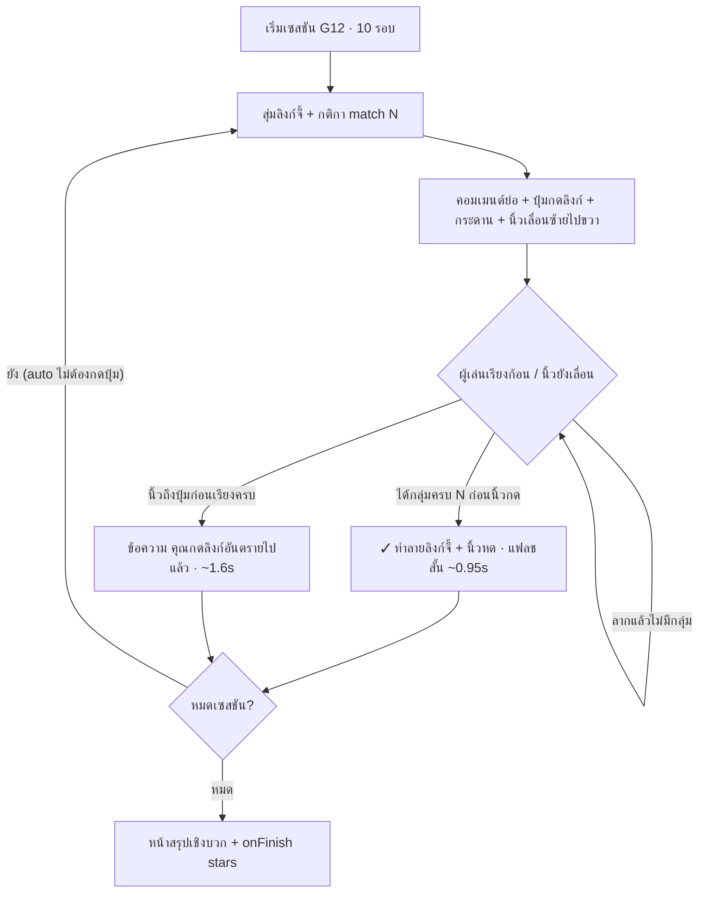
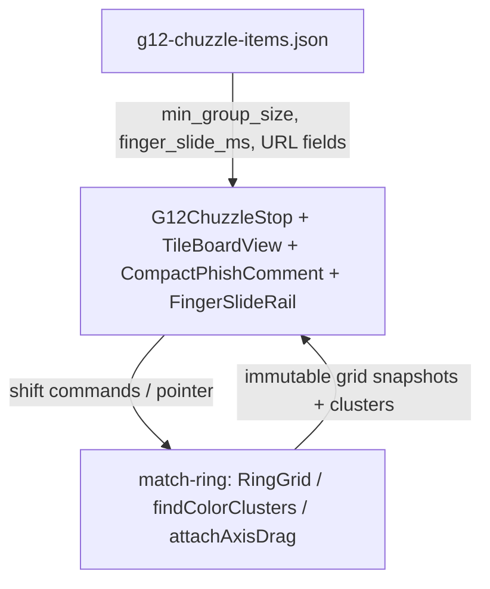

# Detailed Design Document: G12 — อย่ากดลิงก์จี้ ถ้าไม่รีบหยุดกด (Don't Click the Phish)

**สถานะ:** 🔨 Prototype (Dev Game Hub `/dev/games` — ยังไม่ผูกบทเรียน learner)  
**หมวดหมู่:** 3. Motivation & Empowerment Action Game + ผสม Simulation (คอมเมนต์ลิงก์ย่อ)  
**ความสำคัญ:** Should Have — Topic 2: Scams (Malicious Links)  
**กลุ่มเป้าหมาย:** ผู้สูงอายุ (อายุ 60 ปีขึ้นไป)  
**ผู้ออกแบบ:** ทีม NAPLAB (ไอเดียผสาน [G9](./design-g9.md) เวอร์ชันย่อ + [G11](./design-g11.md) นิ้วดึงสายตา + Classic Chuzzle)  
**เวอร์ชัน:** 2.3 | **อัปเดตล่าสุด:** 2026-07-21

> เกม**ใหม่แยกจาก G11** — G11 นิ้วเลื่อน**ขึ้นจากล่างจอ** · G12 นิ้วเลื่อน**ซ้าย → ขวา** เข้าหาปุ่มลิงก์  
> G12: **เรียงก้อน Chuzzle ให้ทันก่อนนิ้วกด** = **ทำลายลิงก์จี้** ในคอมเมนต์ย่อ แล้วเรียนจุดสังเกต URL จากแผงใต้คอมเมนต์  
> **ทำไมต้องมีนิ้ว:** ถ้าไม่มีสิ่งเคลื่อนไหวดึงสายตา ผู้เล่นมักโฟกัสแต่กระดานแล้วมองข้าม URL — นิ้วแนวนอน + ปุ่มที่ค่อยๆ ไฮไลต์/stroke สว่างขึ้น สร้างคำถามว่า “ทำไมมีนิ้วไปกด?” และผูกมือเรียงก้อนกับ “หยุดก่อนกดลิงก์”

**แหล่งอ้างอิงกลไกเกม:** [classic-chuzzle](https://github.com/TradeIdeasPhilip/classic-chuzzle) — ลากแถว/คอลัมน์หมุนวงแหวน จนกลุ่มสีเดียวกันที่ต่อกัน ≥ 3 (หรือ ≥ 4 ตามกติการอบ) แล้วชิ้นนั้นหายไป

---

## 1. Overview (ภาพรวมของเกม)

เกม **G12 — อย่ากดลิงก์จี้ ถ้าไม่รีบหยุดกด** สอน **อย่ากดลิงก์แปลกปลอมในคอมเมนต์โซเชียล** โดยแปลงการ "หยุดก่อนกด" เป็นการ **เรียงก้อนทำลายลิงก์จี้ก่อนที่นิ้วจะกด**

### แนวคิดหลัก (Concept)

หน้าจอมี 3 สัญญาณที่ทำงานเป็น**ลูปเดียว**:

1. **คอมเมนต์ย่อ (Compact Comment — แนว G9 ตัดทอน)** ด้านบน — ลิงก์จี้ + ปุ่มจำลอง "กดเปิดลิงก์" (กินพื้นที่ไม่เกิน ~28% จอ)
2. **นิ้วมือ (แนวนอน — ต่างจาก G11)** — เลื่อน**ซ้าย → ขวา** เข้าหาปุ่มกด พร้อมปุ่มที่ค่อยๆ ไฮไลต์/stroke สว่างขึ้น (**ไม่ใช่ปุ่มแตะ** — หยุดนิ้วได้ด้วยการเรียง Chuzzle เท่านั้น)
3. **กรอบเกม Chuzzle** ด้านล่าง — ลากแถว/คอลัมน์ให้กลุ่มสีครบตามกติกา

ผลรอบ:
- **เรียงครบก่อนนิ้วกด** → ทำลายการ์ดลิงก์ + ได้คะแนน + นิ้วหดกลับ + แผงจุดสังเกตใต้คอมเมนต์
- **นิ้วกดก่อน** → **ไม่หักคะแนน** + แผงคำแนะนำนุ่มนวลใต้คอมเมนต์ + สุ่มลิงก์ใหม่เล่นต่อ

> 💡 **ปรัชญา:** นิ้ว = ตัวดึงสายตา + soft timer ที่สื่อ “กำลังจะกดลิงก์จี้” · มือที่เล่น Chuzzle = กำลังหยุด/ทำลายลิงก์นั้น · คอมเมนต์ย่อให้เห็นโดเมนโดยไม่แย่งพื้นที่กระดาน

### สิ่งที่เกมนี้ผสาน / ตัดออก

| จาก | นำมาใช้ / ตัด |
|-----|----------------|
| [G9](./design-g9.md) | ✅ โทนคอมเมนต์ย่อ + คลังลิงก์ + กฎโดเมน / ❌ ตัดโพสต์ต้นเรื่อง, engagement, ปุ่มตัดสิน ✓✗, UI เต็มครึ่งจอ |
| [G11](./design-g11.md) | ✅ แนวคิดนิ้วเป็น soft timer / ❌ ทิศทางต่างกัน (G11 = **ล่าง→บน**, G12 = **ซ้าย→ขวา**) · ❌ **ไม่ให้แตะมือ** — หยุดนิ้วด้วย Chuzzle แทน |
| classic-chuzzle | ✅ ลากหมุนแถว/คอลัมน์ + กลุ่มสี ≥ N / ❌ ตัดบอมบ์ |

---

## 2. Core Gameplay Loop (วงลูปหลักการเล่น)



### สรุปลูปเล่น (ต่อเนื่องอัตโนมัติ — ไม่มีปุ่ม "ถัดไป")

1. **สุ่มลิงก์จี้** — คอมเมนต์ย่อ + โดเมนเด่น + ปุ่ม "กดเปิดลิงก์" + `minGroupSize` + `finger_slide_ms`
2. **นิ้วเริ่มเลื่อนซ้าย → ขวา** ช้าๆ เข้าหาปุ่ม · ปุ่มค่อยๆ ไฮไลต์/stroke สว่างขึ้นตามความใกล้ — ดึงสายตาให้เห็นว่า “กำลังจะกดลิงก์นี้”
3. **เล่น Chuzzle** — เรียงให้ครบก่อนนิ้วถึง
4. **ผลรอบ (แฟลชสั้น แล้ว auto ไปต่อทันที ไม่ต้องกดอะไร):**
   - ทัน → ทำลายลิงก์ + แฟลช "ทำลายลิงก์จี้ทันแล้ว!" ~0.95s → สุ่มลิงก์ใหม่ต่อทันที
   - ไม่ทัน → ข้อความ **"คุณกดลิงก์อันตรายไปแล้ว"** (+ โดเมนหลัก) ~1.6s → ไปต่อทันที ไม่หักคะแนน
5. วน **10 รอบ** → สรุปเชิงบวก

> **กติกาโครงการ:** ไม่มีหน้าจอแพ้ ไม่หักคะแนนเมื่อนิ้วกดก่อน จบเซสชัน = ผ่านเสมอ ([Art Direction](./03-art-direction.md))
> **จำนวนรอบ:** 10 รอบ/เซสชัน (`SESSION_ROUNDS`) — คลังลิงก์มี 8 ชิ้น จึงวนสับไพ่ซ้ำเพื่อให้ครบ 10 รอบ
> **ไม่มี flow แบบบทเรียน:** ไม่มีการหยุดรอผู้เล่นกดปุ่ม "ถัดไป" และไม่มีแผงจุดสังเกต/สายด่วนแบบเต็ม — เหลือเพียงข้อความผลรอบสั้นๆ แล้วเดินเกมต่อเอง (เนื้อหาสอนย้ายไปหน้าสรุปตอนจบ)

---

## 3. กลไกเรียงก้อน (Match-Ring) — สรุปผู้เล่น

> สเปก logic ฉบับเต็มสำหรับ implement อยู่ที่ **[§13 Match-Ring Logic Spec](#13-match-ring-logic-spec-clean-room--สเปกสำหรับ-implement)**  
> เขียนขึ้นใหม่ในโปรเจกต์นี้ (clean-room) — **ห้าม copy โค้ด/ชื่อฟังก์ชันจาก repo อ้างอิง**

### 3.1 สิ่งที่ผู้เล่นสัมผัส

| รายการ | ค่า G12 | หมายเหตุ |
|--------|---------|----------|
| ขนาดกระดาน | **5×5** | พื้นที่หลักของจอ |
| จำนวนสี | **4 สี** (+ รูปทรง/ไอคอนเล็กน้อย ไม่พึ่งสีอย่างเดียว) | |
| การควบคุม | ลาก**ทั้งแถว**หรือ**ทั้งคอลัมน์**แบบวงแหวน (ช่องหลุดขอบเข้าอีกฝั่ง) | ไม่ใช่สลับ 2 ช่อง |
| เคลียร์เมื่อ | กลุ่มสีเดียวกันติดกันบน/ล่าง/ซ้าย/ขวา ขนาด ≥ `minGroupSize` | ไม่นับทแยง · **prototype ตั้งเป็น 3 ทุกรอบ** (engine รองรับ N) |
| สำเร็จรอบ | เคลียร์ได้อย่างน้อย 1 กลุ่ม **ก่อนนิ้วถึงปุ่ม** | = ทำลายลิงก์จี้ · แฟลชสั้นแล้วสุ่มลิงก์ใหม่ต่อทันที |
| ไม่สำเร็จรอบ | นิ้วถึงปุ่มก่อน | ไม่หักคะแนน · ข้อความ "คุณกดลิงก์อันตรายไปแล้ว" สั้นๆ แล้วไปต่อ |

### 3.2 สิ่งที่ตัดออกจากเกมเรียงก้อนทั่วไป/อ้างอิง

- ระบบบอมบ์ / chain explosion / คะแนน combo ซับซ้อน  
- พื้นหลังอนิเมชันหนัก  
- การแตะนิ้วเพื่อหยุด (นั้นคือ G11)

---

## 4. User Interface & Screen Layout (Portrait เท่านั้น)

**งบพื้นที่:** คอมเมนต์ย่อ+ปุ่ม+แถวนิ้วแนวนอน **≤ ~30% จอ** · กระดาน Chuzzle **≥ ~50–55%** · แผงเฉลยเมื่อเปิดเป็น inline ใต้คอมเมนต์

```
+---------------------------------------------------+
|  GameShell: ทำลายทัน 3 · เหลือ ~1:20   🔊         | -> เชลล์กลาง (สั้น)
+---------------------------------------------------+
|  ┌─ คอมเมนต์ย่อ (Compact · แนว G9) ─────────┐   | -> ≤ ~28–30% จอ
|  │ (👤) บัญชีไม่รู้จัก · 2 ชม.                │   |
|  │ เฮ้ย! แกอยู่ในคลิปนี้รึเปล่า? 👉            │   | -> body สั้น 1–2 บรรทัด
|  │ ┌─────────────────────────────────────┐  │   |
|  │ │ CLIP-VIEW.TOP                       │  │   | -> โดเมนตัวใหญ่
|  │ │ ดูคลิปที่คุณถูกแท็ก                  │  │   |
|  │ └─────────────────────────────────────┘  │   |
|  │  👆───────→  [ 🔗 กดเปิดลิงก์ ]            │   | -> นิ้วซ้าย→ขวา
|  │              └ stroke/glow ค่อยสว่าง ┘    │   | -> ปุ่มไฮไลต์ตาม progress
|  └───────────────────────────────────────────┘   |
|  ─ แฟลชผลรอบสั้นๆ (overlay กลางจอ · auto-dismiss) ─ | -> ไม่มีปุ่ม ไม่บล็อก
|  ✓ ทำลายลิงก์จี้ทันแล้ว!  /  ⚠️ คุณกดลิงก์อันตรายไปแล้ว |
|  (miss: + โดเมนหลัก clip-view.top · รัฐไทย = .go.th) |
|  → auto ไปรอบถัดไปเอง ไม่ต้องกดอะไร               |
+---------------------------------------------------+
|  กรอบ Chuzzle · เรียงครบ 3 ก่อนนิ้วกด            | -> พื้นที่หลัก
|  +-----+-----+-----+-----+-----+                  |
|  | 🔴  | 🟢  | 🔵  | 🟡  | 🔴  |                  |
|  +-----+-----+-----+-----+-----+                  |
|  | 🟡  | 🔴  | 🔴  | 🟢  | 🔵  |                  |
|  +-----+-----+-----+-----+-----+                  |
|  | ... 5×5 ...                                    |
|  +-----+-----+-----+-----+-----+                  |
+---------------------------------------------------+
```

> ⚠️ **ห้ามใช้ popup / modal / overlay ทับหน้าจอ** สำหรับเฉลยหรือจุดสังเกต URL  
> ⚠️ **นิ้วไม่ใช่ปุ่มแตะ** — แตะมือแล้วไม่มีผล · หยุดนิ้วได้ด้วยการเรียง Chuzzle เท่านั้น (ต่างจาก G11)  
> ⚠️ **ทิศทางนิ้ว G12 = แนวนอน (ซ้าย→ขวา)** — ไม่เลื่อนขึ้นจากล่างจอแบบ G11

### 4.1 คอมเมนต์ย่อ (Compact Comment — ตัดจาก G9)

คงกลิ่น "คอมเมนต์โซเชียลจำลอง" ของ G9 แต่**ตัดทุกอย่างที่กินที่โดยไม่จำเป็นต่อการสอนโดเมน**:

| องค์ประกอบ G9 เต็ม | ใน G12 |
|--------------------|--------|
| โพสต์ต้นเรื่อง + engagement + แถบถูกใจ/แชร์ | ❌ ตัด |
| "ความคิดเห็นทั้งหมด" | ❌ ตัด |
| ปุ่ม ✓ ทางการ / ✗ ปลอม | ❌ ตัด (ตัดสินด้วยการทำลายผ่าน Chuzzle) |
| ปุ่ม "🔍 ส่องลิงก์ก่อน" ก้อนใหญ่ | ❌ ตัดเป็นค่าเริ่มต้น (โดเมนโชว์ใหญ่บนการ์ดอยู่แล้ว) |
| avatar + ชื่อ + เวลา | ✅ เก็บ 1 บรรทัด |
| เนื้อคอมเมนต์ | ✅ สั้น **สูงสุด 2 บรรทัด** (ตัดด้วย `…` ถ้ายาว) |
| การ์ดพรีวิวลิงก์ | ✅ **ย่อ:** โดเมนตัวใหญ่ 1 บรรทัด + headline 1 บรรทัด |
| ปุ่ม "กดเปิดลิงก์" | ✅ **เก็บแบบย่อ** — เป็นเป้าหมายที่นิ้วเลื่อนไปหา (จำลองเท่านั้น) |

กติกาคอมเมนต์ย่อ:
- จำลองกลางๆ **ไม่ใช้โลโก้/สีแบรนด์ Facebook จริง** (เหมือน G9)
- URL + ปุ่มกดเป็นข้อความ/ปุ่มจำลอง — **ห้าม** `<a href>` ออกเว็บจริง
- โดเมนหลัก (`owner_domain`) อ่านออกชัดตั้งแต่แรก — คือสิ่งที่ถูกทำลายเมื่อเรียงทัน
- ฟอนต์ ≥ 20px แต่จำกัดจำนวนบรรทัดเพื่อไม่แย่งพื้นที่กระดาน

### 4.2 นิ้วมือแนวนอน + ปุ่มไฮไลต์ (Attention Magnet + Soft Timer)

ต่างจาก G11 ที่นิ้วเลื่อน**ล่าง → บน** จากขอบจอ — ใน G12 นิ้วอยู่**แถวเดียวกับปุ่มลิงก์ในคอมเมนต์ย่อ** และเลื่อน**ซ้าย → ขวา**

| บทบาท | รายละเอียด |
|--------|------------|
| **ดึงสายตา** | นิ้วเคลื่อนแนวนอน + ปุ่มที่ค่อยๆ สว่างขึ้น → ดึงตาไปที่ URL/ปุ่มกด (ไม่แย่งพื้นที่กระดานแบบนิ้วลอยกลางจอ) |
| **Soft timer** | `finger_slide_ms` (~10–14 วินาที) = เวลาที่นิ้วเดินทางจากซ้ายสุดถึงปุ่ม |
| **ไม่ใช่ input** | **ห้าม** แตะมือแล้วหยุดนิ้ว (นั้นคือ G11) — หยุดได้ด้วย Chuzzle เท่านั้น |

#### การเคลื่อนที่ของนิ้ว
- จุดเริ่ม: ซ้ายของแถวปุ่มในคอมเมนต์ย่อ (ชี้ขวา / 👆 หรือ illustration มือชี้)
- จุดจบ: ศูนย์กลางปุ่ม "กดเปิดลิงก์"
- ความเร็วคงที่ในรอบ ไม่เร่งตามจำนวนข้อ
- **ทัน:** นิ้วถอยกลับไปทางซ้าย (หรือจางหาย) + หยุด progress ไฮไลต์ปุ่ม + ทำลายการ์ดลิงก์
- **ไม่ทัน:** นิ้วถึงปุ่ม → animation กดเบาๆ + แผงคำแนะนำ — **ไม่หักคะแนน**

#### ปุ่ม URL ค่อยๆ ไฮไลต์จนถึงจังหวะกด
progress ของนิ้ว (0% → 100%) ผูกกับภาพปุ่มพร้อมกัน:

| Progress นิ้ว | ภาพปุ่ม "กดเปิดลิงก์" |
|---------------|------------------------|
| 0–30% | stroke บาง / ขอบจาง |
| 30–70% | **stroke หนาขึ้น** + สีขอบเด่นขึ้น (เช่นเตือนส้ม/teal) |
| 70–95% | glow / แสงรอบปุ่มสว่างขึ้นชัด + อาจมี pulse ช้าๆ |
| 100% (กด) | ปุ่มยุบ scale เบาๆ + เสียงกดนุ่ม + เปิดแผงคำแนะนำ |

> ใช้ **stroke / box-shadow / outline** เป็นหลัก — อ่านออกแม้บนจอสว่าง และไม่พึ่งสีอย่างเดียว (คู่กับไอคอน🔗 บนปุ่มเสมอ)

`prefers-reduced-motion`: นิ้วกระโดดเป็นขั้นๆ หรือใช้แถบ progress ใต้ปุ่มแทนการเลื่อนยาว · ปุ่มยังเปลี่ยนความหนา stroke ตามเวลาได้

### 4.3 แฟลชผลรอบ (Outcome Flash — auto-dismiss, ไม่มีปุ่ม)

โผล่**หลังจบรอบ** เป็น overlay สั้นๆ กลางจอ แล้ว**หายเองพร้อมเดินเกมต่อ** (ไม่มีปุ่ม "ถัดไป" — ตามคำขอ "ไม่ต้องมี flow แบบบทเรียน"):

| สถานะ | ข้อความแฟลช | เนื้อหา | ระยะเวลา |
|-------|-------------|---------|----------|
| ทัน (destroy) | "✓ ทำลายลิงก์จี้ทันแล้ว!" | สั้นๆ อย่างเดียว | ~0.95s → สุ่มลิงก์ใหม่ |
| ไม่ทัน (finger press) | "⚠️ คุณกดลิงก์อันตรายไปแล้ว" | + บรรทัดเดียว: โดเมนหลัก + "รัฐไทย = .go.th" | ~1.6s → ไปต่อ |

กติกาแฟลช:
- **overlay กลางจอ `pointer-events-none`** — ไม่บล็อกการเล่น ไม่มีปุ่มให้กด
- **auto-advance:** จบแฟลชแล้ว `setTimeout` เรียกรอบถัดไปเอง (destroy ~950ms / miss ~1600ms)
- **ตัด flow แบบบทเรียนออก:** ไม่มีแผง `red_flags`/`explain`/hotline รายรอบอีกต่อไป — เนื้อหาสอนเชิงลึกย้ายไปหน้าสรุปตอนจบ (field `red_flags`/`explain`/`hotline` ใน JSON ยังคงไว้เผื่อใช้อนาคต)

### 4.4 กรอบเกม Chuzzle

- เป็น**ฮีโร่ของจอ** — พื้นที่ใหญ่ที่สุด
- ป้ายกติการอบชัด (`minGroupSize`)
- ชิ้นสีตัดกัน + รูปทรง/ไอคอนเล็กน้อย **ไม่พึ่งสีอย่างเดียว**
- เมื่อเคลียร์กลุ่มทัน: animation ชิ้นหาย + **ทำลายการ์ดลิงก์** + นิ้วถอยซ้าย + รีเซ็ตไฮไลต์ปุ่ม

### 4.5 Animation "ทำลายลิงก์จี้" (เมื่อทัน)

1. กลุ่มบนกระดานเคลียร์
2. นิ้วถอยกลับซ้าย / จาง · stroke ปุ่มกลับเป็นปกติ
3. การ์ดพรีวิวโดเมนสั่นสั้น → แตก/จาง (~400ms)
4. แฟลช "✓ ทำลายลิงก์จี้ทันแล้ว!" กลางจอ ~0.95s → auto สุ่มลิงก์ใหม่
5. เสียงชื่นชมอบอุ่น

เมื่อ**ไม่ทัน:** นิ้วถึงปุ่ม → stroke/glow เต็ม → ปุ่มยุบเบาๆ → แฟลช "⚠️ คุณกดลิงก์อันตรายไปแล้ว" ~1.6s (ไม่มีการทำลายการ์ดแบบฉลอง) → auto ไปรอบถัดไป

### 4.6 จบเซสชัน

| ทางเลือก | รายละเอียด |
|----------|------------|
| **A — จำนวนรอบคงที่ (แนะนำ)** | เช่น 8 รอบ (นับทั้งทันและไม่ทัน) → สรุป |
| **B — นาฬิกาเซสชันนุ่ม** | ~2:00–2:30 แล้วสรุป — "หมดเวลาเล่น" ไม่ใช่แพ้ |

ดาวคิดจากสัดส่วนรอบที่**ทำลายทัน** ไม่ใช่ลงโทษรอบที่นิ้วกดก่อน

---

## 5. Scoring & Content Mix

### 5.1 คะแนน

| สถานการณ์ | ผล |
|-----------|-----|
| เรียงครบก่อนนิ้วกด (ทำลายลิงก์) | **+1** ความมั่นใจ / `destroyed_count++` |
| นิ้วกดก่อน | **0 (ไม่หัก)** / `miss_count` สำหรับวิเคราะห์เท่านั้น ไม่โชว์ผู้เล่น |
| ลากแล้วไม่มีกลุ่ม | ไม่กระทบ นิ้วยังเลื่อน เล่นต่อ |
| จบเซสชัน | `onFinish(stars)` |

**ดาว:** จากสัดส่วนรอบที่ทัน (เช่น 8 รอบ)  
- ≥80% ทัน = 3 ดาว · ≥50% = 2 · ต่ำกว่า = 1 (ขั้นต่ำ 1 เสมอ)  
- หน้าสรุปโชว์เฉพาะดาว + คำชม **ไม่โชว์จำนวนพลาด**

### 5.2 คลังโจทย์ — โฟกัสลิงก์จี้

ลูปหลักใช้โจทย์ **ลิงก์อันตราย ~100%** (เป้าหมายคือหยุดนิ้วไม่ให้กดลิงก์จี้)  
การสอนลิงก์จริงปล่อยให้ [G9](./design-g9.md)

ครอบคลุมเคส G9 ฝั่งปลอม: ขีดกลางหลอกตา, subdomain ลวง, `.xyz`/`.top`, ลิงก์ล่อจิตวิทยา, แอปกู้นอก Store ฯลฯ

---

## 6. Content Data Design

ไฟล์: `src/data/g12-chuzzle-items.json`

```json
{
  "id": "g12-c-001",
  "author": "บัญชีไม่รู้จัก",
  "time_ago": "2 ชม.",
  "body": "เฮ้ย! แกอยู่ในคลิปนี้รึเปล่า? ดูเลย 👉",
  "link_display": "clip-view.top/watch",
  "link_full": "https://clip-view.top/watch?id=you",
  "link_headline": "ดูคลิปที่คุณถูกแท็ก",
  "owner_domain": "clip-view.top",
  "is_safe": false,
  "min_group_size": 3,
  "finger_slide_ms": 12000,
  "red_flags": ["TLD .top น่าสงสัย", "ลิงก์ล่อความอยากรู้", "โดเมนไม่ใช่แพลตฟอร์มที่รู้จัก"],
  "explain": "คอมเมนต์หลอกให้กดด้วยความอยากรู้ค่ะ โดเมน clip-view.top ไม่ใช่ของจริง — อย่ากด ถามลูกหลานหรือโทร 1441 ได้ค่ะ",
  "hotline": "1441",
  "ai_disclosure": false
}
```

| ฟิลด์ | หมายเหตุ |
|-------|----------|
| `body` / `link_headline` | สั้น — UI ย่อ |
| `owner_domain` | โดเมนที่ไฮไลต์และเป็นเป้าหมายทำลาย |
| `min_group_size` | `3` (prototype ใช้ 3 ทุกรอบ — ดูหมายเหตุ §3.1; เดิมมีบางรอบเป็น 4 ทำให้สับสนว่าเรียง 3 แล้วไม่ติด) |
| `finger_slide_ms` | ระยะเวลานิ้วเลื่อนซ้าย→ขวาถึงปุ่ม (~10000–14000 แนะนำ) · เดิมเคยชื่อ `finger_rise_ms` |

คลังเสนอ: **12–16 ข้อ** — ทีมวิชาการตรวจก่อนใช้จริง · reuse คู่โดเมนจาก G9 ได้

---

## 7. Controls Summary

| การกระทำ | วิธี | ผล |
|----------|------|-----|
| เรียงก้อน | ลากแถว/คอลัมน์ | หมุนชิ้นสี |
| ทำลายลิงก์ / หยุดนิ้ว | ปล่อยเมื่อกลุ่มครบ N **ก่อนนิ้วถึง** | เคลียร์ + ทำลายการ์ด + นิ้วถอยซ้าย + รีเซ็ตไฮไลต์ปุ่ม + แผงเฉลย |
| แตะนิ้ว/มือ | — | **ไม่มีผล** (ไม่ใช่ G11) |
| ไปข้อถัดไป | แตะ "ลิงก์ถัดไป →" ในแผง | สุ่มโจทย์ใหม่ |
| ฟังเสียง | 🔊 | TTS อ่าน body + เฉลย |

- ระหว่าง animation: ล็อก input จนจบ

---

## 8. Slogan Integration

เมื่อ**ทัน** แสดงสั้นๆ **ในแผงใต้คอมเมนต์**:

```
หยุด 🛑 → คิด 🧠 → ถาม 💬 → ทำ ✅
```

ผูก “เพิ่งหยุดนิ้วด้วยการทำลายลิงก์จี้” กับหลักคิดหยุดก่อนกด

---

## 9. Reward & Summary Screen

```
+---------------------------------------------------+
|          🏆 ยอดเยี่ยมมากค่ะ!                       |
|             ⭐ ⭐ ⭐                                |
|   "คุณฝึกหยุดนิ้วก่อนกดลิงก์จี้ได้ดีมาก            |
|    จำไว้นะคะ — มองโดเมนให้ขาด                     |
|    รัฐไทย = .go.th  และสงสัยเมื่อไหร่ให้หยุดก่อนกด" |
|   [ ▶ ไปบทถัดไป ]   [ 🔄 เล่นอีกรอบ ]            |
+---------------------------------------------------+
```

---

## 10. Art Direction & Motion

- โทน token โครงการ (teal `--primary`)
- คอมเมนต์ย่อ: "คล้ายแต่ไม่ก๊อป" โซเชียลจริง
- นิ้ว: illustration การ์ตูนอบอุ่น — **เลื่อนแนวนอนซ้าย→ขวา** ในแถวปุ่ม (ไม่ลอยจากล่างจอแบบ G11)
- ปุ่มลิงก์: **stroke / glow ค่อยหนา-สว่างตาม progress** ของนิ้ว จนถึงจังหวะกด — มีไอคอน🔗 กำกับ ไม่พึ่งสีเดี่ยว
- **ทำลายลิงก์:** แตก/จางที่การ์ดโดเมนเมื่อทัน
- **แผงเฉลย:** fade-in ใต้คอมเมนต์ — **ห้าม** modal / backdrop
- `prefers-reduced-motion`: ลดการเลื่อนนิ้ว / ใช้แถบ progress ใต้ปุ่ม · stroke ปุ่มยังเปลี่ยนตามเวลาได้
- ✓ / ✗ มีไอคอนกำกับ ไม่พึ่งสีเดี่ยว
- Performance: หลีกเลี่ยงพื้นหลังหมุนซ้อนแบบ classic-chuzzle บนมือถือ

---

## 11. Technical Implementation Details

### Component & Integration

- Component UI: **`G12ChuzzleStop`** (`.tsx`) — ชื่อเกมตาม product; ชั้น logic ใช้แพ็กเกจ **`match-ring`** ตาม §13
- Props: `onFinish(stars)` + `logEvent` ผ่าน `GameShell`
- โครงไฟล์เสนอ:

```
src/components/G12ChuzzleStop.tsx
src/components/g12/CompactPhishComment.tsx
src/components/g12/FingerSlideRail.tsx
src/lib/match-ring/
  types.ts
  board-state.ts
  cluster-find.ts
  axis-drag.ts
  seed-board.ts
src/data/g12-chuzzle-items.json
```

- **`'use client'`** + โหลด dynamic `ssr: false` ถ้าระบบ pointer/animation ผูก DOM
- **ห้าม** reuse layout G9 เต็ม · **ห้าม** นิ้วเป็น touch-stop แบบ G11 · **ห้ามลิงก์ออกเว็บจริง**
- **ห้าม** copy โค้ดหรือชื่อสัญลักษณ์จาก repo อ้างอิง (ดู §13.1)

### Event Logging

```javascript
logEvent('game_start',        { game_id: 'g12', variant: 'match_ring_finger' });
logEvent('round_start',       { game_id: 'g12', item_id: 'g12-c-001', min_group_size: 3, finger_slide_ms: 12000 });
logEvent('link_destroyed',    { game_id: 'g12', item_id: 'g12-c-001', cluster_size: 3, before_finger: true });
logEvent('finger_press',      { game_id: 'g12', item_id: 'g12-c-001' });
logEvent('feedback_view',     { game_id: 'g12', item_id: 'g12-c-001', outcome: 'destroy' | 'miss' });
logEvent('round_next',        { game_id: 'g12' });
logEvent('game_complete',     { game_id: 'g12', stars: 3, destroyed_count: 6, rounds: 8 });
```

---

## 12. Open Questions (คำถามเปิดรอทีม)

1. **ลำดับ Sprint:** อย่าแซงงานเชียงใหม่ 6–7 ส.ค.
2. **ขนาดกระดาน:** 4×4 vs 5×5
3. **`finger_slide_ms` เริ่มต้น:** 10s / 12s / 14s — playtest กับผู้สูงอายุ
4. **จบเซสชัน:** จำนวนรอบคงที่ (แนะนำ) หรือนาฬิกาเซสชันนุ่ม?
5. **ความแรงของไฮไลต์ปุ่ม:** ใช้แค่ stroke หรือเพิ่ม glow/pulse ด้วย? (ระวังผู้เล่นแพ้แสงกะพริบ)
6. **Cascade หลังเคลียร์:** MVP เคลียร์ครั้งเดียวพอ หรือต้องวนเคลียร์กลุ่มที่เกิดใหม่จนกว่าจะนิ่ง? (§13.6 เสนอให้ทำ cascade เพื่อกระดานไมตัน)
7. **ทีมวิชาการ:** ตรวจคลังลิงก์จี้ก่อนใช้จริง

---

## 13. Match-Ring Logic Spec (Clean-Room) — สเปกสำหรับ implement

เอกสารนี้เป็น **สัญญา logic ของ G12** สำหรับ AI/dev รอบถัดไป  
แรงบันดาลใจระดับกลไก: เกมเรียงก้อนแบบหมุนแถว/คอลัมน์ (ศึกษาจากโปรเจกต์อ้างอิงภายนอก)  
**implementation ต้องเขียนใหม่ทั้งหมด** ภายใต้ชื่อและโครงสร้างด้านล่าง

### 13.1 กติกา Clean-Room (บังคับ)

| ทำ | ห้าม |
|----|------|
| อ่านสเปกนี้แล้วเขียนโค้ดใหม่ใน `src/lib/match-ring/` | Copy ไฟล์ `.ts` จาก repo อ้างอิง |
| ใช้ชื่อในตาราง §13.2 | ใช้ชื่อ `LogicalBoard`, `findActionable`, `GuiPiece`, `Animator`, `phil-lib`, คำว่า Chuzzle ในโค้ด/UI ผู้เรียน |
| ทดสอบด้วย unit test ของ logic ล้วน (Vitest) | Vendor / submodule โค้ดอ้างอิงเข้า repo |
| อ้างใน comment ว่า "match-ring / G12" | อ้างชื่อเกมเชิงพาณิชย์ต้นทางในโค้ด |

ชื่อผลิตภัณฑ์บนจอผู้เรียน: **「อย่ากดลิงก์จี้ ถ้าไม่รีบหยุดกด」** เท่านั้น

### 13.2 ชื่อโมดูลและสัญลักษณ์ (ของเรา)

| บทบาท | ชื่อในโค้ด G12 |
|--------|----------------|
| แพ็กเกจ logic | `match-ring` |
| สถานะกระดาน | `RingGrid` / `createRingGrid` / `shiftRow` / `shiftColumn` |
| ชิ้นบนกระดาน | `Tile` `{ id, row, col, hue }` |
| สี (logic) | `TileHue` = `'coral' \| 'mint' \| 'sky' \| 'sand'` (4 ค่า — ไม่ใช้ชื่อสี HTML ชุดเดียวกับอ้างอิง) |
| หากลุ่ม | `findColorClusters(grid, minSize)` → `ColorCluster[]` |
| ลากล็อกแกน | `attachAxisDrag(el, handlers)` · state: `idle \| armed \| row \| col \| settling` |
| ผลพรีวิว | `previewShift(grid, axis, index, steps)` → `{ grid, clusters }` |
| ตัวนำเสนอ UI | `TileBoardView` (React) — คนละชั้นกับ logic |
| นิ้ว | `FingerSlideRail` + `fingerProgress: 0..1` |

### 13.3 โมเดลข้อมูลกระดาน

```
RingGrid:
  size: number          // G12 = 5
  tiles: Tile[][]       // tiles[row][col], row 0 = บนสุด

Tile:
  id: string            // คงที่ตลอดชีวิตชิ้น (ใช้เป็น key React)
  row: number
  col: number
  hue: TileHue
```

พิกัด:
- `row` เพิ่มลงล่าง, `col` เพิ่มไปทางขวา  
- การเลื่อนแบบวงแหวนใช้ modulo:  
  `wrap(i) = ((i % size) + size) % size`

### 13.4 การหมุนแถว / คอลัมน์ (หัวใจของเกม)

**ไม่สลับสองช่อง** — เลื่อน**ทั้งแถวหรือทั้งคอลัมน์** ทีละจำนวนเต็มช่อง (steps)

#### `shiftRow(grid, rowIndex, steps)`
- `steps > 0` = ชิ้นในแถวนั้นเลื่อนไปทาง**ขวา** (ชิ้นหลุดขวาสุดเข้าคอลัมน์ 0)  
- `steps < 0` = เลื่อนไปทาง**ซ้าย**  
- แถวอื่นไม่เปลี่ยน  
- อัปเดต `tile.col` ของทุกชิ้นในแถวให้ตรงตำแหน่งใหม่

#### `shiftColumn(grid, colIndex, steps)`
- `steps > 0` = ชิ้นในคอลัมน์นั้นเลื่อนไปทาง**ล่าง** (หลุดล่างสุดเข้าแถว 0)  
- `steps < 0` = เลื่อนไปทาง**บน**  
- คอลัมน์อื่นไม่เปลี่ยน  
- อัปเดต `tile.row`

> ระหว่างลากแบบ fractional: UI วาด offset ทศนิยมได้ แต่ตอน commit ใช้ `steps = round(offset)` แล้ว wrap ให้อยู่ในช่วง `0 .. size-1`

### 13.5 การหากลุ่มสี `findColorClusters`

อัลกอริทึม (อธิบาย ไม่ผูกชื่อคลาสอ้างอิง):

1. สร้างกราฟเชื่อมต่อ: สองช่องเชื่อมกันถ้า **อยู่ติดกัน 4 ทิศ** และ **`hue` เท่ากัน**
2. หา connected components (BFS/DFS/Union-Find ก็ได้)
3. คืนเฉพาะ component ที่ `size >= minSize` (`minGroupSize` จากโจทย์รอบนั้น)
4. แต่ละ `ColorCluster` = `{ hue, tiles: Tile[], size }`

**ไม่นับแนวทแยง**

ใช้ตอน:
- **preview** ขณะลาก (ไฮไลต์กลุ่มที่จะได้ถ้าปล่อยตอนนี้)
- **commit** ตอนปล่อย — ถ้า `clusters.length === 0` → กระดานเด้งกลับ ไม่เคลียร์

### 13.6 เคลียร์กลุ่ม + เติมช่อง + cascade

เมื่อ commit สำเร็จและยังไม่โดดนิ้วกด:

```
function resolveAfterCommit(grid, clusters):
  1. ลบ tiles ที่อยู่ใน clusters ออกจากกริด
  2. แต่ละคอลัมน์: ชิ้นที่เหลือ "ตก" ลงชิดล่าง (หรือชิดบน — เลือกอย่างหนึ่งแล้วใช้ตลอด; แนะนำให้ตกลงล่างแบบ puzzle ทั่วไป)
  3. ช่องว่างด้านบนของแต่ละคอลัมน์: สร้าง Tile ใหม่สุ่ม hue (หลีกเลี่ยงการสุ่มแล้วเกิดกลุ่มทันทีถ้าทำได้ง่าย — ไม่บังคับใน MVP)
  4. เรียก findColorClusters อีกครั้ง
     - ถ้ายังมีกลุ่ม ≥ minSize → วนทำ 1–4 ต่อ (cascade) จนนิ่ง
     - ถ้าต้องการ MVP สั้นสุด: ทำแค่รอบเดียวแล้วจบ (Open Q ข้อ 6)
  5. ส่งสัญญาณ UI: roundSuccess → ทำลายลิงก์ + หยุดนิ้ว
```

**สำคัญต่อ G12:** ทันทีที่มีอย่างน้อย 1 กลุ่มถูกเคลียร์จาก commit แรก (ก่อน cascade ก็ได้) นับว่า**ทันนิ้ว**แล้ว — หยุด `FingerSlideRail` · อย่ารอนิ้วแข่งระหว่าง cascade

### 13.7 สร้างกระดานเริ่มต้น `seedBoard`

1. สุ่ม `TileHue` ทุกช่อง  
2. เรียก `findColorClusters(grid, minSize)`  
3. ถ้ามีกลุ่มใด ≥ minSize → สุ่มใหม่เฉพาะช่องในกลุ่มนั้น (หรือทั้งกระดาน) จน**ไม่มีกลุ่มเคลียร์ได้ตอนเริ่ม**  
4. ผู้เล่นต้องลากอย่างน้อยหนึ่งครั้งก่อนจึงจะเคลียร์ได้

### 13.8 Axis drag (อินพุต)

State machine:

```
idle → (pointerdown บน tile) → armed
armed → (เลื่อนเกิน threshold ~0.1 ช่อง) → row | col   // ล็อกแกนตามแนวที่เด่นกว่า
row|col → (pointermove) → เรียก previewShift + ไฮไลต์ clusters
row|col → (pointerup / cancel) → settling
settling → ถ้า clusters ว่าง: animate กลับ + idle
         → ถ้ามี clusters และ fingerProgress < 1: commit shiftRow/Column + resolveAfterCommit + idle(รอแผงเฉลย)
         → ถ้า fingerProgress >= 1 แล้ว: ไม่รับ commit (รอบจบแบบ miss แล้ว)
```

รายละเอียด:
- ใช้ Pointer Events + `setPointerCapture`  
- แปลงพิกัดหน้าจอ → หน่วยช่องกระดาน (ความกว้าง/สูงของ board element ÷ `size`)  
- ระหว่าง `settling` / animation: **ไม่รับ pointer ใหม่**  
- นิ้ว**ไม่**อยู่ใน state machine นี้ — เป็นระบบขนาน (§13.9)

### 13.9 นิ้วขนานกับกระดาน (G12-specific)

```
FingerSlideRail:
  progress: 0 → 1 ในเวลา finger_slide_ms (linear)
  ทิศ: ซ้าย → ขวา ในแถวปุ่มคอมเมนต์
  onReachEnd: ถ้ายังไม่ destroy → miss round

ผูกกับปุ่ม:
  strokeWidth / glowOpacity = f(progress)   // 0% บาง → 100% หนา+สว่าง
```

Race:
- `destroy` ชนะถ้า `resolveAfterCommit` เริ่มก่อน `progress === 1`  
- `miss` ชนะถ้า `progress` ถึง 1 ก่อน  
- หลังอย่างใดอย่างหนึ่ง: หยุด rail · ล็อกกระดาน · เปิดแผง inline

### 13.10 ชั้น UI กับ logic แยกกัน



- Logic **ไม่รู้จัก** DOM, React, นิ้ว, หรือ URL  
- UI **ไม่คำนวณ** connected components เอง — เรียก `findColorClusters`  
- ทดสอบ logic ได้ด้วย Vitest โดยไม่มี React

### 13.11 Pseudocode รอบเล่นหนึ่งข้อ

```
onRoundStart(item):
  grid = seedBoard(size=5, hues=4, minSize=item.min_group_size)
  finger.start(item.finger_slide_ms)
  board.unlock()

onDragCommit(axis, index, steps):
  if finger.progress >= 1: return
  next = axis=='row' ? shiftRow(grid,index,steps) : shiftColumn(grid,index,steps)
  clusters = findColorClusters(next, item.min_group_size)
  if clusters empty:
    animateRevert(); return
  grid = next
  finger.stop()
  resolveAfterCommit(grid, clusters)   // เคลียร์ + ตก + เติม (+ cascade ตามนโยบาย)
  showInlineFeedback(outcome='destroy')
  destroyed_count++

onFingerReachEnd():
  if already resolved: return
  board.lock()
  showInlineFeedback(outcome='miss')
  // ไม่หักคะแนน

onNextLink():
  if sessionDone: onFinish(stars)
  else onRoundStart(nextItem)
```

### 13.12 Checklist ก่อนถือว่า logic พร้อม

- [ ] `shiftRow` / `shiftColumn` wrap ถูกต้องทั้งบวกและลบ  
- [ ] preview กับ commit ได้ผล clusters ชุดเดียวกันเมื่อ steps เท่ากัน  
- [ ] `seedBoard` ไม่มีกลุ่ม ≥ minSize ตอนเริ่ม  
- [ ] commit ที่ไม่มีกลุ่ม → กระดานกลับที่เดิม นิ้วยังเดินต่อ  
- [ ] commit ที่มีกลุ่มก่อนนิ้วจบ → destroy + นิ้วหยุด  
- [ ] นิ้วจบก่อน → miss ไม่หักคะแนน  
- [ ] unit tests ครอบคลุม shift + cluster + seed  
- [ ] ไม่มี identifier จากตาราง “ห้าม” ใน §13.1

---

## Related Documents

- Mechanics รวม: [Core Mechanics](./01-mechanics.md)
- กติกา UI/UX บังคับ: [Art Direction](./03-art-direction.md)
- พี่น้องเนื้อหาลิงก์ (UI เต็ม): [G9 Detailed Design](./design-g9.md)
- พี่น้องแอคชั่นหยุดนิ้ว (แตะมือ — คนละอินพุต): [G11 Detailed Design](./design-g11.md)
- พี่น้องแอคชั่น "หยุด": [G5 กางโล่กู้ชีพ](./design-g5.md)
- นโยบาย AI Content: [Concept §5](./00-concept.md#5-นโยบายการนำเสนอเนื้อหาที่สร้างจาก-ai-⚠️)
- อ้างอิงแนวคิดภายนอก (ศึกษาเท่านั้น ห้าม copy): [classic-chuzzle](https://github.com/TradeIdeasPhilip/classic-chuzzle) — ไม่มี LICENSE; ใช้ §13 เป็นสเปก implement
- Dev Game Hub: `/dev/games` — [US-03-R4](../agile/user-stories/US-03-R4.md)
