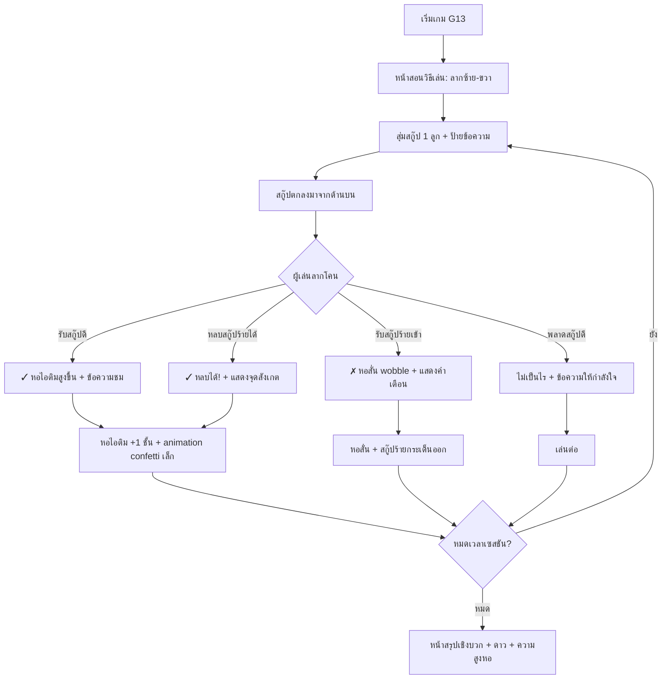

# Detailed Design Document: G13 — ต่อไอติมรู้ทันสื่อ (Stack Smart Scoops)

**สถานะ:** 🔨 Canvas Remake v2 + G13 Leaderboard implemented — รอ runtime playtest
**หมวดหมู่:** 3. Motivation & Empowerment Action Game  
**ความสำคัญ:** Nice to Have  
**กลุ่มเป้าหมาย:** ผู้สูงอายุ (อายุ 60 ปีขึ้นไป)  
**ผู้ออกแบบ:** ทีมวิชาการ NAPLAB  
**เวอร์ชัน:** 2.0 | **อัปเดตล่าสุด:** 2026-07-31

> **คำตัดสิน v2 (2026-07-31):** [US-GAME-13-R2](../agile/user-stories/US-GAME-13-R2.md) แทนที่กลไก prototype v1 ด้านล่างทั้งหมดในส่วนที่ขัดกัน เอกสาร v1 คงไว้เป็นประวัติ/เหตุผลของ prototype เท่านั้น

## G13 v2 — Canvas Remake (Current Specification)

### เป้าหมาย

G13 เป็นเกมแอ็กชันปิดท้าย Flow ที่ **เน้นความสนุก** ผู้เล่นลากกรวยรับไอติมจริงให้สูงที่สุดภายใน 120 วินาที และหลบระเบิด ไม่มีเนื้อหาความรู้, label, emoji หรือการตัดสิน good/bad บนวัตถุเกม

### Architecture

- Gameplay render บน HTML `<canvas>`: ไอติม, ระเบิด, กรวย/หอ, collision, wobble และชิ้นส่วนที่ร่วง
- React/DOM ดูแลเฉพาะ tutorial, HUD, feedback และ summary
- ใช้ `requestAnimationFrame` + delta time; logical coordinates แยกจาก backing store
- Canvas backing store scale ตาม `devicePixelRatio` (cap 3) โดย physics ไม่เปลี่ยนตาม display scale
- ทุกวัตถุถูก clip ด้วย canvas world bounds และ cleanup เมื่อพ้นพื้นที่
- เมื่อยอดหอสูงเกินเส้นติดตามที่ 48% ของความสูง playfield ใช้ camera offset เลื่อนโลกลงอย่างนุ่มนวลแทนการย่อหอ; เมื่อจำนวนชั้นลดจากระเบิด กล้อง ease กลับขึ้นตามความสูงใหม่
- พื้นที่ลากควบคุมเป็น fixed input hit area ช่วงล่าง 34% ของ playfield แยกจากตำแหน่งกรวย/camera จึงเริ่มลากใหม่ได้แม้กรวยถูกกล้องเลื่อนพ้นขอบล่าง
- ฉากหลังผูกกับ camera altitude: ท้องฟ้ากลางวันค่อย ๆ มืดเป็นอวกาศ, เมฆค่อย ๆ จาง และดาวค่อย ๆ ปรากฏ; เมื่อกล้องลดระดับ ฉากจะย้อนกลับอย่างต่อเนื่อง

### Core Loop

1. เริ่มเกม 120 วินาที กรวยอยู่ด้านล่าง
2. ไอติมหลายรสตกจากด้านบน ผู้เล่นลากกรวย/หอซ้าย-ขวาไปรับ
3. ลูกแรกต่อเมื่อชนปากกรวย; ลูกถัดไปต่อทันทีเมื่อชนไอติมบนสุด
4. ยิ่งหอสูง ยอดหอยิ่งโยกมากขึ้น แต่ไม่มี Game Over
5. ระเบิดตกสลับกับไอติม:
   - หลบสำเร็จ: เล่นต่อ
   - ชนกรวยหรือหอ: pop ไอติมบนสุดไม่เกิน 2 ลูกให้กลายเป็น falling debris
6. หมดเวลาแสดงจำนวนชั้น + คำชม แล้วส่งความสูงหอผ่าน `onFinish(height)` เป็นคะแนน G13
7. เมื่อกด "เสร็จสิ้นบทเรียน" เก็บคะแนนรอใน `sessionStorage` และไป `/lessons/flow-g13/leaderboard`; หลังผู้เล่นยืนยันชื่อจึงส่งคะแนนเข้า Supabase ด้วย `gid = G13`
8. ปุ่ม "เสร็จสิ้นบทเรียน" ใต้ Leaderboard ไป `/lessons/complete` เพื่อแสดงหน้าชื่นชมปลาย Flow

### Visual Direction

- กรวยใช้ vector asset `public/assets/g13-waffle-cone.svg`: ทรงกรวยจริง, ขอบปากกรวย, ลายตารางวาฟเฟิล
- ไอติมวาดเป็น scoop ด้วย path/gradient หลายรส ไม่มีข้อความ
- ระเบิดใช้ silhouette กลมสีเข้ม + ชนวนและประกายสีส้ม แยกจากไอติมได้ทันที
- UI portrait single-screen; canvas เป็น flex child `min-height: 0` และไม่สร้าง page scroll

### Analytics v2

- `game_start`: `renderer: "canvas"`, `session_duration_seconds`
- `scoop_catch`, `scoop_miss`: `tower_height`, `renderer`
- `bomb_hit`: `scoops_dropped`, `tower_height`, `renderer`
- `bomb_dodge`: `tower_height`, `renderer`
- `game_complete`: `tower_height`, `session_duration_ms`, `renderer`

---

## Legacy v1 Prototype Specification (Superseded where conflicting)

**แหล่งอ้างอิงกลไกเกม:**
- [Scoops — NimbleBit](https://www.onsecondscoop.com/2009/07/free-iphone-ipod-touch-game-for.html) — เอียงมือถือซ้าย-ขวารับไอติมตก หลบผัก ฟิสิกส์ทำให้หอสูงคุมยาก
- [Ice Cream Disaster](https://play.google.com/store/apps/details?id=com.capy.icecream) — รับสกู๊ปซ้อน ระบบ wobble/balance หลบสิ่งกีดขวาง เก็บ topping พิเศษ
- ตัวอย่างการเล่น: [m2-res_1080p.mp4](./image/m2-res_1080p.mp4)

---

## 1. Overview (ภาพรวมของเกม)

เกม **G13 — ต่อไอติมรู้ทันสื่อ** เป็นเกมแอคชั่นแบบ **รับของตก (Catch & Stack)** ที่ผสมผสานความสนุกของการต่อไอติมให้สูงที่สุดเข้ากับการสอน **ความรู้เท่าทันสื่อ** สำหรับผู้สูงอายุ

### แนวคิดหลัก (Concept)

ผู้เล่นควบคุม **โคนไอติม** ที่ด้านล่างของหน้าจอ เลื่อนซ้าย-ขวาด้วยการ **ลากนิ้ว (Drag)** เพื่อ:
- **รับสกู๊ปไอติม "ดี"** (สกู๊ปที่มีข้อความ/ไอคอนเชิงบวก เช่น "เช็กก่อนแชร์", "โทร 1441", ".go.th") → ซ้อนบนหอไอติมให้สูงขึ้น
- **หลบสกู๊ปไอติม "ร้าย"** (สกู๊ปที่มีข้อความ/ไอคอนหลอกลวง เช่น "กดรับเงินด่วน!", "bit.ly/xxx", "ส่ง OTP เลย") → ถ้าเผลอรับจะทำให้หอสั่น (wobble) แต่ไม่ล้ม

> 💡 **ปรัชญาการเรียนรู้:** เกมนี้เป็นอุปมาของ **"การรับข้อมูลในชีวิตประจำวัน"** — ข้อมูลดีรับไว้เสริมสร้างความรู้ (หอไอติมสูงขึ้น) ข้อมูลหลอกลวงต้องหลบเลี่ยง ถ้าเผลอรับมาก็ไม่ใช่จุดจบ (ไม่มี Game Over) แต่ต้องรู้ตัวและระวังต่อไป

### จุดเด่นของ G13

| ด้าน | รายละเอียด |
|------|------------|
| **เล่นง่าย** | Input เดียว: ลากนิ้วซ้าย-ขวา ไม่มีปุ่มซับซ้อน |
| **สนุก** | ฟิสิกส์ wobble ทำให้หอไอติมแกว่งเมื่อสูงขึ้น — ตื่นเต้นแต่ไม่กดดัน |
| **สอนไม่รู้ตัว** | ทุกสกู๊ปมีข้อความสั้นๆ ผู้เล่นซึมซับหลักคิดรู้ทันสื่อระหว่างเล่น |
| **ไม่มี Game Over** | หอไอติมสั่นแต่ไม่ล้ม จบเซสชัน = ผ่านเสมอ |
| **ภาพน่ารัก** | สไตล์ไอติมการ์ตูนสดใส เหมาะกับผู้สูงอายุ ไม่ดูเป็น "แอปเด็ก" |

---

## 2. Core Gameplay Loop (วงลูปหลักการเล่น)



### สรุปลูปเล่น

1. **สุ่มสกู๊ป** — ระบบสุ่มสกู๊ปไอติม 1 ลูกพร้อมป้ายข้อความสั้น (ดี/ร้าย) ตกจากด้านบน
2. **ลากโคน** — ผู้เล่นลากนิ้วซ้าย-ขวาเพื่อเลื่อนโคนไอติมรับหรือหลบ
3. **ผลลัพธ์** — แสดงข้อความสั้น 1 บรรทัด (ชม/เตือน) ทันทีหลังรับ/หลบ
4. **ซ้อนหอ** — สกู๊ปดีที่รับได้ซ้อนบนหอ ยิ่งสูงยิ่ง wobble
5. **วนสุ่มใหม่** — จนหมดเวลาเซสชัน (~60-90 วินาที)
6. **สรุปผล** — แสดงความสูงหอไอติม + ดาว + คำชม

> **กติกาโครงการ:** ไม่มีหน้าจอแพ้ จบเซสชัน = ผ่านเสมอ ([Art Direction](./03-art-direction.md))

---

## 3. User Interface & Screen Layout (การจัดหน้าจอ — Portrait เท่านั้น)

หน้าจอเกมออกแบบในแนวตั้ง (Portrait Mode) ถือมือถือมือเดียว:

```
+---------------------------------------------------+
|  GameShell: ⏱️ 0:45   ความสูง: 8 ชั้น   🔊         | -> เชลล์กลาง
+---------------------------------------------------+
|                                                   |
|                   🍦 ← สกู๊ปกำลังตก               | -> โซนสกู๊ปตก
|              "เช็กก่อนแชร์ ✓"                      |    (ด้านบน ~70%)
|                                                   |
|                                                   |
|           ┌─────────────────────────┐             |
|           │   🍨 สกู๊ปชั้น 8         │             | -> หอไอติม
|           │   🍨 สกู๊ปชั้น 7         │             |    (ซ้อนจากโคนขึ้นไป
|           │   🍨 สกู๊ปชั้น 6         │             |     wobble เมื่อสูง)
|           │   🍨 สกู๊ปชั้น 5         │             |
|           │   🍨 สกู๊ปชั้น 4         │             |
|           │   🍨 สกู๊ปชั้น 3         │             |
|           │   🍨 สกู๊ปชั้น 2         │             |
|           │   🍨 สกู๊ปชั้น 1         │             |
|           │   🍦 โคน                 │             |
|           └─────────────────────────┘             |
|                                                   |
|  ← ← ← ← ← ลากซ้าย-ขวา → → → → →               | -> โซนควบคุม
|                                                   |    (ด้านล่าง ~30%)
+---------------------------------------------------+
|  ข้อความสั้น: "เก่งมาก! เช็กแหล่งที่มาก่อนแชร์"   | -> แถบ feedback
+---------------------------------------------------+
```

### รายละเอียดแต่ละส่วน

#### 3.1 โซนสกู๊ปตก (Drop Zone — ด้านบน ~70%)
- สกู๊ปไอติมตกจาก **ตำแหน่ง X แบบสุ่ม** ที่ขอบบนหน้าจอ
- ตกด้วยความเร็วคงที่ช้าๆ (~3-4 วินาทีจากบนจรดล่าง)
- บนสกู๊ปมี **ป้ายข้อความสั้น** (ตัวอักษร ≥ 18px) แสดงเนื้อหาที่เกี่ยวข้อง
- สกู๊ปดี = สีสดใส (เขียว, ฟ้า, ชมพู) พร้อมไอคอน ✓
- สกู๊ปร้าย = สีเข้ม (ม่วงดำ, แดงเข้ม) พร้อมไอคอน ⚠️
- ให้ผู้สูงอายุ **อ่านข้อความบนสกู๊ปได้ทัน** ก่อนตัดสินใจ

#### 3.2 หอไอติม (Ice Cream Tower)
- หอซ้อนจากโคนด้านล่างขึ้นด้านบน
- เมื่อรับสกู๊ปดี: สกู๊ปลงจอดบนยอดหอ + animation bounce นุ่มๆ
- เมื่อหอสูง ≥ 5 ชั้น: เริ่ม wobble ซ้าย-ขวาเบาๆ (CSS animation)
- เมื่อหอสูง ≥ 8 ชั้น: wobble รุนแรงขึ้นเล็กน้อย + ข้อความ "โอ้โห สูงมาก!"
- **หอไม่มีวันล้ม** — wobble เป็นแค่ visual feedback สนุกๆ

#### 3.3 โซนควบคุม (Control Zone — ด้านล่าง ~30%)
- ผู้เล่น **ลากนิ้วซ้าย-ขวา** บนพื้นที่นี้เพื่อเลื่อนโคน+หอทั้งหมด
- Touch target กว้างเต็มจอด้านล่าง — ไม่ต้องแตะที่โคนตรงๆ
- โคนเลื่อนตาม pointer แบบ 1:1 (ไม่ใช่ระบบเอียง/tilt)

#### 3.4 แถบ Feedback (ด้านล่างสุด)
- แสดงข้อความสั้น 1 บรรทัด ทุกครั้งที่รับ/หลบสกู๊ป
- Fade-in ~300ms → แสดง 2 วินาที → fade-out
- สีเขียวอ่อนสำหรับ feedback บวก / สีส้มอ่อนสำหรับ feedback เตือน

---

## 4. Content Pool Design (การออกแบบคลังสกู๊ป)

### 4.1 หลักการออกแบบ

สกู๊ปแบ่งเป็น 2 กลุ่มหลัก:
- **สกู๊ปดี (Good Scoops)** 🍦 — ข้อมูลถูกต้อง / พฤติกรรมดีด้านดิจิทัล → **ต้องรับ**
- **สกู๊ปร้าย (Bad Scoops)** 🦠 — ข้อมูลหลอกลวง / พฤติกรรมเสี่ยง → **ต้องหลบ**

สัดส่วนแนะนำ: ดี ~55% : ร้าย ~45% — ให้ผู้เล่นรู้สึกว่ารับได้บ่อยกว่าหลบ (เสริมกำลังใจ)

### 4.2 ตารางคลังสกู๊ป (เวอร์ชันแรก — 16 ลูก)

#### สกู๊ปดี (Good Scoops) — รับแล้วหอสูงขึ้น

| # | ข้อความบนสกู๊ป | สีสกู๊ป | หมวดหมู่ | ข้อความ feedback เมื่อรับ |
|---|---------------|---------|----------|--------------------------|
| 1 | "เช็กก่อนแชร์ ✓" | 🟢 เขียวมิ้นท์ | good-habit | "เยี่ยม! เช็กข้อมูลก่อนแชร์ต่อเสมอนะคะ" |
| 2 | "โทร 1441 📞" | 🔵 บลูเบอร์รี | good-hotline | "ถูกต้อง! 1441 สายด่วนตำรวจไซเบอร์ค่ะ" |
| 3 | ".go.th 🏛️" | 🟣 ลาเวนเดอร์ | good-domain | "เว็บราชการ .go.th น่าเชื่อถือค่ะ" |
| 4 | "ถามลูกหลานก่อน 👨‍👩‍👧" | 🩷 สตรอเบอร์รี | good-ask | "ดีมาก! ไม่แน่ใจก็ถามคนใกล้ชิดค่ะ" |
| 5 | "ไม่ให้ OTP ใคร 🔒" | 🟡 มะม่วง | good-security | "ถูกต้อง! OTP เป็นความลับส่วนตัวค่ะ" |
| 6 | "อ่านให้จบก่อนเชื่อ 📖" | 🩵 โซดา | good-critical | "เก่ง! อ่านครบก่อนตัดสินใจนะคะ" |
| 7 | "ศูนย์ชัวร์ก่อนแชร์ 🔍" | 🟢 ชาเขียว | good-verify | "สุดยอด! เช็กที่ศูนย์ชัวร์ก่อนแชร์ค่ะ" |
| 8 | "หยุด 🛑 คิด 🧠 ถาม 💬" | 🌈 รุ้ง (พิเศษ) | good-slogan | "เยี่ยมเลย! หยุด คิด ถาม ทำ นะคะ" |
| 9 | "รู้เท่าทัน AI 🤖" | 🩵 โซดาครีม | good-ai | "ดีค่ะ! รู้จัก AI ไว้ไม่ต้องกลัว" |

#### สกู๊ปร้าย (Bad Scoops) — ต้องหลบ

| # | ข้อความบนสกู๊ป | สีสกู๊ป | หมวดหมู่ | ข้อความ feedback เมื่อหลบได้ / เมื่อรับเข้า |
|---|---------------|---------|----------|---------------------------------------------|
| 1 | "กดรับเงินด่วน! 💰" | 🟤 ช็อกโกแลตดำ | bad-scam | หลบ: "เก่ง! รางวัลจากที่ไหนไม่รู้ อย่าเชื่อค่ะ" / รับ: "ระวัง! แจ้งรางวัลจากที่ไม่รู้จัก อย่าเชื่อนะคะ" |
| 2 | "bit.ly/xxx 🔗" | 🔴 เชอร์รีดำ | bad-link | หลบ: "ดีมาก! ลิงก์ย่อน่าสงสัยค่ะ" / รับ: "ลิงก์ย่อน่าสงสัย อย่ากดนะคะ" |
| 3 | "ส่ง OTP เลย! 🔑" | 🟤 กาแฟเข้ม | bad-otp | หลบ: "ถูกต้อง! OTP ห้ามบอกใครค่ะ" / รับ: "ระวัง! ห้ามส่ง OTP ให้ใครเด็ดขาดค่ะ" |
| 4 | "แชร์ด่วน! ข่าวร้อน 🔥" | 🔴 ราสเบอร์รีดำ | bad-fakenews | หลบ: "เก่ง! ข่าวเร่งแชร์มักเป็นข่าวปลอมค่ะ" / รับ: "ข่าวเร่งแชร์มักเป็นข่าวปลอม เช็กก่อนนะคะ" |
| 5 | "โอนเงินภายใน 1 ชม.! ⏰" | 🟤 โกโก้ดำ | bad-urgency | หลบ: "ดี! การเร่งโอนเงินคือกลลวงค่ะ" / รับ: "การเร่งโอนเงินเป็นกลลวงมิจฉาชีพค่ะ" |
| 6 | "คุณอยู่ในคลิปนี้! 👀" | 🔴 บีทรูทดำ | bad-curiosity | หลบ: "เยี่ยม! ลิงก์ล่อความอยากรู้ค่ะ" / รับ: "ลิงก์ล่อความอยากรู้ อย่ากดนะคะ" |
| 7 | "ยาหาย 100%! 💊" | 🟤 ถั่วเข้ม | bad-health | หลบ: "ถูกต้อง! รักษาหาย 100% เป็นโฆษณาเกินจริงค่ะ" / รับ: "โฆษณารักษาหาย 100% อย่าเชื่อ ปรึกษาหมอค่ะ" |

### 4.3 สกู๊ปพิเศษ (Special Scoops)

| ประเภท | ลักษณะ | ผล |
|--------|--------|-----|
| 🌈 **สกู๊ปรุ้ง (Rainbow)** | สกู๊ปสีรุ้งวิบวับ ข้อความ "หยุด คิด ถาม ทำ" | รับแล้ว +2 ชั้น (สกู๊ปใหญ่พิเศษ) + animation confetti + เสียงชื่นชมพิเศษ |
| 🛡️ **สกู๊ปโล่ (Shield)** | สกู๊ปสีทอง รูปโล่ | รับแล้วหอแข็งแกร่งขึ้นชั่วคราว (ลด wobble 5 วินาที) + "โล่ความรู้ป้องกันภัยค่ะ" |

---

## 5. Physics & Visual Feedback (ฟิสิกส์และภาพตอบสนอง)

### 5.1 ระบบ Wobble (การแกว่ง)

หอไอติมมี **ระดับ wobble** ที่เพิ่มตามความสูง:

| ความสูงหอ | ระดับ Wobble | Animation |
|-----------|-------------|-----------|
| 1-4 ชั้น | ไม่มี wobble | หอนิ่งสนิท |
| 5-7 ชั้น | เบา | `rotate: ±1.5deg` สลับซ้าย-ขวา ช้าๆ (~3s/cycle) |
| 8-10 ชั้น | ปานกลาง | `rotate: ±3deg` + `translateX: ±3px` (~2s/cycle) |
| 11+ ชั้น | มาก | `rotate: ±4.5deg` + `translateX: ±5px` (~1.5s/cycle) + ข้อความ "โอ้โห สูงจัง!" |

> **สำคัญ:** หอไม่มีวันล้มจริง — wobble เป็นแค่ visual feedback ที่สร้างความตื่นเต้น ผู้เล่นไม่แพ้ไม่ว่าจะเกิดอะไรขึ้น

### 5.2 เมื่อรับสกู๊ปร้าย (Bad Scoop Hit)

1. หอสั่น **แรงขึ้นชั่วคราว** (~1.5 วินาที) — `rotate: ±6deg` + screen shake เบาๆ
2. สกู๊ปร้ายกระเด็นออกจากหอ (bounce animation ไปด้านข้าง)
3. แสดงข้อความเตือนสีส้มอ่อนที่แถบ feedback
4. **ไม่หักชั้น ไม่หักดาว** — แค่ "ไม่ได้เพิ่ม" + คำเตือนสอน

### 5.3 เมื่อรับสกู๊ปดี (Good Scoop Catch)

1. สกู๊ปลงจอดบนยอดหอ — animation **squish** (กดแบนเล็กน้อย ~80% แล้วเด้งกลับ ~120% → 100%)
2. Confetti particles เล็กๆ พุ่งออกจากจุดลงจอด (~8-12 particles)
3. หอเลื่อนลงเล็กน้อยเพื่อให้มีที่ว่างด้านบน (camera scroll)
4. ข้อความชมสีเขียวอ่อนที่แถบ feedback

---

## 6. Controls & Interaction Mechanics (การควบคุม)

### 6.1 ระบบลากนิ้ว (Drag-to-Move)

- **pointerdown** บนพื้นที่ด้านล่าง (~30% ล่างของจอ) → เริ่มจับ pointer
- **pointermove** → โคน+หอเลื่อนตาม `clientX` แบบ 1:1 (offset จากจุดเริ่มแตะ)
- **pointerup/pointercancel** → ปล่อย
- ขอบซ้าย-ขวาของจอ = ขอบเขตการเลื่อน (โคนไม่ออกนอกจอ)

### 6.2 ทางเลือก Tilt (Optional — ถ้า Accelerometer ใช้ได้)

- ตรวจสอบ `DeviceOrientationEvent` + permission
- เอียงมือถือซ้าย-ขวาเพื่อเลื่อนโคน (ตามแบบ Scoops ต้นฉบับ)
- **ไม่บังคับ** — ปิดได้เสมอ กลับไปใช้ลากนิ้ว
- ความไว (sensitivity) ต่ำพิเศษสำหรับมือสั่นของผู้สูงอายุ

### 6.3 Touch Target
- พื้นที่แตะ/ลาก = **ทั้งครึ่งล่างของจอ** (≥ 48×48px ตาม Art Direction)
- ไม่จำเป็นต้องแตะที่โคนตรงๆ — แตะที่ไหนก็ได้ในโซนควบคุมแล้วลาก

---

## 7. Timing & Difficulty (จังหวะเกมและระดับความยาก)

### 7.1 ค่าจังหวะเกม

| ค่า | เสนอ | หมายเหตุ |
|-----|------|----------|
| ระยะเวลาเซสชัน | **60-90 วินาที** | สั้นพอไม่เบื่อ ยาวพอรับสกู๊ปได้ ~15-20 ลูก |
| ความเร็วสกู๊ปตก | **~3-4 วินาที** จากบนจรดล่าง | ช้ามากเพื่อให้อ่านข้อความทัน |
| ช่วงห่างระหว่างสกู๊ป | **~2-3 วินาที** | ไม่เร่งรัด มีเวลาหายใจ |
| จำนวนสกู๊ปพร้อมกันบนจอ | **1 ลูกเท่านั้น** | ง่ายสำหรับผู้สูงอายุ ไม่สับสน |

### 7.2 ไม่มีระบบเพิ่มความยาก (No Difficulty Ramp)

- ความเร็วสกู๊ปคงที่ตลอดเซสชัน — ไม่เร่งขึ้น
- ไม่มีระบบ "ชีวิต" หรือ "โอกาสผิดจำกัด"
- สกู๊ปร้ายปรากฏในสัดส่วนคงที่ (~45%)

> **เหตุผล:** เกมนี้เป็น Motivation & Empowerment — เน้นความสนุกและการซึมซับเนื้อหา ไม่ใช่ความท้าทาย

---

## 8. Answer Logic & Positive Reinforcement (ตรรกะคำตอบ + การเสริมแรงเชิงบวก)

### 8.1 ตารางผลลัพธ์

| ผู้เล่นทำ | สกู๊ปเป็น | ผลลัพธ์ | ข้อความ |
|-----------|----------|---------|---------|
| รับ | ดี (good) | ✓ **ถูกต้อง** หอ +1 ชั้น | คำชม + ข้อความเชิงบวก |
| หลบ | ร้าย (bad) | ✓ **ถูกต้อง** ไม่ได้ชั้นแต่สะสมแต้ม | คำชม + แสดงจุดสังเกต |
| รับ | ร้าย (bad) | ✗ **ไม่ถูก** หอสั่น ไม่ได้ชั้น | คำเตือนสีส้ม + สอนจุดสังเกต |
| หลบ | ดี (good) | — **พลาด** ไม่ได้ชั้น | "ไม่เป็นไร" ไม่ตำหนิ |

### 8.2 ไม่มีระบบพ่ายแพ้ (No Punishment)
- ไม่มีคำว่า "คุณแพ้" หรือ Game Over
- รับสกู๊ปร้ายใช้สี **ส้มอ่อน** (ไม่ใช่แดงจัด) + ไอคอน ⚠️
- ทุกเซสชันถือว่า "ผ่าน" ไม่ว่าจะเล่นได้กี่ชั้น
- **จบเสมอ = ผ่านเสมอ** (สอดคล้อง Win/Lose policy ของโครงการ)

### 8.3 การนับดาว

ใช้เกณฑ์ **ความสูงหอไอติม** (จำนวนสกู๊ปดีที่รับได้):

| เงื่อนไข | ดาว |
|----------|-----|
| รับสกู๊ปดี ≥ 8 ลูก | ⭐⭐⭐ 3 ดาว |
| รับสกู๊ปดี ≥ 5 ลูก | ⭐⭐ 2 ดาว |
| รับสกู๊ปดี < 5 ลูก | ⭐ 1 ดาว (ขั้นต่ำ 1 ดาวเสมอ) |

หน้าสรุปโชว์เฉพาะ **ดาว + ความสูงหอ + คำชม** ไม่โชว์จำนวนสกู๊ปร้ายที่เผลอรับ

---

## 9. Reward & Summary Screen (ระบบรางวัลและหน้าสรุป)

### หน้าสรุปหลังเล่นจบ

```
+---------------------------------------------------+
|                                                   |
|          🏆 ยอดเยี่ยมมากค่ะ!                       |
|                                                   |
|             ⭐ ⭐ ⭐                                |
|                                                   |
|          🍦🍨🍨🍨🍨🍨🍨🍨🍨                        |
|          ไอติมสูง 9 ชั้น!                           |
|                                                   |
|   "คุณเลือกรับข้อมูลดีได้เก่งมาก                  |
|    จำไว้นะคะ — หยุด 🛑 คิด 🧠 ถาม 💬 ทำ ✅"       |
|                                                   |
|   +-------------------------------------------+   |
|   |           ▶ ไปบทถัดไป                      |   | -> ปุ่มใหญ่ ≥ 56px
|   +-------------------------------------------+   |
|   +-------------------------------------------+   |
|   |           🔄 เล่นอีกรอบ                     |   |
|   +-------------------------------------------+   |
|                                                   |
+---------------------------------------------------+
```

- **ไม่แสดงจำนวนสกู๊ปร้ายที่เผลอรับ** — โชว์แต่ดาว + ความสูง + คำชม
- แสดง **ภาพหอไอติมที่สร้างได้** ขนาดย่อ (รูปประจำเซสชัน)
- ปุ่ม "ไปบทถัดไป" ใหญ่ชัด เพื่อนำผู้เล่นกลับเข้าลูปหลัก
- ส่งดาวให้ GameShell ผ่าน `onFinish(stars)` ตามแบบแผนปกติ

---

## 10. Art Direction & Motion (ทิศทางภาพและการเคลื่อนไหว)

- **โทนภาพ:** สดใส อบอุ่น สีพาสเทล — หอไอติมสีสันสดใสบนพื้นหลังสีฟ้าอ่อน/ครีม
- **สกู๊ป:** รูปร่างครึ่งวงกลมมน มีรอยยิ้ม/ตา แบบ cute (แต่ไม่ childish เกินไป)
- **โคน:** โคนวาฟเฟิลสีน้ำตาลทอง ลายตาราง
- **สกู๊ปร้าย:** สีเข้มกว่า มีเอฟเฟกต์ "ควัน/หมอก" เบาๆ + ไอคอน ⚠️ ชัดเจน
- **พื้นหลัง:** ท้องฟ้าสีฟ้าอ่อน มีเมฆปุยๆ ลอย — เปลี่ยนสีเล็กน้อยตามความสูงหอ (สูงขึ้น = ฟ้าเข้มขึ้น)

### Animation

| สถานการณ์ | Animation | เสียง |
|-----------|-----------|-------|
| สกู๊ปตก | ตกลงช้าๆ + หมุนเล็กน้อย | — |
| รับสกู๊ปดี | squish → bounce + confetti | เสียง "ป๊อป" อ่อนโยน |
| หลบสกู๊ปร้ายได้ | สกู๊ปร้ายตกหายไปด้านล่าง + flash เขียว | เสียง "ปิ๊ง" สั้น |
| เผลอรับสกู๊ปร้าย | หอสั่น + สกู๊ปกระเด็น + screen shake เบา | เสียงเตือนนุ่มนวล |
| สกู๊ปรุ้ง (พิเศษ) | confetti ใหญ่ + sparkle animation | เสียงชื่นชมพิเศษ |
| จบเซสชัน | หอค่อยๆ zoom out แสดงทั้งหมด | เสียงเฉลิมฉลอง |

- **`prefers-reduced-motion`:** ลด wobble และ confetti เหลือ fade ทันที
- ✓ เขียว / ⚠️ ส้มอ่อน — ทุกจุดมีไอคอนกำกับ ไม่พึ่งสีอย่างเดียว ตาม [Art Direction](./03-art-direction.md)

---

## 11. Content Data Design (คลังสกู๊ปแบบ data-driven)

โจทย์สกู๊ปทุกลูกเป็น data-driven (JSON ใน `src/data/`) เพื่อให้ทีมเนื้อหาเพิ่ม/แก้ได้โดยไม่แตะโค้ดเกม

### 11.1 โครงสร้างข้อมูลสกู๊ป (`src/data/g13-scoop-items.json`)

```json
{
  "id": "g13-good-001",
  "type": "good",
  "label": "เช็กก่อนแชร์ ✓",
  "color": "mint",
  "icon": "✓",
  "category": "good-habit",
  "feedback_catch": "เยี่ยม! เช็กข้อมูลก่อนแชร์ต่อเสมอนะคะ",
  "feedback_miss": "ไม่เป็นไรค่ะ โอกาสหน้ามีอีก",
  "special": null,
  "ai_disclosure": false
}
```

```json
{
  "id": "g13-bad-001",
  "type": "bad",
  "label": "กดรับเงินด่วน! 💰",
  "color": "dark-chocolate",
  "icon": "⚠️",
  "category": "bad-scam",
  "feedback_dodge": "เก่ง! รางวัลจากที่ไหนไม่รู้ อย่าเชื่อค่ะ",
  "feedback_hit": "ระวัง! แจ้งรางวัลจากที่ไม่รู้จัก อย่าเชื่อนะคะ",
  "red_flags": ["แจ้งรางวัลจากที่ไม่รู้จัก", "เร่งรัดให้กดทันที"],
  "special": null,
  "ai_disclosure": false
}
```

### 11.2 อธิบายฟิลด์

| ฟิลด์ | คำอธิบาย |
|-------|----------|
| `id` | รหัสสกู๊ปไม่ซ้ำ (g13-good-001, g13-bad-001, ...) |
| `type` | `"good"` (ต้องรับ) หรือ `"bad"` (ต้องหลบ) |
| `label` | ข้อความสั้นที่แสดงบนสกู๊ป (≤ 15 ตัวอักษร + emoji) |
| `color` | ชื่อสีของสกู๊ป (map กับ CSS variable) |
| `icon` | ไอคอนเสริมบนสกู๊ป (✓ สำหรับดี, ⚠️ สำหรับร้าย) |
| `category` | หมวดหมู่สำหรับวิเคราะห์: `good-habit`, `good-hotline`, `bad-scam`, `bad-fakenews`, ฯลฯ |
| `feedback_catch` / `feedback_dodge` | ข้อความ feedback เมื่อทำถูก |
| `feedback_miss` / `feedback_hit` | ข้อความ feedback เมื่อทำผิด |
| `red_flags` | อาร์เรย์จุดสังเกตอันตราย (เฉพาะ `bad` type) |
| `special` | `null` / `"rainbow"` / `"shield"` สำหรับสกู๊ปพิเศษ |
| `ai_disclosure` | `true` เมื่อกราฟิกสร้างด้วย AI → แสดงป้ายตาม[นโยบาย AI Content](./00-concept.md#5-นโยบายการนำเสนอเนื้อหาที่สร้างจาก-ai-⚠️) |

---

## 12. Technical Implementation Details (สเปกทางเทคนิค)

### Component & Integration
- Component: **`G13ScoopStacker`** วางใน `src/components/` ตามแบบแผน G-number เดิม — คุยกับ `GameShell` ผ่าน props มาตรฐาน `onFinish(stars)` + `logEvent`
- เขียนเป็น **`.tsx`** (TypeScript) ตั้งแต่ต้น
- Dev mode มีปุ่ม **"ข้ามเวลา"** ใน HUD เพื่อจบ timer และเข้า summary ทันที โดยครอบด้วย `process.env.NODE_ENV === "development"` เพื่อให้ production compiler ตัดทั้งปุ่มและ handler ออกจาก bundle
- React state + CSS transitions/animations สำหรับการเคลื่อนที่โคนและสกู๊ป
- Wobble ใช้ CSS `animation` + `transform: rotate()` ควบคุมผ่าน React state
- ฟิสิกส์สกู๊ปตก: ใช้ `requestAnimationFrame` + `translateY` เพิ่มทีละ frame
- คลังสกู๊ป: `src/data/g13-scoop-items.json` — ระบบสุ่มลำดับสกู๊ป (shuffle + สลับ good/bad)
- **ลงทะเบียนใน Dev Game Hub** (`src/app/dev/games/page.tsx`)

### Event Logging

```javascript
logEvent('game_start',      { game_id: 'g13' });
logEvent('scoop_catch',     { game_id: 'g13', scoop_id: 'g13-good-001', type: 'good', correct: true, tower_height: 5 });
logEvent('scoop_dodge',     { game_id: 'g13', scoop_id: 'g13-bad-001', type: 'bad', correct: true, tower_height: 5 });
logEvent('scoop_hit',       { game_id: 'g13', scoop_id: 'g13-bad-002', type: 'bad', correct: false, tower_height: 5 });
logEvent('scoop_miss',      { game_id: 'g13', scoop_id: 'g13-good-003', type: 'good', correct: false, tower_height: 5 });
logEvent('special_scoop',   { game_id: 'g13', scoop_id: 'g13-special-rainbow', special: 'rainbow' });
logEvent('game_complete',   { game_id: 'g13', stars: 3, tower_height: 9, good_caught: 9, bad_hit: 1, session_duration_ms: 72000 });
```

- `tower_height` = จำนวนสกู๊ปดีที่ซ้อนอยู่บนหอ ณ ขณะนั้น
- `session_duration_ms` = ระยะเวลาเล่นทั้งหมด — มีค่าต่อทีมวิชาการ

### Animation Implementation
- สกู๊ปตก: `requestAnimationFrame` + `transform: translateY(${y}px)`
- โคนเลื่อน: `transform: translateX(${x}px)` ตาม pointer
- Wobble: CSS `@keyframes wobble` ปรับ amplitude ตาม `data-wobble-level`
- Squish: CSS `@keyframes squish` (scaleY 0.8 → 1.2 → 1.0, ~200ms)
- Confetti: span elements + CSS animation `@keyframes confetti-burst` (opacity + translate + rotate)
- Touch event: `onPointerDown/Move/Up` บน container (ไม่ใช้ `onClick`)

---

## 13. Open Questions (คำถามเปิดรอทีมตัดสินใจ)

1. **ลำดับความสำคัญ / Sprint:** ยังไม่ได้กำหนด Sprint — ต้องปรึกษาทีมว่าจัดเข้า Sprint ไหน G13 มีความสำคัญ Nice to Have จึงอยู่หลังเกม Must Have (G1-G3, G6)
2. **ผูกกับบทเรียนใด?:** ยังไม่กำหนดว่าจะผูกกับ Topic ไหน — เสนอเป็นเกมสรุปรวม (Recap Game) หลังจบทุกบทเรียน หรือเป็นเกมพิเศษปลดล็อกเมื่อเก็บดาวครบ
3. **ระยะเวลาเซสชัน:** เสนอ 60-90 วินาที — ต้อง user test กับผู้สูงอายุจริงเพื่อหาจุดที่เหมาะสม (สั้นเกินอาจไม่สนุก ยาวเกินอาจเมื่อย)
4. **ระบบ Tilt (เอียงมือถือ):** ควรใส่เป็น option หรือใช้ลากนิ้วอย่างเดียว? — DeviceOrientation permission ใน iOS ยุ่งยาก + ผู้สูงอายุอาจไม่คุ้นเคย
5. **เสียงอ่านข้อความบนสกู๊ป:** สกู๊ปตกเร็วเกินกว่าจะอ่านออกเสียงได้ทัน — อาจใส่ปุ่ม 🔊 แยกสำหรับอ่านสรุปหลังจบเซสชันแทน
6. **กราฟิกสกู๊ป:** ใช้ illustration วาดเอง, emoji, หรือสร้างจาก AI? — กระทบ `ai_disclosure` และงบประมาณ
7. **Multi-scoop mode (อนาคต):** ในเวอร์ชันถัดไป อาจเพิ่มโหมดสกู๊ป 2 ลูกพร้อมกัน สำหรับผู้เล่นที่คุ้นเคยแล้ว — ต้อง user test ก่อน

---

## Related Documents
- Mechanics รวม: [Core Mechanics](./01-mechanics.md)
- กติกา UI/UX บังคับ: [Art Direction](./03-art-direction.md)
- เกม Format 3 พี่น้อง: [G5 กางโล่กู้ชีพ](./design-g5.md), [G7 วิ่งสู้ภัยไซเบอร์](./design-g7.md), [G8 กระโดดแพ](./design-g8.md)
- นโยบาย AI Content: [Concept §5](./00-concept.md#5-นโยบายการนำเสนอเนื้อหาที่สร้างจาก-ai-⚠️)
- Dev Game Hub (ทดสอบ): `/dev/games` — [US-03-R4](../agile/user-stories/US-03-R4.md)
- ตัวอย่างการเล่น: [m2-res_1080p.mp4](./image/m2-res_1080p.mp4)
