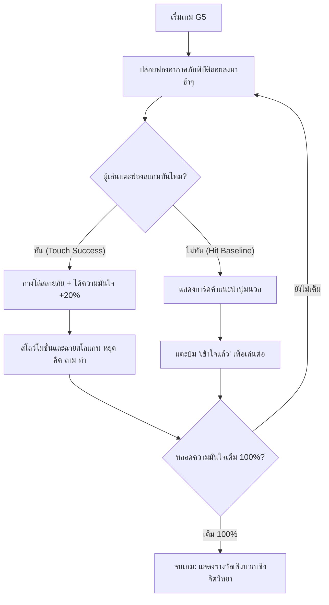

# Detailed Design Document: G5 — หยุด คิด ถาม ทำ (กางโล่กู้ชีพ - Digital Shield Defender)

**สถานะ:** 🏗️ Draft / Approved  
**หมวดหมู่:** 3. Motivation & Empowerment Action Game  
**ความสำคัญ:** Should Have  
**กลุ่มเป้าหมาย:** ผู้สูงอายุ (อายุ 60 ปีขึ้นไป)  
**ผู้ออกแบบ:** ทีมวิชาการ NAPLAB  
**เวอร์ชัน:** 1.0 | **อัปเดตล่าสุด:** 2026-07-05

---

## 1. Overview (ภาพรวมของเกม)
เกม **G5 — หยุด คิด ถาม ทำ** ได้รับการออกแบบใหม่ให้จำกัดขอบเขตการเล่นเหลือเพียง **ปฏิกิริยาเดียว (Single-action)** เพื่อแก้ปัญหาเรื่องผู้สูงวัยสับสนกับการควบคุมที่ซับซ้อน (Multi-tasking) 
โดยในเกมนี้ ผู้เล่นจะมีหน้าที่เป็น "ผู้ป้องกันภัยไซเบอร์" คอยแตะบนฟองคำสั่งล่อลวงอันตรายที่กำลังลอยตกลงมา เพื่อกาง **"โล่ป้องกันภัยดิจิทัล" (Digital Shield)** ทำลายคำสั่งนั้น ก่อนที่มันจะตกลงสู่พิกัดปลอดภัย (ด้านล่างของหน้าจอ)

---

## 2. Core Gameplay Loop (วงลูปหลักการเล่น)



---

## 3. User Interface & Screen Layout (การจัดหน้าจอ)

หน้าจอเกมถูกกำหนดให้แสดงผลในแนวตั้ง (Portrait Mode) เพื่อความสะดวกในการถือมือถือเล่นด้วยมือเดียวของผู้สูงอายุ โดยแบ่งพื้นที่ออกเป็น 3 ส่วนหลัก:

```
+---------------------------------------------------+
|  [|||||||||||||||||||||| 60% |||||||||||||||]      | -> 1. หลอดพลังความมั่นใจ (Confidence Bar)
|       ความพร้อมไซเบอร์: 60% (แตะสะกัดสำเร็จ 3/5)     |
+---------------------------------------------------+
|                                                   |
|          (  สิทธิ์รับเงิน 10,000  )               | -> 2. พื้นที่เล่น (Active Game Canvas)
|             ( แตะสอยตรงนี้ )                      |     - ฟองอากาศสแกมตกลงมาช้าๆ
|                                                   |     - วงกลมสัมผัส Touch Target กว้างพิเศษ
|                                                   |
|                       [ 🛡️ Digital Shield ]       |
|                                                   |
+---------------------------------------------------+
| ================== Baseline ===================== | -> 3. เส้นขอบเขตปลอดภัย (Safety Line)
+---------------------------------------------------+
```

*   **หลอดสะสมพลังความมั่นใจ (Confidence Gauge):** วางอยู่ด้านบนสุดของจอ แสดงสัดส่วนเปอร์เซ็นต์ด้วยตัวหนังสือขนาดใหญ่ (ขั้นต่ำ 20px Bold) และแถบสีสันสดใสสังเกตง่าย
*   **พื้นที่เล่นเกม (Phaser Canvas area):** ฟองอากาศจะลอยร่วงลงมาด้วยความเร็วต่ำมาก (ประมาณ 50-80 พิกเซลต่อวินาที) เพื่อให้ผู้เล่นวัย 60+ สามารถตอบสนองได้อย่างนุ่มนวล
*   **เส้นขอบเขตปลอดภัย (Safety Line):** หากฟองข้อความหลุดเลยเส้นนี้ลงไปด้านล่าง จะเปรียบเหมือนข้อความภัยสแกมถูกเปิดอ่าน/เข้าสู่ชีวิตจริง ระบบจะทำสโลว์โมชั่นหยุดเกมเพื่อนำเสนอ "การ์ดคำสอนเชิงบวก" ทันที

---

## 4. Hazard Pool Data Design (การออกแบบข้อความล่อลวง)

ข้อความที่ Spawn ออกมาจะคัดสรรเฉพาะประเด็นเสี่ยงที่ผู้สูงอายุพบเจอบ่อยที่สุด 5 ลำดับแรก:

| ID | ข้อความในฟองอากาศ (Hazard Text) | ประเภทภัยคุกคาม | วิธีรับมือ (Action) | คำชี้แนะเมื่อสะกดไม่ทัน (Advice Card Text) |
|---|-----------------------------|-------------|-------------------|---------------------------------------|
| 1 | "โอนด่วน 500 บ. ค่าพัสดุตกค้าง!" | SMS แอบอ้างขนส่ง | แตะสลายภัย (Block) | "มิจฉาชีพมักเร่งเร้าให้โอนเงินเร็ว แต่การจงใจชะลอช้าและโทรเช็กศูนย์ขนส่งก่อน จะช่วยรักษาเงินในกระเป๋าได้ค่ะ" |
| 2 | "ยินดีด้วย! คุณมีสิทธิ์ลุ้นรับโบนัสวัยเกษียณ" | เว็บลิงก์สแกม | แตะสลายภัย (Block) | "รางวัลใหญ่ที่ส่งมาทาง SMS หรือหน้าเว็บ มักเป็นเบ็ดล่อข้อมูล ห้ามกดลิงก์แปลกปลอมเด็ดขาดนะคะ" |
| 3 | "ลูกคุณเดือดร้อน ขอเลข OTP ด่วน!" | แชทแอบอ้างบุคคล | แตะสลายภัย (Block) | "รหัส OTP คือกุญแจสำคัญ ห้ามบอกใครเด็ดขาด แม้ผู้นั้นจะอ้างเป็นญาติ ให้วางสายแล้วโทรกลับเบอร์จริงเพื่อยืนยัน" |
| 4 | "โปรดแจ้งรหัสธนาคารเพื่อความปลอดภัย" | Social Phishing | แตะสลายภัย (Block) | "ธนาคารและหน่วยงานรัฐไม่มีนโยบายสอบถามรหัสผ่านหรือรหัส OTP ทางแชทหรือโทรศัพท์ ให้ปฏิเสธทันทีค่ะ" |
| 5 | "แชร์ต่อข่าวนี้เพื่อป้องกันโรคภัยร้ายแรง" | ข่าวปลอม (MIL) | แตะสลายภัย (Block) | "ข้อมูลสุขภาพปาฏิหาริย์มักไม่ได้รับการยืนยันทางการแพทย์ ควรเช็กผ่านศูนย์ชัวร์ก่อนแชร์ หรือไม่แชร์ต่อเพื่อความปลอดภัย" |

---

## 5. Controls & Tapping Mechanics (การควบคุมและพิกัดการแตะ)

*   **Single-Action Input:** ผู้เล่นเพียงแตะนิ้วที่พิกัดใดก็ได้ที่ฟองอากาศตกลงมา ไม่มีการควบคุมจอยสติ๊ก ปัดนิ้ว หรือกดหลายปุ่มพร้อมกัน
*   **Accessibility Target Area:** เพื่อป้องกันความผิดพลาดจากอาการมือสั่นของผู้สูงอายุ กล่องชนการตอบสนอง (Collision and Touch box) จะมีรัศมีขยายกว้างกว่าฟองอากาศประมาณ 15 พิกเซลโดยรอบ ทำให้สามารถแตะโดนได้ง่ายแม้นิ้วจะไม่ได้จิ้มลงไปกึ่งกลางฟองอย่างแม่นยำ
*   **Visual Feedback:** เมื่อผู้เล่นแตะโดน ฟองอากาศจะแตกออกพร้อมเอฟเฟกต์ประกายแสงสีฟ้า (Shield Wave) และฉายคะแนนขึ้นเป็นตัวเลขลอยขึ้นเบาๆ (`+20 ความมั่นใจ`)

---

## 6. Slogan Overlay Animation Sequence (ระบบสโลแกนเตือนสติ)

กลไกที่สำคัญที่สุดในการสร้างทัศนคติคือการแทรกสโลแกน **"หยุด คิด ถาม ทำ"** ทุกครั้งที่กางโล่สะกดภัยได้สำเร็จ:

```
[ขั้นตอนอนิเมชั่นกางโล่ป้องกันสแกมสำเร็จ]
ฟองอากาศแตก --> หน้าจอดรอปแสง (Gray Overlay) --> เวลาสโลว์ลง (Phaser Time Scale = 0.1x)
     ↓
แสดงตัวหนังสือทีละขั้น (Fade-in สเตปละ 500ms):
     ↓
1. "หยุด" 🛑  (ชะลอการตอบสนองความเร็ว)
2. "คิด" 🧠   (ทบทวนถึงความไม่สมเหตุสมผล)
3. "ถาม" 💬   (ปรึกษาญาติหรือโทรสอบถามหน่วยงานโดยตรง)
4. "ทำ" ✅    (ลงมือจัดการอย่างรอบคอบ เช่น บล็อกและรายงานผล)
     ↓
หน้าจอคืนความสว่างปกติ --> ปล่อยฟองถัดไป
```

---

## 7. Reward & Psychological Reinforcement (ระบบการให้รางวัลบวก)

*   **หลอด Confidence Bar เต็ม 100%:** เมื่อแตะสะกัดกั้นข้อความเสี่ยงภัยสำเร็จครบ 5 ข้อ (สะสมข้อละ +20%) เกมจะหยุดสนิทและเปลี่ยนเข้าสู่หน้าจอสรุป
*   **ไม่มีระบบพ่ายแพ้ (No Punishment):** ผู้สูงอายุจะไม่เจอคำว่า "คุณแพ้" หรือระบบเสียงระเบิดที่สร้างความตกใจและลบความภูมิใจในตนเอง หากฟองหลุดรอด จะแสดงเพียงกล่องคำชี้แนะนุ่มนวลให้แตะปิดเพื่อไปต่อ
*   **รางวัลเชิงจิตวิทยา:** หน้าจบเกมจะแสดงรางวัลในรูปของ **"ประกาศนียบัตรยอดนักสะกัดภัยไซเบอร์"** พร้อมคำชมเชิงบวกว่า:
    > *"ยอดเยี่ยมมากค่ะ! คุณมีความมั่นใจและเตรียมพร้อมรับมือภัยไซเบอร์ด้วยหลักคิด หยุด คิด ถาม ทำ เต็มร้อยเปอร์เซ็นต์ พร้อมนำทักษะนี้ไปปกป้องความสุขในชีวิตประจำวัน"*

---

## 8. Technical Implementation Details (สเปกทางเทคนิค)

### React Component Container
ตัวเกมจะถูกบรรจุใน React Component `G5DigitalShield.jsx` ซึ่งควบคุมสเตทการทำงานและส่งต่อข้อมูลความคืบหน้าของบทเรียน:

```javascript
// ตัวอย่างการส่ง Event ประวัติการเล่นเข้าสู่ตาราง action_logs
import { loggingService } from '../services/loggingService';

const logG5Event = async (actionType, details) => {
  await loggingService.logAction({
    game_id: 'g5',
    action_type: actionType, // 'game_start', 'block_success', 'block_miss', 'game_complete'
    action_details: details // e.g. { hazard_id: 1, current_confidence: 60 }
  });
};
```

### Phaser 3 Game Configuration Spec
*   **Physics Engine:** Arcade Physics ความเร็วต่ำ ไร้แรงโน้มถ่วง (Gravity-Y = 0) กำหนดค่า Y-velocity ของฟองให้อยู่ระหว่าง 50-80
*   **Graphics Scale:** ปรับสเกลแคนวาสแบบ `Phaser.Scale.FIT` รองรับความละเอียดหน้าจอมือถือสัดส่วน 16:9 และ 19.5:9
*   **State Control:** เชื่อมโยงสเตตผ่านระบบ Global Store (คุกกี้ / LocalStorage) เมื่อจบเกมระบบจะปลดล็อกบทเรียนถัดไปและเพิ่มแต้มดาวใน `RewardScreen.jsx`
