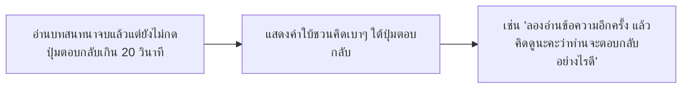

# Detailed Design Document: G6 — จำลองแชทไลน์ (LINE Chat Simulation)

**สถานะ:** 🏗️ Draft (v2.0 — เปลี่ยนกลไกหลักจาก Tap Hotspot เป็นระบบเลือกตอบกลับ)
**หมวดหมู่:** 2. Simulation Games
**ความสำคัญ:** Must Have — Topic 2: Scams
**กลุ่มเป้าหมาย:** ผู้สูงอายุ (อายุ 60 ปีขึ้นไป)
**ผู้ออกแบบ:** ทีมวิชาการ NAPLAB
**เวอร์ชัน:** 2.1 | **อัปเดตล่าสุด:** 2026-08-18

> **หมายเหตุ v2.1 (2026-08-18):** หัวแชทเหลือเฉพาะโปรไฟล์กับชื่อบัญชี — **ไม่ใส่** ปุ่มย้อนกลับ, ปุ่มโทร, วิดีโอคอล, ค้นหา หรือเมนู เพราะผู้สูงอายุอาจเข้าใจผิดว่ากดออกจากเกมหรือโทรออกได้ ปุ่มโทรสายด่วนจริงยังอยู่ที่การ์ดสรุปท้ายบท (`tel:`)

---

## 1. Overview (ภาพรวมของเกม)

เกม **G6 — จำลองแชทไลน์** จำลองหน้าจอแอปพลิเคชัน **LINE** ให้เหมือนของจริงมากที่สุดเท่าที่จะทำได้ (Pixel-level fidelity) เพื่อลดช่องว่างระหว่าง "เกมฝึกหัด" กับ "ประสบการณ์จริงบนมือถือ" — เมื่อผู้สูงอายุเจอแชทหลอกลวงจริงในชีวิตประจำวัน สมองจะจดจำรูปแบบหน้าตาที่เคยฝึกไว้ในเกมได้ทันที (Pattern Recognition Transfer)

ผู้เล่นจะสวมบทบาทเป็น **"เจ้าของบัญชี LINE"** ที่ได้รับข้อความจากมิจฉาชีพในบทสนทนาจำลอง ข้อความจะ**ทยอยขึ้นเองอัตโนมัติทีละฟอง** (จำลองว่ามีการสนทนาใหม่เข้ามาจากคนแปลกหน้า) เมื่ออ่านจบแล้ว ผู้เล่นต้อง**ตัดสินใจตอบกลับ** โดยเลือก 1 ใน 3 ทาง:

1. **ยอมรับ** — ทำตามคำสั่งของมิจฉาชีพ (เช่น ให้ข้อมูล/โอนเงินตามที่ขอ)
2. **ปฏิเสธ** — ตอบกลับไปว่าไม่ยินยอม/ไม่ให้ข้อมูล
3. **นิ่งเฉย** — ไม่ตอบกลับเลย

เลือกแล้วระบบจะเฉลยผลลัพธ์ของการตัดสินใจนั้น พร้อมตีกรอบแดงชี้จุดสังเกต (Red Flag) ทุกจุดในบทสนทนาให้ดูประกอบ

> **หมายเหตุด้านลิขสิทธิ์/จริยธรรม:** หน้าจอที่จำลองเป็น **การเลียนแบบเชิงการศึกษา (Educational Recreation)** ของรูปแบบ UI ที่คุ้นตา ไม่ใช่การใช้ทรัพย์สินทางปัญญา, โลโก้ทางการ หรือซอร์สโค้ดของ LINE Corporation แต่อย่างใด ต้องมีข้อความกำกับเล็กๆ ใต้กรอบจำลองเสมอว่า *"หน้าจอจำลองเพื่อการเรียนรู้ ไม่ใช่แอป LINE จริง"* ตาม[นโยบายความโปร่งใสของโครงการ](./00-concept.md#5-นโยบายการนำเสนอเนื้อหาที่สร้างจาก-ai-⚠️)

> **หมายเหตุด้านเนื้อหา (เปิดสำหรับทีมวิชาการทบทวน):** การจัดลำดับว่า "ปฏิเสธ" กับ "นิ่งเฉย" อย่างไหนปลอดภัยกว่ากันยังเป็นประเด็นที่ถกเถียงได้ในวงการให้ความรู้เรื่องภัยหลอกลวง เอกสารฉบับนี้จึงออกแบบให้ **ทั้งสองทางเลือกนี้ถือว่า "ปลอดภัย" เท่ากัน** (ไม่มีการชี้ว่าทางใดดีกว่า) มีเพียง "ยอมรับ" เท่านั้นที่ถือว่าเสี่ยง หากทีมวิชาการต้องการกำหนดลำดับความปลอดภัยที่ต่างจากนี้ ให้แก้ไขที่ field `isSafe` และข้อความ `feedback` ต่อ response ในหัวข้อ 4

---

## 2. Core Gameplay Loop (วงลูปหลักการเล่น)

```mermaid
flowchart TD
    Start[เริ่มสถานการณ์ที่ N] --> Load[โหลดหน้าจอแชท LINE จำลอง + Intro สั้น (ปิดชั่วคราวด้วย flag SHOW_SCENARIO_INTRO)]
    Load --> AutoPlay[บทสนทนาทยอยขึ้นเองอัตโนมัติทีละฟอง พร้อม Typing Indicator]
    AutoPlay --> Done{อ่านจบครบทุกฟองหรือยัง?}
    Done -- ยัง --> AutoPlay
    Done -- จบแล้ว --> Choose[แสดงปุ่มตอบกลับ 3 แบบ: ยอมรับ / ปฏิเสธ / นิ่งเฉย]
    Choose --> Idle{ไม่เลือกตอบเกิน 20 วิ?}
    Idle -- ใช่ --> Hint[แสดงคำใบ้ชวนคิดเบาๆ]
    Hint --> Choose
    Idle -- ยังไม่ถึงเวลา --> Choose
    Choose --> Pick{ผู้เล่นเลือกปุ่มตอบกลับ}
    Pick --> Reveal[แสดงผลลัพธ์ของทางเลือกที่เลือก + ตีกรอบแดงจุด Red Flag ทุกจุดในบทสนทนา]
    Reveal --> Summary[การ์ดสรุป หยุด คิด ถาม ทำ + เบอร์สายด่วน]
    Summary --> NextCheck{ยังมีสถานการณ์ถัดไปไหม?}
    NextCheck -- มี --> Start
    NextCheck -- ครบ 3 สถานการณ์ --> Complete[จบเกม: มอบดาว + ใบเฉลยรวม]
```

*ไม่มีเงื่อนไขแพ้ (No Fail State):* ไม่ว่าผู้เล่นจะเลือกตอบแบบใด ระบบจะเฉลยและให้กำลังใจเสมอ — แม้เลือก "ยอมรับ" (ทางเลือกที่เสี่ยง) ก็ไม่มีคำว่า "ผิด/แพ้" มีเพียงคำอธิบายผลลัพธ์ที่อาจเกิดขึ้นจริงอย่างนุ่มนวล สอดคล้องกับหลักการออกแบบใน [Core Mechanics](./01-mechanics.md#core-loop)

*การเล่นข้อความอัตโนมัติไม่ใช่การจับเวลากดดัน:* ฟองข้อความจะทยอยปรากฏเองทุกๆ ~0.9 วินาที เพื่อจำลองความรู้สึก "มีคนทักเข้ามาจริง" เท่านั้น ผู้เล่นมีเวลาไม่จำกัดในการอ่านซ้ำและตัดสินใจตอบกลับหลังจากบทสนทนาจบ (ปุ่มตอบกลับจะกดได้ก็ต่อเมื่ออ่านครบทุกฟองแล้วเท่านั้น เพื่อป้องกันการกดข้ามโดยไม่อ่าน)

---

## 3. LINE UI Fidelity Teardown (การจำลองหน้าตาแอป LINE แบบละเอียด)

หัวใจของเกมนี้คือความสมจริง ("คล้ายมากที่สุด") จึงต้องแยกองค์ประกอบหน้าจอ LINE ออกเป็นชิ้นส่วนย่อยและกำหนดสเปกแต่ละชิ้นให้ชัดเจน เพื่อให้ทีม Dev ประกอบ Component ได้ตรงกับของจริงที่ผู้สูงอายุคุ้นเคย

```
+---------------------------------------------------+
| 9:41            🔋100%          📶            | -> (A) Status Bar จำลอง (เพิ่มความสมจริงระดับ "แคปหน้าจอ")
+---------------------------------------------------+
| (👤)  สรรพากร ฝ่ายเร่งรัดหนี้สิน                 | -> (B) Chat Header (แถบหัวแชท)
+---------------------------------------------------+
| ░░░░░░░░░░░░ พื้นหลังลายจุดอ่อนสีเบจ ░░░░░░░░░░░ |
|                                                   |
|   (👤)  ┌─────────────────────────┐              | -> (C) ฟองข้อความ (ทยอยขึ้นเองอัตโนมัติทีละฟอง)
|         │ เรียนท่าน มีหนี้ภาษี      │  10:42       |     พร้อม Typing Indicator (● ● ●) ก่อนฟองถัดไป
|         │ ค้างชำระ 45,000 บาท     │              |
|         └─────────────────────────┘              |
|                                                   |
|         ┌───────────────────────────────┐        | -> (D) การ์ดลิงก์แบบ Open-Graph Preview
|         │ [ 🖼️ ภาพตราครุฑปลอม ]        │        |    (ภาพย่อ + หัวข้อ + โดเมน URL)
|         │ ยืนยันตัวตนด่วนที่นี่          │  10:42  |
|         │ 🔗 rd-govth-payment.xyz       │        |
|         └───────────────────────────────┘        |
|                                                   |
|                    ┌───────────────────┐         | -> (E) ปุ่ม CTA แบบ Flex Message Template
|                    │   กดรับสิทธิ์เลย   │  10:43  |    (ตกแต่งอย่างเดียว ไม่ Interactive)
|                    └───────────────────┘         |
|                                                   |
+---------------------------------------------------+
|  ＋   [ พิมพ์ข้อความ... ]         📷   🎤   ➤    | -> (F) Input Bar (ปิดใช้งาน/ตกแต่งเท่านั้น)
+---------------------------------------------------+
|            [ 👍 ยอมรับ (ทำตามที่ขอ) ]             | -> (G) ปุ่มเลือกตอบกลับ 3 แบบ
|            [ 👎 ปฏิเสธ (ตอบกลับว่าไม่ยอม) ]        |    (นอกกรอบโทรศัพท์ ด้านล่างจอ — ดูเหตุผลข้อ G)
|            [ 🙈 นิ่งเฉย (ไม่ตอบกลับ) ]             |
+---------------------------------------------------+
```

### (A) Status Bar จำลอง
เพิ่มแถบเวลา/แบตเตอรี่/สัญญาณจำลองด้านบนกรอบโทรศัพท์ (คงที่ ไม่ขยับ) เพื่อให้ภาพรวมเหมือน "แคปหน้าจอที่มีคนแชร์เตือนภัยกันจริง" ซึ่งเป็นรูปแบบที่ผู้สูงอายุคุ้นเคยจากการแชร์เตือนภัยใน LINE กลุ่มครอบครัว

### (B) Chat Header (แถบหัวแชท)
| องค์ประกอบ | สเปก |
|---|---|
| พื้นหลังแถบหัว | ขาว `#FFFFFF` + เส้นแบ่งบางสีเทา `#E5E5E5` ด้านล่าง (LINE ธีมสว่างมาตรฐาน) |
| Avatar คู่สนทนา | วงกลม 36px |
| ชื่อบัญชี | ตัวหนา ≥ 20px สีดำ `#1A1A1A` |
| **ป้ายยืนยันตัวตน (Verification Badge)** | จุดสำคัญที่สุดของการสอน: บัญชีทางการจริงของ LINE Official Account จะมีโล่/ติ๊กสีเขียวหรือน้ำเงินต่อท้ายชื่อ **บัญชีในสถานการณ์หลอกลวงทุกสถานการณ์ต้อง "ไม่มีป้ายนี้"** — เป็นหนึ่งใน Red Flag ที่เฉลยหลังผู้เล่นตอบกลับ |
| ปุ่มตกแต่งที่ห้ามใส่ | **ไม่ใส่** ปุ่มย้อนกลับ, ปุ่มโทร, ปุ่มวิดีโอคอล, ปุ่มค้นหา หรือเมนู `≡` — ผู้สูงอายุอาจเข้าใจผิดว่ากดออกจากเกมหรือโทรออกได้ หัวแชทเหลือเฉพาะโปรไฟล์กับชื่อบัญชี |

### (C) ฟองข้อความ (Chat Bubble Anatomy)
| ประเภท | สี/สไตล์ |
|---|---|
| ฟองฝั่งซ้าย (จากคนอื่น) | พื้นขาว `#FFFFFF` ขอบมน 18px มีหางชี้ซ้ายบน, เงาบางๆ `--shadow-sm` |
| Timestamp | ตัวเล็ก 13px สีเทา `#9AA0A6` ติดขอบฟองด้านนอก |
| ระยะห่างฟอง | 12–16px ระหว่างฟอง |
| **Typing Indicator** | ฟองจุดกลม 3 จุด (● ● ●) เรียงเต้นสลับจังหวะ แสดงระหว่างรอฟองถัดไปปรากฏ (~0.9 วินาที/ฟอง) เพื่อจำลองความรู้สึก "กำลังมีคนพิมพ์" |

### (D) การ์ดลิงก์แบบ Open-Graph Preview
จำลองการ์ดพรีวิวลิงก์ที่ LINE ดึงข้อมูลอัตโนมัติเมื่อมีคนวางลิงก์ในแชท (รูปย่อ + หัวข้อ + **แถบโดเมน URL สีเทาด้านล่างสุดของการ์ด**) — จุดนี้คือ **Red Flag หลักของเกม** เพราะเป็นทักษะสำคัญที่สุด: การอ่านโดเมนจริงก่อนกดลิงก์ (เช่น `.xyz`, `-th.cc`, สะกดเลียนแบบ `rd.go.th` เป็น `rd-govth-payment.xyz`)

### (E) ปุ่ม CTA แบบ Flex Message Template
มิจฉาชีพยุคใหม่มักส่งข้อความในรูปแบบ "การ์ดปุ่มสำเร็จรูป" (LINE Flex Message) แทนข้อความเปล่า เช่น ปุ่มสีเขียว/แดงสดเต็มความกว้างเขียนว่า "กดรับสิทธิ์เลย" — ออกแบบปุ่มนี้ให้สะดุดตาเกินจริงเล็กน้อย (ขนาดใหญ่, สีสด, เงาเน้น) เพื่อฝึกสังเกตความ "เร่งเร้าเกินความจำเป็น" ของ UI หลอกลวง ปุ่มนี้เป็นการตกแต่งเนื้อหาบทสนทนาเท่านั้น (`pointer-events: none`) — ไม่ใช่จุดที่ผู้เล่นกด การตัดสินใจจริงเกิดที่ปุ่มตอบกลับ (G) ด้านล่างจอ

### (F) Input Bar (แถบพิมพ์ข้อความ)
แสดงเพื่อความสมจริงเท่านั้น (ไม่ Interactive, `pointer-events: none`, สี placeholder จาง `#9AA0A6`) ป้องกันผู้เล่นสับสนพยายามพิมพ์ตอบโต้เอง — การตอบกลับจริงเลือกผ่านปุ่ม (G) แทน

### (G) ปุ่มเลือกตอบกลับ (Response Buttons) — **องค์ประกอบใหม่หลักของ v2.0**
ปุ่มใหญ่ 3 ปุ่มวางซ้อนกันแนวตั้ง**นอกกรอบโทรศัพท์จำลอง ด้านล่างจอ** (ไม่ใช่แถบเล็กๆ ในกรอบแชทแบบภาพอ้างอิงต้นแบบ) เหตุผลที่ไม่ทำตามภาพอ้างอิงแบบ pixel-for-pixel: ปุ่มไอคอนแถวเล็กในภาพอ้างอิง (Reply/FWD/ปุ่มไอคอน) มีขนาดเล็กกว่าเกณฑ์แตะขั้นต่ำ 48×48px ตามข้อกำหนด [Art Direction](./03-art-direction.md#accessibility-สำหรับผู้สูงวัย-ข้อบังคับ-ไม่ใช่ทางเลือก) ซึ่งเป็น**ข้อบังคับของโครงการ ไม่ใช่ทางเลือก** จึงขยายเป็นปุ่มเต็มความกว้าง (min-height 64px) แทน เพื่อให้ผู้สูงอายุกดได้ง่ายและแม่นยำ

แต่ละปุ่มมีไอคอนกำกับควบคู่กับข้อความเสมอ (ไม่ใช้สีสื่อความหมายเดี่ยว):
| ปุ่ม | ไอคอน | สถานะก่อนอ่านจบ |
|---|---|---|
| ยอมรับ (ทำตามที่ขอ) | 👍 | ปุ่มปิดใช้งาน (จาง) จนกว่าอ่านบทสนทนาครบทุกฟอง |
| ปฏิเสธ (ตอบกลับว่าไม่ยอม) | 👎 | เช่นเดียวกัน |
| นิ่งเฉย (ไม่ตอบกลับ) | 🙈 | เช่นเดียวกัน |

---

## 4. Scenario / Response Content Design (ชุดสถานการณ์หลอกลวงและทางเลือกตอบกลับ)

ตาม [US-GAME-06 AC2](../agile/user-stories/US-GAME-06.md) ต้องมีสถานการณ์หลอกลวงอย่างน้อย 3 รูปแบบ:

| ID | สถานการณ์ | ชื่อบัญชีปลอม | คำสั่ง/ข้อเรียกร้องของมิจฉาชีพ | Red Flag ทั้งหมด (รวม Chat Header) |
|---|---|---|---|---|
| g6-s1 | เจ้าหน้าที่สรรพากรทวงภาษีค้างจ่าย | "สรรพากร ฝ่ายเร่งรัดหนี้สิน" (ไม่มีป้ายยืนยัน) | ขอเลขบัตรประชาชน + รหัส OTP | 5 |
| g6-s2 | เสนอสิทธิ์ลุ้นโบนัสปีใหม่จากธนาคาร | "ธนาคารออมสุข Contact Center" (ไม่มีป้ายยืนยัน) | ขอเลขบัญชี + CVV + รหัส OTP | 5 |
| g6-s3 | ชักชวนลงทุนกองทุนเกษียณผลตอบแทนสูง | "โค้ชการเงิน อ.มานะ" (ไม่มีป้ายยืนยัน) | ขอโอนเงินลงทุนขั้นต่ำ 5,000 บาท | 5 |

### รายละเอียดสถานการณ์ที่ 1: g6-s1 (ตัวอย่างเต็มรูปแบบ)

**บทสนทนา (เนื้อหา Red Flag เดิม ไม่เปลี่ยนจาก v1.0 — ยังใช้เพื่อเฉลยหลังตอบกลับ):**

| Bubble ID | ประเภท | เนื้อหา | คำอธิบายเมื่อเฉลย |
|---|---|---|---|
| s1-header | Chat Header | ชื่อ "สรรพากร ฝ่ายเร่งรัดหนี้สิน" ไม่มีป้ายยืนยันตัวตน | 🚩 บัญชีทางการของกรมสรรพากรต้องมีป้าย Official Account สีเขียว/น้ำเงินกำกับเสมอ บัญชีนี้เป็นบัญชีบุคคลธรรมดา ไม่ใช่หน่วยงานจริง |
| s1-b1 | ข้อความ | "เรียนท่าน ตรวจพบหนี้ภาษีค้างชำระ 45,000 บาท กรุณาดำเนินการภายใน 2 ชั่วโมง มิเช่นนั้นจะถูกอายัดบัญชี" | 🚩 ข่มขู่+เร่งรัดเวลาสั้นผิดปกติ หน่วยงานรัฐไม่มีอำนาจอายัดบัญชีผ่านข้อความแชทและไม่เร่งรัดภายในไม่กี่ชั่วโมง |
| s1-b2 (Link Card) | Open-Graph Card | รูปตราครุฑปลอม + "ยืนยันตัวตนด่วนที่นี่" + โดเมน `rd-govth-payment.xyz` | 🚩 โดเมนจริงของกรมสรรพากรต้องลงท้าย `.go.th` เท่านั้น โดเมนนี้สะกดเลียนแบบและลงท้าย `.xyz` ซึ่งเป็นของปลอม |
| s1-b3 (CTA Button) | ปุ่ม | "กดยืนยันตัวตนเพื่อระงับการอายัด" | 🚩 ปุ่มเร่งเร้าให้กดทันทีโดยไม่ให้เวลาตรวจสอบ/ปรึกษาญาติ เป็นเทคนิคกดดันทางจิตวิทยาแบบมิจฉาชีพ |
| s1-b4 | ข้อความ | "กรุณาแจ้งเลขบัตรประชาชนและรหัส OTP ที่ได้รับทาง SMS เพื่อยืนยันตัวตนกับระบบ" | 🚩 หน่วยงานราชการไม่มีนโยบายขอรหัส OTP หรือเลขบัตรประชาชนผ่านแชทเด็ดขาด รหัส OTP คือกุญแจสำคัญที่ห้ามให้ใครทั้งสิ้น |

**ทางเลือกตอบกลับ (Response Options) — เนื้อหาใหม่ของ v2.0:**

| ทางเลือก | isSafe | ข้อความเฉลยที่แสดง |
|---|---|---|
| 👍 ยอมรับ (ทำตามที่ขอ) | ❌ เสี่ยง | "อันตรายค่ะ! หากให้เลขบัตรประชาชนและรหัส OTP ไป มิจฉาชีพจะสามารถนำไปสวมรอยทำธุรกรรมหรือถอนเงินจากบัญชีของท่านได้ทันที กรมสรรพากรจริงไม่มีวันขอข้อมูลนี้ผ่านแชท" |
| 👎 ปฏิเสธ (ตอบกลับว่าไม่ยอม) | ✅ ปลอดภัย | "ดีค่ะ! การปฏิเสธไม่ให้ข้อมูลช่วยตัดวงจรหลอกลวงได้ทันที กรมสรรพากรจริงติดต่อเรื่องภาษีด้วยหนังสือราชการทางไปรษณีย์เท่านั้น ไม่ใช่ผ่านแชท" |
| 🙈 นิ่งเฉย (ไม่ตอบกลับ) | ✅ ปลอดภัย | "ดีค่ะ! การไม่ตอบกลับก็ปลอดภัยเช่นกัน เพราะไม่มีข้อมูลใดหลุดไปถึงมิจฉาชีพ อย่าลืมบล็อกบัญชีนี้และแจ้งเบาะแสกับตำรวจไซเบอร์ด้วยนะคะ" |

**สรุปสถานการณ์ (แสดงทุกทางเลือกหลังตอบกลับ):** กรมสรรพากรติดต่อประชาชนเรื่องภาษีด้วยหนังสือราชการทางไปรษณีย์เท่านั้น ไม่มีนโยบายทวงเงิน อายัดบัญชี หรือขอ OTP ผ่าน LINE โดยเด็ดขาด

*(สถานการณ์ g6-s2 และ g6-s3 ออกแบบด้วยโครงสร้างข้อมูลเดียวกัน โดยสลับเนื้อหาไปตามธีมโบนัสปีใหม่/การลงทุนเกษียณ — ดูข้อความเต็มของทั้ง 3 สถานการณ์ในโค้ด `SCENARIOS` ที่ [G6LineSimulation.jsx](../../src/components/G6LineSimulation.jsx) ทีมเนื้อหาสามารถเพิ่มสถานการณ์ที่ 4+ ได้ในอนาคตโดยไม่ต้องแก้โค้ด เพียงเพิ่ม object ใหม่)*

---

## 5. Controls & Response Mechanics (การควบคุมและกลไกการตอบกลับ)

* **ไม่มีการแตะเลือกจุดในบทสนทนาอีกต่อไป** (ตัดออกจาก v1.0) — บทสนทนาเป็นแบบอ่านอย่างเดียวระหว่างเล่น
* **ปุ่มตอบกลับ 3 ปุ่ม** (G) จะ**กดไม่ได้ (disabled)** จนกว่าฟองข้อความสุดท้ายของสถานการณ์จะปรากฏครบ เพื่อบังคับให้อ่านบทสนทนาให้จบก่อนตัดสินใจ
* เลือกตอบกลับได้เพียง 1 ครั้งต่อสถานการณ์ (กดแล้วล็อกทันที เข้าสู่หน้าเฉลย)
* **Accessibility Target Area:** ปุ่มตอบกลับทั้ง 3 ปุ่มมีความสูงขั้นต่ำ 64px (เกินเกณฑ์ 48×48px ตาม [Art Direction](./03-art-direction.md#accessibility-สำหรับผู้สูงวัย-ข้อบังคับ-ไม่ใช่ทางเลือก) อยู่แล้ว)
* **แตะจุด Red Flag เพื่อดูคำอธิบายยังใช้ได้ แต่เฉพาะหลังตอบกลับแล้ว** (ในหน้าเฉลย) เพื่อให้ผู้เล่นศึกษารายละเอียดเชิงลึกต่อได้ ไม่ใช่กลไกตัดสินผลของเกม

---

## 6. Hint System (ระบบบอกใบ้เมื่อผู้เล่นค้นหานาน)

ตาม [US-GAME-06 AC5](../agile/user-stories/US-GAME-06.md) ต้องมีระบบบอกใบ้ช่วยลดความอึดอัด โดยออกแบบให้ **ไม่ใช่การจับเวลาบังคับ** (ขัดกับหลัก Accessibility ที่ห้ามมีการจับเวลากดดัน) แต่เป็นกลไกเสริมกำลังใจ:



* **โทนของคำใบ้:** เป็นคำถามชวนคิดเบาๆ ไม่ใช่คำสั่งบังคับ ไม่ชี้นำคำตอบที่ "ถูก"
* **ไม่หักคะแนน:** การเห็นคำใบ้ไม่มีผลลบต่อดาวที่ได้รับ สอดคล้องกับหลักไม่มีระบบลงโทษของโครงการ
* **Logging:** บันทึก event `hint_shown` ทุกครั้งที่ระบบแสดงใบ้ เพื่อใช้วิเคราะห์ว่าสถานการณ์ใดทำให้ผู้เล่นลังเลตัดสินใจนาน

---

## 7. Reveal & Feedback System (ระบบเฉลย)

เมื่อผู้เล่นกดปุ่มตอบกลับ (ยอมรับ/ปฏิเสธ/นิ่งเฉย):
1. **การ์ดผลลัพธ์การตอบกลับ** ปรากฏทันที: ไอคอน ✅ (ปลอดภัย, กรอบสีเขียว) หรือ ⚠️ (เสี่ยง, กรอบสีแดง) พร้อมข้อความอธิบายผลลัพธ์ที่อาจเกิดขึ้นจริงจากทางเลือกนั้น (ดูเนื้อหาในหัวข้อ 4) — ใช้ทั้งไอคอนและสีคู่กันเสมอ ไม่ใช้สีสื่อความหมายเดี่ยว
2. ทุก Hotspot ที่เป็น Red Flag จริงในบทสนทนา (Chat Header + ฟองข้อความ) จะถูกตีกรอบสีแดง `var(--accent-error)` หนา 3px พร้อมป้ายเลขกำกับลำดับ (①②③...)
3. แตะที่กรอบแดงแต่ละจุดเพื่อขยายคำอธิบายแบบละเอียด (Accordion แบบเดียวกับ G2 — อ่านง่ายสำหรับผู้สูงอายุ ไม่ต้องเลื่อนจอเยอะ)
4. การ์ดสรุปท้ายบท: แสดงหลักคิด **"หยุด คิด ถาม ทำ"** + ปุ่ม "โทรแจ้งตำรวจไซเบอร์ 1441" (ปุ่มโทรออกจริงบนมือถือ `tel:1441`)
5. ปุ่มไปสถานการณ์ถัดไป / ไปบทถัดไป

---

## 8. Reward & Psychological Reinforcement (ระบบให้รางวัลบวก)

* **ดาว 1–3 ดวง ต่อรอบเกม (คิดจากภาพรวมทั้ง 3 สถานการณ์):** คำนวณจากสัดส่วนทางเลือกที่ "ปลอดภัย" (ปฏิเสธ หรือ นิ่งเฉย) เทียบกับทั้ง 3 สถานการณ์ — ครบ 3/3 = 3 ดาว, 2/3 = 2 ดาว, ต่ำกว่านั้น = 1 ดาว (min 1 ดาวเสมอ แม้เลือก "ยอมรับ" ทุกครั้ง เพื่อไม่ให้รู้สึกล้มเหลว)
* **ไม่มีคำว่า "ผิด/แพ้":** แม้เลือก "ยอมรับ" (ทางเสี่ยง) ก็ไม่มีกรอบตำหนิหรือคำพูดลงโทษ มีเพียงคำอธิบายผลลัพธ์ที่อาจเกิดขึ้นจริงอย่างนุ่มนวล
* **ข้อความปิดท้าย:** *"เก่งมากค่ะ! ตอนนี้ท่านสังเกตแชทหลอกลวงแบบนี้ได้แม่นยำขึ้นแล้ว หากเจอแชทแบบนี้จริง ให้หยุดคิดถามทำก่อนตอบกลับทุกครั้งนะคะ"*

---

## 9. Technical Implementation Details (สเปกทางเทคนิค)

### เทคโนโลยีที่เลือกใช้
ใช้ **React + CSS (HTML DOM)** ล้วน ไม่ใช้ Phaser 3 เนื่องจากเกมนี้เป็นการจำลอง UI แบบ static ไม่มีฟิสิกส์ สอดคล้องกับแนวทางที่ใช้ใน [G2ScamSpotter.jsx](../../src/components/G2ScamSpotter.jsx) — เพื่อความง่ายในการปรับ CSS ให้ตรงกับของจริงและใช้ทรัพยากรเครื่องน้อย เหมาะกับมือถือรุ่นเก่า

### React Component Container
```javascript
// src/components/G6LineSimulation.jsx
export default function G6LineSimulation({ onFinish, logEvent }) { ... }
// logEvent action types: 'hint_shown', 'toggle_audio', 'select_response',
//                        'enter_scenario', 'click_hotline', 'game_complete'
```

### Data Structure (ชุดข้อมูลสถานการณ์)
```javascript
const SCENARIOS = [
  {
    id: 'g6-s1',
    accountName: 'สรรพากร ฝ่ายเร่งรัดหนี้สิน',
    avatarEmoji: '🏛️',
    isVerifiedBadge: false, // ต้องเป็น false เสมอในสถานการณ์หลอกลวง
    bubbles: [
      { id: 's1-header', type: 'header', isRedFlag: true, desc: '...' },
      { id: 's1-b1', type: 'text', isRedFlag: true, text: '...', desc: '...' },
      { id: 's1-b2', type: 'link-card', isRedFlag: true, domain: '...', desc: '...' },
      { id: 's1-b3', type: 'cta-button', isRedFlag: true, buttonText: '...', desc: '...' },
      { id: 's1-b4', type: 'text', isRedFlag: true, text: '...', desc: '...' },
    ],
    responses: {
      accept: { label: 'ยอมรับ (ทำตามที่ขอ)', feedback: '...', isSafe: false },
      refuse: { label: 'ปฏิเสธ (ตอบกลับว่าไม่ยอม)', feedback: '...', isSafe: true },
      ignore: { label: 'นิ่งเฉย (ไม่ตอบกลับ)', feedback: '...', isSafe: true },
    },
    hotlineNumber: '1441',
    summary: '...'
  },
  // g6-s2, g6-s3 ...
];
```

### Auto-play Reveal
บทสนทนาแต่ละฟองปรากฏทีละอันผ่าน `revealedCount` (React state) ที่เพิ่มค่าเองทุก ~900ms ด้วย `useEffect` + `setTimeout` (ไม่ใช้ `setInterval` เพื่อให้ cleanup ง่ายและไม่มี race condition เมื่อเปลี่ยนสถานการณ์) ปุ่มตอบกลับ (G) จะ `disabled` จนกว่า `revealedCount` เท่ากับจำนวนฟองทั้งหมด

### Bubble Renderer
คอมโพเนนต์ย่อย `<ChatBubble type="..." />` แยกเรนเดอร์ตาม `type` (`text`, `link-card`, `cta-button`, `sticker`, `image`, `header`) เพื่อให้ทีมเนื้อหาเพิ่มสถานการณ์ใหม่ได้ง่ายโดยแค่เพิ่มข้อมูล ไม่ต้องแก้ Layout Component

### State Control
เชื่อมกับ `GameShell.jsx` (หรือ `src/app/lessons/[id]/game/page.tsx` บน Next.js) ผ่าน props `onFinish(stars)` และ `logEvent(actionType, details)` แบบเดียวกับเกมอื่นทั้งหมดในชุด

---

## Related Documents
- Mechanics: [Core Mechanics](./01-mechanics.md#g6--จำลองแชท-line-line-chat-simulation-must--topic-2-scams)
- Concept: [Concept & Architecture](./00-concept.md)
- Art Direction: [Art Direction & Accessibility](./03-art-direction.md)
- User Story: [US-GAME-06](../agile/user-stories/US-GAME-06.md)
- Reference Component: [G2ScamSpotter.jsx](../../src/components/G2ScamSpotter.jsx)
