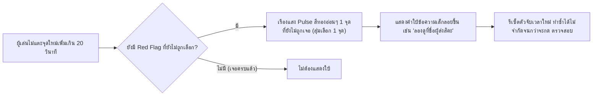

# Detailed Design Document: G6 — จำลองแชท LINE (LINE Chat Simulation)

**สถานะ:** 🏗️ Draft  
**หมวดหมู่:** 2. Simulation Games  
**ความสำคัญ:** Must Have — Topic 2: Scams  
**กลุ่มเป้าหมาย:** ผู้สูงอายุ (อายุ 60 ปีขึ้นไป)  
**ผู้ออกแบบ:** ทีมวิชาการ NAPLAB  
**เวอร์ชัน:** 1.0 | **อัปเดตล่าสุด:** 2026-07-05

---

## 1. Overview (ภาพรวมของเกม)

เกม **G6 — จำลองแชท LINE** จำลองหน้าจอแอปพลิเคชัน **LINE** ให้เหมือนของจริงมากที่สุดเท่าที่จะทำได้ (Pixel-level fidelity) เพื่อลดช่องว่างระหว่าง "เกมฝึกหัด" กับ "ประสบการณ์จริงบนมือถือ" — เมื่อผู้สูงอายุเจอแชทหลอกลวงจริงในชีวิตประจำวัน สมองจะจดจำรูปแบบหน้าตาที่เคยฝึกไว้ในเกมได้ทันที (Pattern Recognition Transfer)

ผู้เล่นจะสวมบทบาทเป็น **"เจ้าของบัญชี LINE"** ที่ได้รับข้อความจากมิจฉาชีพในบทสนทนาจำลอง หน้าที่คือ **แตะ (Tap)** บนข้อความ/องค์ประกอบใดก็ตามในแชทที่รู้สึกว่า "ผิดปกติ" (Red Flag Hotspot) แล้วกดปุ่ม "ตรวจสอบ" เพื่อดูเฉลยว่าจุดใดคือกลลวงจริง พร้อมคำอธิบายและเบอร์สายด่วนแจ้งเหตุ

> **หมายเหตุด้านลิขสิทธิ์/จริยธรรม:** หน้าจอที่จำลองเป็น **การเลียนแบบเชิงการศึกษา (Educational Recreation)** ของรูปแบบ UI ที่คุ้นตา ไม่ใช่การใช้ทรัพย์สินทางปัญญา, โลโก้ทางการ หรือซอร์สโค้ดของ LINE Corporation แต่อย่างใด ต้องมีข้อความกำกับเล็กๆ ใต้กรอบจำลองเสมอว่า *"หน้าจอจำลองเพื่อการเรียนรู้ ไม่ใช่แอป LINE จริง"* ตาม[นโยบายความโปร่งใสของโครงการ](./00-concept.md#5-นโยบายการนำเสนอเนื้อหาที่สร้างจาก-ai-⚠️)

---

## 2. Core Gameplay Loop (วงลูปหลักการเล่น)

```mermaid
flowchart TD
    Start[เริ่มสถานการณ์ที่ N] --> Load[โหลดหน้าจอแชท LINE จำลอง + Intro สั้น]
    Load --> Read[ผู้เล่นอ่านบทสนทนาที่เลื่อนขึ้นมาทีละฟอง]
    Read --> Tap{ผู้เล่นแตะจุดที่สงสัย}
    Tap -- แตะถูกจุด/ผิดจุด --> Toggle[ไฮไลท์ฟ้าอ่อนที่จุดถูกเลือก (Toggle ได้)]
    Toggle --> Idle{ไม่มีการแตะเพิ่มเกิน 20 วิ?}
    Idle -- ใช่ --> Hint[ระบบเรืองแสงชี้จุดใบ้เบาๆ 1 จุด]
    Hint --> Tap
    Idle -- ยังไม่ถึงเวลา --> Tap
    Tap --> Verify{ผู้เล่นกดปุ่ม 'ตรวจสอบ'}
    Verify --> Reveal[แสดงกรอบแดง + คำอธิบายทุกจุด Red Flag]
    Reveal --> Summary[การ์ดสรุป หยุด คิด ถาม ทำ + เบอร์สายด่วน 1441]
    Summary --> NextCheck{ยังมีสถานการณ์ถัดไปไหม?}
    NextCheck -- มี --> Start
    NextCheck -- ครบ 3 สถานการณ์ --> Complete[จบเกม: มอบดาว + ใบเฉลยรวม]
```

*ไม่มีเงื่อนไขแพ้ (No Fail State):* ผู้เล่นกดตรวจสอบได้แม้เลือกจุดไม่ครบ หรือเลือกผิด ระบบจะเฉลยและให้กำลังใจเสมอ สอดคล้องกับหลักการออกแบบใน [Core Mechanics](./01-mechanics.md#core-loop)

---

## 3. LINE UI Fidelity Teardown (การจำลองหน้าตาแอป LINE แบบละเอียด)

หัวใจของเกมนี้คือความสมจริง ("คล้ายมากที่สุด") จึงต้องแยกองค์ประกอบหน้าจอ LINE ออกเป็นชิ้นส่วนย่อยและกำหนดสเปกแต่ละชิ้นให้ชัดเจน เพื่อให้ทีม Dev ประกอบ Component ได้ตรงกับของจริงที่ผู้สูงอายุคุ้นเคย

```
+---------------------------------------------------+
| 9:41            🔋100%          📶            | -> (A) Status Bar จำลอง (เพิ่มความสมจริงระดับ "แคปหน้าจอ")
+---------------------------------------------------+
| ←   (👤)  สรรพากร ฝ่ายเร่งรัดหนี้สิน     ☎  ≡  | -> (B) Chat Header (แถบหัวแชท)
+---------------------------------------------------+
| ░░░░░░░░░░░░ พื้นหลังลายจุดอ่อนสีเบจ ░░░░░░░░░░░ |
|                                                   |
|   (👤)  ┌─────────────────────────┐              | -> (C) ฟองข้อความฝั่งซ้าย (จากคู่สนทนา)
|         │ เรียนท่าน มีหนี้ภาษี      │  10:42       |     สีขาว, มุมมน, มีหาง, avatar ซ้ำเฉพาะฟองแรก
|         │ ค้างชำระ 45,000 บาท     │              |
|         └─────────────────────────┘              |
|                                                   |
|         ┌───────────────────────────────┐        | -> (D) การ์ดลิงก์แบบ Open-Graph Preview
|         │ [ 🖼️ ภาพตราครุฑปลอม ]        │        |    (ภาพย่อ + หัวข้อ + โดเมน URL)
|         │ ยืนยันตัวตนด่วนที่นี่          │  10:42  |
|         │ 🔗 rd-govth-payment.xyz       │        |
|         └───────────────────────────────┘        |
|                                                   |
|                    ┌───────────────────┐         | -> (E) ปุ่ม CTA แบบ Flex Message Template
|                    │   กดรับสิทธิ์เลย   │  10:43  |    (ปุ่มเต็มความกว้าง สีสด ทรงมนแบบ Rich Menu)
|                    └───────────────────┘         |
|                                                   |
+---------------------------------------------------+
|  ＋   [ พิมพ์ข้อความ... ]         📷   🎤   ➤    | -> (F) Input Bar (ปิดใช้งาน/ตกแต่งเท่านั้น)
+---------------------------------------------------+
```

### (A) Status Bar จำลอง
เพิ่มแถบเวลา/แบตเตอรี่/สัญญาณจำลองด้านบนกรอบโทรศัพท์ (คงที่ ไม่ขยับ) เพื่อให้ภาพรวมเหมือน "แคปหน้าจอที่มีคนแชร์เตือนภัยกันจริง" ซึ่งเป็นรูปแบบที่ผู้สูงอายุคุ้นเคยจากการแชร์เตือนภัยใน LINE กลุ่มครอบครัว

### (B) Chat Header (แถบหัวแชท)
| องค์ประกอบ | สเปก |
|---|---|
| พื้นหลังแถบหัว | ขาว `#FFFFFF` + เส้นแบ่งบางสีเทา `#E5E5E5` ด้านล่าง (LINE ธีมสว่างมาตรฐาน) |
| ปุ่มย้อนกลับ | ไอคอน `←` สีเทาเข้ม ซ้ายสุด (ตกแต่งอย่างเดียว ไม่ต้องกดได้) |
| Avatar คู่สนทนา | วงกลม 36px |
| ชื่อบัญชี | ตัวหนา 18–20px สีดำ `#1A1A1A` |
| **ป้ายยืนยันตัวตน (Verification Badge)** | จุดสำคัญที่สุดของการสอน: บัญชีทางการจริงของ LINE Official Account จะมีโล่/ติ๊กสีเขียวหรือน้ำเงินต่อท้ายชื่อ **บัญชีในสถานการณ์หลอกลวงทุกสถานการณ์ต้อง "ไม่มีป้ายนี้"** เพื่อให้ผู้เล่นฝึกสังเกตความไม่ครบถ้วนนี้ |
| ไอคอนขวา | โทรศัพท์ `☎` และเมนู `≡` สีเทา (ตกแต่ง) |

### (C) ฟองข้อความ (Chat Bubble Anatomy)
| ประเภท | สี/สไตล์ |
|---|---|
| ฟองฝั่งซ้าย (จากคนอื่น) | พื้นขาว `#FFFFFF` ขอบมน 18px มีหางชี้ซ้ายบน, เงาบางๆ `--shadow-sm` |
| ฟองฝั่งขวา (ถ้ามีข้อความผู้เล่นเป็นฉากหลังบทสนทนา) | พื้นเขียว LINE `#06C755` ตัวหนังสือขาว |
| Timestamp | ตัวเล็ก 13px สีเทา `#9AA0A6` ติดขอบฟองด้านนอก |
| สถานะอ่านแล้ว | คำว่า "อ่านแล้ว" ตัวจิ๋วสีเทาใต้ฟองฝั่งขวา (เสริมความสมจริง ไม่ใช่จุดให้แตะ) |
| ระยะห่างฟอง | 12–16px ระหว่างฟอง, จัดกลุ่มฟองติดกันหากผู้ส่งเดิมพูดต่อเนื่อง (ไม่ซ้ำ Avatar) |

### (D) การ์ดลิงก์แบบ Open-Graph Preview
จำลองการ์ดพรีวิวลิงก์ที่ LINE ดึงข้อมูลอัตโนมัติเมื่อมีคนวางลิงก์ในแชท (รูปย่อ + หัวข้อ + **แถบโดเมน URL สีเทาด้านล่างสุดของการ์ด**) — จุดนี้คือ **Hotspot หลักของเกม** เพราะเป็นทักษะสำคัญที่สุด: การอ่านโดเมนจริงก่อนกดลิงก์ (เช่น `.xyz`, `-th.cc`, สะกดเลียนแบบ `rd.go.th` เป็น `rd-govth-payment.xyz`)

### (E) ปุ่ม CTA แบบ Flex Message Template
มิจฉาชีพยุคใหม่มักส่งข้อความในรูปแบบ "การ์ดปุ่มสำเร็จรูป" (LINE Flex Message) แทนข้อความเปล่า เช่น ปุ่มสีเขียว/แดงสดเต็มความกว้างเขียนว่า "กดรับสิทธิ์เลย" — ออกแบบปุ่มนี้ให้สะดุดตาเกินจริงเล็กน้อย (ขนาดใหญ่, สีสด, เงาเน้น) เพื่อฝึกสังเกตความ "เร่งเร้าเกินความจำเป็น" ของ UI หลอกลวง

### (F) Input Bar (แถบพิมพ์ข้อความ)
แสดงเพื่อความสมจริงเท่านั้น (ไม่ Interactive, `pointer-events: none`, สี placeholder จาง `#9AA0A6`) ป้องกันผู้เล่นสับสนพยายามพิมพ์ตอบโต้ ซึ่งอยู่นอกขอบเขตของเกม

---

## 4. Scenario / Hazard Content Design (ชุดสถานการณ์หลอกลวง)

ตาม [US-GAME-06 AC2](../agile/user-stories/US-GAME-06.md) ต้องมีสถานการณ์หลอกลวงอย่างน้อย 3 รูปแบบ:

| ID | สถานการณ์ | ชื่อบัญชีปลอม | ประเภทฟองข้อความที่ใช้ | Red Flag Hotspots (จำนวน รวม Chat Header) |
|---|---|---|---|---|
| g6-s1 | เจ้าหน้าที่สรรพากรทวงภาษีค้างจ่าย | "สรรพากร ฝ่ายเร่งรัดหนี้สิน" (บัญชีบุคคลทั่วไป ไม่มีป้ายยืนยัน) | Header + ข้อความ + การ์ดลิงก์ Open-Graph + ปุ่ม CTA + ข้อความ | 5 |
| g6-s2 | เสนอสิทธิ์ลุ้นโบนัสปีใหม่จากธนาคาร | "ธนาคารออมสุข Contact Center" (ใช้โลโก้ธนาคารปลอมเป็น Avatar) | Header + ข้อความ + สติกเกอร์แสดงความยินดี + ปุ่ม CTA + ข้อความ | 5 |
| g6-s3 | ชักชวนลงทุนกองทุนเกษียณผลตอบแทนสูง | "โค้ชการเงิน อ.มานะ (ที่ปรึกษาวัยเกษียณ)" | Header + ข้อความ + ภาพกราฟผลตอบแทนปลอม + ข้อความ + ลิงก์กลุ่มลับ | 5 |

### รายละเอียดสถานการณ์ที่ 1: g6-s1 (ตัวอย่างเต็มรูปแบบ)

| Bubble ID | ประเภท | เนื้อหา | เป็น Red Flag? | คำอธิบายเมื่อเฉลย |
|---|---|---|---|---|
| s1-header | Chat Header | ชื่อ "สรรพากร ฝ่ายเร่งรัดหนี้สิน" ไม่มีป้ายยืนยันตัวตน | ✅ | 🚩 บัญชีทางการของกรมสรรพากรต้องมีป้าย Official Account สีเขียว/น้ำเงินกำกับเสมอ บัญชีนี้เป็นบัญชีบุคคลธรรมดา ไม่ใช่หน่วยงานจริง |
| s1-b1 | ข้อความ | "เรียนท่าน ตรวจพบหนี้ภาษีค้างชำระ 45,000 บาท กรุณาดำเนินการภายใน 2 ชั่วโมง มิเช่นนั้นจะถูกอายัดบัญชี" | ✅ | 🚩 ข่มขู่+เร่งรัดเวลาสั้นผิดปกติ หน่วยงานรัฐไม่มีอำนาจอายัดบัญชีผ่านข้อความแชทและไม่เร่งรัดภายในไม่กี่ชั่วโมง |
| s1-b2 (Link Card) | Open-Graph Card | รูปตราครุฑปลอม + "ยืนยันตัวตนด่วนที่นี่" + โดเมน `rd-govth-payment.xyz` | ✅ | 🚩 โดเมนจริงของกรมสรรพากรต้องลงท้าย `.go.th` เท่านั้น โดเมนนี้สะกดเลียนแบบและลงท้าย `.xyz` ซึ่งเป็นของปลอม |
| s1-b3 (CTA Button) | ปุ่ม | "กดยืนยันตัวตนเพื่อระงับการอายัด" | ✅ | 🚩 ปุ่มเร่งเร้าให้กดทันทีโดยไม่ให้เวลาตรวจสอบ/ปรึกษาญาติ เป็นเทคนิคกดดันทางจิตวิทยาแบบมิจฉาชีพ |
| s1-b4 | ข้อความ | "กรุณาแจ้งเลขบัตรประชาชนและรหัส OTP ที่ได้รับทาง SMS เพื่อยืนยันตัวตนกับระบบ" | ✅ | 🚩 หน่วยงานราชการไม่มีนโยบายขอรหัส OTP หรือเลขบัตรประชาชนผ่านแชทเด็ดขาด รหัส OTP คือกุญแจสำคัญที่ห้ามให้ใครทั้งสิ้น |

**สรุปสถานการณ์:** กรมสรรพากรติดต่อประชาชนเรื่องภาษีด้วยหนังสือราชการทางไปรษณีย์เท่านั้น ไม่มีนโยบายทวงเงิน อายัดบัญชี หรือขอ OTP ผ่าน LINE โดยเด็ดขาด

*(สถานการณ์ g6-s2 และ g6-s3 ออกแบบด้วยโครงสร้างข้อมูลเดียวกัน โดยสลับเนื้อหาไปตามธีมโบนัสปีใหม่/การลงทุนเกษียณ ทีมเนื้อหาสามารถเพิ่มสถานการณ์ที่ 4+ ได้ในอนาคตโดยไม่ต้องแก้โค้ด เพียงเพิ่ม object ใหม่ในชุดข้อมูล `SCENARIOS`)*

---

## 5. Controls & Hotspot Mechanics (การควบคุมและกลไกจุดสังเกต)

* **Single Selection Gesture:** ผู้เล่นแตะ (Tap) บนฟองข้อความ/การ์ด/ปุ่มที่สงสัยเพื่อ **Toggle เลือก/ยกเลิก** (ไฮไลท์ขอบสีฟ้า `var(--primary)` พร้อมพื้นหลัง `var(--primary-light)`) เลือกได้หลายจุดพร้อมกัน ไม่จำกัดจำนวนครั้งก่อนกด "ตรวจสอบ"
* **Accessibility Target Area:** ทุก Hotspot (รวมถึงชื่อบัญชีในแถบหัว, การ์ดลิงก์, ปุ่ม CTA) ต้องมีพื้นที่แตะขั้นต่ำ 48×48px ตามข้อกำหนด [Art Direction](./03-art-direction.md#accessibility-สำหรับผู้สูงวัย-ข้อบังคับ-ไม่ใช่ทางเลือก) แม้ว่าองค์ประกอบภาพจริงจะเล็กกว่านั้น (เช่น ชื่อบัญชีในแถบหัว)
* **ปุ่ม "ตรวจสอบ":** ปุ่มขนาดใหญ่ (min-height 64px) ด้านล่างจอ กดได้ตลอดเวลาแม้ยังไม่ได้เลือกจุดใดเลย (ไม่บังคับ) เพื่อลดความกดดัน — หากไม่เลือกเลยระบบจะเฉลยพร้อมให้กำลังใจแบบนุ่มนวลเป็นพิเศษ

---

## 6. Hint System (ระบบบอกใบ้เมื่อผู้เล่นค้นหานาน)

ตาม [US-GAME-06 AC5](../agile/user-stories/US-GAME-06.md) ต้องมีระบบบอกใบ้ช่วยลดความอึดอัด โดยออกแบบให้ **ไม่ใช่การจับเวลาบังคับ** (ขัดกับหลัก Accessibility ที่ห้ามมีการจับเวลากดดัน) แต่เป็นกลไกเสริมกำลังใจ:



* **โทนของคำใบ้:** เป็นคำถามชวนคิดเบาๆ ไม่ใช่คำสั่งบังคับ เช่น "ลองดูที่ชื่อผู้ส่งสิคะ", "ลองอ่านโดเมนลิงก์ให้ละเอียดอีกครั้งนะคะ"
* **ไม่หักคะแนน:** การใช้ Hint ไม่มีผลลบต่อดาวที่ได้รับ สอดคล้องกับหลักไม่มีระบบลงโทษของโครงการ
* **Logging:** บันทึก event `hint_shown` ทุกครั้งที่ระบบแสดงใบ้ เพื่อใช้วิเคราะห์ว่าจุดใดยากเกินไปสำหรับกลุ่มเป้าหมาย

---

## 7. Reveal & Feedback System (ระบบเฉลย)

เมื่อกด "ตรวจสอบ":
1. หน้าจอหรี่แสงเบาๆ (Gray Overlay 30% opacity) ยกเว้นบริเวณแชท
2. ทุก Hotspot ที่เป็น Red Flag จริง จะถูกตีกรอบสีแดง `var(--accent-error)` หนา 3px พร้อมป้ายเลขกำกับลำดับ (① ② ③ ④) และไอคอน 🚩
3. แตะที่กรอบแดงแต่ละจุดเพื่อขยายคำอธิบายแบบละเอียด (Accordion แบบเดียวกับ G2 — อ่านง่ายสำหรับผู้สูงอายุ ไม่ต้องเลื่อนจอเยอะ)
4. การ์ดสรุปท้ายบท: แสดงหลักคิด **"หยุด คิด ถาม ทำ"** + ปุ่ม "โทรแจ้งตำรวจไซเบอร์ 1441" (ปุ่มโทรออกจริงบนมือถือ `tel:1441`)
5. ปุ่มไปสถานการณ์ถัดไป / จบเกม

---

## 8. Reward & Psychological Reinforcement (ระบบให้รางวัลบวก)

* **ดาว 1–3 ดวง ต่อรอบเกม (คิดจากภาพรวมทั้ง 3 สถานการณ์):** คำนวณจากสัดส่วน Red Flag ที่พบเทียบกับทั้งหมด (min 1 ดาว เสมอ แม้พบน้อย เพื่อไม่ให้รู้สึกล้มเหลว) — ใช้ตรรกะเดียวกับ [G1FactCheck](../../src/components/G1FactCheck.jsx)
* **ไม่มีคำว่า "ผิด/แพ้":** จุดที่เลือกแต่ไม่ใช่ Red Flag จะไม่มีกรอบสีแดงหรือคำตำหนิ เพียงไม่ถูกไฮไลท์ในหน้าเฉลยเท่านั้น
* **ข้อความปิดท้าย:** *"เก่งมากค่ะ! ตอนนี้ท่านสังเกตแชทหลอกลวงแบบนี้ได้แม่นยำขึ้นแล้ว หากเจอแชทแบบนี้จริง ให้หยุดคิดถามทำก่อนกดทุกครั้งนะคะ"*

---

## 9. Technical Implementation Details (สเปกทางเทคนิค)

### เทคโนโลยีที่เลือกใช้
ใช้ **React + CSS (HTML DOM)** ล้วน ไม่ใช้ Phaser 3 เนื่องจากเกมนี้เป็นการจำลอง UI แบบ static ไม่มีฟิสิกส์/การเคลื่อนไหวอัตโนมัติ สอดคล้องกับแนวทางที่ใช้ใน [G2ScamSpotter.jsx](../../src/components/G2ScamSpotter.jsx) — เพื่อความง่ายในการปรับ CSS ให้ตรงกับของจริงและใช้ทรัพยากรเครื่องน้อย เหมาะกับมือถือรุ่นเก่า

### React Component Container
```javascript
// src/components/G6LineSimulation.jsx
import { loggingService } from '../services/loggingService';

const logG6Event = async (actionType, details) => {
  await loggingService.logAction({
    game_id: 'g6',
    action_type: actionType, // 'game_start', 'tap_hotspot', 'hint_shown', 'check_scenario', 'game_complete'
    action_details: details  // e.g. { scenario_id: 'g6-s1', bubble_id: 's1-b2', is_red_flag: true }
  });
};
```

### Data Structure (ชุดข้อมูลสถานการณ์)
```javascript
const SCENARIOS = [
  {
    id: 'g6-s1',
    accountName: 'สรรพากร ฝ่ายเร่งรัดหนี้สิน',
    avatarUrl: '/images/g6/avatar-tax.png',
    isVerifiedBadge: false, // ต้องเป็น false เสมอในสถานการณ์หลอกลวง
    bubbles: [
      { id: 's1-header', type: 'header', isRedFlag: true, hintText: 'ลองดูที่ชื่อผู้ส่งสิคะ', desc: '...' },
      { id: 's1-b1', type: 'text', sender: 'other', text: '...', isRedFlag: true, desc: '...' },
      { id: 's1-b2', type: 'link-card', imageUrl: '...', title: '...', domain: 'rd-govth-payment.xyz', isRedFlag: true, desc: '...' },
      { id: 's1-b3', type: 'cta-button', text: 'กดยืนยันตัวตนเพื่อระงับการอายัด', isRedFlag: true, desc: '...' },
      { id: 's1-b4', type: 'text', sender: 'other', text: '...', isRedFlag: true, desc: '...' },
    ],
    hotlineNumber: '1441',
    summary: '...'
  },
  // g6-s2, g6-s3 ...
];
```

### Bubble Renderer
คอมโพเนนต์ย่อย `<ChatBubble type="..." />` แยกเรนเดอร์ตาม `type` (`text`, `link-card`, `cta-button`, `sticker`, `header`) เพื่อให้ทีมเนื้อหาเพิ่มสถานการณ์ใหม่ได้ง่ายโดยแค่เพิ่มข้อมูล ไม่ต้องแก้ Layout Component

### State Control
เชื่อมกับ `GameShell.jsx` ผ่าน props `onFinish(stars)` และ `logEvent(actionType, details)` แบบเดียวกับเกมอื่นทั้งหมดในชุด (ดู [G2ScamSpotter.jsx](../../src/components/G2ScamSpotter.jsx) เป็นต้นแบบ)

---

## Related Documents
- Mechanics: [Core Mechanics](./01-mechanics.md#g6--จำลองแชท-line-line-chat-simulation-must--topic-2-scams)
- Concept: [Concept & Architecture](./00-concept.md)
- Art Direction: [Art Direction & Accessibility](./03-art-direction.md)
- User Story: [US-GAME-06](../agile/user-stories/US-GAME-06.md)
- Reference Component: [G2ScamSpotter.jsx](../../src/components/G2ScamSpotter.jsx)
