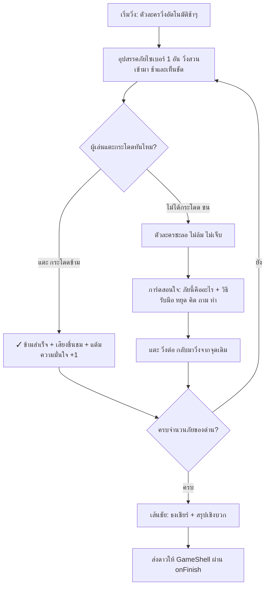

# Detailed Design Document: G7 — วิ่งสู้ภัยไซเบอร์ (Cyber Runner)

**สถานะ:** 🏗️ Draft / Proposal (รอทีมจัดลำดับความสำคัญและกำหนด Sprint)
**หมวดหมู่:** รูปแบบที่ 3 — เกมสร้างเสริมกำลังใจ (Motivation & Empowerment Action Game)
**ความสำคัญ:** Should — ชุดที่ 2: ทัศนคติ
**กลุ่มเป้าหมาย:** ผู้สูงอายุ (อายุ 60 ปีขึ้นไป)
**ผู้ออกแบบ:** Game Designer ทีม NAPLAB
**เวอร์ชัน:** 1.0 | **อัปเดตล่าสุด:** 2026-07-21
**User Story:** [US-GAME-07](../agile/user-stories/US-GAME-07.md)

**เกมพี่น้อง (Reference):** กลุ่ม Action เดียวกับ [G5 กางโล่กู้ชีพ](./design-g5.md) และ [G8 กระโดดแพ](./design-g8.md) — ใช้หลัก "แอคชั่นเดียว + เสริมพลังบวก + ไม่มีจอแพ้"

---

## 1. Overview (ภาพรวมของเกม)

เกม **G7 — วิ่งสู้ภัยไซเบอร์** เป็นเกมวิ่งด้านข้างอัตโนมัติ (Side-Scroller Auto-Runner) ที่ตัวละครตัวแทนผู้สูงวัยวิ่งไปข้างหน้าเรื่อยๆ ผู้เล่นทำ **แอคชั่นเดียวคือแตะที่ใดก็ได้บนจอเพื่อกระโดด** ข้ามอุปสรรค "ภัยไซเบอร์" ที่วิ่งสวนเข้ามา (แก๊งคอลเซ็นเตอร์, กล่อง SMS แนบลิงก์, ป้ายโฆษณารวยเร็ว ฯลฯ)

สาระสำคัญคือปลูกทัศนคติว่า **"ภัยล่อลวงออนไลน์ = สิ่งกีดขวางที่ต้องกระโดดข้าม (หลบเลี่ยง ไม่เข้าไปคลิก/รับสาย)"** ไม่ใช่สิ่งที่ต้องเข้าไปปฏิสัมพันธ์ด้วย — เปลี่ยนความกลัวเป็นความมั่นใจว่า "เห็นแล้วหลบเป็น"

> ⚠️ **โจทย์ออกแบบที่ต้องแก้ให้เข้ากติกาโครงการ:** เกมวิ่งโดยธรรมชาติมี "จังหวะกดดัน" และ "ฉากเลื่อนต่อเนื่อง" ซึ่งขัดกับ [Art Direction](./03-art-direction.md) (ห้ามจับเวลากดดัน/ห้ามจอแพ้) และเสี่ยงเวียนศีรษะสำหรับผู้สูงอายุ (Motion Sensitivity) — เอกสารนี้จึงออกแบบเวอร์ชัน **"วิ่งช้า ให้อภัยสูง ชนได้ไม่แพ้"** (ดู §6, §7)

---

## 2. Core Gameplay Loop (วงลูปหลักการเล่น)



---

## 3. Level / Run Structure (โครงสร้างการวิ่ง)

- 1 รอบการเล่น = วิ่งผ่าน **ภัย 8 อัน** (ปรับได้หลัง playtest) เรียงมาทีละอัน ไม่มีอันซ้อนกัน
- **ภัยมาทีละอัน เว้นระยะห่างชัดเจน** — ไม่มีการถาโถมหลายอันพร้อมกัน (ลดความกดดันและความสับสน)
- ความเร็วคงที่ช้าๆ ตลอด (ไม่มีการเร่งความเร็วขึ้นเรื่อยๆ แบบเกมวิ่งทั่วไป) — เกมนี้วัด "หลบเป็นไหม" ไม่ใช่ "รีเฟล็กซ์เร็วแค่ไหน"
- ลำดับภัย**สุ่มจากคลัง** (§9) เพื่อเล่นซ้ำได้ไม่จำ
- จบรอบ = ถึงเส้นชัย มีธงและคำชม + การ์ดสรุปข้อคิด 1 ประโยค

---

## 4. Controls & Interaction (การควบคุม — แตะเดียว ให้อภัยสูง)

- **แตะที่ใดก็ได้บนจอ = กระโดด** (Tap to Jump) — ไม่มีปุ่มทิศทาง ไม่มีปัด/ลาก
- **หน้าต่างกระโดดกว้าง (Generous jump window):** ตัวละครลอยอยู่กลางอากาศนานพอ (~0.65 วินาที) และ "ช่วงปลอดภัย" ที่นับว่าข้ามสำเร็จครอบคลุมทั้งช่วงลอย — ผู้เล่นแตะล่วงหน้าเล็กน้อยก็ข้ามได้ ไม่ต้องจับจังหวะเป๊ะ
- แตะซ้ำระหว่างลอยไม่มีผล (กันการกระโดดรัว) — กระโดดได้อีกครั้งเมื่อแตะพื้นแล้ว
- **ไม่มีการจับเวลานับถอยหลัง** — ความเร็วคงที่ช้า อุปสรรคเห็นล่วงหน้าชัด
- รองรับปุ่มเสียง/คำบรรยายภัยตาม Open Decision โครงการ

---

## 5. Screen Layout (การจัดหน้าจอ — Portrait/แนวนอนในกรอบ)

```
+---------------------------------------------------+
|  แต้มความมั่นใจ ⭐ 3     ภัยที่ข้าม 3/8            | -> แถบสถานะบน (ไม่มีตัวจับเวลา!)
+---------------------------------------------------+
|                                                   |
|                                                   |
|                              (( 📞 ))              | -> อุปสรรคภัย วิ่งเข้ามาจากขวา ช้าๆ
|                                                   |
|     🧓                                             | -> ตัวละคร (ตำแหน่งคงที่ซ้าย) กระโดดขึ้น-ลง
|  ═══════════════════════════════════════════════  | -> พื้นวิ่ง
|         [ แตะที่ใดก็ได้เพื่อกระโดด 👆 ]             | -> คำใบ้การควบคุม
+---------------------------------------------------+
```

- **ตัวละครอยู่กับที่ (ซ้ายค่อนกลาง) ฉาก/อุปสรรคเลื่อนเข้าหา** — กล้องไม่แพน ไม่มี parallax หลายชั้น ลดอาการเวียนศีรษะ
- อุปสรรคภัย: ไอคอนใหญ่ ≥ 64px + ป้ายชื่อภัยสั้นๆ (เช่น "เบอร์แปลก", "SMS ลิงก์") สีตัดกับพื้นหลังชัด
- แถบสถานะบน: "แต้มความมั่นใจ" (สะสมขึ้นเรื่อยๆ) + "ภัยที่ข้าม x/8" — **ไม่มีตัวจับเวลา ไม่มีชีวิต (lives)**
- ปุ่ม/ตัวหนังสือ ≥ 20px, Contrast ≥ 4.5:1 ตาม [Art Direction](./03-art-direction.md)

---

## 6. No-Fail & Hit Handling (ชนได้ ไม่แพ้ — หัวใจของเกมนี้)

| กติกา | รายละเอียด |
|-------|-----------|
| กระโดดข้ามสำเร็จ | ✓ เสียงชื่นชมเบาๆ + แต้มความมั่นใจ +1 + ตัวละครวิ่งต่อลื่นๆ |
| ชนอุปสรรค | ตัวละคร **ไม่ล้ม ไม่มีภาพเจ็บ/รุนแรง** — แค่ชะลอหยุดหน้าอุปสรรค (สะดุดเบาๆ) ไม่มีเสียงตกใจ |
| หลังชน | เกม **หยุดนิ่ง (freeze)** แล้วแสดง **การ์ดสอนใจ** ทันที: ภัยนี้คืออะไร + วิธีรับมือ (อิงสโลแกน "หยุด คิด ถาม ทำ") |
| กลับมาเล่น | แตะ "วิ่งต่อ" → อุปสรรคที่ชนหายไป ตัวละครวิ่งต่อจากจุดเดิม (ไม่ถอยหลัง ไม่รีเซ็ต) |
| ไม่มี Game Over | ชนกี่ครั้งก็ได้ ไม่มีแพ้ ไม่มีตัดจบ — ชน = โอกาสเรียนรู้ 1 ครั้ง (นับเบื้องหลังเพื่อคิดดาว §8) |

> การ์ดสอนใจหลังชนคือ **ช่วงเวลาสอนที่สำคัญที่สุด** ของเกมนี้ (เหมือนการ์ดเฉลยของ G8) — เปลี่ยน "ชน" ให้เป็นความรู้ ไม่ใช่การลงโทษ

---

## 7. Motion & Accessibility (การเคลื่อนไหว — ลดอาการเวียนศีรษะ)

ประเด็นเฉพาะของเกมวิ่งที่ต้องระวังเป็นพิเศษกับผู้สูงอายุ:

- **ความเร็วช้าคงที่** ไม่เร่งขึ้น, อุปสรรคมาทีละอันเว้นระยะ, ฉากหลังเรียบ (ไม่มี parallax หลายชั้น/ลายกระพริบ)
- **กล้องไม่แพนตามตัวละคร** — ตัวละครอยู่กับที่ อุปสรรคเลื่อนเข้าหา (จอนิ่งกว่าการเลื่อนฉากทั้งจอ)
- `prefers-reduced-motion`: ลดการเลื่อนพื้นหลัง/เอฟเฟกต์ให้เหลือน้อยที่สุด, การกระโดดเป็นการขยับสั้นๆ นุ่มๆ, ไม่มีการสั่นจอ (screen shake) ทุกกรณี
- เสียงประกอบเป็นโทนบวกเบาๆ ไม่มีเสียงตกใจ/เสียงชนดัง

---

## 8. Reward & Positive Reinforcement (ระบบรางวัล)

- **จบรอบ = ผ่านเสมอ** ไม่มีเงื่อนไขแพ้
- หน้าสรุป: จำนวนภัยที่ข้ามได้ + แต้มความมั่นใจ + คำชม
  > "เก่งมากค่ะ! วิ่งฝ่าภัยออนไลน์มาได้ตลอดเส้นทาง ทีนี้เจอเบอร์แปลกหรือ SMS ชวนเชื่อ ก็รู้แล้วว่าต้องกระโดดข้าม ไม่เข้าไปยุ่ง"
- **ดาวส่งให้ `GameShell` ผ่าน `onFinish(stars)`:** คำนวณจากสัดส่วนการกระโดดข้ามสำเร็จครั้งแรก (ข้ามได้เลยไม่ชน) — ≥80% = 3 ดาว, ≥50% = 2 ดาว, ต่ำกว่า = 1 ดาว (ขั้นต่ำ 1 ดาว)
- หน้าสรุปโชว์เฉพาะดาว+คำชม ไม่โชว์จำนวนครั้งที่ชนเป็นเชิงลบ
- เชื่อมระบบดาวประจำบทและใบประกาศตาม [Progression & Reward System](./01-mechanics.md#progression--reward-system)

---

## 9. Content Data Design (คลังภัยแบบ data-driven)

ภัยทุกอันเป็น data-driven (JSON ใน `src/data/`) เพื่อให้ทีมเนื้อหาเพิ่ม/แก้ได้โดยไม่แตะโค้ดเกม

### 9.1 โครงสร้างข้อมูลภัย (`src/data/g7-hazards.json`)

```json
{
  "id": "g7-callcenter",
  "icon": "📞",
  "label": "เบอร์แปลกโทรเข้า",
  "category": "call",
  "advice": "แก๊งคอลเซ็นเตอร์ชอบอ้างเป็นเจ้าหน้าที่ ขู่ให้โอนเงิน — เบอร์แปลกไม่รับ หรือวางสายแล้วโทร 1441 เช็กเองค่ะ",
  "ai_disclosure": false
}
```

### 9.2 ตัวอย่างชุดภัยเริ่มต้น

| ไอคอน | ภัย | วิธีรับมือ (การ์ดสอนใจ) |
|-------|-----|--------------------------|
| 📞 | เบอร์แปลกโทรเข้า (แก๊งคอลเซ็นเตอร์) | ไม่รับ/วางสาย แล้วโทร 1441 เช็กเอง |
| 📩 | SMS แนบลิงก์ | ไม่กดลิงก์ใน SMS พิมพ์เว็บทางการเอง |
| 💰 | โฆษณารวยเร็ว/แจกเงินล้าน | ดีเกินจริง = หลอก อย่ากดอย่ากรอกข้อมูล |
| 🎁 | คุณได้รับของรางวัลฟรี | ไม่มีของฟรี อย่าให้ข้อมูล/ค่าจัดส่ง |
| 🪙 | ชวนลงทุนคริปโตกำไรเท่าตัว | การันตีกำไรสูง = สัญญาณโกง หยุดคิดก่อน |
| 💊 | ยาวิเศษรักษาทุกโรค | อวดอ้างเกินจริง ปรึกษาหมอ/เภสัชก่อน |
| 🔗 | ลิงก์ย่อแปลกๆ | ไม่รู้ปลายทางอย่ากด |
| 👮 | อ้างเป็นตำรวจ/ราชการให้โอนเงิน | ราชการไม่โทรสั่งโอนเงิน วางสายโทร 1441 |

- คลังเป้าหมายเวอร์ชันแรก: **ภัย 8–12 แบบ** — ต้องส่งทีมวิชาการ NAPLAB ตรวจก่อนใช้จริง
- การ์ดสอนใจของภัยกลุ่มสแกมปิดท้ายด้วยสายด่วน **1441 (ตำรวจไซเบอร์)** ตามความเหมาะสม

---

## 10. Technical Implementation Details (สเปกทางเทคนิค)

### Component & Integration
- Component: **`G7CyberRunner`** วางใน `src/components/` — คุยกับ `GameShell` ผ่าน props มาตรฐาน `onFinish(stars)` + `logEvent` ไม่สร้าง layout/progress dots เอง
- เขียนเป็น **`.tsx`** (แนวเดียวกับ `G8RaftCrossing.tsx`)
- **การเคลื่อนที่ใช้ `requestAnimationFrame`** สำหรับตำแหน่งอุปสรรค (ลื่นบนมือถือ หยุด/พักได้ง่ายเมื่อชน) — **ไม่ใช้ `setInterval`** (บทเรียนจาก G5) และไม่ต้องใช้ physics engine เพราะมีวัตถุเคลื่อนที่ทีละชิ้น
- Collision แบบง่าย: อุปสรรค 1 อันบนจอ ณ เวลาหนึ่ง — เช็กตอนอุปสรรคถึงตำแหน่งตัวละครว่า "กำลังลอยอยู่ไหม" (jumping = ข้าม, ไม่ jumping = ชน)
- คลังภัย: `src/data/g7-hazards.json`
- **ลงทะเบียนใน Dev Game Hub** (`src/app/dev/games/page.tsx`): เพิ่ม entry G7 (`component: G7CyberRunner`, `status: "prototype"`)

### Event Logging

```javascript
logEvent('game_start',   { game_id: 'g7' });
logEvent('jump',         { game_id: 'g7', hazard_id: 'g7-callcenter' });
logEvent('hazard_clear', { game_id: 'g7', hazard_id: '...', first_try: true });
logEvent('hazard_hit',   { game_id: 'g7', hazard_id: '...' });        // ชน + เปิดการ์ดสอนใจ
logEvent('game_complete',{ game_id: 'g7', stars: 3, cleared: 8 });
```

`hazard_hit` แยกตาม `hazard_id` มีค่าต่อทีมวิชาการ — วิเคราะห์ว่าภัยแบบไหนที่ผู้สูงอายุ "หลบไม่ทัน/แยกไม่ออก" บ่อยที่สุด

---

## 11. Open Questions (คำถามเปิดรอทีมตัดสินใจ)

1. **ความเร็ว/หน้าต่างกระโดด:** ค่าเริ่มต้นในร่างนี้เน้นให้อภัยสูง — ต้อง playtest กับผู้สูงอายุจริงเพื่อจูนความเร็วและความกว้างของ jump window
2. **จำนวนภัยต่อรอบ:** ร่างไว้ 8 อัน — อาจสั้น/ยาวไป ต้องดูจากความสนุกและความล้า
3. **Motion Sensitivity:** ต้องทดสอบกับผู้สูงอายุจริงว่าการเลื่อนอุปสรรค (แม้ตัวละครนิ่ง) ทำให้เวียนศีรษะไหม — ถ้าใช่ อาจต้องลดความเร็ว/ทำโหมด "หยุดแล้วค่อยมา" เพิ่ม
4. **แนวจอ:** portrait หรือกรอบแนวนอนในจอ portrait — ต้องเลือกให้เข้ากับ Portrait-first ของโครงการ
5. **ต้องอัปเดต `US-GAME-07`** จาก Planned เป็นสถานะพัฒนาเมื่อเริ่มทำ prototype

## Related Documents
- Mechanics รวม: [Core Mechanics](./01-mechanics.md)
- กติกา UI/UX บังคับ: [Art Direction](./03-art-direction.md)
- เกม Action พี่น้อง: [G5 Detailed Design](./design-g5.md), [G8 Detailed Design](./design-g8.md)
- นโยบาย AI Content: [Concept §5](./00-concept.md#5-นโยบายการนำเสนอเนื้อหาที่สร้างจาก-ai-⚠️)
- Dev Game Hub (ทดสอบ): `/dev/games` — [US-03-R4](../agile/user-stories/US-03-R4.md)
