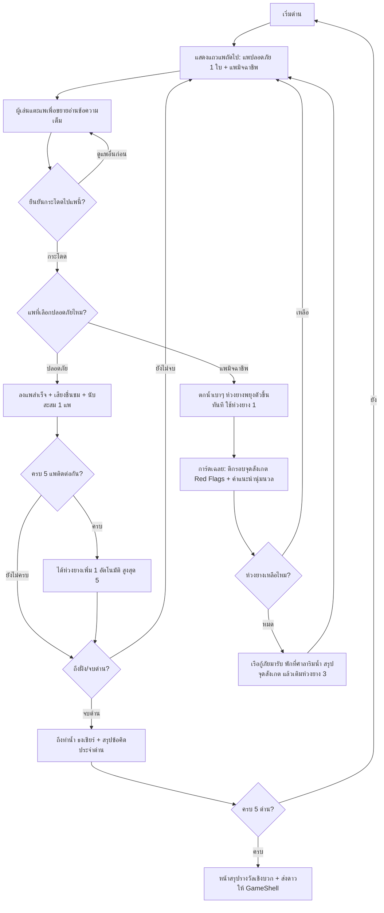

# Detailed Design Document: G8 — กระโดดแพรู้ทันมิจ (Safe Raft Crossing)

**สถานะ:** 🏗️ Draft / Proposal (รอทีมจัดลำดับความสำคัญและกำหนด Sprint)
**หมวดหมู่:** 3. Motivation & Empowerment Action Game (ลูกผสม Content-Focused: คัดแยก SMS/สายโทรเข้า)
**ความสำคัญ:** เสนอเป็น Should — Topic 2: Scams
**กลุ่มเป้าหมาย:** ผู้สูงอายุ (อายุ 60 ปีขึ้นไป)
**ผู้ออกแบบ:** Game Designer ทีม NAPLAB
**เวอร์ชัน:** 1.0 | **อัปเดตล่าสุด:** 2026-07-19

**เกมอ้างอิง (Reference):** เกมกบกระโดดข้ามใบบัว (Frog Jump / Lily Pad Hop) — เปลี่ยนใบบัวเป็น "แพข้อความ" และเปลี่ยนกบเป็น "ตัวละครคน" ตัวแทนผู้สูงวัย

---

## 1. Overview (ภาพรวมของเกม)

เกม **G8 — กระโดดแพรู้ทันมิจ** เป็นเกมฝึกทักษะการคัดแยก **ข้อความ SMS** และ **สายโทรเข้า** ว่าอันไหนมาจากมิจฉาชีพ อันไหนปลอดภัย โดยนำเสนอผ่านฉากทะเลสาบ: ตัวละครคนต้องกระโดดจากแพหนึ่งไปยังแพถัดไปเพื่อข้ามทะเลสาบให้ถึงฝั่ง

ในแต่ละจังหวะกระโดด ผู้เล่นต้องเลือกแพที่ "ปลอดภัย" จากแพที่ลอยอยู่ตรงหน้า — แพแต่ละใบจะแสดงข้อความ SMS (หลอก/ไม่หลอก ปะปนกัน สุ่มจากคลังโจทย์) เมื่อเล่นไประยะหนึ่งแพจะเปลี่ยนเป็น **สายโทรเข้า** (ชื่อผู้โทร + เบอร์โทร ทั้งเบอร์ที่น่าเชื่อถือและเบอร์แปลก) และช่วงท้ายจะ **ผสมทั้ง SMS และสายโทรเข้า** เข้าด้วยกัน

หัวใจของเกมคือการจำลอง "จังหวะตัดสินใจ" แบบเดียวกับชีวิตจริง: ก่อนจะกดเปิด SMS หรือรับสายใดๆ ให้ **หยุด คิด ถาม ทำ** — เลือกเหยียบเฉพาะสิ่งที่ตรวจสอบแล้วว่าปลอดภัย

> ⚠️ **ข้อปรับจากไอเดียต้นทางเพื่อให้ตรงกติกาโครงการ:** กลไก "ห่วงยาง 5 หน่วย" คงไว้ครบถ้วน แต่เมื่อห่วงยางหมดจะ**ไม่มีหน้าจอแพ้ (Game Over)** — ใช้ระบบ "เรือกู้ภัยใจดี" มารับไปพักรับคำแนะนำแล้วกลับมาเล่นต่อจากแพเดิมแทน (ดู §6) ตามกติกา [Art Direction](./03-art-direction.md) ที่ห้ามมีการลงโทษหรือจอแพ้ทุกกรณี

---

## 2. Core Gameplay Loop (วงลูปหลักการเล่น)



---

## 3. Level Structure (โครงสร้าง 5 ด่าน)

เกมมีทั้งหมด **5 ด่าน** ไล่ระดับตามชนิดโจทย์และความเนียนของมิจฉาชีพ (ไม่ใช่ตามความเร็ว — เกมนี้**ไม่มีการจับเวลา**ทุกด่าน):

| ด่าน | ชนิดแพ | ระดับความเนียนของโจทย์ | ตัวอย่างสิ่งที่ฝึก |
|------|--------|------------------------|--------------------|
| 1 | SMS ล้วน | ชัดเจนมาก (ภาษาเร่งรัด, ลิงก์แปลกเห็นได้ทันที) | สังเกตลิงก์ `.xyz` / คำว่า "ด่วน!" "โอนตอนนี้" |
| 2 | SMS ล้วน | เนียนขึ้น (แอบอ้างหน่วยงาน, ตัวสะกดเพี้ยนเล็กน้อย) | เทียบชื่อผู้ส่งปลอม เช่น `Krungthai-TH` vs ผู้ส่งจริง |
| 3 | สายโทรเข้าล้วน | ชื่อผู้โทร + เบอร์ (เบอร์บันทึกไว้/เบอร์ทางการ vs เบอร์แปลก) | เบอร์ขึ้นต้น `+697`, เบอร์มือถือแอบอ้างเป็นธนาคาร |
| 4 | ผสม SMS + สายโทรเข้า | ปานกลาง สลับชนิดสุ่ม | สลับโหมดการสังเกตระหว่างข้อความกับเบอร์โทร |
| 5 | ผสม SMS + สายโทรเข้า | เนียนที่สุดในคลังโจทย์ | เคสก้ำกึ่งที่ต้องอ่านครบทุกจุดก่อนตัดสินใจ |

- แต่ละด่านยาว **2 หน้าจอ** (หน้าจอละ 5 แถวแพ = กระโดด 10 ครั้งต่อด่าน) — ปรับจำนวนได้หลัง playtest
- จบด่าน = ตัวละครขึ้น "ท่าน้ำ" มีธงและตัวละครประกอบโบกมือเชียร์ พร้อมการ์ดสรุปข้อคิดประจำด่าน 1 ประโยค
- ลำดับโจทย์ภายในด่าน**สุ่มจากคลัง** (Pool ตาม §7) เพื่อให้เล่นซ้ำได้ไม่จำเฉลย

---

## 4. Screen Layout (การจัดหน้าจอ — Portrait เท่านั้น)

**กติกากล้องนิ่ง (Static Camera Rule):** 1 หน้าจอแสดงแพคงที่ **5 แถว** กล้อง**ไม่เลื่อนตามตัวละคร**ระหว่างกระโดด — ฉากจะเปลี่ยนครั้งเดียวเมื่อกระโดดครบทั้ง 5 แถวของหน้าจอนั้น เหตุผล: ผู้สูงอายุจำนวนมากเวียนศีรษะง่ายเมื่อภาพพื้นหลังเคลื่อนไหวต่อเนื่อง (Motion Sensitivity) การตรึงฉากช่วยให้อ่านข้อความบนแพได้นิ่งและสบายตา

```
+---------------------------------------------------+
| 🛟🛟🛟🛟🛟  ห่วงยาง 5   |   ด่าน 1/5  🚩 แพที่ 3/10 | -> 1. แถบสถานะ (ห่วงยาง + ความคืบหน้า)
+---------------------------------------------------+
|  ~~~~ (ฝั่ง/ท่าน้ำ อยู่บนสุดของหน้าจอสุดท้าย) ~~~~   |
|   [ 📩 แพ SMS ก ]        [ 📩 แพ SMS ข ]           | -> แถวที่ 5
|                                                   |
|        [ 📩 แพ SMS ]     [ 📞 แพสายโทรเข้า ]        | -> แถวที่ 4
|                                                   |
|   [ 📞 แพ ]         [ 📩 แพ ]                      | -> แถวที่ 3
|                                                   |
|        [ 📩 แพ ]         [ 📩 แพ ]                 | -> แถวที่ 2 (แถวถัดไป — เด่นสุด)
|                                                   |
|              🧍 ตัวละครยืนบนแพปัจจุบัน               | -> แถวที่ 1 (จุดเริ่มของหน้าจอนี้)
|  ~~~~~~~~~~~~~~ ผิวน้ำทะเลสาบ ~~~~~~~~~~~~~~~~~~   |
+---------------------------------------------------+
```

- **แถบสถานะด้านบน:** ไอคอนห่วงยาง 🛟 ขนาด ≥ 32px ต่ออัน พร้อมตัวเลขกำกับ "ห่วงยาง 5" (ไม่ใช้ไอคอนอย่างเดียว — มีตัวหนังสือ ≥ 20px เสมอ) + ตัวบอกความคืบหน้า "ด่าน x/5" และ "แพที่ x/10"
- **แถวแพถัดไป (Active Row):** ขยับตัวเบาๆ (bobbing บนผิวน้ำ ±4px ช้าๆ) และมีขอบเรืองแสงบอกว่า "เลือกแถวนี้" — แถวที่ไกลออกไปแสดงจางลง (dimmed) และ**แตะไม่ได้** กันการกดข้ามแถว
- **แพ 1 ใบ = การ์ดข้อความ:** ขนาดขั้นต่ำ ~44vw × 96px, มุมโค้ง, ไอคอนชนิดกำกับเสมอ (📩 SMS / 📞 สายโทรเข้า), ตัวอย่างข้อความบนแพตัดสั้น 2 บรรทัด ฟอนต์ ≥ 20px
- **จำนวนแพต่อแถว:** ค่าเริ่มต้น **2 ใบ** (ปลอดภัย 1 + มิจฉาชีพ 1) — ด่าน 4–5 อาจสุ่มเป็น 3 ใบในบางแถว (ปลอดภัย 1 + มิจฉาชีพ 2) เพื่อเพิ่มความท้าทายโดยไม่เพิ่มความซับซ้อนของกติกา

### การเปลี่ยนหน้าจอ (Scene Transition)
- เมื่อกระโดดครบ 5 แถว ฉากจะเลื่อนขึ้น **ครั้งเดียว ช้าๆ** (~1.5 วินาที, easing นุ่ม `ease-in-out`) พร้อมข้อความคั่น "เก่งมาก! ไปกันต่อ 🌊"
- ผู้ใช้ที่ตั้งค่า `prefers-reduced-motion` จะได้ transition แบบ **fade** แทนการเลื่อน (ไม่มีการเคลื่อนที่ของฉากเลย)

---

## 5. Controls & Interaction (การควบคุม — แตะ 2 จังหวะกันพลาด)

ผู้เล่นใช้ **การแตะอย่างเดียว** ไม่มีปัด ไม่มีลาก ไม่มีปุ่มทิศทาง โดยแบ่งเป็น 2 จังหวะเพื่อกันการกดพลาดจากมือสั่นและให้ได้อ่านข้อความเต็มก่อนตัดสินใจ:

1. **แตะแพครั้งแรก = ขยายอ่าน** — เปิดการ์ดขยายกลางจอแสดงข้อความ SMS เต็ม (หรือหน้าจอสายโทรเข้าจำลอง: ชื่อผู้โทร + เบอร์เต็ม) ฟอนต์ ≥ 22px พร้อมปุ่มใหญ่ 2 ปุ่ม:
   - `🦵 กระโดดไปแพนี้` (ปุ่มหลัก ≥ 56px สูง)
   - `👀 ดูแพอื่นก่อน` (ปุ่มรอง — ปิดการ์ดกลับไปหน้าทะเลสาบ)
2. **แตะยืนยัน = กระโดด** — ตัวละครกระโดดแบบโค้ง (arc) ช้าๆ ~600ms ไปลงแพที่เลือก

ข้อกำหนดตาม [Art Direction](./03-art-direction.md):
- Touch target ของแพและปุ่มทุกจุด ≥ 48×48px (ตัวแพจริงใหญ่กว่านั้นมาก)
- ถูก/ผิดต้องมีไอคอนกำกับเสมอ: ลงแพปลอดภัย = ✓ เขียว + เสียงชื่นชม, แพมิจฉาชีพ = ✗ ส้มอ่อน (ไม่ใช้แดงจัด/เสียงตกใจ)
- **ไม่มีการจับเวลาใดๆ** — แพลอยรออยู่ตลอด ผู้เล่นอ่านนานแค่ไหนก็ได้
- รองรับปุ่มเสียงอ่านข้อความ (TTS/เสียงอัด ตาม Open Decision ของโครงการ) บนการ์ดขยาย

---

## 6. Life-Ring System (ระบบห่วงยาง — ไม่มี Game Over)

| กติกา | รายละเอียด |
|-------|-----------|
| ห่วงยางเริ่มต้น | **5 หน่วย** แสดงเป็นไอคอน 🛟 บนแถบสถานะ |
| กระโดดลงแพมิจฉาชีพ | ตัวละครตกน้ำแบบนุ่มนวล (น้ำกระเซ็นการ์ตูน ไม่มีภาพจมน่ากลัว ไม่มีเสียงตกใจ) → **ห่วงยางพองรับตัวขึ้นมาทันที** → ใช้ห่วงยางไป 1 → แสดงการ์ดเฉลยจุดสังเกต → กลับขึ้นแพเดิม เลือกแถวเดิมใหม่ (ระบบสุ่มสลับตำแหน่งแพในแถวนั้นเพื่อไม่ให้เดาจากตำแหน่ง) |
| กระโดดถูกครบ 5 แพติดต่อกัน | ได้ห่วงยางเพิ่ม **+1 อัตโนมัติ** พร้อมอนิเมชั่นห่วงยางลอยมาจากขอบจอ + ข้อความ "รอบคอบมาก! รับห่วงยางเพิ่ม 🛟" (สะสมสูงสุด 5 — ถ้าเต็มอยู่แล้วเปลี่ยนเป็นประกายดาวชื่นชมแทน) |
| ห่วงยางหมด | **ไม่มีจอแพ้ ไม่รีเซ็ตด่าน** — "เรือกู้ภัยใจดี" ⛵ แล่นมารับตัวละครไปพักที่ "ศาลาริมน้ำ": หน้าจอสรุปแบบอบอุ่นทวนจุดสังเกตของโจทย์ที่พลาดในด่านนี้ (สูงสุด 3 ข้อ) น้ำเสียงให้กำลังใจ ("มิจฉาชีพสมัยนี้เนียนมากจริงๆ ค่ะ มาดูจุดสังเกตกันอีกรอบ") → แตะ "พร้อมลุยต่อ" → กลับไปแพเดิมพร้อมห่วงยาง **3 หน่วย** |
| ผลต่อรางวัล | จำนวนครั้งที่ตกน้ำ**ไม่ถูกโชว์เป็นตัวเลขเชิงลบ** — ใช้คำนวณดาวเบื้องหลังเท่านั้น (ดู §9) |

> การตกน้ำถูกออกแบบให้เป็น "โอกาสเรียนรู้" ตามหลักการโครงการ ("โดนหลอกแล้วอย่าอาย") — การ์ดเฉลยหลังตกน้ำคือช่วงเวลาสอนที่สำคัญที่สุดของเกมนี้

---

## 7. Content Data Design (คลังโจทย์ SMS และสายโทรเข้า)

โจทย์ทุกข้อเป็นข้อมูลแบบ data-driven (JSON ใน `src/data/`) เพื่อให้ทีมเนื้อหาเพิ่ม/แก้ได้โดยไม่แตะโค้ดเกม

### 7.1 โครงสร้างข้อมูลโจทย์

```json
{
  "id": "g8-sms-001",
  "type": "sms",                     // "sms" | "call"
  "is_scam": true,
  "difficulty": 1,                   // 1-3 ใช้จัดเข้าด่าน
  "sender": "Thai-Post9",
  "text": "พัสดุตกค้าง ชำระ 40 บ. ด่วน คลิก th-post.xyz/track",
  "red_flags": ["ลิงก์ลงท้าย .xyz ไม่ใช่เว็บทางการ", "เร่งรัดให้จ่ายด่วน", "ชื่อผู้ส่งสะกดแปลก"],
  "explain": "ไปรษณีย์ไทยไม่ส่ง SMS เรียกเก็บเงินผ่านลิงก์ หากสงสัยให้โทร 1545 ตรวจสอบเองค่ะ",
  "ai_disclosure": false             // true เมื่อภาพ/เสียงประกอบโจทย์สร้างด้วย AI → ต้องแสดงป้ายหลังหน้าเฉลยตามนโยบาย
}
```

โจทย์ชนิด `call` ใช้ฟิลด์ `caller_name` + `phone_number` แทน `sender`/`text` เช่น `{"caller_name": "ไม่ทราบชื่อ", "phone_number": "+697 88 123 4567"}`

### 7.2 ตัวอย่างชุดโจทย์เริ่มต้น (คัดจากภัยที่ผู้สูงอายุเจอบ่อย)

| ชนิด | ตัวอย่าง | เฉลย | จุดสังเกต (Red Flags) |
|------|---------|------|----------------------|
| 📩 SMS | "พัสดุตกค้าง ชำระ 40 บ. คลิก th-post.xyz" | ❌ มิจ | ลิงก์ .xyz, เร่งรัด, แอบอ้างขนส่ง |
| 📩 SMS | "ยินดีด้วย! คุณได้รับสิทธิ์กู้ 50,000 ดอกเบี้ย 0% กดรับเลย" | ❌ มิจ | ดีเกินจริง, ชวนกดลิงก์ทันที |
| 📩 SMS | "รหัส OTP ของคุณคือ 483920 ห้ามบอกรหัสนี้แก่ผู้อื่น" (จากธนาคารที่เพิ่งทำรายการเอง) | ✅ ปลอดภัย | OTP จริงจะมาตอนเราทำรายการเอง และ*ไม่*ขอให้ส่งกลับ |
| 📩 SMS | "นัดหมายฉีดวัคซีนของท่าน วันศุกร์ 09.00 น. รพ.สต. บ้านกลาง" | ✅ ปลอดภัย | ไม่มีลิงก์, ไม่ขอข้อมูล, อ้างอิงนัดจริง |
| 📩 SMS | "บัญชีของท่านถูกระงับ ยืนยันตัวตนที่ krungthai-verify.com ภายใน 24 ชม." | ❌ มิจ | ขู่ให้รีบ, โดเมนเลียนแบบธนาคาร |
| 📞 สาย | "แม่" (เบอร์ที่บันทึกไว้ในเครื่อง) | ✅ ปลอดภัย | รายชื่อที่บันทึกเอง โทรคุยกันประจำ |
| 📞 สาย | "ไม่ทราบชื่อ +697 88 123 4567" | ❌ มิจ | เบอร์ต่างประเทศ +697 ทั้งที่ไม่มีญาติอยู่ต่างประเทศ |
| 📞 สาย | "DHL Express 06-1234-5678" อ้างมีพัสดุผิดกฎหมาย | ❌ มิจ | บริษัทจริงไม่โทรขู่เรื่องพัสดุผิดกฎหมาย — แก๊ง Call Center |
| 📞 สาย | "รพ.มหาราช 053-xxx-xxx" (เบอร์ตรงกับที่เคยติดต่อ) | ✅ ปลอดภัย | เบอร์สำนักงานตรงกับเอกสารนัดจริง |
| 📞 สาย | "ตำรวจไซเบอร์" 09-8765-4321 แจ้งว่าบัญชีพัวพันคดี ให้โอนเงินตรวจสอบ | ❌ มิจ | ตำรวจจริงไม่โทรสั่งโอนเงิน — วางสายแล้วโทร 1441 เช็กเอง |

- คลังโจทย์เป้าหมายเวอร์ชันแรก: **SMS 20 ข้อ + สายโทรเข้า 15 ข้อ** (มิจ ~60% / ปลอดภัย ~40%) — ต้องส่งให้ทีมวิชาการ NAPLAB ตรวจความถูกต้องของเนื้อหาก่อนใช้จริง
- ทุกการ์ดเฉลยของโจทย์กลุ่ม "มิจ" ปิดท้ายด้วยช่องทางแจ้งเหตุ: **สายด่วน 1441 (ตำรวจไซเบอร์)**
- หากมีภาพ/เสียงประกอบที่สร้างด้วย AI ต้องตั้ง `ai_disclosure: true` และแสดงป้าย "⚠️ สื่อนี้สร้างโดย AI เพื่อการเรียนรู้" หลังหน้าเฉลยตาม[นโยบาย AI Content](./00-concept.md#5-นโยบายการนำเสนอเนื้อหาที่สร้างจาก-ai-⚠️)

---

## 8. Art Direction & Motion Guidelines (ทิศทางภาพและการเคลื่อนไหว)

- **ธีมฉาก:** ทะเลสาบยามเช้าโทนสว่างสบายตา ใช้โทนสีเข้ากับ token หลักของโครงการ (teal `--primary`) — น้ำสีฟ้าอมเขียวอ่อน, ท้องฟ้าสดใส, ไม่มีสัตว์อันตราย (ไม่มีจระเข้แบบเกมต้นแบบ — ความเสี่ยงเดียวคือ "ข้อความบนแพ" เพื่อไม่สร้างความเครียดเพิ่ม)
- **ตัวละคร:** คนวัยเก๋าท่าทางสดใส สวมชูชีพ+ห่วงยาง สื่อความปลอดภัยตลอดเวลา (ตกน้ำ = เปียกนิดหน่อย ไม่ใช่อันตราย)
- **การเคลื่อนไหวทั้งหมดช้าและคาดเดาได้:** กระโดด ~600ms, แพ bobbing ±4px ช้าๆ, เปลี่ยนฉากครั้งเดียวเมื่อจบหน้าจอ (~1.5s) — ไม่มี parallax, ไม่มีกล้องติดตามตัวละคร, ไม่มีเอฟเฟกต์กะพริบถี่
- `prefers-reduced-motion`: ปิด bobbing, กระโดดเปลี่ยนเป็น fade-teleport, เปลี่ยนฉากเป็น fade
- ตัวหนังสือทุกจุด ≥ 20px, ปุ่ม ≥ 22px, Contrast ≥ 4.5:1 ตาม [Art Direction](./03-art-direction.md)

---

## 9. Reward & Positive Reinforcement (ระบบรางวัล)

- **จบครบ 5 ด่าน = ผ่านเสมอ** (สอดคล้อง Win/Lose ของโครงการ: ไม่มีเงื่อนไขแพ้)
- หน้าสรุปแสดง: จำนวนแพที่ข้ามสำเร็จทั้งหมด, ห่วงยางคงเหลือ, และคำชมเชิงบวก
  > "สุดยอดค่ะ! คุณข้ามทะเลสาบได้สำเร็จด้วยสายตาที่รู้ทันมิจฉาชีพ ทีนี้ SMS หรือเบอร์แปลกๆ ก็หลอกคุณไม่ได้แล้ว"
- **ดาวส่งให้ `GameShell` ผ่าน `onFinish(stars)`:** คำนวณเบื้องหลังจากสัดส่วนการกระโดดถูกครั้งแรก (first-try accuracy) — ≥80% = 3 ดาว, ≥50% = 2 ดาว, ต่ำกว่า = 1 ดาว (ขั้นต่ำ 1 ดาวเสมอ) — หน้าจอสรุปโชว์เฉพาะดาวและคำชม **ไม่โชว์เปอร์เซ็นต์หรือจำนวนครั้งที่พลาด**
- เชื่อมระบบดาวประจำบทและใบประกาศตาม [Progression & Reward System](./01-mechanics.md#progression--reward-system)

---

## 10. Technical Implementation Details (สเปกทางเทคนิค)

### Component & Integration
- Component: `G8RaftCrossing` วางใน `src/components/` ตามแบบแผน G-number เดิม และคุยกับ `GameShell` ผ่าน props มาตรฐาน `onFinish(stars)` + `logEvent` — ไม่สร้าง layout/progress dots เอง
- ใช้ React state ล้วน + **CSS Transitions/Transform** สำหรับอนิเมชั่นกระโดดและเปลี่ยนฉาก (แนวทางเดียวกับบทเรียนจาก G5 ที่เปลี่ยนจาก `setInterval` มาเป็น CSS transition เพื่อเฟรมเรตลื่นบนมือถือ) — **ไม่ต้องใช้ physics engine** เพราะไม่มีวัตถุเคลื่อนที่อิสระ
- คลังโจทย์อยู่ใน `src/data/g8-hazards.json` (หรือดึงจากตาราง quiz บน Supabase ในอนาคต — ตัดสินใจร่วมกับงาน US-MIGRATE-03)
- หมายเหตุช่วงเปลี่ยนผ่านสแตก: หากพัฒนาหลัง migration Next.js + TypeScript เสร็จ ให้เขียนเป็น `.tsx` ตั้งแต่ต้น

### Event Logging (ทุก action สำคัญต้องยิง log ตามกติกาโครงการ)

```javascript
// ตัวอย่าง event ที่ต้องบันทึกเข้าตาราง action_logs
logEvent('game_start',    { game_id: 'g8', level: 1 });
logEvent('raft_inspect',  { game_id: 'g8', item_id: 'g8-sms-001' });        // เปิดการ์ดขยายอ่าน
logEvent('jump_correct',  { game_id: 'g8', item_id: '...', first_try: true });
logEvent('jump_wrong',    { game_id: 'g8', item_id: '...', rings_left: 3 }); // ตกน้ำ + เปิดการ์ดเฉลย
logEvent('ring_bonus',    { game_id: 'g8', rings: 5 });                      // ครบ 5 แพ ได้ห่วงเพิ่ม
logEvent('rescue_shown',  { game_id: 'g8', level: 4 });                      // ห่วงหมด เรือกู้ภัยมารับ
logEvent('level_complete',{ game_id: 'g8', level: 2 });
logEvent('game_complete', { game_id: 'g8', stars: 3, total_jumps: 50 });
```

ข้อมูล `jump_wrong` แยกตาม `item_id` มีค่ามากต่อทีมวิชาการ — ใช้วิเคราะห์ว่าโจทย์มิจฉาชีพแบบไหนหลอกผู้สูงอายุได้ผลที่สุด เพื่อปรับเนื้อหาอบรม

---

## 11. Open Questions (คำถามเปิดรอทีมตัดสินใจ)

1. **ลำดับความสำคัญ / Sprint:** เสนอเป็น Should (Topic 2: Scams) — ควรเข้า Sprint 05 คู่กับ G7 (Action game เหมือนกัน) หรือ Sprint 06? *ไม่แนะนำ*ให้เข้าก่อนงานเชียงใหม่ 6–7 ส.ค. เพราะ Sprint 03 เต็มแล้ว
2. **จำนวนหน้าจอต่อด่าน:** ร่างไว้ 2 หน้าจอ/ด่าน (10 แพ) × 5 ด่าน = 50 การตัดสินใจ — อาจยาวเกินไปสำหรับ 1 บทเรียน ควร playtest แล้วอาจลดเหลือ 1 หน้าจอ/ด่าน
3. **คลังโจทย์:** ต้องการทีมวิชาการช่วยเขียน/ตรวจ SMS 20 ข้อ + สายโทรเข้า 15 ข้อ (โดยเฉพาะเคส "ปลอดภัยจริง" ที่ต้องไม่สอนให้ระแวงทุกอย่างเกินเหตุ)
4. **ต้องสร้าง User Story `US-GAME-08`** ใน `docs/agile/user-stories/` และจดเข้า Product Backlog เมื่อทีมยืนยันลำดับความสำคัญแล้ว (รหัส US-GAME-08 เดิมเคยถูกลบไปแล้วตอน reorganize 2026-07-05 — นำกลับมาใช้ใหม่ได้)

## Related Documents
- Mechanics รวม: [Core Mechanics](./01-mechanics.md)
- กติกา UI/UX บังคับ: [Art Direction](./03-art-direction.md)
- เกมพี่น้องกลุ่ม Action: [G5 Detailed Design](./design-g5.md), G7 (ยังไม่มี detailed design)
- นโยบาย AI Content: [Concept §5](./00-concept.md#5-นโยบายการนำเสนอเนื้อหาที่สร้างจาก-ai-⚠️)
