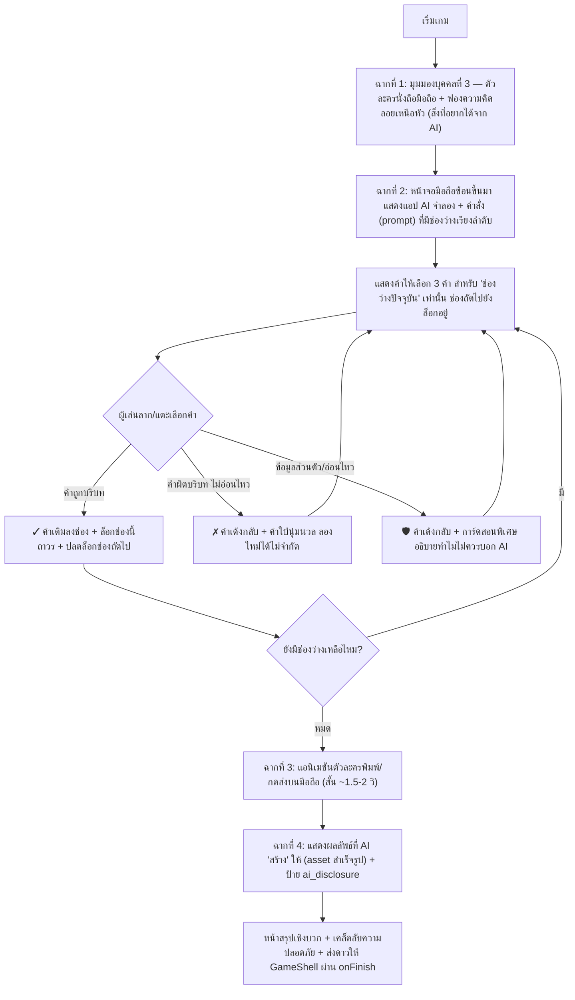

# Detailed Design Document (Prototype): ขอ AI ให้ถูกคำ (Ask the AI the Right Way — AI Prompt Builder)

**สถานะ:** 🧪 Prototype / Concept Draft (ยังไม่เข้าคิว Sprint อย่างเป็นทางการ — เอกสารนี้อยู่นอก pipeline เกม G1–G14 ปัจจุบัน)
**หมวดหมู่:** รูปแบบที่ 1 — เกมตอบคำถาม/ลงมือทำ (Content-Focused, กลไก Drag & Drop เติมคำในช่องว่าง)
**Topic ที่รองรับ:** Topic 3 — AI (คู่กับ [G3 — AI หรือ คน?](../01-mechanics.md) แต่กลับด้าน: G3 สอน "จับสังเกต AI" ส่วนเกมนี้สอน "ใช้ AI ให้เป็นและปลอดภัย")
**ความสำคัญ:** ยังไม่กำหนด — รอทีมจัดลำดับ (ดู [Open Questions](#9-open-questions-คำถามเปิดรอทีมตัดสินใจ) ข้อ 1)
**กลุ่มเป้าหมาย:** ผู้สูงอายุ (อายุ 60 ปีขึ้นไป)
**ผู้ออกแบบ:** Game Designer ทีม NAPLAB (ร่างโดย Claude Code ตามบรีฟผู้ใช้)
**เวอร์ชัน:** 0.1 (Draft แรก) | **อัปเดตล่าสุด:** 2026-09-11
**User Story:** ยังไม่มี — สร้างเมื่อทีมอนุมัติแนวคิดและกำหนด G-number/Sprint แล้ว

---

## 1. Overview (ภาพรวมของเกม)

เกม **"ขอ AI ให้ถูกคำ"** เป็นเกม **ลากคำเติมช่องว่าง (Drag & Drop / Fill-in-the-blank)** ที่สอนผู้สูงอายุว่า **Generative AI ใช้ทำอะไรได้บ้างในชีวิตประจำวัน** และ **ต้องสั่งงาน (prompt) อย่างไรให้ได้ผลลัพธ์ที่ต้องการ โดยไม่หลุดข้อมูลส่วนตัว**

ต่างจากเกมกลุ่ม Topic 3 เดิม (G3 — AI หรือ คน? ที่สอน "แยกแยะของจริง/AI") เกมนี้เป็น **มุมบวก (constructive use)**: ให้ผู้เล่นสวมบทบาทช่วยตัวละครแต่งคำสั่งขอภาพจาก AI ทีละคำ ผ่านสถานการณ์ที่ผู้สูงอายุไทยคุ้นเคยมากที่สุด — **การส่งรูปอวยพรตอนเช้าในกลุ่มไลน์**

หัวใจของเกมมี 2 บทเรียนคู่กัน:
1. **AI Literacy เชิงบวก** — Generative AI ไม่ใช่เรื่องน่ากลัว ใช้สร้างสิ่งดีๆ ในชีวิตประจำวันได้ (ภาพอวยพร, การ์ดวันเกิด ฯลฯ) ถ้ารู้วิธี "สั่ง" ให้ถูก
2. **AI Safety** — คำสั่งที่พิมพ์บอก AI อาจถูกเก็บ/รั่วไหลได้ **ห้ามใส่ข้อมูลส่วนตัว** (เลขบัตรประชาชน, ที่อยู่, เบอร์โทร, ชื่อ-นามสกุลจริง) หรือ **ภาพ/ใบหน้าคนจริงโดยไม่ได้รับอนุญาต** ลงในคำสั่ง — เชื่อมโยงกับนโยบาย AI Content ของโครงการ (ดู [00-concept.md §5](../00-concept.md#5-นโยบายการนำเสนอเนื้อหาที่สร้างจาก-ai-⚠️))

> ⚠️ **กติกาโครงการที่ยึดถือ:** ไม่มีการจับเวลา ไม่มีหน้าจอแพ้ (Game Over) เลือกคำผิด = คำเด้งกลับ + คำใบ้นุ่มนวล ลองใหม่ได้ไม่จำกัดครั้ง ไม่ใช่การลงโทษ ([Art Direction](../03-art-direction.md))

### ข้อจำกัดทางเทคนิคที่ตั้งไว้ตั้งแต่ต้น (ไม่ใช่ Open Question)

**ห้ามเรียก Generative AI API จริงระหว่างเล่นเกม** — ผลลัพธ์ท้ายเกม (ภาพ/ข้อความที่ "AI สร้างให้") ต้องเป็น **asset สำเร็จรูปที่ผลิตไว้ล่วงหน้า (static, deterministic)** ต่อ 1 ชุดคำสั่งที่ถูกต้อง เหตุผล:
- ต้องเล่นออฟไลน์ได้ผ่าน PWA/Service Worker ใน LINE WebView ตามสถาปัตยกรรมโปรเจกต์ ([00-concept.md §2](../00-concept.md#2-technical-stack-ยืนยันแล้ว))
- ควบคุม content safety ได้ 100% — แอปสอนผู้สูงอายุ ห้ามให้ AI จริงสร้างอะไรที่ไม่เหมาะสมโดยไม่ได้ตรวจก่อน
- ต้องติดป้าย `ai_disclosure` ที่ทีมงานรับรองเนื้อหาได้ล่วงหน้าตามนโยบายโครงการ
- ไม่มีต้นทุน API ต่อการเล่นซ้ำไม่จำกัดครั้ง (งบประมาณโครงการจำกัด)

---

## 2. Core Gameplay Loop (วงลูปหลักการเล่น)



---

## 3. Content Structure (โครงสร้างสถานการณ์)

แต่ละ "สถานการณ์" (scenario) = 1 บริบทที่ตัวละครอยากขอ AI ช่วยทำอะไรสักอย่าง ออกแบบให้เป็น **data-driven** เพื่อให้เพิ่มสถานการณ์ใหม่ได้โดยไม่แตะโค้ดเกม (แนวเดียวกับ G4/G8)

### 3.1 สถานการณ์หลัก (v1 — ออกแบบละเอียดในเอกสารนี้): "ภาพอวยพรตอนเช้า"

บริบท: ตัวละครอยากได้ภาพสวัสดีตอนเช้าสวยๆ ไปส่งในกลุ่มไลน์ครอบครัว/เพื่อน — พฤติกรรมที่ผู้สูงอายุไทยคุ้นเคยและทำเป็นประจำอยู่แล้ว ทำให้บริบทเข้าใจง่ายทันทีโดยไม่ต้องอธิบายเพิ่ม

คำสั่ง (prompt template) มี **4 ช่องว่าง** เรียงลำดับตายตัว:

> "สร้างภาพบรรยากาศ **[ช่อง 1]** มี **[ช่อง 2]** พร้อมข้อความอวยพรว่า "**[ช่อง 3]**" ลงท้ายด้วย "**[ช่อง 4]**""

แต่ละช่องมีตัวเลือกคำ **3 คำ**: 1 คำถูก + 1 คำผิดบริบท (ไม่อ่อนไหว แค่ไม่เข้าเรื่อง) + 1 คำดักข้อมูลอ่อนไหว (sensitive-data trap) — สลับประเภทข้อมูลอ่อนไหวไปทุกช่อง เพื่อฝึกให้ผู้เล่น "ระวังทุกช่อง ไม่ใช่แค่บางช่อง"

| ช่อง | คำถาม/label | ✅ คำถูก | ⚠️ คำผิดบริบท | 🛡️ คำดักข้อมูลอ่อนไหว | หมวดข้อมูลอ่อนไหว |
|------|-------------|----------|----------------|------------------------|---------------------|
| 1 | บรรยากาศของภาพ | "เช้าสดใส อบอุ่น" | "มืดมัว น่ากลัว" | "หน้าตาเหมือนดาราคนนี้จริงๆ" | `real-person-likeness` (ใช้ภาพ/ใบหน้าคนจริงโดยไม่ได้รับอนุญาต) |
| 2 | สิ่งของ/ฉากในภาพ | "ดอกไม้และแสงแดดยามเช้า" | "รถแข่งความเร็วสูง" | "เลขบัตรประชาชน 13 หลักของยาย" | `national-id` |
| 3 | ข้อความอวยพร | "สวัสดีตอนเช้า ขอให้มีความสุขทั้งวันนะคะ" | "สูตรทำแกงเขียวหวาน" | "ที่อยู่บ้านเลขที่ 99/1 ซอยลำไย" | `home-address` |
| 4 | ลงท้ายข้อความ | "จากยาย ด้วยความคิดถึง" | "ไม่ต้องเซ็นชื่ออะไรเลย" | "ชื่อ-นามสกุลจริงและเบอร์โทรศัพท์ของยาย" | `full-name-phone` |

หมวดข้อมูลอ่อนไหวใช้ taxonomy ร่วมกับ [G4 — แชร์ดีไหม?](../design-g4.md) (`national-id`, `home-address`) บวกหมวดใหม่เฉพาะ AI (`real-person-likeness`, `full-name-phone`) เพื่อให้ทีมวิชาการวิเคราะห์ข้ามเกมได้

### 3.2 สถานการณ์เสริม (โครงไว้สำหรับ v1.1+ — ยังไม่ลงรายละเอียดเต็ม)

| สถานการณ์ | บริบท | บทเรียนพิเศษที่เพิ่ม |
|-----------|-------|----------------------|
| การ์ดอวยพรวันเกิดหลาน | ขอ AI วาดการ์ดวันเกิดให้หลาน | คำถูกต้องใช้คำเรียกทั่วไป เช่น "หลานคนโปรด" — คำดักคือ "ชื่อจริงและรูปถ่ายจริงของหลาน" (เชื่อมกับหมวด `child-location`/`child-photo` ของ G4 — ห้ามใส่ข้อมูล/รูปเด็กจริงลงคำสั่ง AI) |
| ภาพอวยพรปีใหม่/สงกรานต์ | ขอ AI สร้างภาพอวยพรเทศกาล | เพิ่มความหลากหลายตามฤดูกาล ใช้ prompt template เดียวกัน (โครงสร้าง 4 ช่องเดิม แค่เปลี่ยนคำตัวเลือก) |
| ถามสูตรอาหารง่ายๆ | ขอ AI แนะนำสูตรอาหารจากวัตถุดิบที่มี | โชว์ว่า Generative AI ไม่ใช่แค่ "สร้างภาพ" แต่ตอบเป็นข้อความ/คำแนะนำได้ด้วย (ผลลัพธ์เป็นข้อความแทนภาพ) — ขยายความเข้าใจ "AI ใช้ทำอะไรได้บ้าง" ตามที่ผู้ใช้ตั้งโจทย์ไว้ |

- ทุกสถานการณ์ต้องผ่านการตรวจจากทีมวิชาการ NAPLAB โดยเฉพาะคำถูก/คำผิดบริบทที่ต้องเป็นธรรมชาติสำหรับผู้สูงอายุจริง (ไม่ใช่ภาษาทางการ/ศัพท์เทคนิค)

---

## 4. Content Data Design (คลังสถานการณ์แบบ data-driven)

สถานการณ์ทุกชุดเป็น data-driven (JSON ใน `src/data/`) แนวเดียวกับ `src/data/g4-privacy-items.json` และ `src/data/g8-raft-items.json`

### 4.1 โครงสร้างข้อมูล (`src/data/gproto-prompt-items.json`)

```json
{
  "id": "prompt-01-good-morning",
  "character_thought": "อยากได้ภาพสวัสดีตอนเช้าสดใสๆ ไปส่งในไลน์กลุ่มครอบครัว",
  "prompt_template": "สร้างภาพบรรยากาศ {slot1} มี {slot2} พร้อมข้อความอวยพรว่า \"{slot3}\" ลงท้ายด้วย \"{slot4}\"",
  "slots": [
    {
      "id": "slot1",
      "label": "บรรยากาศของภาพ",
      "order": 1,
      "choices": [
        { "text": "เช้าสดใส อบอุ่น", "type": "correct" },
        { "text": "มืดมัว น่ากลัว", "type": "wrong_context" },
        { "text": "หน้าตาเหมือนดาราคนนี้จริงๆ", "type": "sensitive_pii", "category": "real-person-likeness" }
      ]
    },
    {
      "id": "slot2",
      "label": "สิ่งของ/ฉากในภาพ",
      "order": 2,
      "choices": [
        { "text": "ดอกไม้และแสงแดดยามเช้า", "type": "correct" },
        { "text": "รถแข่งความเร็วสูง", "type": "wrong_context" },
        { "text": "เลขบัตรประชาชน 13 หลักของยาย", "type": "sensitive_pii", "category": "national-id" }
      ]
    },
    {
      "id": "slot3",
      "label": "ข้อความอวยพร",
      "order": 3,
      "choices": [
        { "text": "สวัสดีตอนเช้า ขอให้มีความสุขทั้งวันนะคะ", "type": "correct" },
        { "text": "สูตรทำแกงเขียวหวาน", "type": "wrong_context" },
        { "text": "ที่อยู่บ้านเลขที่ 99/1 ซอยลำไย", "type": "sensitive_pii", "category": "home-address" }
      ]
    },
    {
      "id": "slot4",
      "label": "ลงท้ายข้อความ",
      "order": 4,
      "choices": [
        { "text": "จากยาย ด้วยความคิดถึง", "type": "correct" },
        { "text": "ไม่ต้องเซ็นชื่ออะไรเลย", "type": "wrong_context" },
        { "text": "ชื่อ-นามสกุลจริงและเบอร์โทรศัพท์ของยาย", "type": "sensitive_pii", "category": "full-name-phone" }
      ]
    }
  ],
  "result_asset": "/images/gproto/good-morning-result.png",
  "result_caption": "🌅 สวัสดีตอนเช้า ขอให้มีความสุขทั้งวันนะคะ — จากยาย ด้วยความคิดถึง",
  "ai_disclosure": true,
  "safety_tip": "ไม่บอกข้อมูลส่วนตัว เช่น เลขบัตร ที่อยู่ เบอร์โทร หรือหน้าคนจริง กับ AI นะคะ"
}
```

- `choices` ในแต่ละ slot **สุ่มลำดับการแสดงผล** ทุกครั้ง (ไม่ตรึงตำแหน่ง) เพื่อไม่ให้จำตำแหน่งแทนการอ่านความหมาย
- `type: sensitive_pii` ต้องมี `category` เสมอ เพื่อให้การ์ดสอน (Teach) เลือกคำอธิบายที่ตรงหมวด และให้ทีมวิชาการวิเคราะห์ข้ามเกมกับ G4 ได้
- `result_asset` เป็นภาพ/ข้อความสำเร็จรูป **1 ชุดคงที่ต่อสถานการณ์** ไม่สุ่ม ไม่เรียก AI จริง (ดู [§1 ข้อจำกัดทางเทคนิค](#ข้อจำกัดทางเทคนิคที่ตั้งไว้ตั้งแต่ต้น-ไม่ใช่-open-question))
- ภาพประกอบทั้งหมด (ตัวละคร, ฉาก, result_asset) เป็นภาพวาด/จำลอง ไม่ใช้ภาพบุคคลจริง — ถ้าใช้ AI ช่วยผลิตต้องตั้ง `ai_disclosure: true` ตาม[นโยบาย AI Content](../00-concept.md#5-นโยบายการนำเสนอเนื้อหาที่สร้างจาก-ai-⚠️)

---

## 5. Screen Layout (การจัดหน้าจอ — Portrait เท่านั้น)

### ฉากที่ 1 — เปิดเรื่อง (มุมมองบุคคลที่ 3)

```
+---------------------------------------------------+
|  GameShell: progress dots ● ○ ○ ○   🔊 เสียงอ่าน   |
+---------------------------------------------------+
|                                                   |
|               ( 🌸💭 ... )  <- ฟองความคิด           |
|                 (｡•‿•｡)                           |
|              [ตัวละคร นั่งถือมือถือ]                 |
|                                                   |
|   "วันนี้อยากได้ภาพสวัสดีตอนเช้าสวยๆ ไปแชร์ในไลน์"     | -> ข้อความ ≥ 22px
|                                                   |
|                [ แตะเพื่อไปต่อ → ]                  | -> ปุ่ม ≥ 56px
+---------------------------------------------------+
```

### ฉากที่ 2 — เติมคำสั่ง (หน้าจอมือถือซ้อนขึ้นมา)

```
+---------------------------------------------------+
|  📱 แอป AI (จำลอง)                                 |
+---------------------------------------------------+
|  สร้างภาพบรรยากาศ [ ? ]  <- ช่องปัจจุบัน (ไฮไลต์เรืองแสง) |
|  มี [ ⋯⋯⋯ ]                 <- ช่องถัดไป (ล็อก/จาง)   |
|  ข้อความว่า "[ ⋯⋯⋯ ]"        <- ล็อก                 |
|  ลงท้ายด้วย "[ ⋯⋯⋯ ]"        <- ล็อก                 |
+---------------------------------------------------+
|          เลือกคำที่ใช่ ใส่ในช่องที่ไฮไลต์               |
|  +------------+  +------------+  +------------+    |
|  | เช้าสดใส    |  | มืดมัว      |  | หน้าเหมือน   |    | -> การ์ดคำ ≥ 48×48px
|  | อบอุ่น      |  | น่ากลัว     |  | ดาราคนนี้    |    |
|  +------------+  +------------+  +------------+    |
|     (ลากคำ หรือ แตะคำแล้วแตะช่องที่ไฮไลต์ ได้ทั้งสองแบบ) |
+---------------------------------------------------+
```

- **ช่องว่างที่ยังไม่ถึงคิว** แสดงเป็นเส้นประจางๆ (ไม่ใช่ปุ่มกดได้) — ป้องกันผู้เล่นข้ามลำดับ ตามกติกาเกมที่ต้องเติมเรียงจากช่องแรกไปช่องสุดท้าย
- **การ์ดคำ 3 ใบ** สุ่มตำแหน่งทุกรอบ, ตัวอักษร ≥ 20px, มีทั้งไอคอนมือจับ (drag handle) และรองรับการแตะเลือก
- ตอบผิดบริบท: การ์ดคำสั่นเบาๆ (shake) แล้วเด้งกลับที่เดิม + tooltip คำใบ้ เช่น "ลองดูคำที่บอกบรรยากาศของภาพมากกว่านี้นะคะ"
- ตอบด้วยข้อมูลอ่อนไหว: การ์ดคำเปลี่ยนเป็นไอคอน 🛡️ ชั่วครู่ แล้วเปิดการ์ดสอนแบบเต็มจอทับ (ดู §6)

### ฉากที่ 3 — แอนิเมชันพิมพ์/ส่ง (สั้น ~1.5–2 วินาที)

ตัวละครก้มมองจอ นิ้วแตะหน้าจอ + จุดไข่ปลาโหลดพร้อมไอคอนประกาย ✨ ข้อความ "กำลังสร้างภาพให้..." — ถ้า `prefers-reduced-motion` เปลี่ยนเป็น fade ตรงไปหน้าผลลัพธ์ทันที ไม่มีแอนิเมชันพิมพ์

### ฉากที่ 4 — ผลลัพธ์

```
+---------------------------------------------------+
|   ✨ AI สร้างภาพให้แล้ว!                            |
+---------------------------------------------------+
|        +-------------------------------+          |
|        |   [ภาพดอกไม้ยามเช้า + ข้อความ]   |          | -> result_asset
|        |   "สวัสดีตอนเช้า ขอให้มีความสุข   |          |
|        |    ทั้งวันนะคะ" — จากยาย         |          |
|        +-------------------------------+          |
|                                                   |
|   ⚠️ ภาพนี้สร้างโดย AI เพื่อการเรียนรู้              | -> ai_disclosure (บังคับ)
|                                                   |
|   💡 เคล็ดลับ: ไม่บอกข้อมูลส่วนตัว (เลขบัตร ที่อยู่     | -> safety_tip
|      เบอร์โทร หน้าคนจริง) กับ AI นะคะ                |
|                                                   |
|              [ ไปต่อ → ]                          | -> ปุ่ม ≥ 56px
+---------------------------------------------------+
```

ทุกข้อความ ≥ 20px, ปุ่ม ≥ 22px, Contrast ≥ 4.5:1, Touch target ≥ 48×48px ตาม [Art Direction](../03-art-direction.md)

---

## 6. Interaction & Accessibility (กลไกการโต้ตอบ — สำคัญมากสำหรับกลุ่มเป้าหมาย)

> เกมนี้ตั้งต้นเป็น "เกมลากคำ" ตามโจทย์ แต่ **drag gesture จริงบนมือถือมักใช้ยากสำหรับผู้สูงอายุ** (นิ้วสั่น, กดค้างไม่มั่นคง) — จึงออกแบบให้รองรับ **2 วิธีป้อนข้อมูลเทียบเท่ากัน** ไม่ใช่ให้ tap เป็นแค่ fallback สำรอง:

1. **ลาก (Drag):** กดค้างที่การ์ดคำแล้วลากไปปล่อยที่ช่องว่างที่ไฮไลต์
2. **แตะเลือก (Tap-to-place):** แตะการ์ดคำ 1 ครั้ง (การ์ดจะไฮไลต์ว่าเลือกอยู่) แล้วแตะช่องว่างที่ไฮไลต์อีกครั้งเพื่อวาง

ทั้งสองวิธีต้องให้ผลลัพธ์เหมือนกันทุกประการ (ตรวจ/เด้งกลับ/ล็อกช่อง) — ทีมพัฒนาควรใช้ pointer events หรือ library ที่รองรับทั้ง touch/drag/keyboard (เช่น `@dnd-kit`) แทน native HTML5 Drag-and-Drop API ที่รองรับ touch ได้ไม่ดีพอ

- ไม่มีการจับเวลาเลือกคำ — คิดได้นานเท่าที่ต้องการ (ตามกติกาโครงการ ไม่มีแรงกดดันเรื่องเวลา)
- ช่องว่างที่ยังไม่ถึงคิว **ต้องไม่รับการวาง/แตะ** เพื่อบังคับลำดับ แต่ควรมีคำอธิบายสั้นๆ ถ้าผู้เล่นพยายามแตะช่องที่ยังไม่ปลดล็อก (เช่น สั่นเบาๆ) ไม่ใช่เงียบเฉยจนดูเหมือนเกมค้าง

---

## 7. Answer Logic & Positive Reinforcement (ตรรกะคำตอบ + การเสริมแรงเชิงบวก)

| ผู้เล่นเลือก | ผลลัพธ์ | Feedback |
|-------------|---------|----------|
| คำถูกบริบท (`correct`) | ✓ เติมลงช่อง + ล็อกช่องถาวร + ปลดล็อกช่องถัดไป | เสียงชื่นชมสั้นๆ + ไม่หยุดจังหวะเกมด้วยการ์ดอธิบายยาว |
| คำผิดบริบท ไม่อ่อนไหว (`wrong_context`) | ✗ เด้งกลับที่เดิม ไม่ล็อก ลองใหม่ได้ไม่จำกัดครั้ง | คำใบ้นุ่มนวลเฉพาะช่อง ไม่มีการนับพลาด/ไม่มีบทลงโทษ |
| ข้อมูลส่วนตัว/อ่อนไหว (`sensitive_pii`) | 🛡️ เด้งกลับ + เปิดการ์ดสอนพิเศษเต็มจอ | อธิบายเหตุผลตาม `category` เฉพาะ เช่น "ข้อมูลที่พิมพ์บอก AI อาจถูกเก็บไว้หรือหลุดออกไปได้ ไม่ควรใส่เลขบัตร/ที่อยู่/เบอร์โทร/หน้าคนจริงนะคะ" — โทนเป็นการ "สอน" ไม่ใช่ "ตำหนิ" |

- **การนับดาว (เบื้องหลัง):** คำนวณจากสัดส่วนช่องที่เติม **ถูกตั้งแต่ครั้งแรก** (ไม่มีการลองผิดก่อน) จากทั้งหมด — ≥80% = 3 ดาว, ≥50% = 2 ดาว, ต่ำกว่า = 1 ดาว (ขั้นต่ำ 1 ดาวเสมอ)
- หน้าสรุปโชว์เฉพาะ **ดาว + คำชม + เคล็ดลับความปลอดภัย** ไม่โชว์จำนวนครั้งที่พลาด/เลือกข้อมูลอ่อนไหว (เพื่อไม่ให้รู้สึกถูกจับผิด)
- **จบเสมอ = ผ่านเสมอ** ไม่มีเงื่อนไขแพ้ (สอดคล้อง Win/Lose ของโครงการ)

---

## 8. Art Direction & Motion (ทิศทางภาพและการเคลื่อนไหว)

- โทนภาพสว่างสบายตา ใช้ token หลักโครงการ (teal `--primary`) — การ์ดคำขอบโค้ง เงานุ่ม คล้ายชิป (chip) มือจับชัดเจน
- การ์ดคำที่ถูกลาก/แตะ: ขยายเล็กน้อย (scale ~1.05) พร้อมเงาลอยระหว่างเคลื่อนที่ แล้ว snap เข้าช่องแบบนุ่มนวล ~200ms
- ช่องว่างที่ไฮไลต์: ขอบเรืองแสง teal กะพริบช้าๆ (ไม่ถี่จนรบกวนสายตา) เพื่อดึงความสนใจไปที่คิวปัจจุบัน
- แอนิเมชันพิมพ์ (ฉากที่ 3): สั้น กระชับ ไม่เกิน 2 วินาที ไม่บังคับดูซ้ำ
- `prefers-reduced-motion`: ปิด scale/shake/กะพริบทั้งหมด เปลี่ยนเป็น fade แทน
- ✓ เขียว / ✗ ส้มอ่อน / 🛡️ ฟ้า — ทุกจุดมีไอคอนกำกับ ไม่พึ่งสีอย่างเดียว

---

## 9. Technical Implementation Details (สเปกทางเทคนิค)

### Component & Integration
- ชื่อ Component ชั่วคราว: **`GPromptBuilder`** (ยังไม่ผูก G-number จนกว่าทีมจะอนุมัติเข้า pipeline อย่างเป็นทางการ) — เมื่อ promote แล้วควรย้าย/rename ตามแบบแผน G-number เดิมและวางใน `src/components/`
- คุยกับ `GameShell` ผ่าน props มาตรฐาน `onFinish(stars)` + `logEvent` ไม่สร้าง layout/progress dots เอง
- เขียนเป็น **`.tsx`** ตั้งแต่ต้น
- Interaction layer แนะนำ `@dnd-kit` (หรือเทียบเท่าที่รองรับ pointer + touch + keyboard) — ไม่ใช้ native HTML5 Drag-and-Drop API ตาม [§6](#6-interaction--accessibility-กลไกการโต้ตอบ--สำคัญมากสำหรับกลุ่มเป้าหมาย)
- คลังสถานการณ์: `src/data/gproto-prompt-items.json`
- รองรับปุ่มเสียงอ่านคำสั่ง/คำตัวเลือก (TTS/เสียงอัด) — reuse กลไก Volume2/VolumeX แบบ G1/G3 ถ้าทีมยืนยันว่าต้องมี (ดู Open Questions ข้อ 5)
- ผลลัพธ์ (`result_asset`) เป็นไฟล์ภาพ/ข้อความสำเร็จรูปใน `public/images/gproto/` — **ไม่มีการเรียก API ภายนอกระหว่างเล่น**
- เมื่อพร้อม demo ให้ลงทะเบียนใน Dev Game Hub (`src/app/dev/games/page.tsx`) ด้วย `status: "prototype"`

### Event Logging (ทุก action สำคัญต้องยิง log)

```javascript
logEvent('game_start',      { game_id: 'gproto-prompt' });
logEvent('slot_attempt',    { game_id: 'gproto-prompt', item_id: 'prompt-01-good-morning', slot_id: 'slot2', choice_type: 'sensitive_pii', category: 'national-id', correct: false });
logEvent('slot_complete',   { game_id: 'gproto-prompt', item_id: 'prompt-01-good-morning', slot_id: 'slot2', attempts: 2 });
logEvent('prompt_complete', { game_id: 'gproto-prompt', item_id: 'prompt-01-good-morning' });
logEvent('result_view',     { game_id: 'gproto-prompt', item_id: 'prompt-01-good-morning' });
logEvent('game_complete',   { game_id: 'gproto-prompt', stars: 3, total_slots: 4 });
```

ข้อมูล `slot_attempt` แยกตาม `choice_type` + `category` มีค่ามากต่อทีมวิชาการ — ใช้วิเคราะห์ว่าผู้สูงอายุ "เกือบ" ใส่ข้อมูลอ่อนไหวประเภทไหนบ่อยที่สุดตอนคุยกับ AI เพื่อเน้นเนื้อหาอบรม

---

## 10. Open Questions (คำถามเปิดรอทีมตัดสินใจ)

1. **G-number / ลำดับความสำคัญ:** ยังไม่ได้กำหนดว่าเกมนี้จัดเป็น Must/Should/Nice หรือ Sprint ไหน — ต้องให้ทีมพิจารณาเทียบกับ G1–G14 ที่มีอยู่
2. **ตัวละครหลัก:** เอกสารนี้ใช้ placeholder "ยาย" ไม่มีชื่อ/ลุคจริง — รอทีมศิลป์ออกแบบให้สอดคล้องกับตัวละครอื่นในโปรเจกต์ (ถ้ามีการกำหนด mascot กลาง)
3. **จำนวนสถานการณ์สำหรับ v1:** เอกสารนี้ออกแบบเต็ม 1 สถานการณ์ (ภาพอวยพรตอนเช้า) + โครงอีก 3 แบบคร่าวๆ — พอสำหรับ prototype demo หรือทีมต้องการมากกว่านี้ก่อนเข้า sprint จริง
4. **Drag จริง vs Tap-to-place:** ต้อง usability test กับผู้สูงอายุจริงว่า drag gesture ใช้ยากไปไหม หรือควรให้ tap-to-place เป็นค่าเริ่มต้นหลักแทน
5. **TTS/เสียงอ่าน:** จำเป็นต้องอ่านออกเสียงคำสั่ง/คำตัวเลือกทุกคำเหมือนเกมอื่นไหม (กระทบเวลาผลิตเสียง)
6. **จำนวน result asset ต่อสถานการณ์:** ใช้ผลลัพธ์เดียวคงที่ หรือมีหลายแบบสุ่มเปลี่ยนเล็กน้อยเพื่อให้เล่นซ้ำไม่จำเจ

## Related Documents
- นโยบาย AI Content (บังคับ): [Concept §5](../00-concept.md#5-นโยบายการนำเสนอเนื้อหาที่สร้างจาก-ai-⚠️)
- Tech Stack / PWA offline constraint: [Concept §2](../00-concept.md#2-technical-stack-ยืนยันแล้ว)
- กติกา UI/UX บังคับ: [Art Direction](../03-art-direction.md)
- Mechanics รวม / การจัดกลุ่มรูปแบบเกม: [Core Mechanics](../01-mechanics.md)
- หมวดข้อมูลอ่อนไหวที่ใช้ร่วมกัน (`national-id`, `home-address` ฯลฯ): [G4 — แชร์ดีไหม?](../design-g4.md)
- เกมพี่น้อง Topic 3 (มุมตรวจจับ AI): G3 — AI หรือ คน? (ดู [Core Mechanics](../01-mechanics.md))
- Product Backlog (สำหรับสร้าง User Story เมื่ออนุมัติ): [01-product-backlog.md](../../agile/01-product-backlog.md)
