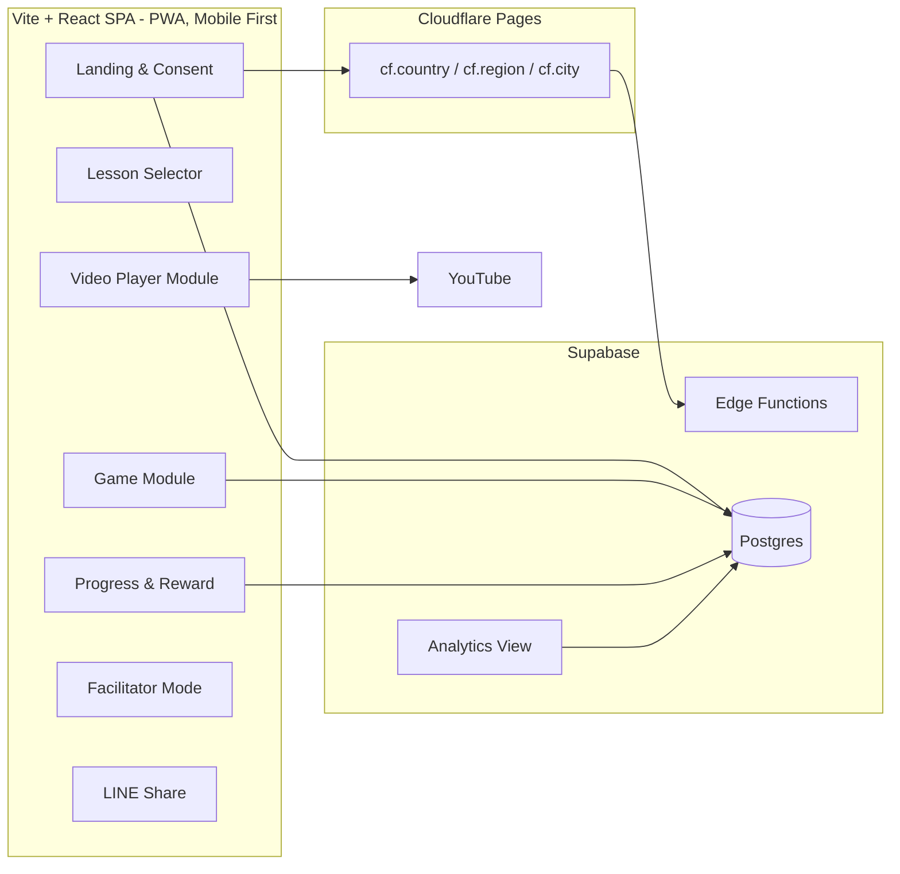

# รู้ทันสื่อ Interactive — System Design

**Version:** 1.2 | **Last Updated:** 2026-07-03
**สถานะ:** 🟢 Stack ยืนยันแล้ว — Vite+React (PWA) / Supabase / Cloudflare Pages

## Subsystem Breakdown

### 1. Landing & Consent Module
- หน้าทักทาย + ฟอร์มอายุ (ปุ่มช่วงอายุ) + ขอความยินยอมเก็บตำแหน่ง (Geolocation + IP — ปฏิเสธได้)
- สร้าง anonymous session id เก็บแบบข้ามระบบจำสถานะ (Hybrid: LocalStorage + Cookies) เพื่อป้องกันข้อมูลหายเมื่อเล่นผ่าน LINE In-App Browser — **ไม่มีระบบ login**

### 2. Lesson Selector & Sequence Engine
- อ่านโครงสร้างบทเรียนจาก config (ลำดับ: คลิป → เกม → บทถัดไป)
- จำความคืบหน้า (ดาว) จาก localStorage + sync ขึ้น backend
- รองรับ deep link ต่อบทเรียน (`/lesson/:id`) สำหรับแชร์ใน LINE

### 3. Video Player Module
- YouTube iframe embed (คลิปแนวตั้ง 9:16) ผ่าน YouTube IFrame API เพื่อจับ event "ดูจบ"
- Fallback: ปุ่มเปิดใน YouTube app หาก embed เล่นไม่ได้ใน LINE browser
- บันทึก event: เริ่มดู / ดูจบ

### 4. Game Module
- เกมย่อย G1–G5 (ดูสเปกที่ [Core Mechanics](../gdd/01-mechanics.md))
- โครงสร้างร่วม: `GameShell` (โจทย์ทีละข้อ, เฉลย, progress dots, เสียงอ่าน) + game type plugins (quiz / tap-to-spot / swipe / scenario)
- ข้อมูลโจทย์เป็น content file (JSON) แยกจากโค้ด — ทีมเนื้อหาแก้ได้โดยไม่ต้อง build ใหม่
- Engine: เริ่มจาก HTML/JS + CSS animation; ใช้ Phaser 3 เฉพาะเกมที่ต้อง canvas จริง ๆ (ลดขนาดโหลดสำหรับเน็ตช้า)

### 5. Progress & Reward Module
- ดาวต่อบท, ใบประกาศเมื่อครบหลักสูตร (render เป็นภาพให้บันทึก/แชร์)

### 6. Facilitator Mode
- Layout ขยายสำหรับโปรเจกเตอร์, คู่มือพูดประกอบต่อบท, โหมดตอบแบบกลุ่ม
- เข้าผ่านลิงก์เฉพาะ (`/facilitator`) ไม่ต้องมีระบบสิทธิ์ซับซ้อนในเฟสแรก

### 7. Data Collection & Analytics Subsystem
- **Session Sync Module:** เชื่อมโยงและตรวจสอบ Session ID + ข้อมูลอายุ ระหว่าง LocalStorage และ Cookie (Max-Age 1 ปี, SameSite=Lax) อัตโนมัติ ป้องกันข้อมูลหายบน WebView ของมือถือ
- **IP Geolocation Parser:** ใช้ค่า `request.cf.country/region/city` ที่ Cloudflare Pages ใส่มาให้ในทุก request โดยตรง (ไม่ต้องเรียก MaxMind/API ภายนอกหรือเก็บ IP ดิบเลย — Cloudflare แปลงให้ที่ edge ก่อนถึงแอปแล้ว) ตรงกับหลัก PDPA แบบ by-design
- **Hybrid Location Selector:** กรอกจังหวัดเริ่มต้นให้ผู้ใช้โดยอัตโนมัติจาก IP ในขั้นตอน Consent และมี Dropdown อำเภอ/ตำบล ให้ผู้ใช้ยืนยันหรือเลือกเอง เพื่อข้อมูลเชิงพื้นที่ที่ถูกต้องแม่นยำสูง
- **Event Logging Controller:** โมดูลรับคำสั่งกดปุ่ม/การตอบสนองกิจกรรมของผู้ใช้ (เช่น กดเล่นวิดีโอ, กดใบประกาศ, เปิดเสียงอ่าน) แล้วบันทึกแบบ Asynchronous ลงตาราง `action_logs` พร้อม Timestamp
- **Dashboard:** แดชบอร์ดวิเคราะห์จำนวนผู้เรียนรายพื้นที่ (จังหวัด/ตำบล), พฤติกรรมการเล่น/ดูวิดีโอ, และสถิติการตอบผิดของเกมเพื่อใช้ประเมินผลโครงการ
- ดูรายละเอียดที่ [Data Schema](./03-data-schema.md) — รวมประเด็น PDPA

## Non-Functional Requirements

| ด้าน | ข้อกำหนด |
|------|----------|
| อุปกรณ์เป้าหมาย | Android ราคาประหยัด/รุ่นเก่า, เปิดผ่าน LINE in-app browser |
| ประสิทธิภาพ | First load < 3s บน 3G; asset รวมต่อหน้า < 1MB |
| Offline | ไม่บังคับในเฟสแรก แต่ให้เกมเล่นต่อได้แม้ sync ล้มเหลว (queue ไว้ผ่าน service worker) |
| ความปลอดภัยข้อมูล | ไม่เก็บชื่อ-เบอร์-ข้อมูลระบุตัวตน; ตำแหน่งเก็บระดับหยาบ (ตำบล/พิกัดปัดเศษ) |
| ภาษา | ไทยเท่านั้น (เฟสแรก) |
| Installability | PWA (manifest + service worker) เป็น bonus ไม่ใช่เส้นทางหลัก — LINE in-app browser ไม่รองรับ install prompt โดยตรง (ดู[หมายเหตุ PWA](../gdd/00-concept.md#หมายเหตุเรื่อง-pwa)) |

## Open Decisions

- [x] Backend: **Supabase** (Postgres + Edge Functions)
- [x] Frontend framework: **Vite + React** + `vite-plugin-pwa`
- [x] Hosting + IP Geolocation: **Cloudflare Pages** (ใช้ `request.cf.*` แทนบริการภายนอก)
- [x] ระดับความละเอียดของตำแหน่งที่เก็บ: บันทึกจังหวัด/อำเภอจาก Cloudflare + ให้เลือกอำเภอ/ตำบลเพิ่มแบบ Manual (ไม่เก็บพิกัดดิบและ Raw IP ภายใต้ PDPA)
- [ ] เสียงอ่านโจทย์: อัดเสียงจริง vs TTS (กระทบงบและนโยบาย AI content)

## Related Documents
- Concept: [Concept & Architecture](../gdd/00-concept.md)
- Mechanics: [Core Mechanics](../gdd/01-mechanics.md)
- Data: [Data Schema](./03-data-schema.md)
- Backlog: [Product Backlog](../agile/01-product-backlog.md)
