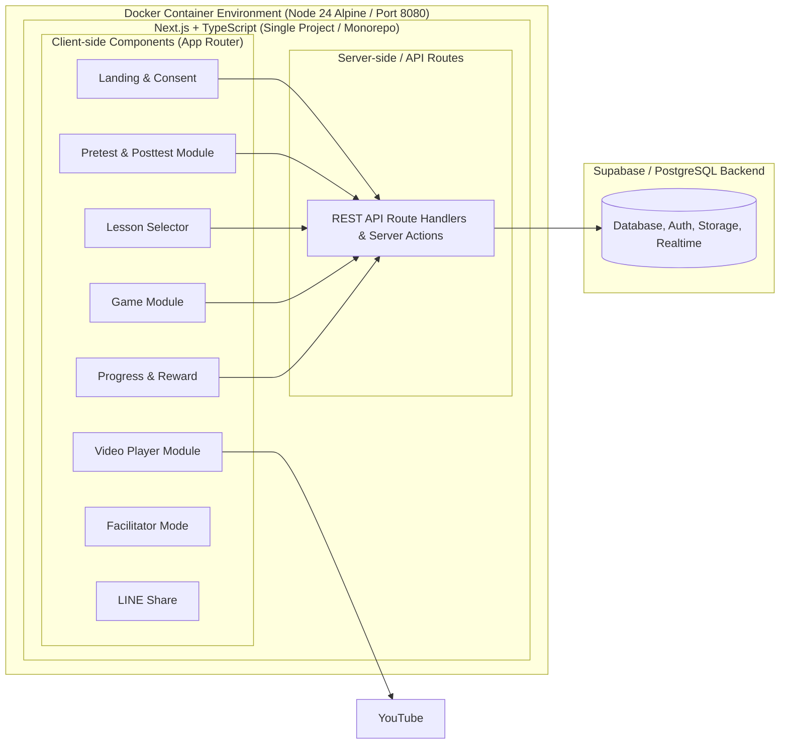

# รู้ทันสื่อ Interactive — System Design

**Version:** 1.7 | **Last Updated:** 2026-07-31
**สถานะ:** 🟢 Stack ยืนยันแล้ว — Next.js + TypeScript + Supabase (Database, Auth, Storage, Real-time) + Docker Container (Portainer CAMT)

## Subsystem Breakdown

### 1. Landing & Consent Module
- หน้าทักทาย + ฟอร์มอายุ (ปุ่มช่วงอายุ) + ขอความยินยอมเก็บและเลือกตำแหน่งผ่าน UI Dropdown (จังหวัด/อำเภอ/ตำบล) ที่ผู้เรียนเลือกเอง
- สร้าง anonymous session id เก็บแบบข้ามระบบจำสถานะ (Hybrid: LocalStorage + Cookies) เพื่อป้องกันข้อมูลหายเมื่อเล่นผ่าน LINE In-App Browser — **ไม่มีระบบ login**

### 2. Lesson Selector & Sequence Engine
- อ่านโครงสร้างบทเรียนจาก config (ลำดับ: คลิป → เกม → บทถัดไป)
- จำความคืบหน้า (ดาว) จาก localStorage + sync ขึ้น backend
- รองรับ deep link ต่อบทเรียน (`/lesson/:id`) สำหรับแชร์ใน LINE

### 3. Video Player Module
- YouTube iframe embed (คลิปแนวตั้ง 9:16) ผ่าน YouTube IFrame API เพื่อจับ event "ดูจบ"
- Fallback: ปุ่มเปิด in YouTube app หาก embed เล่นไม่ได้ใน LINE browser
- บันทึก event: เริ่มดู / ดูจบ

### 4. Game Module
- เกมย่อย G1–G5 (ดูสเปกที่ [Core Mechanics](../gdd/01-mechanics.md))
- โครงสร้างร่วม: `GameShell` (โจทย์ทีละข้อ, เฉลย, progress dots, เสียงอ่าน) + game type plugins (quiz / tap-to-spot / swipe / scenario)
- ข้อมูลโจทย์เป็น content file (JSON) แยกจากโค้ด — ทีมเนื้อหาแก้ได้โดยไม่ต้อง build ใหม่
- Engine: เริ่มจาก HTML/JS + CSS animation; ใช้ Phaser 3 เฉพาะเกมที่ต้อง canvas จริง ๆ (ลดขนาดโหลดสำหรับเน็ตช้า)

### 5. Progress & Reward Module
- ดาวต่อบท, ใบประกาศเมื่อครบหลักสูตร (render เป็นภาพให้บันทึก/แชร์)

### 6. Facilitator Mode
- Layout ขยายสำหรับโปรเจกเตอร์, คู่มือพูดประกอบต่อบท, โหมดตอบแบบกลุ่ม
- เข้าผ่านลิงก์เฉพาะ (`/facilitator`) ไม่ต้องมีระบบสิทธิ์ซับซ้อนในเฟสแรก

### 7. Data Collection & Analytics Subsystem
- **Session Sync Module:** เชื่อมโยงและตรวจสอบ Session ID + ข้อมูลอายุ ระหว่าง LocalStorage และ Cookie (Max-Age 1 ปี, SameSite=Lax) อัตโนมัติ ป้องกันข้อมูลหายบน WebView ของมือถือ
- **UI Location Selector:** ผู้เรียนเลือกจังหวัด/อำเภอ/ตำบลเองจากรายการท้องถิ่น (เชียงใหม่ แพร่ น่าน และตัวเลือกอื่น ๆ) ไม่ดึงพิกัด GPS เพราะพิกัดมักไม่ตรง และผู้เรียนอาจต้องการกรอกบ้านเกิดหรือที่อยู่ปัจจุบันตามความประสงค์ — สอดคล้องกับหลัก PDPA ที่เก็บเฉพาะพื้นที่ที่ผู้เรียนตั้งใจเลือก
- **Event Logging Controller:** โมดูลรับคำสั่งกดปุ่ม/การตอบสนองกิจกรรมของผู้ใช้ (เช่น กดเล่นวิดีโอ, กดใบประกาศ, เปิดเสียงอ่าน) แล้วบันทึกแบบ Asynchronous ผ่าน REST API Route Handlers (`/api/action-logs`) ลงตาราง `action_logs` ในฐานข้อมูล PostgreSQL ของ Supabase
- **User Access Logging (Page Views):** ระบบติดตามการเข้าชมหน้าจอต่างๆ แบบ real-time รวมถึงแหล่งที่มาจาก LINE (Referrer) และระยะเวลาการใช้เวลาในแต่ละหน้าจอ (Duration) บันทึกลงตาราง `page_views` เพื่อวัดพฤติกรรมการเล่น
- **Pretest & Posttest Tracking:** จัดส่งและซิงก์ผลลัพธ์คะแนน pretest/posttest, ประวัติการตอบคำถามในแต่ละข้อ, และเวลาที่ทำแบบสอบถามสำเร็จ ไปบันทึกลงตาราง `quiz_attempts` และ `quiz_answers` ใน Supabase เพื่อให้ทีมประเมินผลนำไปเปรียบเทียบความก้าวหน้าของผู้เรียน
- **Dashboard:** แดชบอร์ดวิเคราะห์จำนวนผู้เรียนรายพื้นที่ (จังหวัด/ตำบล), พฤติกรรมการเล่น/ดูวิดีโอ, และสถิติการตอบผิดของเกมเพื่อใช้ประเมินผลโครงการ
- ดูรายละเอียดที่ [Data Schema](./03-data-schema.md) — รวมประเด็น PDPA

### 8. Pretest & Posttest Module
- **Pretest Screen:** หน้าจอแบบทดสอบวัดความรู้ก่อนเรียน มีเงื่อนไขการเข้าถึงทันทีหลังจากกดยินยอมนโยบายข้อมูล (Consent) และเลือกช่วงอายุเสร็จ ก่อนได้รับอนุญาตให้เข้าเรียนบทที่ 1
- **Posttest Screen:** หน้าจอแบบทดสอบวัดความรู้หลังเรียน มีเงื่อนไขการเปิดใช้งานอัตโนมัติเมื่อผู้เรียนเรียนจบครบทุกบทเรียนและสะสมดาวได้ครบตามกำหนดก่อนเข้ารับใบประกาศเกียรติคุณ (Certificate)
- **Quiz Processing Engine:** ส่วนควบคุมการแสดงผลข้อสอบ ตัวเลือกคำตอบ คีย์คำตอบ (ตรวจถูก/ผิด) และคำนวณคะแนนฝั่ง Client พร้อมจัดเก็บสถานะผลลัพธ์เพื่อนำส่งผ่าน API หรือ Server Actions ขึ้นฐานข้อมูล Supabase

### 9. Deployment & Container Subsystem (Docker & Portainer)
- **Multi-stage Docker Build:** แพ็กเกจ Next.js 16 ด้วย `node:24-alpine` แยกสเตจ `dependencies`, `build` และ `runner` เพื่อลดขนาดคอนเทนเนอร์และเพิ่มความปลอดภัยใน Production
- **Build Placeholder Strategy:** ใช้อาร์กิวเมนต์ `BUILD_DATABASE_URL` จำลองช่วงสั่ง `npm run build` เพื่อให้ Next.js รวบรวมข้อมูล Route Metadata สำเร็จโดยไม่ต้องพึ่งพาลิงก์ฐานข้อมูลจริง
- **Container Execution:** รันแอปพลิเคชันผ่านคำสั่ง `npm run start` บนพอร์ต internal `8080` พร้อมระบบ `HEALTHCHECK` อัตโนมัติ (`wget`)
- **Portainer Stack Deployment:** ติดตั้งและบริหารจัดการผ่านไฟล์ Stack `docker-compose.portainer.yml` บนเครื่องแม่ข่าย CAMT (แมปพอร์ตโฮสต์ `10980:8080`) โดยส่งผ่านค่าคอนฟิก `DATABASE_URL` และ `ENABLE_DEV_HUB` ผ่าน Environment Variables ตอน runtime โดยไม่ต้อง Rebuild Image ใหม่

## Non-Functional Requirements

| ด้าน | ข้อกำหนด |
|------|----------|
| อุปกรณ์เป้าหมาย | Android ราคาประหยัด/รุ่นเก่า, เปิดผ่าน LINE in-app browser |
| ประสิทธิภาพ | First load < 3s บน 3G; asset รวมต่อหน้า < 1MB |
| Offline | ไม่บังคับในเฟสแรก แต่ให้เกมเล่นต่อได้แม้ sync ล้มเหลว (queue ไว้ผ่าน service worker) |
| ความปลอดภัยข้อมูล | ไม่เก็บชื่อ-เบอร์-ข้อมูลระบุตัวตน; ตำแหน่งเก็บระดับหยาบ (ตำบล/พิกัดปัดเศษ) |
| ภาษา | ไทยเท่านั้น (เฟสแรก) |
| Installability | PWA (manifest + service worker) เป็น bonus ไม่ใช่เส้นทางหลัก — LINE in-app browser ไม่รองรับ install prompt โดยตรง (ดู[หมายเหตุ PWA](../gdd/00-concept.md#หมายเหตุเรื่อง-pwa)) |

## Open Decisions

- [x] Core Framework: **Next.js (App Router) + TypeScript** (จัดการทั้ง Frontend, Backend และ Server API ในโปรเจกต์เดียว)
- [x] UI & Styling: **Tailwind CSS** (สำหรับจัดสไตล์ด้วย Utility-first CSS) + **shadcn/ui** (Component Library ที่มี Radix UI เป็นพื้นฐานและปรับแต่งโค้ดได้ง่ายในระบบ)
- [x] Form & Validation: **React Hook Form** (จัดการสถานะของฟอร์มฝั่ง Client) + **Zod** (ทำ Schema Validation ตรวจสอบข้อมูลทั้งฝั่ง Client และ Server API)
- [x] Database, Auth & Storage: **Supabase** (รวบรวม PostgreSQL Database, Authentication, Storage และระบบ Real-time ไว้อย่างเบ็ดเสร็จในที่เดียว)
- [x] Container & Deployment: **Multi-stage Dockerfile (Node 24 Alpine) + Portainer Stack (CAMT VM)** (รันบนพอร์ต 8080/10980 พร้อม Dynamic Runtime Environment Configuration)
- [x] Testing: **Vitest** (ทดสอบ Logic, ฟังก์ชันคำนวณคะแนน และ Schema Validation) + **Playwright** (ทดสอบ E2E Flow การใช้งานจริงบน LINE In-App Browser จำลอง)
- [x] Geolocation: **Dropdown จังหวัด/อำเภอ/ตำบล ที่ผู้เรียนเลือกเอง** (ไม่ใช้ GPS, ไม่ใช้ GeoIP ผ่าน Cloudflare Pages หรือบริการ IP Geolocation ภายนอก)
- [ ] เสียงอ่านโจทย์: อัดเสียงจริง vs TTS (กระทบงบและนโยบาย AI content)

## Related Documents
- Concept: [Concept & Architecture](../gdd/00-concept.md)
- Mechanics: [Core Mechanics](../gdd/01-mechanics.md)
- Data: [Data Schema](./03-data-schema.md)
- Backlog: [Product Backlog](../agile/01-product-backlog.md)
