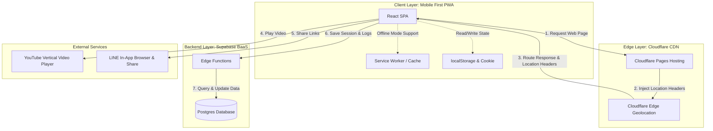
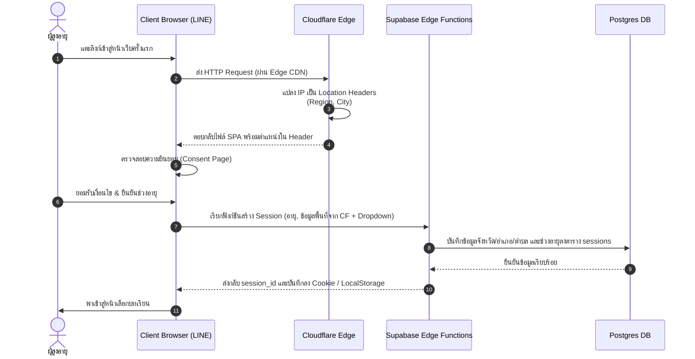

# รู้ทันสื่อ Interactive — System Architecture

**Version:** 1.0 | **Last Updated:** 2026-07-03 | **Owner:** NAPLAB Dev Team

เอกสารนี้อธิบายสถาปัตยกรรมระบบ (System Architecture) ของแอปพลิเคชันรู้ทันสื่อ Interactive ครอบคลุมการจัดแบ่งส่วนประกอบ การจัดวางระบบ (Deployment) และการไหลของข้อมูลหลัก โดยมีเป้าหมายเพื่อรองรับผู้ใช้ที่เป็นผู้สูงอายุในกลุ่มไลน์ชุมชน มีประสิทธิภาพสูงในพื้นที่ที่สัญญาณอินเทอร์เน็ตจำกัด และปฏิบัติตามหลักความปลอดภัยข้อมูลส่วนบุคคล (PDPA) อย่างเคร่งครัด

---

## 1. High-Level Architecture

ระบบถูกออกแบบในลักษณะ **Serverless & Edge-first Architecture** เพื่อลดภาระและ latency ในการเข้าถึงสำหรับผู้ใช้ผ่านเครือข่ายมือถือ 3G/4G ในพื้นที่ห่างไกล โดยแบ่งส่วนการทำงานออกเป็น 4 เลเยอร์หลัก:

---

## 2. Component Detail

### 2.1 Client Layer (Vite + React SPA)
สถาปัตยกรรมฝั่งผู้ใช้เน้นความมีน้ำหนักเบาและตอบสนองได้รวดเร็ว (Mobile-First):
- **React Single Page Application (SPA):** พัฒนาด้วย React และแพ็คเกจโดย Vite เพื่อให้ไฟล์มีขนาดเล็กรวมกันต่ำกว่า 1MB ในการโหลดหน้าแรก
- **Progressive Web App (PWA):** ใช้ `vite-plugin-pwa` เพื่อติดตั้ง Service Worker สำหรับแคชไฟล์ Static assets (ภาพ, CSS, เสียง) ช่วยเพิ่มความเร็วในการเปิดใช้งานครั้งต่อไป และรองรับการทำงานในสภาวะสัญญาณขาดหาย
- **Hybrid Persistence Store:** ผสมผสานการใช้ `localStorage` และ HTTP Cookie (Max-Age 1 ปี, `SameSite=Lax`) ร่วมกัน เพื่อให้ระบบจดจำสถานะ `session_id`, `age_range` และความคืบหน้าของบทเรียนได้นานที่สุด ป้องกันปัญหา WebView ของแอปพลิเคชัน LINE ล้างข้อมูลแคชของผู้ใช้โดยไม่คาดคิด

### 2.2 Edge Layer (Cloudflare Pages)
- **Static Hosting:** ใช้ Cloudflare Pages ในการเก็บรักษาระบบและกระจายโค้ดฝั่ง Client ผ่าน CDN ระดับโลก ช่วยให้ผู้ใช้งานดาวน์โหลดเว็บเพจได้ในเวลาไม่ถึง 3 วินาทีบนเครือข่าย 3G
- **Privacy Geolocation:** เมื่อฝั่งไคลเอ็นต์ทำการเข้าถึงเว็บแอปพลิเคชัน เซิร์ฟเวอร์ของ Cloudflare จะอ่านและแทรกข้อมูลตำแหน่งทางภูมิศาสตร์จาก Edge Servers ในรูปของ Request Headers เช่น:
  * `cf-ipcountry` (ประเทศ)
  * `cf-region-code` (จังหวัด)
  * `cf-city` (อำเภอ/เทศบาล)
  ทำให้ระบบสามารถระบุพื้นที่ของผู้เล่นเพื่อเริ่มต้นหน้าต่างเลือกพิกัดได้ โดยที่ไม่ต้องเก็บหรือส่งต่อ Raw IP Address หรือพิกัดละติจูด/ลองจิจูดของผู้ใช้ไปวิเคราะห์ต่อฝั่งหลังบ้าน ช่วยให้สอดคล้องกับหลัก Privacy by Design

### 2.3 Backend Layer (Supabase Serverless)
- **Supabase Edge Functions:** ใช้สำหรับงานประมวลผลขนาดเบา เช่น การแปลงรหัสภูมิภาคของ Cloudflare เป็นจังหวัด/อำเภอตามฐานข้อมูลระบบ และการนำเข้า Logs ต่าง ๆ (Event Logging)
- **Postgres Database:** เก็บข้อมูลหลักแบบไร้โครงสร้างที่ระบุตัวตนบุคคล (No PII):
  * **`sessions`:** รหัสผู้ใช้ไร้ชื่อ (Anonymous Session ID), กลุ่มช่วงอายุ, จังหวัด, อำเภอ, ตำบล และวันที่สร้าง
  * **`lesson_progress`:** บันทึกการได้ดาวและการเรียนจบของแต่ละบทเรียนผูกกับ Session ID
  * **`action_logs`:** บันทึกพฤติกรรม (Event Logs) ในรูปโครงสร้าง JSON: Session ID, ประเภท Event (เช่น ข้ามคลิป, เปิดคำถาม, ปิดเสียงอ่าน, กดรับใบประกาศ), แหล่งกำเนิด (บทเรียนย่อย/เกม), และ Timestamp

### 2.4 External Integration
- **YouTube IFrame API:** ฝังตัวเล่นวิดีโอแนวตั้ง (9:16) ในหน้าแอปพลิเคชัน และดักจับความก้าวหน้าการรับชมเพื่อระบุว่าดูวิดีโอจบเรียบร้อยแล้วหรือไม่
- **LINE In-App Browser:** สภาพแวดล้อมที่ออกแบบมารองรับการแสดงผลของ WebView LINE
- **LINE URL Scheme:** รองรับการทำ Deep Linking เพื่อแชร์ลิงก์การเรียนตรงไปยังช่องแชทกลุ่มหรือแชร์ดาวที่ได้รับ

---

## 3. Data Flow & Subsystems

### 3.1 การไหลของข้อมูลการสร้าง Session (Onboarding Flow)
การสร้างผู้ใช้งานและยืนยันตำแหน่งภายใต้กฎหมายคุ้มครองข้อมูลส่วนบุคคล (PDPA) มีขั้นตอนการสื่อสารข้อมูลดังนี้:

### 3.2 ระบบประมวลผลพฤติกรรมการใช้งาน (Asynchronous Event Logging)
เพื่อความเร็วในการแสดงผลฝั่ง Client ทุกการส่งสถิติพฤติกรรมผู้ใช้จะไม่บล็อกการทำกิจกรรมบนจอภาพ:

1. **ดักจับพฤติกรรม (Client-side Listeners):** ระบบตรวจจับการกดปุ่ม (เช่น ปุ่มเล่นเสียงอ่าน, ปุ่มข้าม, ปุ่มแชร์ดาว)
2. **คิวส่งข้อมูล (Async Queue/Service Worker):** Client ส่งข้อมูล Event เข้าสู่เบื้องหลังแบบไม่รอคอยผลลัพธ์ (Non-blocking POST Request)
3. **จัดเก็บ (DB Insertion):** Supabase Edge Function รับข้อมูลพฤติกรรม นำไปแปลง/จัดระเบียบ และบันทึกเข้าตาราง `action_logs` ทันที

---

## 4. Security & Compliance (PDPA)

สถาปัตยกรรมด้านความปลอดภัยนี้ถูกออกแบบขึ้นเพื่อปกป้องผู้เล่นสูงวัยและปฏิบัติตามกฎหมาย:
1. **การปฏิเสธการระบุตัวตน (Anonymity by Default):** แอปพลิเคชันไม่มีช่องทางการป้อนข้อมูลชื่อจริง นามสกุลจริง เบอร์โทรศัพท์ หรือเลขประจำตัวใด ๆ
2. **สิทธิ์ในการเข้าถึงพิกัด (Consent-Based Location):** ข้อมูลตำแหน่งถูกแปลงผ่าน IP ในระดับพื้นที่กว้าง (จังหวัด) และให้ผู้เล่นยืนยันหรือระบุอำเภอ/ตำบลเพิ่มเติมผ่านหน้าจออย่างสมัครใจ หากผู้เล่นปฏิเสธสิทธิ์ตำแหน่ง ระบบจะไม่บันทึกพิกัดแต่ยังเปิดโอกาสให้เข้าเล่นเกมได้ตามปกติ
3. **การป้องกันฐานข้อมูล (Row Level Security - RLS):** การเขียนข้อมูล Progress และข้อมูล Log ลงตารางของ Supabase จะถูกปกป้องด้วยกฎการป้อนข้อมูลเพื่ออนุญาตเฉพาะ Session ID ปัจจุบันในการเขียนเท่านั้น ป้องกันความเสี่ยงจากการพยายามเข้าถึงของบุคคลภายนอก

---

## Related Documents
- System Design: [System Design](./01-system-design.md)
- Data Schema: [Data Schema](./03-data-schema.md)
- Concept: [Concept & Architecture](../gdd/00-concept.md)
