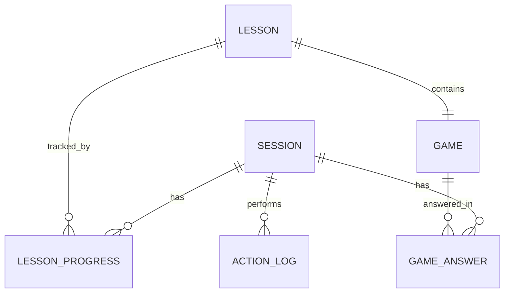

# รู้ทันสื่อ Interactive — Data Schema

**Version:** 1.2 | **Last Updated:** 2026-07-03
**สถานะ:** 🟢 Stack ยืนยันแล้ว — Geolocation ผ่าน Cloudflare (`request.cf.*`) แทนบริการภายนอก

## หลักการ (Data Minimization & Privacy-First)

Requirement ระบุให้เก็บ **อายุ** และ **ตำแหน่งที่เปิดเล่นแอป** — ออกแบบให้เก็บน้อยที่สุดที่ตอบโจทย์การประเมินโครงการและสอดคล้องกับ PDPA:

- ❌ ไม่เก็บ: ชื่อ, เบอร์โทร, LINE ID, ข้อมูลระบุตัวบุคคล หรือ Raw IP Address (IP ดิบจะถูกแปลงเป็นพิกัดภูมิศาสตร์แล้วทำลายทิ้งทันที)
- ✅ เก็บ: ช่วงอายุ (ไม่ใช่วันเกิด), ตำแหน่งระดับหยาบ (จังหวัด/ตำบล), ความคืบหน้าการเล่นแบบ anonymous, และบันทึกกิจกรรมการกดใช้งานฟังก์ชันต่างๆ
- ⚠️ **PDPA:** ต้องมีหน้าขอความยินยอมภาษาง่ายก่อนเก็บ; ผู้ปฏิเสธการแชร์ตำแหน่งต้องใช้งานแอปได้ครบทุกฟีเจอร์ โดยระบบจะบันทึกสถานะยินยอมหรือไม่ยินยอมไว้ด้วย

## Entities



### `sessions`
| Field | Type | Notes |
|-------|------|-------|
| id | uuid (PK) | anonymous, สร้างฝั่ง client เก็บใน localStorage และ cookie |
| age_range | text | เช่น `"60-69"` — เลือกจากปุ่มช่วงอายุ |
| role | text | `elder` / `leader` (leader เมื่อเข้าผ่าน facilitator link) |
| location_consent | boolean | สถานะการยินยอมแชร์ตำแหน่ง |
| ip_province | text (nullable) | จังหวัดที่แปลงมาจาก IP Address (ไม่เก็บ Raw IP ในฐานข้อมูล) |
| ip_district | text (nullable) | อำเภอที่แปลงมาจาก IP Address (ถ้าจับได้ละเอียดพอ เช่นผ่าน IP Geolocation) |
| selected_district | text (nullable) | อำเภอที่ผู้ใช้เลือกเอง (กรณี IP คลาดเคลื่อน หรือต้องการความถูกต้องระดับพื้นที่) |
| selected_sub_district | text (nullable) | ตำบลที่ผู้ใช้เลือกเอง (กรณี IP คลาดเคลื่อน หรือต้องการข้อมูลระดับตำบล) |
| user_agent | text | ข้อมูล Browser/Device เพื่อวิเคราะห์ประสิทธิภาพบน Mobile browser / LINE In-App browser |
| created_at | timestamptz | |

### `action_logs` (ตารางบันทึกกิจกรรมการกดใช้งานฟังก์ชันต่างๆ ในระบบ)
| Field | Type | Notes |
|-------|------|-------|
| id | uuid (PK) | |
| session_id | uuid (FK) | อ้างอิงตาราง sessions |
| event_name | text | เช่น `"click_play_video"`, `"click_next_lesson"`, `"toggle_mute"`, `"open_help"`, `"game_start"`, `"game_hint_clicked"`, `"certificate_download"` |
| page_url | text | URL ของหน้าที่เกิดเหตุการณ์ (เช่น `/lesson/t1-mil` หรือ `/game/G1`) |
| payload | jsonb (nullable) | ข้อมูลเสริมเฉพาะเหตุการณ์ (เช่น `{"video_seconds": 12.5}` หรือ `{"hint_id": "h1"}`) |
| created_at | timestamptz | เวลาที่เกิดการกระทำนั้นๆ (Client Timestamp) |

### `lessons` (content config — อาจเป็น JSON ฝั่ง client)
| Field | Type | Notes |
|-------|------|-------|
| id | text (PK) | เช่น `t1-mil` |
| title | text | |
| youtube_video_id | text | ⏳ รอรายการคลิปจากทีมเนื้อหา |
| game_id | text | เกมประจำบท (G1–G5) |
| order | int | ลำดับใน sequence |

### `lesson_progress`
| Field | Type | Notes |
|-------|------|-------|
| session_id | uuid (FK) | |
| lesson_id | text (FK) | |
| video_completed_at | timestamptz | จาก YouTube IFrame API event |
| game_completed_at | timestamptz | ได้ดาวเมื่อ field นี้ไม่ null |

### `game_answers`
| Field | Type | Notes |
|-------|------|-------|
| session_id | uuid (FK) | |
| game_id / question_id | text | |
| answer | text | |
| is_correct | boolean | ใช้วัดว่าโจทย์ไหนคนพลาดเยอะ → ปรับสื่อ |
| answered_at | timestamptz | |

### Game content files (JSON, ไม่อยู่ใน DB)
```json
{
  "game_id": "G3",
  "type": "ai-or-not",
  "questions": [
    {
      "id": "g3-q1",
      "media": "img/g3/doctor-ai.webp",
      "is_ai": true,
      "ai_disclosure": "ภาพนี้สร้างโดย AI เพื่อการเรียนรู้",
      "explanation": "สังเกตนิ้วมือและเงาที่ผิดธรรมชาติ",
      "audio": "audio/g3/q1-explain.mp3"
    }
  ]
}
```
> ทุกโจทย์ที่ใช้สื่อ AI ต้องมี field `ai_disclosure` — บังคับตาม[นโยบาย AI Content](../gdd/00-concept.md#5-นโยบายการนำเสนอเนื้อหาที่สร้างจาก-ai-⚠️)

---

## สถาปัตยกรรมด้านการเก็บข้อมูลและการรักษาสภาพผู้ใช้ (Data Architecture & State Preservation)

### 1. การจำ Session/Cookie ในอุปกรณ์ (Cross-Session Persistence)
เนื่องจากกลุ่มเป้าหมายส่วนใหญ่ใช้งานผ่าน **LINE In-App Browser (WebView)** หรือ Mobile Browser อื่นๆ ซึ่งมักประสบปัญหาข้อมูลหายหรือ Session หลุดบ่อยครั้ง (เช่น เมื่อผู้ใช้ล้างแคช, ปิดหน้าต่างแชท, หรือ LINE ล้างหน่วยความจำชั่วคราว) เพื่อแก้ปัญหานี้และจำอายุของผู้เล่นบนเครื่องนั้นๆ ให้ได้นานที่สุด จึงออกแบบระบบรักษาสถานะแบบ **Hybrid Persistence**:

- **กลไกการทำ Persistence:**
  1. เมื่อเริ่มเข้าสู่เว็บแอปพลิเคชัน ฝั่ง Client จะทำการตรวจสอบข้อมูล `session_id` และ `age_range` ทั้งใน `localStorage` และ `Cookies` (ที่ตั้งค่า `Max-Age` เป็น 1 ปี และเปิดใช้งาน `SameSite=Lax`)
  2. หากพบข้อมูลในที่ใดที่หนึ่ง แต่ไม่มีในอีกที่หนึ่ง ระบบจะทำการซิงก์ข้อมูลกลับให้อัตโนมัติ (เช่น หาก LINE ล้าง `localStorage` แต่ `Cookie` ยังอยู่ ระบบจะอ่านค่าจาก Cookie มาเซ็ตกลับลงใน `localStorage`)
  3. หากไม่พบในทั้งสองที่ ระบบจึงจะถือว่าเป็น Session ใหม่ และนำไปสู่หน้ายินยอมเงื่อนไขและเลือกช่วงอายุต่อไป
- **Facilitator Link Helper:** สำหรับกรณีใช้งานในชุมชนผ่านผู้นำชุมชน จะสามารถแชร์ URL ในลักษณะ Deep Link ที่ฝังพารามิเตอร์พื้นที่ (เช่น `?province=ChiangMai&district=Muang`) เพื่อเป็น Fallback ในกรณีที่ระบบตรวจจับพิกัดไม่ได้หรือผู้ใช้ล้างแคชทั้งหมด

### 2. การจัดการตำแหน่งและข้อมูล IP ภายใต้ PDPA (PDPA & IP Geolocation Compliance)
เพื่ออำนวยความสะดวกในการวิเคราะห์ระดับจังหวัด/ตำบลโดยที่ไม่ละเมิดความเป็นส่วนตัวของผู้สูงอายุ ระบบได้ออกแบบขั้นตอนการจัดการ IP Address และพิกัดภูมิศาสตร์ (Geolocation) ดังนี้:

- **ขั้นตอนการแปลงข้อมูลตำแหน่ง (IP Geolocation Flow):**
  1. Cloudflare Pages อ่านค่า `request.cf.country` / `request.cf.region` / `request.cf.city` ให้อัตโนมัติที่ edge สำหรับทุก request — **ไม่มีการอ่าน IP ดิบในโค้ดแอปเลย** จึงไม่ต้องพึ่งบริการภายนอก (MaxMind/3rd-party API)
  2. ส่งค่าที่แปลงแล้ว (จังหวัด/ภูมิภาค/เมือง) ไปยัง Supabase Edge Function เพื่อ map เป็นชื่อจังหวัด (`ip_province`) และอำเภอ (`ip_district`) ที่ใช้ในระบบ
  3. บันทึกเฉพาะค่าที่แปลงแล้วลงในตาราง `sessions` — ไม่มี IP ดิบผ่านเข้าสู่ระบบแอปหรือฐานข้อมูลเลยตั้งแต่ต้น (privacy by design)
- **การคัดเลือกอำเภอ/ตำบล (Hybrid Manual Dropdown):**
  - เนื่องจาก IP Geolocation มักไม่มีความแม่นยำเพียงพอในระดับอำเภอหรือตำบล (พิกัดมือถืออาจจะชี้ไปที่เสาส่งสัญญาณในอำเภออื่น)
  - หลังจากได้จังหวัดเริ่มต้นจาก IP แล้ว ระบบจะนำไปใช้เพื่อกรองค่าเริ่มต้นในหน้าต่างยินยอม โดยจะแสดงคำแนะนำ เช่น *"ดูเหมือนว่าคุณจะอยู่ที่จังหวัด [เชียงใหม่] ใช่หรือไม่?"*
  - หากใช่/ไม่ใช่ ผู้ใช้สามารถกดเลือกหรือแก้ไข **อำเภอ** และ **ตำบล** จาก Dropdown รายการในจังหวัดนั้นๆ ได้อย่างสะดวกสบาย ซึ่งทำให้ได้ข้อมูลตำบลที่ถูกต้องที่สุดสำหรับการประเมินโครงการโดยไม่ต้องพิมพ์ข้อมูลเอง

---

## Analytics Queries ที่ต้องรองรับ
- **ข้อมูลผู้เล่นแยกตามพื้นที่และช่วงอายุ:** รายงานจำนวนผู้เข้าเรียน (Sessions) แยกตาม จังหวัด/อำเภอ/ตำบล และช่วงอายุของผู้เล่น เพื่อรายงานให้โครงการทราบความครอบคลุม
- **เวลาและจำนวนการกดใช้งานฟังก์ชัน (Event Engagement):** รายงานความถี่และช่วงเวลาเฉลยของเกม, อัตราการกดข้ามวิดีโอ, การเปิดปิดเสียงอ่านโจทย์, หรือดาวน์โหลดใบประกาศ เพื่อระบุปัญหาจุดที่ผู้ใช้ติดขัดหรือหน้าจอที่ไม่มีผู้ใช้งาน
- **อัตราการเรียนจบต่อบท (Funnel Analysis):** สัดส่วนการไหลของกลุ่มผู้ใช้ตั้งแต่เริ่มเข้าหน้าแรก -> ดูวิดีโอจบ -> ทำเกมตอบคำถามสำเร็จในแต่ละบทเรียน
- **โจทย์ที่ตอบผิดมากที่สุด (Error Rate per Question):** สัดส่วนและจำนวนการตอบผิดแยกตามข้อคำถามของเกม G1-G5 เพื่อประเมินว่าเรื่องใดที่ผู้สูงอายุยังขาดความเข้าใจ

## Related Documents
- System: [System Design](./01-system-design.md)
- Concept: [Concept & Architecture](../gdd/00-concept.md)
