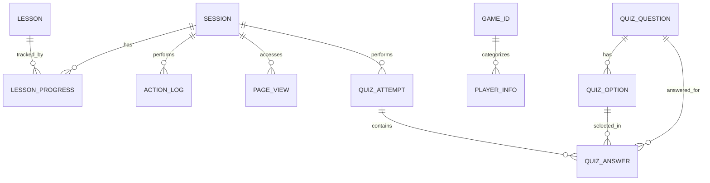

# รู้ทันสื่อ Interactive — Data Schema

**Version:** 1.8 | **Last Updated:** 2026-08-18
**สถานะ:** 🟢 Stack ยืนยันแล้ว — Next.js (TypeScript) + Supabase (PostgreSQL) / เลือกพื้นที่แมนนวลผ่าน UI / เชื่อมต่อฐานข้อมูลผ่าน `pg` Pool ทั้งบน Cloud Supabase และ Docker Container Environments (`DATABASE_URL`)

> ℹ️ **การติดตั้ง Schema บน Docker Container:**
> - **Production (Portainer Stack):** แอปพลิเคชันเชื่อมต่อไปยัง Supabase Cloud PostgreSQL โดยตรงผ่านตัวแปร `DATABASE_URL`
> - **Local Testing (`docker/docker-compose.yml`):** มีตัวเลือกเปิดคอนเทนเนอร์ Postgres 15 local (`media-literacy-db`) ซึ่งจะ mount สคริปต์ [docs/supabase-schema.sql](../supabase-schema.sql) ในโฟลเดอร์ `/docker-entrypoint-initdb.d/` เพื่อรันสร้าง Schema ตารางและคีย์เริ่มต้นให้อัตโนมัติ

## หลักการ (Data Minimization & Privacy-First)

Requirement ระบุให้เก็บ **อายุ** และ **ตำแหน่งที่เปิดเล่นแอป** — ออกแบบให้เก็บน้อยที่สุดที่ตอบโจทย์การประเมินโครงการและสอดคล้องกับ PDPA:

- ❌ ไม่เก็บ: ชื่อจริง-นามสกุล, เบอร์โทร, LINE ID หรือเลขระบุตัวตนทางราชการ
- ✅ เก็บ: ชื่อเล่นที่ผู้ใช้ยินยอมให้แสดงบน Leaderboard, UUID แบบ local ที่ไม่ผูกกับบัญชี, ช่วงอายุ (ไม่ใช่วันเกิด), ตำแหน่งที่ผู้เรียนเลือกเอง (จังหวัด/อำเภอ/ตำบล), ความคืบหน้าการเล่นแบบ anonymous และบันทึกกิจกรรมการกดใช้งาน
- ⚠️ **PDPA:** ต้องมีหน้าขอความยินยอมภาษาง่ายก่อนเก็บ; ผู้ปฏิเสธการแชร์ตำแหน่งต้องใช้งานแอปได้ครบทุกฟีเจอร์ โดยระบบจะบันทึกสถานะยินยอมหรือไม่ยินยอมไว้ด้วย

## Entities



### `sessions`
| Field | Type | Notes |
|-------|------|-------|
| id | uuid (PK) | anonymous, สร้างฝั่ง client เก็บใน localStorage และ cookie |
| age_range | text | เช่น `"60-69"` — เลือกจากปุ่มช่วงอายุ |
| role | text | `elder` / `leader` (leader เมื่อเข้าผ่าน facilitator link) |
| location_consent | boolean | สถานะการยินยอมแชร์ตำแหน่ง |
| selected_district | text (nullable) | อำเภอที่ผู้ใช้เลือกเอง |
| selected_sub_district | text (nullable) | ตำบลที่ผู้ใช้เลือกเอง |
| gps_latitude | numeric (nullable) | คอลัมน์เดิม เก็บละติจูด — **UI ปัจจุบันไม่เติมค่านี้แล้ว** (ถอด GPS ตาม [FB-2026-08-18](../agile/feedback/FB-2026-08-18-gps-consent.md)) |
| gps_longitude | numeric (nullable) | คอลัมน์เดิม เก็บลองจิจูด — **UI ปัจจุบันไม่เติมค่านี้แล้ว** |
| user_agent | text | ข้อมูล Browser/Device เพื่อวิเคราะห์ประสิทธิภาพบน Mobile browser / LINE In-App browser |
| created_at | timestamptz | |

### `page_views` (ตารางบันทึกการเข้าถึงหน้าจอและระยะเวลาการเข้าชม)
| Field | Type | Notes |
|-------|------|-------|
| id | uuid (PK) | |
| session_id | uuid (FK) | อ้างอิงตาราง sessions |
| page_path | text | พาร์ทหน้าจอที่มีการเข้าถึง (เช่น `/lessons` หรือ `/pretest`) |
| referrer | text (nullable) | แหล่งที่มาก่อนหน้า (เช่น `https://line.me/` หรือลิงก์ภายนอก) |
| duration_seconds | integer | ระยะเวลาที่อยู่บนหน้านั้นๆ (หน่วยวินาที, ค่าเริ่มต้น 0) |
| created_at | timestamptz | เวลาที่เริ่มเข้าสู่หน้านี้ |

### `action_logs` (ตารางบันทึกกิจกรรมการกดใช้งานฟังก์ชันต่างๆ ในระบบ)
| Field | Type | Notes |
|-------|------|-------|
| id | uuid (PK) | |
| session_id | uuid (FK) | อ้างอิงตาราง sessions |
| event_name | text | เช่น `"click_play_video"`, `"click_next_lesson"`, `"toggle_mute"`, `"open_help"`, `"game_start"`, `"game_hint_clicked"`, `"certificate_download"` |
| page_url | text | URL ของหน้าที่เกิดเหตุการณ์ (เช่น `/lesson/t1-mil` หรือ `/game/G1`) |
| payload | jsonb (nullable) | ข้อมูลเสริมเฉพาะเหตุการณ์ (เช่น `{"video_seconds": 12.5}` หรือ `{"hint_id": "h1"}`) |
| created_at | timestamptz | เวลาที่เกิดการกระทำนั้นๆ (Client Timestamp) |

### `lesson_progress`
| Field | Type | Notes |
|-------|------|-------|
| session_id | uuid (FK) | |
| lesson_id | text (FK) | |
| video_completed_at | timestamptz | จาก YouTube IFrame API event |
| game_completed_at | timestamptz | ได้ดาวเมื่อ field นี้ไม่ null |

### `game_id` (ทะเบียนเกมที่เปิดใช้บน Leaderboard)
| Field | Type | Notes |
|-------|------|-------|
| gid | varchar (PK) | รหัสเกม เช่น `G1`, `G3`, `G6`, `G13` |
| name | varchar | ชื่อเกมที่แสดงบนหัวหน้า Leaderboard |
| created_at | timestamptz | วันที่เพิ่มเกมเข้าสู่ registry |

### `player_info` (ประวัติคะแนน Leaderboard)
| Field | Type | Notes |
|-------|------|-------|
| id | uuid (PK) | รหัสรายการคะแนนแต่ละรอบ สร้างใหม่ทุกครั้งที่บันทึก |
| attempt_uuid | uuid (Unique) | รหัสรอบจาก client สำหรับ idempotency ป้องกัน React Strict Mode/การ retry สร้างคะแนนซ้ำ |
| player_uuid | uuid | UUID ประจำ local player profile; ใช้ไฮไลท์ประวัติของเครื่องปัจจุบัน ไม่ใช่บัญชีหรือหลักฐานยืนยันตัวตน |
| name | varchar | ชื่อเล่นที่ผู้ใช้ยินยอมให้แสดงสาธารณะ ความยาว 1–30 ตัวอักษร |
| gid | varchar (FK) | อ้างอิง `game_id.gid`; ทุก query Leaderboard ต้องกรองด้วย field นี้ |
| score | integer | คะแนนของรอบนั้น ต้องไม่เป็น null และต้องไม่ติดลบ |
| created_at | timestamptz | เวลาที่ server รับและบันทึกคะแนน |

> **ข้อกำหนดก่อนเริ่ม implementation (US-CF-50):** DDL ล่าสุดที่ผู้ใช้จัดเตรียมมี `id`, `name`, `gid`, `score`, `created_at` และ FK ของ `gid` แล้ว แต่ยังต้องเพิ่ม `player_uuid uuid not null` เพื่อแยกตัวผู้เล่นออกจากรหัสรายการคะแนน หากใช้ `id` เป็น UUID ผู้เล่น จะไม่สามารถเก็บ history หลายรอบต่อผู้เล่นได้ นอกจากนี้ต้องปรับ `score` เป็น `not null`, เพิ่ม `check (score >= 0)`, name length constraint และ index `(gid, score desc, created_at asc)`

**พฤติกรรมการเก็บข้อมูล:**
- หนึ่งรอบที่เล่นจบ = หนึ่งแถวใหม่ ไม่ upsert และไม่ deduplicate ด้วยชื่อหรือ `player_uuid`
- ชื่อซ้ำและคะแนนซ้ำเป็นข้อมูล history ที่ยอมรับได้
- หน้า Leaderboard แสดง Top 10 แยกตาม `gid` เท่านั้น ห้ามนำคะแนนต่างเกมมาเรียงรวมกัน
- Browser ห้ามอ่านหรือเขียนตารางโดยตรง; Next.js Route Handler เชื่อม Supabase PostgreSQL ผ่าน `DATABASE_URL`
- เปิด RLS โดยไม่ให้ policy แก่ `anon`/`authenticated`; API ฝั่ง server เป็นผู้ตรวจและบันทึกข้อมูล

**ข้อมูลตั้งต้นที่ต้องมีใน `game_id`:**
```sql
insert into public.game_id (gid, name)
values
  ('G1', 'จริงหรือมั่ว?'),
  ('G2', 'จับสัญญาณมิจ'),
  ('G3', 'AI หรือ คน?'),
  ('G5', 'กางโล่กู้ชีพ'),
  ('G6', 'จำลองแชท LINE'),
  ('G13', 'ต่อไอติมรู้ทันสื่อ')
on conflict (gid) do update set name = excluded.name;
```

### `quiz_questions` (ตารางคลังข้อสอบ Pretest / Posttest)
| Field | Type | Notes |
|-------|------|-------|
| id | text (PK) | ตัวระบุคำถาม (เช่น `"pre-q1"`, `"post-q1"`) |
| test_type | text | ประเภทการทดสอบ (`"pretest"` หรือ `"posttest"`) |
| question_text | text | ข้อความโจทย์คำถาม |
| media_url | text (nullable) | ลิงก์ไฟล์สื่อรูปภาพหรือคลิปแนบประกอบ |
| explanation | text (nullable) | ข้อความคำอธิบายเฉลย (แสดงหลังจากตรวจคำตอบทั้งหมดแล้ว) |
| sort_order | integer | ลำดับการเรียงในการแสดงผลแบบทดสอบ |
| created_at | timestamptz | |

### `quiz_options` (ตารางตัวเลือกคำตอบของแต่ละคำถาม)
| Field | Type | Notes |
|-------|------|-------|
| id | uuid (PK) | |
| question_id | text (FK) | อ้างอิงตาราง quiz_questions |
| option_text | text | ข้อความของตัวเลือกคำตอบ |
| is_correct | boolean | แฟล็กบอกว่าเป็นคำตอบที่ถูกต้องใช่หรือไม่ |
| created_at | timestamptz | |

### `quiz_attempts` (ตารางบันทึกการทำแบบทดสอบแยกแต่ละรอบ)
| Field | Type | Notes |
|-------|------|-------|
| id | uuid (PK) | |
| session_id | uuid (FK) | อ้างอิงตาราง sessions |
| test_type | text | ประเภทการทดสอบ (`"pretest"` หรือ `"posttest"`) |
| score | integer | คะแนนรวมที่ทำได้ (คำนวณฝั่ง client และ sync ขึ้น backend) |
| completed_at | timestamptz | วันเวลาที่ส่งแบบทดสอบสำเร็จ |
| created_at | timestamptz | วันเวลาที่เริ่มทำแบบทดสอบ |

### `quiz_answers` (ตารางบันทึกการตอบข้อสอบรายข้อของผู้เข้าสอบแต่ละเซสชัน)
| Field | Type | Notes |
|-------|------|-------|
| id | uuid (PK) | |
| attempt_id | uuid (FK) | อ้างอิงตาราง quiz_attempts |
| question_id | text (FK) | อ้างอิงตาราง quiz_questions |
| selected_option_id | uuid (FK) | อ้างอิงตาราง quiz_options ที่ผู้เล่นเลือกตอบ |
| is_correct | boolean | คำตอบนั้นถูกต้องหรือไม่ (ช่วยวิเคราะห์รายข้อความเข้าใจผิด) |
| created_at | timestamptz | วันเวลาที่กดส่งคำตอบ |

### Game content files (JSON, ไม่อยู่ใน DB)
```json
{
  "game_id": "G3",
  "type": "ai-or-not",
  "questions": [
    {
      "id": "g3-q1",
      "media": "img/g3/doctor-ai.webp",
      "is_ai": true,
      "ai_disclosure": "ภาพนี้สร้างโดย AI เพื่อการเรียนรู้",
      "explanation": "สังเกตนิ้วมือและเงาที่ผิดธรรมชาติ",
      "audio": "audio/g3/q1-explain.mp3"
    }
  ]
}
```
> ทุกโจทย์ที่ใช้สื่อ AI ต้องมี field `ai_disclosure` — บังคับตาม[นโยบาย AI Content](../gdd/00-concept.md#5-นโยบายการนำเสนอเนื้อหาที่สร้างจาก-ai-⚠️)

---

## สถาปัตยกรรมด้านการเก็บข้อมูลและการรักษาสภาพผู้ใช้ (Data Architecture & State Preservation)

### 1. การจำ Session/Cookie ในอุปกรณ์ (Cross-Session Persistence)
เนื่องจากกลุ่มเป้าหมายส่วนใหญ่ใช้งานผ่าน **LINE In-App Browser (WebView)** หรือ Mobile Browser อื่นๆ ซึ่งมักประสบปัญหาข้อมูลหายหรือ Session หลุดบ่อยครั้ง (เช่น เมื่อผู้ใช้ล้างแคช, ปิดหน้าต่างแชท, หรือ LINE ล้างหน่วยความจำชั่วคราว) เพื่อแก้ปัญหานี้และจำอายุของผู้เล่นบนเครื่องนั้นๆ ให้ได้นานที่สุด จึงออกแบบระบบรักษาสถานะแบบ **Hybrid Persistence**:

- **กลไกการทำ Persistence:**
  1. เมื่อเริ่มเข้าสู่เว็บแอปพลิเคชัน ฝั่ง Client จะทำการตรวจสอบข้อมูล `session_id` และ `age_range` ทั้งใน `localStorage` และ `Cookies` (ที่ตั้งค่า `Max-Age` เป็น 1 ปี และเปิดใช้งาน `SameSite=Lax`)
  2. หากพบข้อมูลในที่ใดที่หนึ่ง แต่ไม่มีในอีกที่หนึ่ง ระบบจะทำการซิงก์ข้อมูลกลับให้อัตโนมัติ (เช่น หาก LINE ล้าง `localStorage` แต่ `Cookie` ยังอยู่ ระบบจะอ่านค่าจาก Cookie มาเซ็ตกลับลงใน `localStorage`)
  3. หากไม่พบในทั้งสองที่ ระบบจึงจะถือว่าเป็น Session ใหม่ และนำไปสู่หน้ายินยอมเงื่อนไขและเลือกช่วงอายุต่อไป
- **Facilitator Link Helper:** สำหรับกรณีใช้งานในชุมชนผ่านผู้นำชุมชน จะสามารถแชร์ URL ในลักษณะ Deep Link ที่ฝังพารามิเตอร์พื้นที่ (เช่น `?province=ChiangMai&district=Muang`) เพื่อเป็น Fallback ในกรณีที่ระบบตรวจจับพิกัดไม่ได้หรือผู้ใช้ล้างแคชทั้งหมด

### 1.1 Local Player Profile สำหรับ Leaderboard
- เก็บ `{ player_uuid, name }` เป็น object เดียวใน `localStorage` ภายใต้ key ที่กำหนดร่วมกัน เช่น `naplab_ml_leaderboard_player`
- เมื่อเปิด `/lessons/[id]/leaderboard` และพบ object ที่ถูกต้อง ให้ข้ามหน้ากรอกชื่อ; หากไม่พบหรือข้อมูลเสีย ให้แสดงฟอร์มชื่อและสร้าง UUID ใหม่
- UUID นี้แยกจาก primary key `player_info.id`: UUID ผู้เล่นคงเดิมในเครื่อง แต่ `id` ของประวัติคะแนนสร้างใหม่ทุกครั้ง
- การล้างข้อมูลเว็บไซต์หรือเปลี่ยน browser/device จะสร้าง local player profile ใหม่ ซึ่งเป็นข้อจำกัดที่ยอมรับในระบบแบบไม่มีบัญชี

### 2. การจัดการตำแหน่งและข้อมูลพิกัด (PDPA & Geolocation Compliance)
เพื่อความสะดวกในการวิเคราะห์รายพื้นที่โดยไม่ละเมิดสิทธิ์ความเป็นส่วนตัวของผู้ใช้ ระบบให้ผู้เรียนเลือกพื้นที่เอง:

- **การระบุตำแหน่งผ่าน UI (Manual Location Selector):**
  1. **เลือกจังหวัด/อำเภอ/ตำบลเอง:** หน้า Consent มีรายการท้องถิ่น (ครอบคลุมพื้นที่จัดกิจกรรมเป้าหมาย: เชียงใหม่ แพร่ น่าน และตัวเลือกอื่น ๆ) ผู้เรียนเลือกได้ตามที่อยู่ที่ต้องการใช้ เช่น บ้านเกิด หรือที่อยู่ปัจจุบันที่เล่นเกม
  2. **ไม่ดึงพิกัด GPS:** ถอดปุ่ม "ดึงพิกัดจาก GPS" และ Reverse Geocode แล้ว เพราะพิกัดมักไม่ตรง และไม่ตอบโจทย์กรณีที่ผู้เรียนอยากกรอกที่อยู่อื่นที่ไม่ใช่ตำแหน่งเครื่อง — ดู [FB-2026-08-18](../agile/feedback/FB-2026-08-18-gps-consent.md)
  3. **หลักความปลอดภัย:** ระบบไม่มีการจัดเก็บไอพีแอดเดรส (IP Address) พิกัดละติจูด/ลองจิจูดจากเบราว์เซอร์ หรือช่องข้อมูลส่วนตัวของผู้เข้าชมเพื่อตัดความเชื่อมโยงในการเข้าถึงตัวตนที่แท้จริง

---

## Analytics Queries ที่ต้องรองรับ
- **ข้อมูลผู้เล่นแยกตามพื้นที่และช่วงอายุ:** รายงานจำนวนผู้เข้าเรียน (Sessions) แยกตาม จังหวัด/อำเภอ/ตำบล และช่วงอายุของผู้เล่น เพื่อรายงานให้โครงการทราบความครอบคลุม
- **เวลาและจำนวนการกดใช้งานฟังก์ชัน (Event Engagement):** รายงานความถี่และช่วงเวลาเฉลยของเกม, อัตราการกดข้ามวิดีโอ, การเปิดปิดเสียงอ่านโจทย์, หรือดาวน์โหลดใบประกาศ เพื่อระบุปัญหาจุดที่ผู้ใช้ติดขัดหรือหน้าจอที่ไม่มีผู้ใช้งาน
- **อัตราการเรียนจบต่อบท (Funnel Analysis):** สัดส่วนการไหลของกลุ่มผู้ใช้ตั้งแต่เริ่มเข้าหน้าแรก -> ดูวิดีโอจบ -> ทำเกมตอบคำถามสำเร็จในแต่ละบทเรียน
- **โจทย์ที่ตอบผิดมากที่สุด (Error Rate per Question):** สัดส่วนและจำนวนการตอบผิดแยกตามข้อคำถามของเกม G1-G5 เพื่อประเมินว่าเรื่องใดที่ผู้สูงอายุยังขาดความเข้าใจ

### Analytics API: `GET /api/action-logs`

รองรับหัวข้อ "เวลาและจำนวนการกดใช้งานฟังก์ชัน (Event Engagement)" ด้านบน — ดึงข้อมูลสรุป (aggregate) จากตาราง `action_logs` **ไม่ใช่ raw rows** ถ้าต้องการข้อมูลรายแถวดิบเพื่อวิเคราะห์เพิ่มเอง ให้เพิ่ม endpoint/ฟังก์ชันแยกต่างหาก

**Query params (ทุกตัว optional ใส่ร่วมกันได้):**

| Param | ชนิด | ความหมาย |
|-------|------|----------|
| `from` | ISO date string | กรอง `created_at >= from` |
| `to` | ISO date string | กรอง `created_at <= to` |
| `event_name` | text | กรองเฉพาะ event เดียว เช่น `tap_hotspot` |
| `session_id` | uuid | กรองเฉพาะ session เดียว |

ถ้า `from`/`to` ไม่ใช่วันที่ที่ parse ได้ จะตอบกลับ `400 Bad Request`

**ตัวอย่างเรียกใช้:**
```bash
curl "https://<domain>/api/action-logs?event_name=tap_hotspot&from=2026-07-01&to=2026-07-19"
```

**รูปแบบ Response:**
```json
{
  "totalEvents": 195,
  "byEventName": [{ "event_name": "tap_hotspot", "count": 25 }],
  "byPageUrl": [{ "page_url": "/lessons", "count": 39 }],
  "byDay": [{ "day": "2026-07-19", "count": 195 }]
}
```

**เรียกจากโค้ดฝั่ง server โดยตรง** (ไม่ผ่าน HTTP) ได้ผ่านฟังก์ชัน `getActionLogAnalytics()` ใน `src/lib/analytics.ts` — ใช้ได้เฉพาะไฟล์ที่รันฝั่ง server (Server Component, Route Handler) เท่านั้น เพราะต่อ DB pool ตรงผ่าน `src/lib/database.ts`:
```ts
import { getActionLogAnalytics } from "@/lib/analytics";

const stats = await getActionLogAnalytics({ eventName: "certificate_download" });
```

---

## Related Documents
- System: [System Design](./01-system-design.md)
- Architecture: [System Architecture](./02-architecture.md)
- Concept: [Concept & Architecture](../gdd/00-concept.md)
