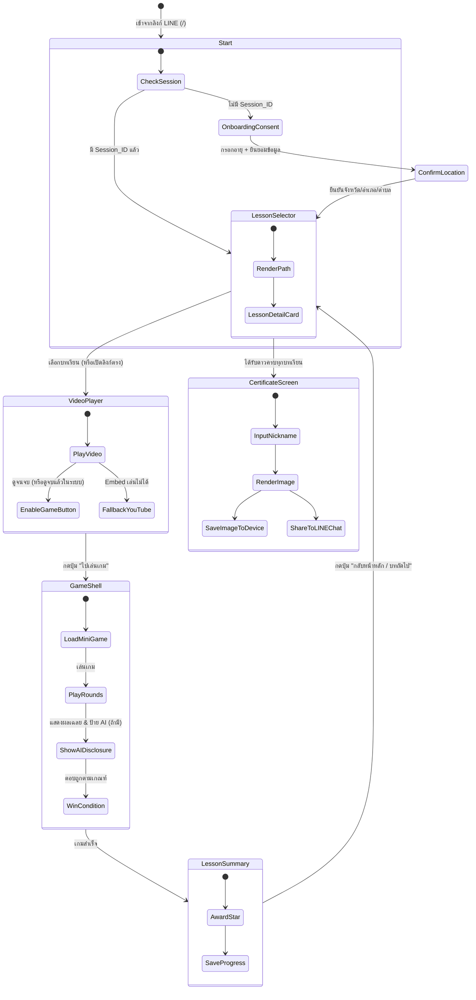
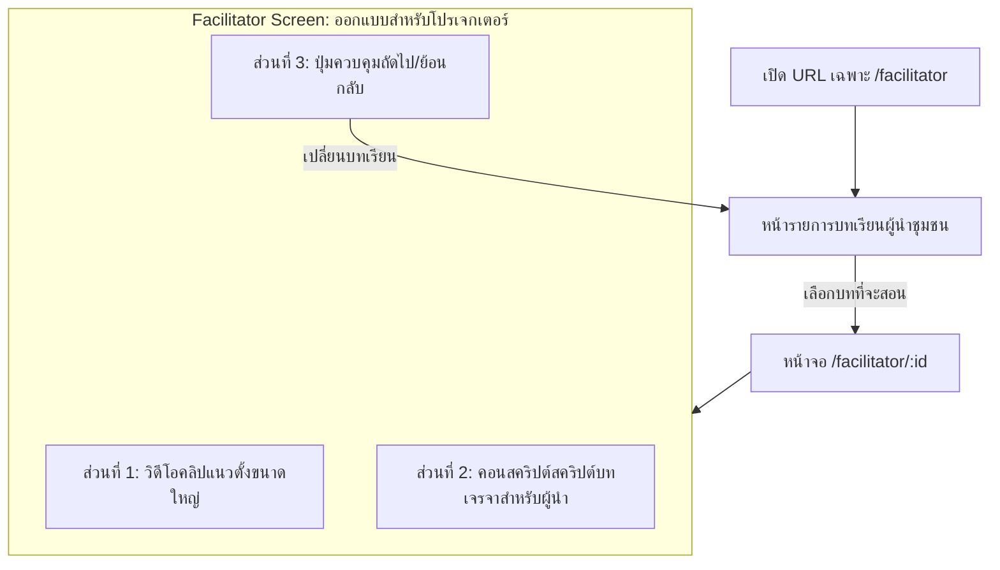

# รู้ทันสื่อ Interactive — Application Flow & Routing

**Version:** 1.0 | **Last Updated:** 2026-07-03 | **Owner:** NAPLAB Dev Team

เอกสารฉบับนี้อธิบายผังการไหลของแอปพลิเคชัน (Application Flow) การกำหนดเส้นทางหน้าจอ (Routing) ในฝั่ง Frontend และเงื่อนไขในการเปลี่ยนผ่านแต่ละหน้าจอ เพื่อแสดงความเชื่อมโยงระหว่างระบบเทคโนโลยีและเส้นทางการใช้งานของผู้ใช้ (User Journey) ทั้งสองกลุ่มหลัก

---

## 1. Route Catalog (รายการหน้าจอและเส้นทาง)

แอปพลิเคชันทำงานในรูปแบบ React SPA โดยมีรายการหน้าจอดังนี้:

| Path | Component Name | Description | Access Guard (เงื่อนไขการเข้าถึง) |
|:---|:---|:---|:---|
| `/` | `LandingWelcome` | หน้าแรกสุด ทักทายต้อนรับ และปุ่มกดเข้าเรียน | ไม่มี (สาธารณะ) |
| `/consent` | `OnboardingConsent` | หน้ายินยอมนโยบายข้อมูล (PDPA) เลือกช่วงอายุและยืนยันจังหวัด/อำเภอ/ตำบล | ต้องยังไม่มี `session_id` หรือข้อมูลตำแหน่งในอุปกรณ์ |
| `/lessons` | `LessonSelector` | หน้าเลือกบทเรียน (Dashboard สำหรับผู้สูงอายุ) แสดงเส้นทางและสถานะความคืบหน้า (ดาว) | ต้องทำการ Onboarding ยืนยันข้อมูลเสร็จแล้ว (มี `session_id`) |
| `/lessons/:id/video` | `VideoPlayer` | หน้าจอเครื่องเล่นคลิปวิดีโอแนวตั้ง (9:16) ดักจับสถานะดูวิดีโอจบ | ต้องผ่าน Onboarding และเรียนบทเรียนก่อนหน้านี้ครบตามลำดับ |
| `/lessons/:id/game` | `GameShell` | หน้าเล่นเกมย่อยประจำบทเรียน โหลดปลั๊กอินเกมย่อย G1-G5 มาแสดง | ต้องทำการชมวิดีโอบทนั้นจบเรียบร้อยแล้วในเซสชันนี้ |
| `/lessons/:id/summary` | `LessonSummary` | หน้าแสดงความสำเร็จ ได้รับดาว และแนะนำบทถัดไป | ต้องเล่นเกมในบทเรียนนั้นผ่านเงื่อนไขชนะแล้ว |
| `/certificate` | `CertificateScreen` | หน้ารับใบประกาศเกียรติคุณแบบใส่ชื่อเล่น ดาวน์โหลดรูปภาพ และแชร์เข้ากลุ่ม LINE | ต้องเรียนครบทุกบทเรียนหลัก (ได้ดาวครบ) |
| `/facilitator` | `FacilitatorHub` | หน้าเริ่มต้นของผู้ช่วยสอน/ผู้นำกิจกรรม แสดงรายการและข้อมูลพื้นที่เบื้องต้น | ไม่มี (สาธารณะ) |
| `/facilitator/:id` | `FacilitatorView` | โหมดฉายจอใหญ่สำหรับนำกิจกรรม แสดงวิดีโอขนาดใหญ่ คอนสคริปต์พูดประกอบ และโหมดตอบกลุ่ม | ไม่มี (สาธารณะ) |

---

## 2. Navigation State Machine (สถานะการเปลี่ยนหน้าจอ)

ผังการเข้าชมหน้าจอและการเปลี่ยนผ่านตามพฤติกรรมของผู้ใช้แบ่งเป็น 2 เส้นทางหลัก:

### 2.1 เส้นทางผู้สูงอายุ (Journey B: Elder Path)

---

## 3. Router Guards & Deep Linking (ระบบป้องกันและลิงก์ตรง)

### 3.1 Router Guards Logic (กลไกจำกัดลำดับการเล่น)
เพื่ออำนวยความสะดวกไม่ให้ผู้สูงอายุเกิดความสับสนหรือหลงทางในหน้าแอปพลิเคชัน Frontend จะทำงานร่วมกับ Router Guards ดังนี้:

- **ยินยอมข้อมูลก่อนเริ่มเสมอ:** หากผู้ใช้พยายามเข้าลิงก์ตรงของบทเรียน เช่น `/lessons/2/video` แต่ระบบไม่พบ `session_id` ใน Cookie หรือ LocalStorage ระบบจะเปลี่ยนเส้นทาง (Redirect) ไปที่ `/consent` อัตโนมัติ เมื่อทำเสร็จจึงจะส่งต่อผู้ใช้ไปยังบทเรียนปลายทางที่กดมาตอนแรก
- **เรียงลำดับการเรียน (Guided Sequence):** ผู้เล่นทั่วไปต้องสะสมดาวตามลำดับ (บทที่ 1 → บทที่ 2 → บทที่ 3) ระบบจะไม่อนุญาตให้กดเข้าเล่นเกมบทที่ 3 หากดาวยังสะสมในบทที่ 1 และ 2 ไม่ครบ
- **สิทธิเข้าถึงเกม (Video-to-Game Lock):** ผู้ใช้งานไม่สามารถข้ามไปที่หน้า `/lessons/:id/game` ได้โดยตรง หากไม่ผ่านสถานะดูวิดีโอจบ (`watched: true` ในแอปสเตตปัจจุบัน)

### 3.2 Deep Linking Flow (แชร์เข้ากลุ่มไลน์)
เมื่อมีผู้นำชุมชนหรือผู้ใช้ส่งต่อข้อความที่มีลิงก์เข้าสู่กลุ่ม LINE:
1. ลิงก์ที่แชร์จะมีหน้าตาเป็น: `https://domain.com/lessons/3/video?ref=facilitator&prov=ChiangMai`
2. เมื่อผู้สูงอายุแตะที่ลิงก์ใน LINE หน้าต่าง LINE In-App Browser จะเปิดขึ้น
3. แอปพลิเคชันอ่านพารามิเตอร์ `prov` เพื่อใช้ตั้งค่าพิกัดเริ่มต้นทันที
4. หากผู้เล่นยังไม่เคยสมัครใช้งานแอป ระบบจะพาไปหน้ารายละเอียด Consent เมื่อยินยอมเสร็จสิ้น จะนำไปยังหน้าวิดีโอบทที่ 3 ทันที (Skip หน้า LessonSelector)

---

## 4. Facilitator Mode Flow (เส้นทางผู้ช่วยสอน)

สำหรับผู้นำกิจกรรมหรือผู้ช่วยอบรมในระดับชุมชน (Journey A):

**จุดเด่นการทำ Routing ของผู้นำ:**
- **เป็นมิตรกับการเปิดบนทีวี/คอมพิวเตอร์:** เส้นทาง `/facilitator` จะปิดอินเทอร์เฟซแบบโมบายล์ เช่น ขนาดปุ่มที่เน้นใช้นิ้วกด และปรับให้แสดงผลสคริปต์ประกอบการสอนอย่างชัดเจนแบบ Desktop Layout
- **ไม่มี Guard จำกัดการข้ามบท:** ผู้นำชุมชนสามารถข้ามไปบทใดก็ได้ทันที (เช่น เริ่มสอนบทที่ 3 ก่อน) เพื่อให้เข้ากับสถานการณ์และหน้างานการจัดการเรียนรู้

---

## Related Documents
- User Journey: [User Journey](../gdd/05-user-journey.md)
- System Design: [System Design](./01-system-design.md)
- System Architecture: [System Architecture](./02-architecture.md)
