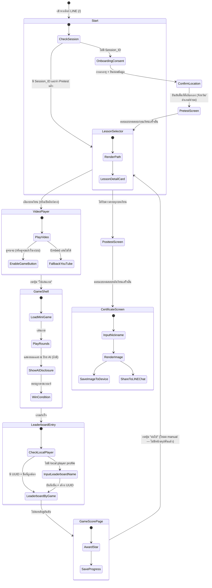
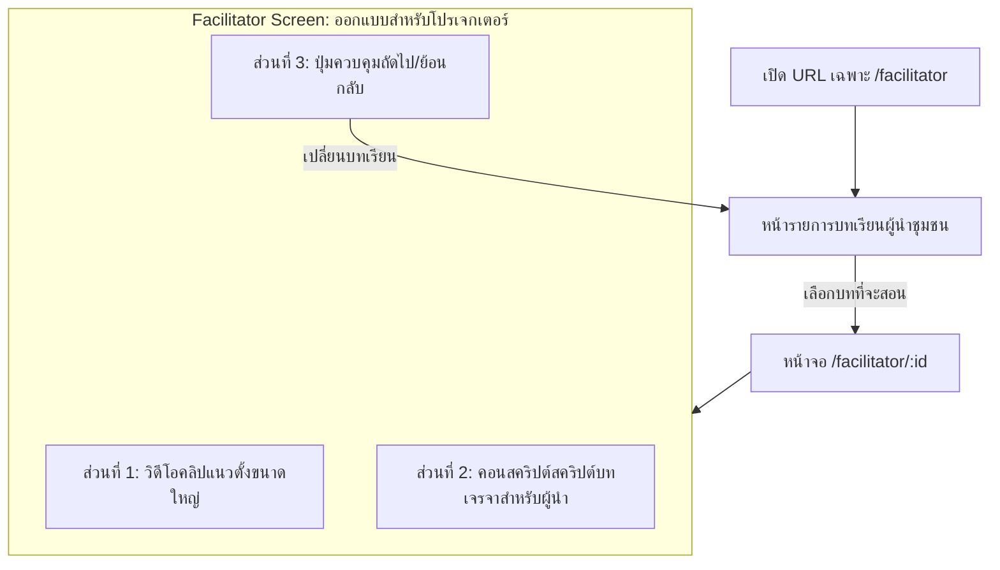
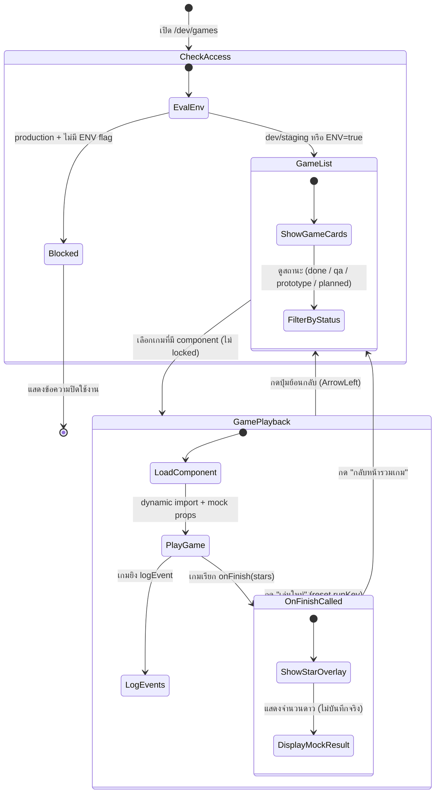

# รู้ทันสื่อ Interactive — Application Flow & Routing

**Version:** 1.6 | **Last Updated:** 2026-08-14 | **Owner:** NAPLAB Dev Team

เอกสารฉบับนี้อธิบายผังการไหลของแอปพลิเคชัน (Application Flow) การกำหนดเส้นทางหน้าจอ (Routing) ใน Next.js App Router และเงื่อนไขในการเปลี่ยนผ่านแต่ละหน้าจอ เพื่อแสดงความเชื่อมโยงระหว่างระบบเทคโนโลยีและเส้นทางการใช้งานของผู้ใช้ (User Journey) ทั้งสองกลุ่มหลัก

---

## 1. Route Catalog (รายการหน้าจอและเส้นทาง)

แอปพลิเคชันทำงานในรูปแบบ **Next.js (App Router)** ที่มีการทำ Code-Splitting และ Dynamic Routing เป็นระบบ Single Project Monorepo ร่วมกับ TypeScript โดยมีโครงสร้างเส้นทางหน้าจอและแผนผังไดเรกทอรี (Directory-based Routes) ดังนี้:

| Path | Next.js File Path | Component Name | Description | Access Guard (เงื่อนไขการเข้าถึง) |
|:---|:---|:---|:---|:---|
| `/` | `app/page.tsx` | `LandingWelcome` | หน้าแรกสุด ทักทายต้อนรับ และปุ่มกดเข้าเรียน | ไม่มี (สาธารณะ) |
| `/consent` | `app/consent/page.tsx` | `OnboardingConsent` | หน้ายินยอมนโยบายข้อมูล (PDPA) เลือกช่วงอายุและจังหวัด/อำเภอ/ตำบลเองจากรายการ | ต้องยังไม่มี `session_id` หรือข้อมูลตำแหน่งในอุปกรณ์ |
| `/pretest` | `app/pretest/page.tsx` | `PretestScreen` | หน้าทำแบบทดสอบวัดความรู้ก่อนเรียน มีคำถามจำนวน 10-15 ข้อ | ต้องผ่านขั้นตอนยินยอมเงื่อนไข (Consent) และระบุอายุแล้ว |
| `/lessons` | `app/lessons/page.tsx` | `LessonSelector` | หน้าเลือกบทเรียน (Dashboard สำหรับผู้สูงอายุ) แสดงเส้นทางและสถานะความคืบหน้า (ดาว) | ต้องทำการทำข้อสอบ Pre-test เสร็จสิ้นแล้ว |
| `/lessons/:id/video` | `app/lessons/[id]/video/page.tsx` | `VideoPlayer` | หน้าจอเครื่องเล่นคลิปวิดีโอแนวตั้ง (9:16) ดักจับสถานะดูวิดีโอจบ | ต้องผ่าน Onboarding, ทำ Pre-test, และเรียนบทเรียนก่อนหน้าตามลำดับ |
| `/lessons/:id/game` | `app/lessons/[id]/game/page.tsx` | `GameShell` | หน้าเล่นเกมย่อยประจำบทเรียน โหลดปลั๊กอินเกมย่อย G1-G5 มาแสดง | ต้องทำการชมวิดีโอบทนั้นจบเรียบร้อยแล้วในเซสชันนี้ |
| `/lessons/:id/score` | `app/lessons/[id]/score/page.tsx` | `GameScorePage` | หน้าคะแนนหลังจบเกม (ใช้ร่วมกันทุกเกม) แสดงดาวที่ได้ ปุ่ม "ต่อไป" พาไปปลายทางจริงจาก query `next` — โหมด manual ไป `/lessons` ตรงๆ (ไม่มีหน้าสรุปคั่นแล้ว), โหมด flow ไปคลิป/เกมบทถัดไปหรือแบบทดสอบหลังเรียนต่อ | ต้องเล่นเกมในบทเรียนนั้นผ่านเงื่อนไขชนะแล้ว |
| `/posttest` | `app/posttest/page.tsx` | `PosttestScreen` | หน้าทำแบบทดสอบวัดความรู้หลังเรียนเพื่อประเมินผลการเรียนรู้ | ต้องเก็บดาวสะสมครบถ้วนทุกบทเรียนก่อน |
| `/certificate` | `app/certificate/page.tsx` | `CertificateScreen` | หน้ารับใบประกาศเกียรติคุณแบบใส่ชื่อเล่น ดาวน์โหลดรูปภาพ และแชร์เข้ากลุ่ม LINE | ต้องทำการทำข้อสอบ Post-test เสร็จสิ้นเรียบร้อยแล้ว |
| `/lessons/:id/leaderboard` | `app/lessons/[id]/leaderboard/page.tsx` | `LessonLeaderboardPage` | หน้ากรอกชื่อครั้งแรกและกระดานคะแนนของเกมที่ระบุใน route | ต้องมี session และใช้ lesson/game ID ที่รองรับ; ฝั่ง client ตรวจ local player profile เพื่อเลือก state กรอกชื่อหรือแสดงอันดับ |
| `/facilitator` | `app/facilitator/page.tsx` | `FacilitatorHub` | หน้าเริ่มต้นของผู้ช่วยสอน/ผู้นำกิจกรรม แสดงรายการและข้อมูลพื้นที่เบื้องต้น | ไม่มี (สาธารณะ) |
| `/facilitator/:id` | `app/facilitator/[id]/page.tsx` | `FacilitatorView` | โหมดฉายจอใหญ่สำหรับนำกิจกรรม แสดงวิดีโอขนาดใหญ่ คอนสคริปต์พูดประกอบ และโหมดตอบกลุ่ม | ไม่มี (สาธารณะ) |
| `/dev/games` | `app/dev/games/page.tsx` | `DevGameHubPage` | หน้ารวมเกมสำหรับทดสอบ (QA Internal Tool) เข้าเล่นเกมย่อย G1–G13 ได้ทันทีโดยข้ามขั้นตอน Consent/Pretest ไม่บันทึกข้อมูลลงระบบจริง | Dev/Staging เท่านั้น หรือเปิด Dynamic Runtime Env `ENABLE_DEV_HUB=true` ใน Docker/Portainer Container |

---

## 2. Navigation State Machine (สถานะการเปลี่ยนหน้าจอ)

ผังการเข้าชมหน้าจอและการเปลี่ยนผ่านตามพฤติกรรมของผู้ใช้แบ่งเป็น 2 เส้นทางหลัก:

### 2.1 เส้นทางผู้สูงอายุ (Journey B: Elder Path)

---

## 3. Router Guards & Deep Linking (ระบบป้องกันและลิงก์ตรง)

### 3.1 Router Guards Logic (กลไกจำกัดลำดับการเล่น)
เพื่ออำนวยความสะดวกไม่ให้ผู้สูงอายุเกิดความสับสนหรือหลงทางในหน้าแอปพลิเคชัน Next.js App Router จะทำงานร่วมกับ Next.js Middleware (`src/proxy.ts`) และ Layout-level Guards ดังนี้:

- **ยินยอมข้อมูลก่อนเริ่มเสมอ:** หากผู้ใช้พยายามเข้าลิงก์ตรงของบทเรียน เช่น `/lessons/2/video` แต่ระบบไม่พบ `session_id` ใน Cookie หรือ LocalStorage ระบบจะเปลี่ยนเส้นทาง (Redirect) ไปที่ `/consent` อัตโนมัติ เมื่อทำเสร็จจึงจะส่งต่อผู้ใช้ไปยังแบบทดสอบ Pretest และบทเรียนปลายทางตามลำดับ (การตรวจสอบใน Middleware จะดูจาก HTTP Cookies เป็นหลัก และประสานงานร่วมกับฝั่ง Client Component ผ่าน `useEffect` ในกรณีที่ต้องอ่านข้อมูล `localStorage`)
- **การบังคับทำ Pre-test (Pre-test Guard - เฉพาะกลุ่มทดสอบ):** หากผู้ใช้มีสถานะเป็นกลุ่มทดสอบ (`isTestingGroup: true`) และยังไม่ได้บันทึกผลการทำแบบทดสอบก่อนเรียนสำเร็จ ระบบจะป้องกันไม่ให้อ่านบทเรียนย่อย โดยจะดักเปลี่ยนเส้นทางมาที่ `/pretest` เสมอ (ผู้ใช้ทั่วไปที่ไม่ใช่กลุ่มทดสอบจะข้ามขั้นตอนนี้และเข้าเรียนได้ทันที)
- **เรียงลำดับการเรียน (Guided Sequence):** ผู้เล่นทั่วไปต้องสะสมดาวตามลำดับ (บทที่ 1 → บทที่ 2 → บทที่ 3) ระบบจะไม่อนุญาตให้กดเข้าเล่นเกมบทที่ 3 หากดาวยังสะสมในบทที่ 1 และ 2 ไม่ครบ
- **สิทธิเข้าถึงเกม (Video-to-Game Lock):** ผู้ใช้งานไม่สามารถข้ามไปที่หน้า `/lessons/:id/game` ได้โดยตรง หากไม่ผ่านสถานะดูวิดีโอจบ (`watched: true` ในแอปสเตตปัจจุบัน)
- **การบังคับทำ Post-test (Post-test Guard - เฉพาะกลุ่มทดสอบ):** เมื่อผู้ใช้สะสมดาวครบ 5 บทเรียน และต้องการเข้าหน้า `/certificate` เพื่อรับใบเกียรติคุณ หากผู้ใช้เป็นกลุ่มทดสอบ ระบบจะตรวจหาประวัติว่าผ่านการประเมินหลังเรียนแล้วหรือไม่ หากยังไม่พบจะบังคับเปลี่ยนเส้นทางไปหน้า `/posttest` ทันที (ผู้ใช้ทั่วไปสามารถกดเข้าดูใบประกาศได้ทันทีโดยไม่ต้องทำข้อสอบ)

### 3.2 Deep Linking Flow (แชร์เข้ากลุ่มไลน์)
เมื่อมีผู้นำชุมชนหรือผู้ใช้ส่งต่อข้อความที่มีลิงก์เข้าสู่กลุ่ม LINE:
1. ลิงก์ที่แชร์จะมีหน้าตาเป็น: `https://domain.com/lessons/3/video?ref=facilitator&prov=ChiangMai`
2. เมื่อผู้สูงอายุแตะที่ลิงก์ใน LINE หน้าต่าง LINE In-App Browser จะเปิดขึ้น
3. แอปพลิเคชันอ่านพารามิเตอร์ `prov` เพื่อใช้ตั้งค่าพิกัดเริ่มต้นในกรณีที่ผู้เล่นยังไม่เคยสร้าง Session ในอุปกรณ์
4. หากผู้เล่นยังไม่เคยสมัครใช้งานแอป ระบบจะพาไปหน้ารายละเอียด Consent เมื่อยินยอมเสร็จสิ้น จะนำไปยังหน้าวิดีโอบทที่ 3 ทันที (Skip หน้า LessonSelector)

---

## 4. Facilitator Mode Flow (เส้นทางผู้ช่วยสอน)

สำหรับผู้นำกิจกรรมหรือผู้ช่วยอบรมในระดับชุมชน (Journey A):

**จุดเด่นการทำ Routing ของผู้นำ:**
- **เป็นมิตรกับการเปิดบนทีวี/คอมพิวเตอร์:** เส้นทาง `/facilitator` จะปิดอินเทอร์เฟซแบบโมบายล์ เช่น ขนาดปุ่มที่เน้นใช้นิ้วกด และปรับให้แสดงผลสคริปต์ประกอบการสอนอย่างชัดเจนแบบ Desktop Layout
- **ไม่มี Guard จำกัดการข้ามบท:** ผู้นำชุมชนสามารถข้ามไปบทใดก็ได้ทันที (เช่น เริ่มสอนบทที่ 3 ก่อน) เพื่อให้เข้ากับสถานการณ์และหน้างานการจัดการเรียนรู้

---

## 5. Dev Game Hub — QA Testing Flow (เส้นทางทดสอบเกมย่อย)

> **Route:** `/dev/games` — เครื่องมือภายในทีม (US-03-R4)

หน้ารวมเกมสำหรับทดสอบ (`DevGameHubPage`) เป็นเส้นทางพิเศษที่แยกออกจาก User Journey หลัก ออกแบบมาเพื่อให้ทีมพัฒนาและ QA สามารถเข้าถึงและทดสอบเกมย่อยแต่ละตัว (G1–G11) ได้ทันที โดยไม่ต้องผ่านขั้นตอน Consent, Pretest หรือเก็บดาวตามลำดับ

### 5.1 Access Guard (เงื่อนไขการเข้าถึง)

| เงื่อนไข | รายละเอียด |
|:---|:---|
| **Environment** | เปิดใช้งานอัตโนมัติใน `NODE_ENV !== "production"` (dev/staging) |
| **Production Override** | ตั้ง `ENABLE_DEV_HUB=true` (หรือ `NEXT_PUBLIC_ENABLE_DEV_HUB=true`) ใน env ของ container แล้ว restart — อ่านฝั่ง server ตอน runtime ไม่ต้อง rebuild image |
| **ถูกปิดกั้น** | หากทั้งสองเงื่อนไขไม่ผ่าน จะแสดงข้อความ "หน้ารวมเกมถูกปิดใช้งาน" |

### 5.2 Game Registry (รายการเกมย่อยในระบบ)

| Game ID | ชื่อเกม | บทเรียนที่ผูก | สถานะ | Component |
|:---|:---|:---|:---|:---|
| G1 | จริงหรือมั่ว? | บทที่ 1 (topic-1) | ✅ เสร็จแล้ว | `G1FactCheck` |
| G2 | จับสัญญาณมิจ | บทที่ 2 (topic-2) | ✅ เสร็จแล้ว | `G2ScamSpotter` |
| G3 | AI หรือ คน? | บทที่ 3 (topic-3) | 🔍 รอตรวจ QA | `G3AIOrNot` |
| G5 | กางโล่กู้ชีพ | บทที่ 4 (topic-5) | 🔍 รอตรวจ QA | `G5DigitalShield` |
| G6 | จำลองแชท LINE | บทที่ 5 (topic-6) | 🔍 รอตรวจ QA | `G6LineSimulation` |
| G4 | แชร์ดีไหม? | ยังไม่ผูกบทเรียน | 🏗️ Prototype | `G4ShareOrNot` |
| G7 | วิ่งสู้ภัยไซเบอร์ | ยังไม่ผูกบทเรียน | 🏗️ Prototype | `G7CyberRunner` |
| G8 | กระโดดแพรู้ทันมิจ | ยังไม่ผูกบทเรียน | 🏗️ Prototype | `G8RaftCrossing` |
| G9 | ลิงก์จี้หรือลิงก์จริง | ยังไม่ผูกบทเรียน | 🏗️ Prototype | `G9LinkInspector` |
| G10 | นี้แอปฉัน นั้นแอปใคร? | ยังไม่ผูกบทเรียน | 🏗️ Prototype | `G10WhoseApp` |
| G11 | หยุดนิ้ว! คิดก่อนกด | ยังไม่ผูกบทเรียน | 🏗️ Prototype | `G11StopTheFinger` |

### 5.3 Testing Flow State Machine

### 5.4 Mock Behavior (พฤติกรรมจำลอง)

Dev Game Hub ใช้ระบบ **mock** เพื่อแยกขาดจากข้อมูลจริงของผู้ใช้:

| ฟีเจอร์ | พฤติกรรมในระบบจริง (`GameShell`) | พฤติกรรมใน Dev Hub (`DevGameHubPage`) |
|:---|:---|:---|
| `onFinish(stars)` | บันทึกดาวลง `progressService` + เปลี่ยนหน้าไป `/lessons/:id/score` (แล้วต่อไปยัง `/lessons` หรือบทถัดไปตามโหมด) | แสดง Overlay แจ้งจำนวนดาว ไม่บันทึกใดๆ |
| `logEvent(name, payload)` | ส่ง HTTP POST ไปยัง `/api/log` ผ่าน `loggingService` | `console.log` + แสดงใน Event Panel บนหน้าจอ |
| Session Guard | ต้องมี `session_id` + ดูวิดีโอจบ + เรียงลำดับบท | ไม่มี Guard ใดๆ เปิดเล่นได้ทันที |
| Component Loading | Static import ใน `GameShell.jsx` | Dynamic import (`next/dynamic`) เพื่อ code-split แต่ละเกม |

### 5.5 Event Panel (แผงตรวจสอบ Event Log)

ด้านล่างของหน้าจอเล่นเกมมี **Event Panel** แสดง event ทั้งหมดที่เกมยิงออกมาแบบ real-time:

- **เวลา** — timestamp ที่เกมยิง event (format `th-TH`, 24 ชม.)
- **ชื่อ event** — เช่น `game_start`, `answer_submit`, `round_complete`, `onFinish (mock)`
- **payload** — ข้อมูลแนบ เช่น `{"stars": 3}`, `{"answer": "ข่าวจริง", "correct": true}`
- **ปุ่มล้าง** — รีเซ็ต event log ทั้งหมด
- **พับ/กาง** — สลับเปิด-ปิด panel ได้

### 5.6 QA Checklist (แนวทางการทดสอบ)

เมื่อทดสอบเกมย่อยแต่ละตัวผ่าน Dev Game Hub ควรตรวจสอบรายการดังนี้:

- [ ] **เปิดเกมได้สำเร็จ** — กดการ์ดเกมแล้ว Component โหลดขึ้นมาโดยไม่มี error ใน console
- [ ] **เล่นจบครบ flow** — เล่นเกมจนถึงจุดที่เรียก `onFinish` → Overlay แสดงดาวถูกต้อง
- [ ] **Event log ครบถ้วน** — ตรวจสอบว่า Event Panel แสดง event สำคัญครบ (เช่น `game_start`, `answer_submit`, `round_complete`)
- [ ] **เล่นใหม่ทำงานถูกต้อง** — กด "เล่นใหม่" แล้วเกม reset state กลับไปเริ่มต้น event log ถูกล้าง
- [ ] **กลับหน้ารวมเกม** — กดย้อนกลับแล้วกลับมาที่รายการเกมได้ปกติ
- [ ] **ไม่มีข้อมูลรั่วไหล** — ตรวจสอบ Network tab ว่าไม่มี HTTP request ไปยัง `/api/log` หรือ `/api/progress`
- [ ] **Responsive** — ทดสอบบนหน้าจอมือถือ (375px) และ desktop (1280px)
- [ ] **สถานะเกม** — เกมที่มี `status: "planned"` และไม่มี component ต้องแสดงเป็น disabled (ไอคอนกุญแจ + กดไม่ได้)

---

## 6. Leaderboard Flow (เส้นทางกระดานคะแนนแบบไม่มีบัญชี)

> **Route:** `/lessons/[id]/leaderboard` — ดู [US-CF-50](../agile/user-stories/US-CF-50.md)

1. เมื่อเปิดหน้า ระบบอ่าน local player profile `{ player_uuid, name }` จาก `localStorage`
2. ถ้าไม่พบหรือข้อมูลไม่ถูกต้อง แสดง state กรอกชื่อพร้อมปุ่ม "ไม่เก็บคะแนน" และ "เก็บคะแนน"
3. เมื่อกด "ไม่เก็บคะแนน" ให้เปิด Leaderboard แบบ browse-only โดยไม่สร้าง UUID/ชื่อและไม่ส่งผลคะแนน
4. เมื่อกรอกชื่อ 1–30 ตัวอักษรแล้วกด "เก็บคะแนน" ให้ client สร้าง UUID, บันทึก object ลงเครื่อง และเปิด Leaderboard
5. ถ้าพบ profile ที่ถูกต้องตั้งแต่แรก ให้ข้ามฟอร์มชื่อและเปิดกระดานคะแนนทันที
6. หน้าแปลง `[id]` จาก route เป็น `gid` เช่น `flow-g13 → G13`; ถ้าไม่รองรับให้แสดง not found
7. เรียก `GET /api/leaderboard?gid=<gid>&limit=10`; endpoint ต้องปฏิเสธ request ที่ไม่มี `gid`
8. Query และ UI แสดงเฉพาะคะแนนของ `gid` นั้น ไม่มีตัวเลือกผสมหรือสลับเกมในหน้าปัจจุบัน
9. สำหรับ G13 เมื่อเล่นจบ ให้ส่งความสูงหอเป็นคะแนน เก็บ pending score ใน `sessionStorage` แล้วนำจาก `/lessons/flow-g13/game` ไป `/lessons/flow-g13/leaderboard`
10. เมื่อมี local player profile ให้ `POST /api/game-results` เพื่อเพิ่ม history ใหม่หนึ่งแถว จากนั้นโหลด Top 10 ใหม่; ถ้าเลือก "ไม่เก็บคะแนน" ให้ล้าง pending score โดยไม่ส่ง API
11. ปุ่ม "เสร็จสิ้นบทเรียน" ใต้ Leaderboard นำไป `/lessons/complete` เพื่อคงหน้าชื่นชมปลาย Flow เดิม

**Browse จากเมนู (US-CF-52):**
- Navigation drawer มีปุ่ม "กระดานคะแนน" เปิด popup เลือกเกม (`LeaderboardGamePicker`) แสดงเฉพาะเกมที่เก็บคะแนน (`BROWSABLE_LEADERBOARD_GAMES`; ตอนนี้ = G13) แต่ละ slot = ไอคอน + ชื่อเกม
- เลือกเกม → `/lessons/<lessonId>/leaderboard?view=browse` (spectator): เหรียญบนเป็น trophy, ไม่ผูกผู้เล่น (ไม่ส่ง `player_uuid`, ไม่มีชื่อ/ไฮไลต์/`currentPlayer`), ไม่ข้ามไปหน้ากรอกชื่อ และไม่ส่งคะแนน
- ปุ่มล่างในโหมด browse = "เลือกเกม" เปิด popup เดิมเพื่อสลับไปดูเกมอื่น

**Fallback และข้อจำกัด:**
- หาก Supabase/API ใช้งานไม่ได้ ให้แสดงข้อความภาษาง่ายและปุ่มลองใหม่ โดยไม่ลบ local player profile
- หากผู้ใช้ล้าง storage หรือเปลี่ยน browser/device ระบบจะให้กรอกชื่อใหม่และสร้าง UUID ใหม่
- UUID เป็น local identifier ไม่ใช่ authentication; การตรวจคะแนนใน MVP เน้น validation และ rate limit ระดับพื้นฐาน
- หน้าต้องรองรับ vertical scroll เพราะรายการอันดับและขนาดฟอนต์อาจสูงเกิน viewport

---

## Related Documents
- User Journey: [User Journey](../gdd/05-user-journey.md)
- System Design: [System Design](./01-system-design.md)
- System Architecture: [System Architecture](./02-architecture.md)
- Data Schema: [Data Schema](./03-data-schema.md)
