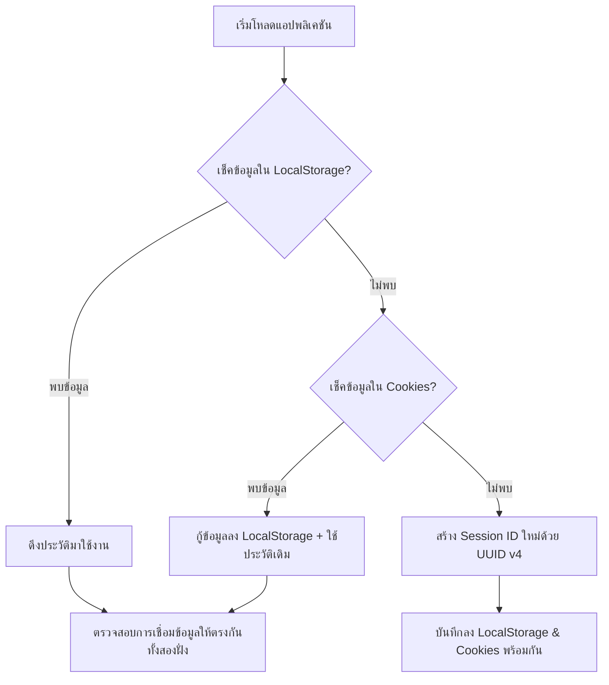

# รู้ทันสื่อ Interactive — ข้อกำหนดระบบระบุตัวตนและเซสชัน (Session & Identifier Specification)

**Version:** 1.0 | **Last Updated:** 2026-07-19 | **Status:** Active | **Owner:** NAPLAB Dev Team

> เอกสารนี้ให้ข้อมูลเชิงลึกและข้อกำหนดทางสถาปัตยกรรมเกี่ยวกับระบบเซสชัน (Session ID) การสร้าง การจัดเก็บ และความทนทานต่อการล้างแคชของเบราว์เซอร์ รวมถึงแนวทางแก้ไขปัญหาการใช้งานข้ามเบราว์เซอร์ในอนาคต

---

## 1. หลักการออกแบบระบบเซสชัน (Session Design Principles)

เนื่องจากกลุ่มเป้าหมายหลักของแอปพลิเคชันคือผู้สูงอายุ ระบบจึงถูกออกแบบตามหลักการ **"ไม่ต้องระบุตัวตนที่แท้จริง (No Authentication)"** เพื่อขจัดขั้นตอนการลงทะเบียนด้วยรหัสผ่านหรือเบอร์โทรศัพท์ที่ซับซ้อน:
- **Pseudo-anonymous Identifier:** ระบบใช้ **Session ID** ที่สุ่มขึ้นมาทำหน้าที่เป็นกุญแจหลัก (Primary Key) ในการบันทึกประวัติการสะสมดาวและการทำข้อสอบ
- **Context-driven Identity:** ข้อมูลเซสชันจะผูกร่วมกับข้อมูลบริบท ได้แก่ **ช่วงอายุ (Age Group)** และ **พื้นที่จัดกิจกรรม (Location: จังหวัด, อำเภอ, ตำบล)** เพื่อใช้ในการรายงานสถิติของ NAPLAB

---

## 2. อัลกอริทึมการสร้าง Session ID (ID Generation Algorithm)

รหัส Session ID จะใช้มาตรฐาน **UUID v4 (RFC 4122)** ซึ่งสุ่มเลขฐานสิบหกขนาด 128 บิต (แสดงผล 36 ตัวอักษรรวมเครื่องหมายขีด) เพื่อให้มั่นใจว่าจะไม่มีการชนกันของไอดีในฐานข้อมูล
การสร้างจะทำงานผ่านฟังก์ชัน `generateUUID()` ในบริการ [progressService.ts](../../src/services/progressService.ts) โดยมีตรรกะแบบ Hybrid เพื่อความเข้ากันได้ของอุปกรณ์:

```typescript
function generateUUID() {
  // 1. ตรรกะหลัก: เรียกใช้งาน Web Crypto API ในเบราว์เซอร์รุ่นใหม่ (ปลอดภัยและมีความสุ่มสูงที่สุด)
  if (typeof crypto !== "undefined" && typeof crypto.randomUUID === "function") {
    return crypto.randomUUID();
  }
  
  // 2. ตรรกะสำรอง (Fallback): หากใช้อุปกรณ์มือถือผู้สูงอายุรุ่นเก่าที่ Web Crypto API ไม่พร้อมใช้งาน
  // จะทำการสุ่มแบบ Pseudo-random ตามหน้ากากฟอร์แมตของ UUID v4
  return "xxxxxxxx-xxxx-4xxx-yxxx-xxxxxxxxxxxx".replace(/[xy]/g, function (c) {
    const r = (Math.random() * 16) | 0;
    const v = c === "x" ? r : (r & 0x3) | 0x8;
    return v.toString(16);
  });
}
```

### 2.2 แนวคิดการทำ Hybrid Session ID (Timestamp + Fingerprint + Math.random) [Proposed]

เป็นแนวคิดในการแก้ปัญหาเมื่อข้อมูลแคชสูญหายหรือกรณีสลับใช้งานเบราว์เซอร์อื่นบนอุปกรณ์เดิม โดยออกแบบโครงสร้าง Session ID ให้ประกอบด้วย 3 ส่วนสำคัญ เพื่อช่วยให้ระบบหลังบ้านสามารถจับคู่ความสัมพันธ์ของเซสชัน (Fuzzy Match / Correlation) ที่มาจากเครื่องเดียวกันได้โดยไม่ต้องยืนยันตัวตน:

```typescript
function generateHybridSessionId() {
  // 1. Timestamp (แปลงฐาน 36) - ป้องกันการซ้ำกันเชิงเวลาที่รันไปข้างหน้าเสมอ
  const timestamp = Date.now().toString(36);
  
  // 2. Pseudo-random (แปลงฐาน 36) - ป้องกันการชนกันในกรณีมีผู้ใช้อุปกรณ์เหมือนกันกดพร้อมกันในเสี้ยววินาที
  const randomVal = Math.random().toString(36).substring(2, 9);
  
  // 3. Simple Browser Fingerprint Hash - ดึงค่าจำเพาะที่ไม่เปลี่ยนตามเบราว์เซอร์มากนัก
  let fingerprintRaw = "";
  if (typeof window !== "undefined") {
    fingerprintRaw = [
      screen.width,                   // ความกว้างหน้าจอที่แท้จริง
      screen.height,                  // ความสูงหน้าจอที่แท้จริง
      new Date().getTimezoneOffset(),   // เขตเวลา (Timezone)
      navigator.language              // ภาษาของระบบปฏิบัติการ
    ].join("|");
  }
  
  // แปลงข้อมูลจำเพาะดิบให้เป็นข้อความ Hash ขนาดสั้นด้วยฟังก์ชันอย่างง่าย (DJB2)
  let hash = 5381;
  for (let i = 0; i < fingerprintRaw.length; i++) {
    hash = (hash * 33) ^ fingerprintRaw.charCodeAt(i);
  }
  const fingerprintHash = (hash >>> 0).toString(36);
  
  // ประกอบรวมรหัสในรูปแบบ: [เวลา]-[ลายนิ้วมือเครื่อง]-[ค่าสุ่ม]
  return `${timestamp}-${fingerprintHash}-${randomVal}`;
}
```

**ประโยชน์เชิงการนำไปประยุกต์ใช้:**
1. **การทำงานร่วมกันสูง (Maximum Compatibility):** ไม่ต้องพึ่งพา Web Crypto API ทำให้เบราว์เซอร์เก่าแค่ไหนก็รันผ่านได้อย่างปลอดภัย 100%
2. **การจับคู่เชิงความสัมพันธ์ (Server-side Correlation):** แม้ผู้เรียนจะล้างแคชหรือสลับไปเข้าใช้ผ่านเบราว์เซอร์ตัวอื่นจนระบบสุ่มสร้าง Session ID ขึ้นมาใหม่ แต่ทีมงาน NAPLAB สามารถวิเคราะห์ประวัติในตารางสถิติโดยกรองจากแฮชลายนิ้วมือตรงส่วนกลาง (`fingerprintHash`) ร่วมกับบริบทของสถานที่ (GPS / IP) และข้อมูลอายุที่ตรงกัน เพื่อระบุเบื้องต้นว่ามาจาก **"อุปกรณ์เครื่องเดียวกัน"** ช่วยจัดเก็บสถิติให้สะอาดมากขึ้น

---

---

## 3. กลยุทธ์การจัดเก็บข้อมูลฝั่งไคลเอนต์ (Client-Side Storage Strategy)

โทรศัพท์ของผู้สูงอายุส่วนใหญ่มักเข้าใช้งานแอปพลิเคชันผ่านห้องแชท LINE ซึ่งจะเปิดเว็บด้วย **LINE In-App Browser (WebView)** ซึ่งเบราว์เซอร์ประเภทนี้มีพฤติกรรมการล้างข้อมูลใน LocalStorage หรือ Cookies เป็นบางส่วนเมื่อปิดแอปพลิเคชันหรือไม่มีความเคลื่อนไหวนานๆ

ระบบจึงใช้สถาปัตยกรรมจัดเก็บข้อมูลแบบ **"คู่สำรองข้ามระบบ" (Hybrid LocalStorage & Cookie Backup)** ดังแผนภาพนี้:



### ข้อกำหนดการเก็บ Cookie
- **Max-Age:** ตั้งเวลาหมดอายุยาวนานสูงสุด **365 วัน** เพื่อให้อุปกรณ์จำเซสชันได้ข้ามปี
- **SameSite:** กำหนดเป็น `Lax` เพื่อให้คุกกี้ทำงานได้อย่างถูกต้องเมื่อลิงก์ถูกกดและเปิดขึ้นจากภายในห้องแชท LINE

---

## 4. โฟลว์การซิงค์ข้อมูลหลังบ้าน (Backend Synchronization Flow)

1. **Anonymous Mode (สิทธิ์ยังไม่ยืนยัน):** เมื่อสร้างเซสชันในครั้งแรก ข้อมูลจะบันทึกอยู่ในระดับ Client เท่านั้น (ยังไม่ส่งขึ้นฐานข้อมูลหลังบ้าน)
2. **Onboarding Complete (ยินยอมข้อมูลแล้ว):** ทันทีที่ผู้ใช้ตอบยอมรับ Consent เลือกช่วงอายุ และยืนยันพิกัดเรียบร้อยในหน้า `/consent` ฟังก์ชัน `saveSession` จะตรวจสอบและส่งข้อมูลเซสชันนั้นไปยังเซิร์ฟเวอร์หลักผ่าน `apiClient.saveSession(session)` เพื่อบันทึกประวัติการสร้าง
3. **Database Schema Connection:** ในฝั่งฐานข้อมูล (PostgreSQL / Supabase) ตาราง `sessions` จะผูกความสัมพันธ์กับตารางอื่นๆ เช่น `quiz_attempts`, `quiz_answers`, และ `lesson_progress` โดยใช้ `session_id` เป็นกุญแจเชื่อมโยงภายนอก (Foreign Key)

---

## 5. แนวทางแก้ไขการสลับเบราว์เซอร์ในอนาคต (Cross-Browser Handoff Alternatives)

เนื่องจากระบบความปลอดภัยของระบบปฏิบัติการ (Android/iOS) มีนโยบายจำกัดการเข้าถึงข้อมูลข้ามเบราว์เซอร์อย่างเข้มงวด (เช่น การเปิดลิงก์บน Chrome จะไม่สามารถเข้าถึงฐานแคชของ LINE In-App Browser ได้) หากต้องการรักษาข้อมูลผู้ใช้และไม่บังคับลงชื่อเข้าใช้ มีทางเลือกและข้อจำกัดในการพัฒนาในอนาคตดังนี้:

### ทางเลือกที่ 1: การแนบ Session ID ผ่านพารามิเตอร์ URL (URL Parameter Handoff) — แนะนำมากที่สุด
- **หลักการทำงาน:** ในหน้าแอปพลิเคชันจะมีปุ่มพิเศษ เช่น "เปิดผ่านเบราว์เซอร์หลัก (Chrome/Safari)" ซึ่งปุ่มนี้จะเรียกใช้งานคำสั่งแชร์หรือนำทางโดยผูกไอดีไปด้วย เช่น `https://domain.com/?sess=1234-5678-abcd`
- **การกู้ข้อมูล:** เมื่อเบราว์เซอร์ปลายทางเปิดลิงก์ดังกล่าวขึ้นมา จะมีสคริปต์ตรวจพบคีย์ `sess` ใน URL แล้วทำการคัดลอก Session ID นั้นไปเขียนลง LocalStorage และ Cookie ของตนเองโดยอัตโนมัติ
- **ข้อดี:** ความแม่นยำสูง (100%), ดำเนินการได้อย่างรวดเร็ว, ไม่ส่งผลกระทบต่อความเป็นส่วนตัวของผู้ใช้คนอื่น

### ทางเลือกที่ 2: ระบบกู้คืนด้วยรหัสสั้น (PIN Code Transfer)
- **หลักการทำงาน:** แสดงรหัสตัวเลข 4 หรือ 5 หลัก (เช่น `7892`) บนหน้าจอหลักของผู้เล่น 
- **การกู้ข้อมูล:** หากผู้เรียนทำกิจกรรมต่อบนเบราว์เซอร์อื่นแล้วพบว่าข้อมูลหาย สามารถไปที่เมนู "กู้ประวัติการเรียน" และกรอกรหัสตัวเลขนั้นเพื่อดึงประวัติเดิมมาสวมรอย
- **ข้อดี:** ใช้งานข้ามเครื่องหรือข้ามอุปกรณ์ได้ง่าย (เช่น ทำบนโทรศัพท์แล้วย้ายไปทำต่อบนแท็บเล็ต)

### ทางเลือกที่ 3: ระบบตรวจจับลายนิ้วมือเบราว์เซอร์ข้ามค่าย (Cross-Browser Fingerprinting)
- **หลักการทำงาน:** ใช้ลักษณะจำเพาะของเครื่อง เช่น ความเร็ว CPU, ขนาดของหน้าจอ, และระบบประมวลผลกราฟิกเพื่อเจนไอดี
- **ข้อจำกัด:** **ไม่แนะนำ** เนื่องจาก Safari และ Chrome จะแสดงค่าตัวแปรจำเพาะด้านกราฟิกและ User-Agent ที่ต่างกันอย่างมาก ทำให้ยากในการจับคู่ให้ตรงกันข้ามค่ายเบราว์เซอร์

### ทางเลือกที่ 4: การจับกลุ่มผ่านที่อยู่ไอพีและพิกัด (IP & GPS Clustering)
- **หลักการทำงาน:** เครื่องที่เข้าใช้ใหม่ในพิกัด GPS เดียวกันและ IP เครือข่ายเดียวกันในจังหวะเดียวกัน จะถูกจับรวมกับเซสชันเดิม
- **ข้อจำกัดและความเสี่ยง:** **ห้ามใช้ในโครงการนี้** เนื่องจากจัดกิจกรรมเวิร์กช็อปร่วมกับชุมชนผู้สูงอายุ ซึ่งผู้เข้าร่วมงานจำนวนมาก (50-100 คน) จะนั่งอบรมร่วมกันในสถานที่เดียวกัน ใช้สัญญาณ Wi-Fi หรือเครือข่ายมือถือเดียวกัน และได้พิกัดพิกัด GPS ใกล้เคียงกัน ส่งผลให้ระบบอาจรวบรวมประวัติของหลายคนเข้าไปยังไอดีเดียวกันโดยไม่ได้ตั้งใจ

## 6. ข้อเสนอแนะ: การบันทึกข้อมูลรายละเอียดอุปกรณ์ด้วย UAParser.js (Proposed Device Logging with UAParser.js)

เพื่อระบุพฤติกรรมการใช้งานและตรวจวิเคราะห์การกระจายตัวของอุปกรณ์ที่เข้าใช้ของกลุ่มเป้าหมาย (เช่น สัดส่วนผู้ใช้ iOS vs Android หรือสัดส่วนหน้าจอมือถือแต่ละรุ่นของกลุ่มผู้สูงอายุ) มีข้อเสนอแนะในการติดตั้งและจัดเก็บข้อมูลอุปกรณ์ฝั่งไคลเอนต์ดังนี้:

### 6.1 ตรรกะการรวบรวมข้อมูลฝั่ง Client
เราสามารถติดตั้งโมดูล `ua-parser-js` เพื่อใช้งานในบริการการบันทึก Log และการเชื่อมต่อเซสชัน:
1. ทำการเรียกเก็บข้อมูลระบบจำเพาะของเครื่องบนไคลเอนต์เมื่อเซสชันเริ่มต้นขึ้น:
   ```typescript
   import { UAParser } from "ua-parser-js";

   export function getDeviceMetadata() {
     const parser = new UAParser();
     const device = parser.getDevice();
     const os = parser.getOS();
     const browser = parser.getBrowser();

     return {
       device_vendor: device.vendor || "Unknown",
       device_model: device.model || "Unknown",
       device_type: device.type || "mobile",
       os_name: os.name || "Unknown",
       os_version: os.version || "Unknown",
       browser_name: browser.name || "Unknown",
       browser_version: browser.version || "Unknown",
       screen_resolution: `${window.screen.width}x${window.screen.height}`
     };
   }
   ```

### 6.2 การออกแบบส่วนเก็บข้อมูลในฐานข้อมูล (Database Schema Update)
1. **ตาราง `sessions`:** เพิ่มคอลัมน์ `device_metadata` (ประเภทข้อมูล `JSONB`) เพื่อบันทึกสเปกเครื่องทั้งหมดตั้งแต่วันที่สร้างเซสชัน
   ```sql
   ALTER TABLE sessions ADD COLUMN device_metadata JSONB DEFAULT '{}'::jsonb;
   ```
2. **ตาราง `action_logs` / `page_views`:** บันทึกข้อมูลเมทาดาต้าของอุปกรณ์เพื่อวิเคราะห์ในแง่ของระบบรักษาความปลอดภัยและการสืบหาเซสชันเครื่องเดิมข้ามเบราว์เซอร์ (Fuzzy match)

### 6.3 ประโยชน์การวิเคราะห์พฤติกรรม (Behavioral Analysis Benefits)
- **การแยกแยะพฤติกรรมการเล่น:** สามารถนำรุ่นและประเภทอุปกรณ์มาจัดกลุ่มร่วมกับ Log พฤติกรรมการเล่นเกมย่อย (เช่น ตรวจสอบว่าผู้สูงอายุที่ใช้มือถือแอนดรอยด์สเปกต่ำมีอัตราการเล่นเกมผ่านสำเร็จช้ากว่าเนื่องจากปัญหากราฟิกกระตุกหรือไม่)
- **การระบุผู้ใช้อุปกรณ์เดิม (Duplicate Identification):** ใช้ค่าประกอบของยี่ห้อ รุ่น และความละเอียดจอภาพ ร่วมกับเวลาและพิกัด GPS ในเวิร์กช็อปเพื่อระบุว่าเครื่องไหนคือเครื่องที่เคยล้างแคช/ข้อมูลเบราว์เซอร์ไป เพื่อจัดระเบียบข้อมูลสถิติ NAPLAB หลังบ้านให้สะอาดที่สุด

---

## เอกสารโค้ดและข้อมูลอ้างอิงที่เกี่ยวข้อง
- **บริการการจัดการความคืบหน้า:** [progressService.ts](../../src/services/progressService.ts)
- **พจนานุกรมตารางฐานข้อมูล:** [03-Data Schema](../software/03-data-schema.md)
- **ระบบและ Guard ทางเดินแอปพลิเคชัน:** [04-Application Flow & Routing](../software/04-application-flow.md)
