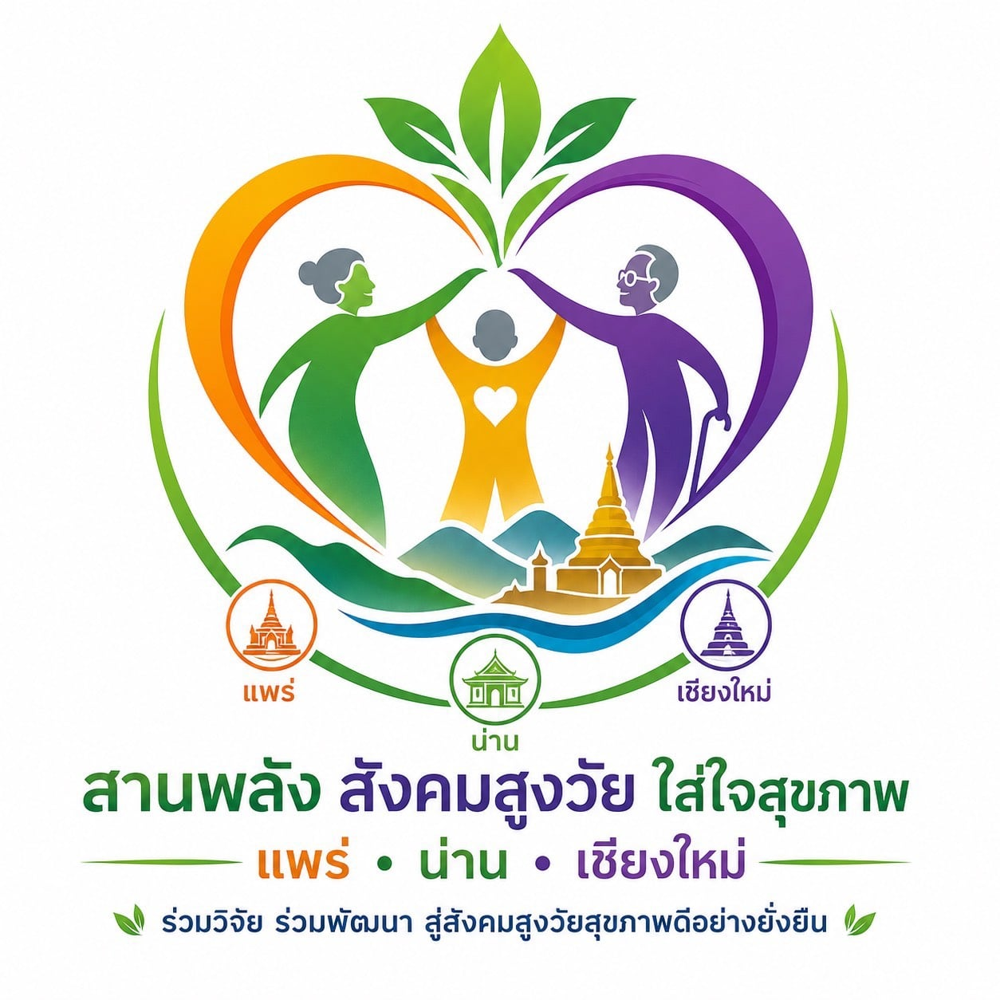
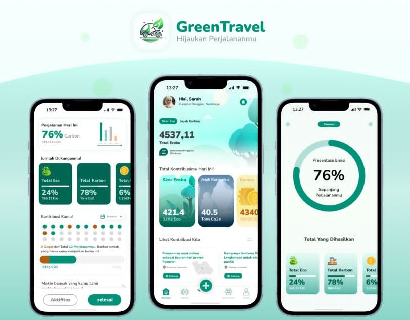

# รู้ทันสื่อ Interactive — Design Reference

ชุดข้อมูลอ้างอิงด้านการออกแบบสำหรับเว็บแอปพลิเคชัน **"รู้ทันสื่อวัยเก๋า" (NAPLAB Media Literacy)** เพื่อส่งเสริมสมรรถนะการรู้เท่าทันสื่อดิจิทัล สแกม และ AI สำหรับผู้สูงอายุในจังหวัดเชียงใหม่ แพร่ และน่าน โดยรวบรวมแนวคิดแบรนด์ การออกแบบระบบสลับธีมตามภูมิภาคจัดงาน (Location-based Theming) และแนวทางการพัฒนาองค์ประกอบ UI เพื่อการเข้าถึงง่ายสำหรับผู้สูงวัย (Senior Accessibility)

  
  &nbsp;&nbsp;
  

> ไฟล์ภาพอ้างอิงต้นทาง: [`_logo.jpg`](_logo.jpg) (ตราสัญลักษณ์โครงการ ใช้กำหนดสีธีมและแนวคิดแบรนด์) และ [`_idea-1.jpg`](_idea-1.jpg) (ต้นแบบเลย์เอาต์ UI สไตล์ GreenTravel ใช้กำหนดขอบโค้งมน เงา และส่วนประกอบการ์ด)

---

## 📅 ข้อมูลการจัดกิจกรรมหลักและธีมสี (Event Dates & Regional Themes)

| พื้นที่จัดงาน | วันที่จัดกิจกรรม (ส.ค. 2569) | ธีมสีหลัก | อารมณ์ความรู้สึก |
| :--- | :--- | :--- | :--- |
| **เชียงใหม่** | 6–7 สิงหาคม 2569 | 💜 สีม่วง (Chiang Mai Purple) | ปัญญา ภูมิความรู้ ความน่าเชื่อถือ |
| **แพร่** | 17–18 สิงหาคม 2569 | 🧡 สีส้ม (Phrae Orange) | ความอบอุ่น ครอบครัว พลังกิจกรรม |
| **น่าน** | 24–25 สิงหาคม 2569 | 💚 สีเขียว (Nan Green) | ธรรมชาติ วิถีชีวิต ชุมชนที่สงบสบาย |
| **ส่วนกลาง (ทั่วไป)** | — | 🩵 สีเขียวหัวเป็ด (Default Teal) | สุขภาพ ความสมดุล ความก้าวหน้า |

---

## 📘 โครงสร้างเอกสาร

1. **[01-brand-identity.md](01-brand-identity.md)** — แนวคิดภาพสัญลักษณ์ โลโก้โครงการ สีจำแนกจังหวัด และกฎระเบียบการใช้ตราสัญลักษณ์
2. **[02-website-design-tokens.md](02-website-design-tokens.md)** — ดีไซน์โทเค็นระดับเว็บ: จานสี ค่าตัวแปร CSS, ระบบพิมพ์ (Typography Scale) และระยะห่างโค้งมน (Layout Tokens)
3. **[03-application-guideline.md](03-application-guideline.md)** — แนวทางการนำไปประยุกต์ใช้ในการพัฒนาโปรเจกต์ React+Vite: CSS variables, โค้ดสลับคลาสตามตำแหน่ง และการทดสอบ Contrast
4. **[design-tokens.json](design-tokens.json)** — ไฟล์รวบรวมค่าดีไซน์โทเค็นดิบในรูปแบบ JSON
5. **[ui-visualization.html](ui-visualization.html)** — หน้าเครื่องมือจำลองและการใช้งาน UI Design (Interactive Visualizer & Component Playground) [NEW]
6. **[05-screen-design.md](../../software/05-screen-design.md)** — แนวทางการจัดวางองค์ประกอบหน้าจอผู้สูงอายุแบบไม่เลื่อนหน้าจอ (No-Scroll Viewport Spec) และตารางเลือกตัดเนื้อหา [NEW]

---

## ⚡ สรุปย่อโทเค็นสำคัญ (Quick Reference)

| โทเค็น | ค่าหลัก | ที่มาของแนวคิด |
| :--- | :--- | :--- |
| **สีม่วง (เชียงใหม่)** | `#7B2CBF` | สีชายสูงวัยในสัญลักษณ์และวัดเชียงใหม่ |
| **สีส้ม (แพร่)** | `#E65100` | สีเด็ก/ครอบครัวในสัญลักษณ์และพระธาตุแพร่ |
| **สีเขียว (น่าน)** | `#2E7D32` | สีหญิงสูงวัยในสัญลักษณ์และสีใบไม้ |
| **สีสากล (Default Teal)** | `#0D9488` | ค่าเริ่มต้นสำหรับการเสริมสร้างสุขภาพ |
| **ฟอนต์แสดงหัวเรื่อง (En/Headings)**| `'Outfit', 'Inter', sans-serif` | เสริมความพรีเมียม ทันสมัย น่าเชื่อถือ |
| **ฟอนต์เนื้อหาไทย (Body)** | `'Sarabun', sans-serif` | ฟอนต์ไม่มีหัวกลมมากเกินไป อ่านภาษาไทยยาวๆ ง่ายที่สุด |
| **ขนาดตัวหนังสือพื้นฐาน (Body Text)**| `20px` (สามารถขยายเป็น `24px` และ `28px` ได้) | ขนาดที่ผ่านการทดสอบว่าเหมาะสมกับผู้สูงวัยมากที่สุด |
| **พื้นที่แตะปุ่มควบคุม (Touch Target)**| ความสูงอย่างน้อย `56px` (แนะนำ `64px` สำหรับปุ่มหลัก)| ป้องกันการสัมผัสคลาดเคลื่อน (Accidental Taps) |
| **ความโค้งมนของการ์ด (Card Radius)**| `16px` (Radius LG) / `24px` (Radius XL) | ดีไซน์ลดความแข็งกระด้าง (แรงบันดาลใจจาก GreenTravel UI) |
| **ขนาดหน้าจอรองรับหลัก (Layout)** | กว้างสูงสุด `480px` (Mobile-first Portrait) | การใช้งานบนหน้าจอสมาร์ตโฟนแนวตั้งเป็นหลัก (ผ่าน LINE app) |
